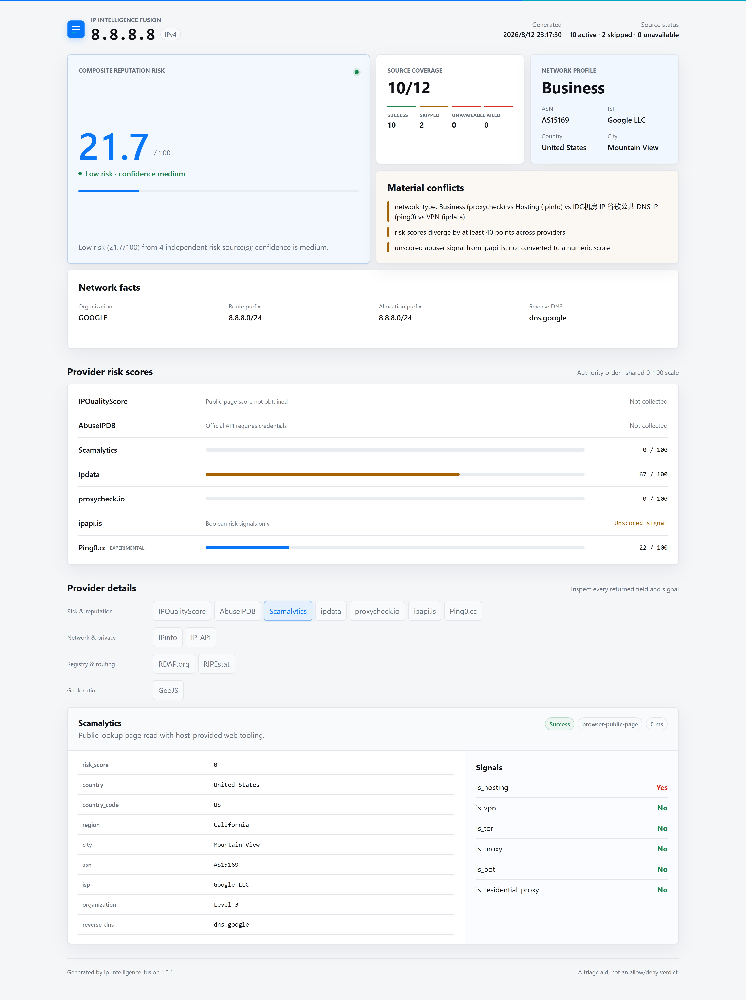

# IP Intelligence Fusion

[English](README.md) | [简体中文](README.zh-CN.md)

[](scripts/ip_intelligence.py)
[](https://www.python.org/)
[](LICENSE)

Auditable, multi-source IP intelligence for public IPv4 and IPv6 addresses. Investigate ownership,
routing, geolocation, proxy/VPN/Tor exposure, hosting, abuse, fraud, reputation, and IP purity in a
single evidence-backed workflow.

Created by [GetIPProxy](https://getipproxy.com/).

> This project is an investigation aid, not an automatic allow/deny verdict. Provider coverage and
> data freshness vary, and an IP should never be called safe solely because no source reported risk.

## Why IP Intelligence Fusion?

Most IP lookup skills return one provider's location record or a flat list of labels. IP
Intelligence Fusion is built for cases where the decision depends on *why* sources agree or
disagree:

- **12 source adapters:** reputation, fraud, proxy/VPN/Tor, geolocation, ASN, registry, and BGP
  routing evidence in one run.
- **Evidence-aware fusion:** consensus values and alternatives remain traceable to their sources.
- **Honest risk scoring:** only upstream numeric scores enter the weighted composite. Boolean flags
  are preserved as unscored signals rather than converted into invented numbers.
- **No false zeroes:** `unknown`, skipped, unavailable, failed, and successful-without-score are
  distinct states. Missing data never becomes low risk.
- **Credential-optional baseline:** keyless sources run without asking users to obtain or reveal new
  API credentials. Existing environment credentials can extend coverage.
- **Validated public-page fallback:** supported official pages can supplement unavailable APIs when
  the host provides read-only web access and the page visibly matches the target IP.
- **Auditable deliverables:** normalized JSON plus a responsive, self-contained offline HTML report
  with every selected provider state and material conflict.
- **Portable and dependency-free:** Python 3.9+ standard library only, with English and Simplified
  Chinese reports.

The project grew from a practical need to compare IP risk scores, ASN ownership, proxy traits, and
provider disagreements before making operational decisions. That same context also informs
GetIPProxy's approach to [Clean IPs by risk score and ASN](https://getipproxy.com/static-residential-proxies/clean-ips/).

## Report Preview



The HTML report works offline: CSS, JavaScript, and report data are embedded in one file. Provider
strings are rendered as text, and the report makes missing coverage and disagreements visible.

## Provider Coverage

The skill selects all providers by default. A provider can still be skipped, unavailable, or fail
at lookup time because credentials, network access, public-page tooling, or upstream service
availability differ between environments.

| Category | Provider | Access and role |
|---|---|---|
| Risk & reputation | IPQualityScore | Fraud score and proxy/VPN/Tor signals; existing API key or validated official public-page fallback |
| Risk & reputation | AbuseIPDB | Community abuse confidence and reports; existing `ABUSEIPDB_API_KEY` only, with no scraping fallback |
| Risk & reputation | Scamalytics | Fraud score, blacklist, and proxy traits; existing API integration or validated official public page |
| Risk & reputation | ipdata | Trust/threat, ASN, and network traits; existing API key or validated official public page |
| Risk & reputation | proxycheck.io | Proxy/VPN type and risk score; keyless, with an optional existing key |
| Risk & reputation | ipapi.is | ASN/company and coarse network/risk flags; keyless |
| Risk & reputation | Ping0.cc | Risk and native/hosting classification; keyless experimental page adapter |
| Network & privacy | IPinfo | Geolocation, ASN/company, route, and anonymization; existing token or validated official public page |
| Network & privacy | IP-API | Geolocation, ASN/ISP, mobile, proxy, and hosting; keyless HTTP endpoint |
| Registry & routing | RDAP.org | Registry allocation and contacts; keyless |
| Registry & routing | RIPEstat | Announced prefix, origin, and routing visibility; keyless |
| Geo cross-check | GeoJS | Independent geolocation and ASN cross-check; keyless |

API success takes precedence over imported public-page evidence. Public pages expose only visible,
allowlisted fields and may offer less coverage than official APIs.

## Requirements

- Python 3.9 or later
- Network access to the selected providers
- Codex, ChatGPT desktop, or another host that supports Agent Skills for skill-driven use
- Optional read-only browser/web capability for official public-page enrichment

No third-party Python package is required.

## Installation

### Install with Codex

Ask Codex's `$skill-installer` to install the repository:

```text
Install the skill from https://github.com/GetIPProxy/ip-intelligence-fusion
```

For local authoring or manual installation, clone the complete repository into a Codex skill search
directory:

```bash
git clone https://github.com/GetIPProxy/ip-intelligence-fusion.git \
  ~/.agents/skills/ip-intelligence-fusion
```

Repository-scoped installation is also supported by cloning or copying the directory to
`<REPO_ROOT>/.agents/skills/ip-intelligence-fusion`. Restart the host only if the newly installed
skill does not appear automatically.

### Clone for direct CLI use

```bash
git clone https://github.com/GetIPProxy/ip-intelligence-fusion.git
cd ip-intelligence-fusion
python scripts/ip_intelligence.py --version
```

On systems where `python` is unavailable, use `python3` or `py -3`.

## Quick Start

### Invoke the Skill

Mention the installed skill and supply exactly one public IP:

```text
Use $ip-intelligence-fusion to investigate 8.8.8.8 and create an English report.
```

The skill validates the target, runs the deterministic baseline, attempts supported public-page
fallbacks when the host has the capability, and returns a concise brief with paths to both reports.

### Run the CLI

Generate JSON evidence and an English offline HTML report:

```bash
python scripts/ip_intelligence.py 8.8.8.8 --report-dir reports --language en
```

Generate a Simplified Chinese report:

```bash
python scripts/ip_intelligence.py 2606:4700:4700::1111 \
  --report-dir reports --language zh-CN
```

Select or exclude providers:

```bash
python scripts/ip_intelligence.py 8.8.8.8 \
  --providers rdap,ripestat,geojs,ipapi-is,proxycheck \
  --report-dir reports

python scripts/ip_intelligence.py 8.8.8.8 --exclude ping0 --report-dir reports
```

Inspect available providers and their runtime configuration state:

```bash
python scripts/ip_intelligence.py --list-providers
```

Use `--self` only when you explicitly intend to investigate the machine's current public IP.

## Outputs

With `--report-dir reports`, the CLI writes:

```text
reports/
├── ip-intelligence-8.8.8.8.json
└── ip-intelligence-8.8.8.8.html
```

- **JSON:** normalized target, timestamps, source states, source evidence, fused facts, composite
  risk, network exposure, conflicts, confidence, and presentation metadata.
- **HTML:** portable interactive report with source coverage, consensus facts, risk rows, network
  traits, conflicts, and grouped provider details.
- **Markdown:** concise terminal output by default, or a standalone file with `--format markdown
  --output <FILE>`.

Raw upstream payloads are excluded by default. Add `--include-raw` only when they are necessary and
appropriate to retain.

## Optional Credentials

The skill never asks you to paste or disclose API secrets. If credentials already exist in the
environment, the corresponding official adapters activate automatically:

| Provider | Environment variable(s) |
|---|---|
| IPinfo | `IPINFO_TOKEN` |
| IPQualityScore | `IPQS_API_KEY` |
| ipdata | `IPDATA_API_KEY` |
| AbuseIPDB | `ABUSEIPDB_API_KEY` |
| Scamalytics | `SCAMALYTICS_API_URL`, `SCAMALYTICS_API_KEY` |
| proxycheck.io | `PROXYCHECK_API_KEY` (optional) |

A missing credential is recorded as a coverage gap, not as a zero or negative finding.

## Fusion Methodology

- Facts become consensus only when at least two sources support the leading compatible value
  without a tie; alternatives and source identities remain in the report.
- Registry country is kept separate from geolocation country, and registry allocation prefix is
  kept separate from the observed BGP route prefix.
- Only native upstream numeric risk/fraud/abuse scores participate in the weighted composite.
  ipdata trust is explicitly converted as `100 - trust_score` and labelled as derived.
- Proxy, VPN, Tor, hosting, bot, blacklist, and abuse booleans remain contextual or unscored signals.
  They do not silently change the composite score.
- Confidence depends on numeric source count and agreement. No numeric estimate produces
  `unknown`, even if contextual flags exist.
- A provider error supplies no negative evidence.

See [the full methodology](references/methodology.md) and [provider reference](references/providers.md).

## Important Limitations

- IP geolocation is approximate and provider databases refresh at different times.
- Hosting, VPN, proxy, or Tor classification is not proof of malicious activity.
- Numeric provider scores have different semantics; the composite is a comparison aid, not a
  universal truth.
- Keyed providers and public pages may be unavailable in a particular environment.
- IP-API's free endpoint uses HTTP and may be blocked by secure networks.
- Ping0.cc is experimental and may stop working if its page layout changes.
- The skill accepts one explicitly supplied public IPv4 or IPv6 address. It rejects hostnames and
  private, loopback, link-local, reserved, multicast, and unspecified addresses.

## Project Structure

```text
ip-intelligence-fusion/
├── SKILL.md                    # Agent workflow and evidence boundaries
├── agents/openai.yaml          # Skill presentation metadata
├── scripts/ip_intelligence.py  # Dependency-free collection and fusion CLI
├── assets/report-template.html # Self-contained report renderer
├── references/                 # Methodology, providers, pages, and report design
└── tests/                      # Unit tests and public evidence fixture
```

## Testing

```bash
python -m unittest discover -s tests -v
```

The suite covers public-IP validation, provider isolation, secret-safe errors, public-page evidence
validation, adapter response shapes, fact/risk fusion, presentation states, and secure offline HTML
rendering.

## Contributing and Support

Issues and pull requests are welcome. For provider changes, preserve target-IP validation, explicit
source states, evidence provenance, and the separation between numeric risk and unscored signals.
Do not commit API credentials, private IP investigation reports, or raw payloads containing
sensitive data.

## Created by GetIPProxy

This open-source Skill is maintained by [GetIPProxy](https://getipproxy.com/), a provider of
dedicated static residential IPs and Clean IP selection using risk-score ranges and ASN context.
The Skill remains provider-neutral: GetIPProxy is not used as an intelligence source or included in
the composite score.

## License

Released under the [MIT License](LICENSE).
