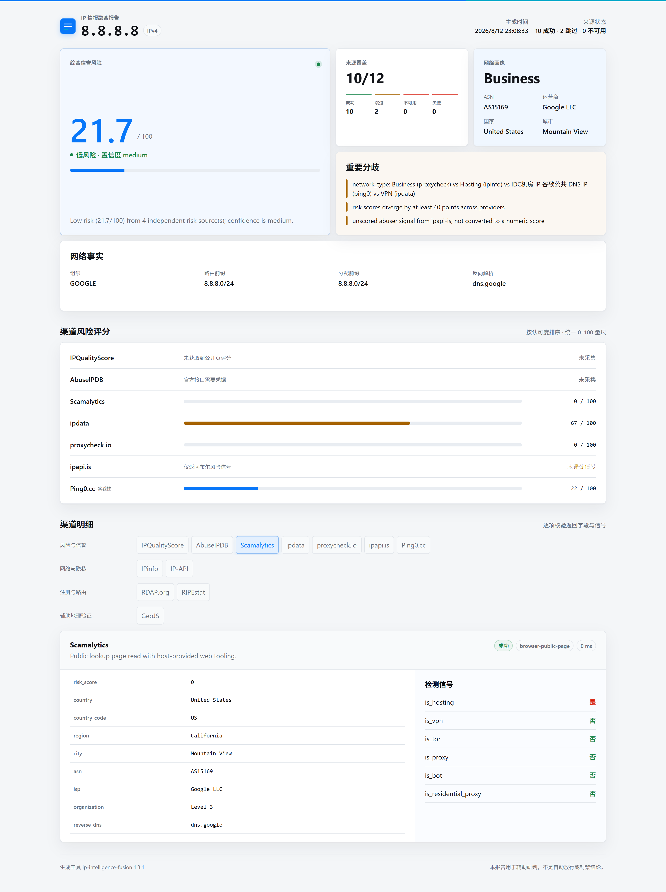

# IP Intelligence Fusion

[English](README.md) | [简体中文](README.zh-CN.md)

[](scripts/ip_intelligence.py)
[](https://www.python.org/)
[](LICENSE)

面向公网 IPv4 和 IPv6 地址的可审计、多来源 IP 情报 Skill。通过一个有证据依据的工作流，调查
IP 所有权、路由、地理位置、代理/VPN/Tor 暴露、托管、滥用、欺诈、信誉与纯净度。

由 [GetIPProxy](https://getipproxy.com/zh-cn/) 创建。

> 本项目是调查辅助工具，不是自动放行或封禁结论。不同来源的覆盖范围和数据更新时间并不
> 一致，不能仅因没有来源报告风险就将某个 IP 称为安全。

## 为什么选择 IP Intelligence Fusion？

多数 IP 查询 Skill 只返回单一服务商的地理记录或一组平铺标签。IP Intelligence Fusion
面向需要理解多个来源为何一致、又为何冲突的调查场景：

- **12 个来源适配器：**一次查询覆盖信誉、欺诈、代理/VPN/Tor、地理位置、ASN、注册信息与
  BGP 路由证据。
- **基于证据的融合：**共识值和备选值始终可追溯到具体来源，来源分歧不会被隐藏。
- **诚实的风险评分：**只有上游数值评分进入加权综合分；布尔标签保留为未计分信号，不会被
  转换成虚构数字。
- **不制造虚假零分：**`unknown`、已跳过、不可用、失败和成功但无评分是不同状态；缺失数据
  永远不会被解释为低风险。
- **凭据可选的基线：**免密钥来源无需用户申请或泄露新的 API 凭据；环境中已有的凭据可扩展
  覆盖范围。
- **经验证的公开页面回退：**当宿主提供只读网页能力时，可从受支持的官方页面补充 API 缺口，
  但页面必须明确回显目标 IP。
- **可审计交付物：**同时生成规范化 JSON 与响应式、单文件离线 HTML，保留所有来源状态和
  重要冲突。
- **便携且零第三方依赖：**仅使用 Python 3.9+ 标准库，并支持英文和简体中文报告。

这个项目源于真实业务中对 IP 风控值、ASN 归属、代理属性以及多来源分歧进行交叉验证的需求。
相同的实践背景也用于 GetIPProxy 的 [按风控值与 ASN 选购纯净住宅代理](https://getipproxy.com/zh-cn/static-residential-proxies/clean-ips/)。

## 报告预览



HTML 报告可完全离线使用：CSS、JavaScript 和报告数据均嵌入单个文件。上游字符串以文本方式
安全渲染，覆盖缺口和来源冲突会被明确展示。

## 查询来源

Skill 默认选择全部来源。实际查询时，某个来源仍可能因为凭据、网络权限、公开页面工具或上游
服务可用性而被跳过、不可用或失败。

| 分类 | 来源 | 访问方式与用途 |
|---|---|---|
| 风险与信誉 | IPQualityScore | 欺诈分数及代理/VPN/Tor 信号；使用已有 API 密钥或经验证的官方公开页面回退 |
| 风险与信誉 | AbuseIPDB | 社区滥用置信度和举报；仅使用已有 `ABUSEIPDB_API_KEY`，不提供页面抓取回退 |
| 风险与信誉 | Scamalytics | 欺诈分数、黑名单和代理属性；使用已有 API 集成或经验证的官方公开页面 |
| 风险与信誉 | ipdata | 信任/威胁、ASN 和网络属性；使用已有 API 密钥或经验证的官方公开页面 |
| 风险与信誉 | proxycheck.io | 代理/VPN 类型及风险分数；可免密钥使用，也支持已有可选密钥 |
| 风险与信誉 | ipapi.is | ASN/公司信息以及粗粒度网络和风险标签；免密钥 |
| 风险与信誉 | Ping0.cc | 风险及原生/托管分类；免密钥的实验性页面适配器 |
| 网络与隐私 | IPinfo | 地理位置、ASN/公司、路由和匿名化信息；使用已有令牌或经验证的官方公开页面 |
| 网络与隐私 | IP-API | 地理位置、ASN/ISP、移动网络、代理和托管属性；免密钥 HTTP 接口 |
| 注册与路由 | RDAP.org | 注册分配与联系人信息；免密钥 |
| 注册与路由 | RIPEstat | 公告前缀、起源 ASN 和路由可见性；免密钥 |
| 辅助地理验证 | GeoJS | 独立的地理位置和 ASN 交叉验证；免密钥 |

成功的 API 响应优先于导入的公开页面证据。公开页面只采集页面中可见且已列入白名单的字段，
其覆盖范围可能少于官方 API。

## 环境要求

- Python 3.9 或更高版本
- 能够访问所选来源的网络连接
- 使用 Skill 时需要 Codex、ChatGPT 桌面端或其他支持 Agent Skills 的宿主
- 使用官方公开页面增强时需要可选的只读浏览器或网页读取能力

无需安装第三方 Python 包。

## 安装

### 使用 Codex 安装

让 Codex 的 `$skill-installer` 安装此仓库：

```text
请从 https://github.com/GetIPProxy/ip-intelligence-fusion 安装这个 Skill
```

本地开发或手动安装时，将完整仓库克隆到 Codex 的 Skill 搜索目录：

```bash
git clone https://github.com/GetIPProxy/ip-intelligence-fusion.git \
  ~/.agents/skills/ip-intelligence-fusion
```

如需仅在某个仓库中使用，也可以将目录克隆或复制到
`<REPO_ROOT>/.agents/skills/ip-intelligence-fusion`。通常宿主会自动发现新 Skill；如未出现，再
重启宿主。

### 克隆后直接使用 CLI

```bash
git clone https://github.com/GetIPProxy/ip-intelligence-fusion.git
cd ip-intelligence-fusion
python scripts/ip_intelligence.py --version
```

如果系统没有 `python` 命令，请使用 `python3` 或 `py -3`。

## 快速开始

### 调用 Skill

提及已安装的 Skill，并明确提供一个公网 IP：

```text
使用 $ip-intelligence-fusion 调查 8.8.8.8，并生成简体中文报告。
```

Skill 会验证目标，执行确定性基线查询，在宿主具备相应能力时尝试受支持的公开页面回退，最后
返回一份简报以及两种报告的路径。

### 运行 CLI

生成 JSON 证据和英文离线 HTML 报告：

```bash
python scripts/ip_intelligence.py 8.8.8.8 --report-dir reports --language en
```

生成简体中文报告：

```bash
python scripts/ip_intelligence.py 2606:4700:4700::1111 \
  --report-dir reports --language zh-CN
```

指定或排除来源：

```bash
python scripts/ip_intelligence.py 8.8.8.8 \
  --providers rdap,ripestat,geojs,ipapi-is,proxycheck \
  --report-dir reports

python scripts/ip_intelligence.py 8.8.8.8 --exclude ping0 --report-dir reports
```

查看来源及当前运行环境中的配置状态：

```bash
python scripts/ip_intelligence.py --list-providers
```

只有在明确要调查本机当前公网 IP 时才使用 `--self`。

## 输出文件

使用 `--report-dir reports` 时，CLI 会写入：

```text
reports/
├── ip-intelligence-8.8.8.8.json
└── ip-intelligence-8.8.8.8.html
```

- **JSON：**规范化目标、时间戳、来源状态、来源证据、融合事实、综合风险、网络暴露、冲突、
  置信度和展示元数据。
- **HTML：**便携交互式报告，包含来源覆盖、共识事实、风险行、网络属性、冲突和分组来源详情。
- **Markdown：**默认输出到终端；也可以通过 `--format markdown --output <FILE>` 写入独立文件。

默认不包含上游原始响应。只有确有必要且适合保留时才使用 `--include-raw`。

## 可选凭据

Skill 不会要求你粘贴或披露 API 密钥。如果环境中已经存在凭据，对应的官方适配器会自动启用：

| 来源 | 环境变量 |
|---|---|
| IPinfo | `IPINFO_TOKEN` |
| IPQualityScore | `IPQS_API_KEY` |
| ipdata | `IPDATA_API_KEY` |
| AbuseIPDB | `ABUSEIPDB_API_KEY` |
| Scamalytics | `SCAMALYTICS_API_URL`、`SCAMALYTICS_API_KEY` |
| proxycheck.io | `PROXYCHECK_API_KEY`（可选） |

凭据缺失会被记录为覆盖缺口，而不是零分或负面证据。

## 融合方法

- 只有至少两个来源支持领先的兼容值且不存在并列时，事实才会成为共识；备选值和来源身份始终
  保留在报告中。
- 注册国家与地理定位国家分别保存，注册分配前缀与观测到的 BGP 路由前缀也分别保存。
- 只有上游原生数值风险、欺诈或滥用评分参与加权综合分。ipdata 信任分会明确使用
  `100 - trust_score` 转换，并标记为派生值。
- 代理、VPN、Tor、托管、机器人、黑名单和滥用布尔值保留为上下文或未计分信号，不会暗中改变
  综合分。
- 置信度取决于数值来源数量和一致程度。没有数值估计时，即使存在上下文标签，结果仍为
  `unknown`。
- 来源失败不构成负面证据。

详见[完整方法论](references/methodology.md)和[来源说明](references/providers.md)。

## 重要限制

- IP 地理定位是近似结果，不同数据库的更新时间不同。
- 托管、VPN、代理或 Tor 分类不等同于恶意行为证据。
- 不同服务商的数值评分语义不同；综合分是对比辅助，不是普适真相。
- 某些环境可能无法使用需要凭据的来源或公开页面。
- IP-API 免费接口使用 HTTP，可能被安全网络阻止。
- Ping0.cc 属于实验性来源，其页面结构变化可能导致适配器失效。
- Skill 只接受一个明确提供的公网 IPv4 或 IPv6 地址；主机名以及私有、回环、链路本地、保留、
  组播和未指定地址会被拒绝。

## 项目结构

```text
ip-intelligence-fusion/
├── SKILL.md                    # Agent 工作流与证据边界
├── agents/openai.yaml          # Skill 展示元数据
├── scripts/ip_intelligence.py  # 零第三方依赖的采集与融合 CLI
├── assets/report-template.html # 自包含报告渲染器
├── references/                 # 方法论、来源、公开页面与报告设计
└── tests/                      # 单元测试和公开证据 fixture
```

## 测试

```bash
python -m unittest discover -s tests -v
```

测试覆盖公网 IP 验证、来源隔离、敏感信息安全错误、公开页面证据校验、适配器响应结构、事实与
风险融合、展示状态和安全的离线 HTML 渲染。

## 贡献与支持

欢迎提交 Issue 和 Pull Request。修改来源适配器时，请保留目标 IP 校验、明确的来源状态、证据
出处，以及数值风险与未计分信号之间的边界。请勿提交 API 凭据、私有 IP 调查报告或含敏感
数据的原始响应。

## 由 GetIPProxy 创建

这个开源 Skill 由 [GetIPProxy](https://getipproxy.com/zh-cn/) 维护。GetIPProxy 提供独享静态
住宅 IP，以及结合风控值范围和 ASN 信息的纯净 IP 选择。本 Skill 保持来源中立：GetIPProxy
不会作为情报来源，也不会参与综合评分。

## 许可证

本项目采用 [MIT License](LICENSE)。
