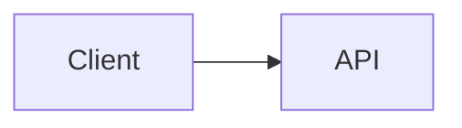

# Extended Syntax — Footnotes, Callouts, Math, Diagrams, Task Lists

Everything here is an extension. None of it is in CommonMark, each target implements a different subset with different syntax, and the failure mode is always the same: the source renders literally. Check the Support Matrix in `SKILL.md` first, and prefer a construct the target already uses in its own docs.

**Contents:** [Task Lists](#task-lists) · [Footnotes](#footnotes) · [Callouts and Admonitions](#callouts-and-admonitions) · [Collapsible Sections](#collapsible-sections) · [Math](#math) · [Mermaid and Diagrams](#mermaid-and-diagrams) · [Definition Lists](#definition-lists) · [Emoji](#emoji) · [Text Decorations](#text-decorations) · [Comments](#comments) · [Wikilinks and Embeds](#wikilinks-and-embeds)

## Task Lists

```markdown
- [ ] open
- [x] done
```

- GFM extension. The checkbox must be the **first thing** in the list item, with a space inside the brackets for unchecked.
- Nested task lists work; on GitHub, checking a box in an issue or PR edits the source.
- `- [X]` uppercase works on GitHub; some parsers only accept lowercase.
- Not clickable in a file view, only in issues/PRs and some doc themes.
- Rendered as literal `[ ]` in Slack, Discord, and any non-GFM target.

## Footnotes

```markdown
Text with a note.[^ref]

[^ref]: The note. Can hold multiple paragraphs if the
    continuation is indented four spaces.
```

- GitHub supports them in files, issues, and PRs; CommonMark does not; MDX needs `remark-gfm`; Python-Markdown needs `footnotes`.
- Labels are arbitrary strings (`[^why-not-json]` beats `[^1]`) and are not the rendered number — the renderer numbers them in order of appearance, so reordering the text renumbers automatically.
- A defined-but-unreferenced footnote silently disappears; a referenced-but-undefined one renders literally, like a broken reference link (`links.md`).
- Footnotes are the wrong tool for a link the reader needs: they move the destination to the bottom of a long page. Use them for asides and provenance.

## Callouts and Admonitions

The same idea with four incompatible syntaxes. Pick by target; never mix two in one doc set.

| Target | Syntax | Types |
|---|---|---|
| GitHub (alerts) | `> [!NOTE]` on the first line of a blockquote | NOTE, TIP, IMPORTANT, WARNING, CAUTION |
| Docusaurus, VitePress | `:::note` … `:::` (title after the type) | note, tip, info, warning, danger |
| MkDocs Material | `!!! note "Title"` with the body indented **4 spaces** | note, abstract, info, tip, success, question, warning, failure, danger, bug, example, quote |
| Obsidian | `> [!note] Title` inside a blockquote | 13 built-in types, foldable with `+`/`-` |
| Pandoc | `::: {.note}` fenced div plus a filter or template | Whatever the template styles |

Failure modes: GitHub renders a Docusaurus `:::note` as literal text; Material renders a GitHub alert as an ordinary quote with `[!NOTE]` in it; a Material admonition whose body is indented 3 spaces silently ends the block after the title.

Content rule regardless of syntax: a callout interrupts reading, so it earns its place only when the information is both surprising and consequential. Three callouts on one screen is a page with no hierarchy.

## Collapsible Sections

```html
<details>
<summary>What this hides</summary>

Markdown inside works **only** after a blank line here.

</details>
```

- Raw HTML: GitHub renders it, Hugo drops it unless `unsafe: true`, MDX needs valid JSX (self-closing tags, `className`), PyPI's sanitizer allows `details`/`summary` in current versions but has not always.
- The blank line after `</summary>` is mandatory: without it the parser treats the contents as an HTML block and does not parse the Markdown.
- `<details open>` starts expanded.
- Content inside is not searchable by browser find on some renderers, and screen readers announce it as a disclosure widget — never hide something a reader must not miss.

## Math

- **GitHub**: `$x^2$` inline and `$$…$$` in a block, rendered with MathJax. Inline math must not have a space after the opening `$`, and a currency amount like `$5 and $6` can accidentally open a math span — escape it as `\$`.
- **Docs sites**: `remark-math` + `rehype-katex` (Docusaurus, VitePress), `pymdownx.arithmatex` + MathJax/KaTeX (MkDocs). Both need explicit configuration; neither is on by default.
- **Pandoc**: `tex_math_dollars` on by default in most Markdown flavors, and the only path that produces real LaTeX output (`conversion.md`).
- KaTeX supports a large but incomplete subset of LaTeX; MathJax is slower and more complete. A formula that renders in one may not in the other — test the actual expression, not a simple one.
- Escaping inside math: backslashes are LaTeX commands, so `\\` in a Markdown context can become a single backslash before LaTeX sees it. When a formula breaks only in Markdown, put it in a `$$` block, which is less aggressively pre-processed.
- Beyond a couple of formulas, the target is probably wrong: `latex` handles documents that are mostly mathematics.

## Mermaid and Diagrams

````markdown

````

- **GitHub** renders `mermaid` fences in files, issues, PRs and wikis. **MkDocs Material** renders them via `superfences` with a custom fence. **Docusaurus** needs `@docusaurus/theme-mermaid`. **Pandoc** needs a filter or a pre-rendered image.
- Mermaid inherits the page theme, which makes it the best answer to the dark-mode image problem (`links.md`).
- Where it does not render, the diagram becomes a wall of source — a real cost. For documents that travel, render to SVG and commit the image with the source in a comment or an adjacent `.mmd` file.
- Diagrams break in ways text does not: a label containing `(`, `:` or a reserved word needs quotes. Keep labels alphanumeric and the diagram will survive versions.
- Alternatives: PlantUML (needs a server), D2 (build step), Graphviz (build step), and ASCII diagrams in a fence — the last renders literally everywhere and is invisible to screen readers.

## Definition Lists

```markdown
Term
: The definition, after a colon and a space.
```

Pandoc (`definition_lists`), Python-Markdown (`def_list`), kramdown. **Not GFM** — on GitHub it renders as two lines, the second starting with a colon. Where the target lacks them, `**Term** — definition` is the portable equivalent and reads the same.

## Emoji

- **Unicode emoji** (paste the character) render everywhere, including Slack, PDF (font permitting) and plain text.
- **Shortcodes** (`:tada:`) are a GitHub feature, plus opt-in extensions elsewhere. On any other target the literal colons show.
- PDF export via LaTeX fails on emoji unless the engine is XeLaTeX/LuaLaTeX with an emoji font, or WeasyPrint (`conversion.md`).
- Screen readers announce emoji by their full CLDR name, so a decorative row of three becomes three spoken phrases (`accessibility.md`). Emoji in headings also end up in the anchor slug on some targets and are stripped on others — never put one in a heading you will link to.

## Text Decorations

| Effect | Syntax | Where |
|---|---|---|
| Strikethrough | `~~x~~` | GFM, most; Slack uses `~x~` |
| Highlight | `==x==` | Obsidian, MkDocs (`pymdownx.mark`), not GFM |
| Subscript / superscript | `~x~` / `^x^` | Pandoc, Python-Markdown extensions; `<sub>`/`<sup>` elsewhere |
| Underline | none | Markdown has no underline by design — it collides with links; `<u>` if `raw_html` allows |
| Inserted / deleted | `++x++` / `~~x~~` | Extensions only; for real change tracking use a diff or `word-docx` |

## Comments

- `<!-- comment -->` works in every HTML-tolerant parser and is stripped from the output — but it is **in the file**, so it is public in any public repo.
- **MDX rejects HTML comments**; use `{/* comment */}` (`mdx.md`).
- Obsidian has `%%comment%%`, which stays out of exports.
- A reference-definition trick (`[//]: # (comment)`) survives parsers that strip HTML, at the cost of being unreadable to the next person.
- Docusaurus `<!--truncate-->` and Hugo `<!--more-->` are functional markers, not comments: they set the excerpt boundary.

## Wikilinks and Embeds

- `[[Page Name]]` and `![[Page Name]]` are Obsidian, Foam, and GitHub **wikis** — not GFM files. In a repo README they render literally as double brackets.
- Obsidian embeds pull the whole target file into the page; nothing else does. A vault exported to a site needs those converted to normal links plus includes (`docs-sites.md`).
- Converting a vault out of Obsidian is mostly a wikilink-to-relative-link rewrite plus a slug decision; do it once with a script, and put the slug rule chosen plus the script in an `artifacts/` file with its `## Boxes` line, because every future export must match it.

**When a target's real extension support is established** — which callout syntax it takes, whether math is configured, whether Mermaid renders — write it into that target's row in `## Render Targets` of `~/Clawic/data/markdown/memory.md`, and put anything it silently swallowed into `Confirmed refuses` with a one-line `## Quirks` entry naming the target (`memory-template.md`). Extension support is the fact this domain re-learns most often, and it is a single table cell.
