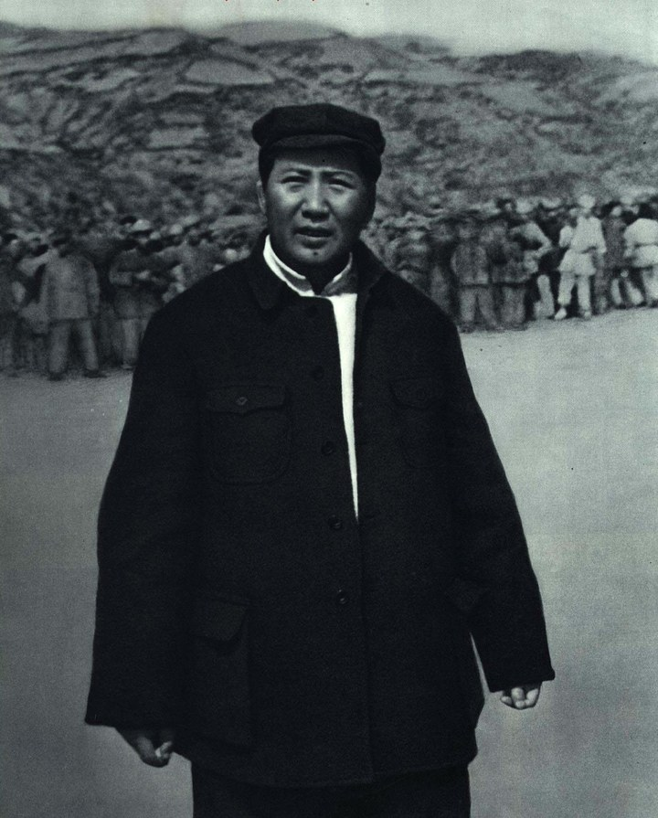
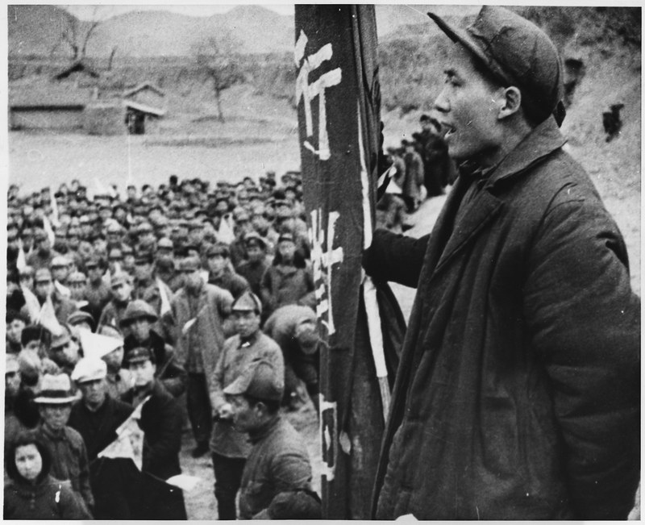
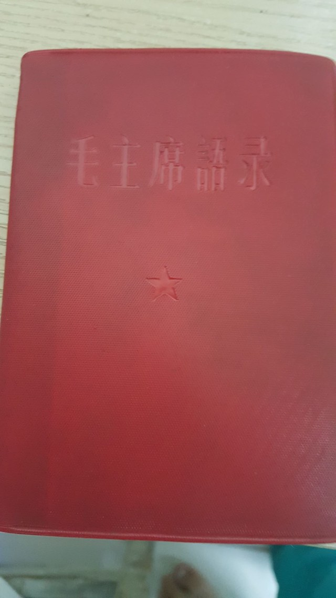

# 教员 · 思维模式引擎 / Jiaoyuan · Mindset Engine

<p align="center">
  <a href="LICENSE"></a>
  <a href="LICENSE-CONTENT"></a>
  
</p>

> 仓库名：**jiaoyuan.skill** · 中文名：**教员** / Repository: **jiaoyuan.skill** · Chinese name: **Jiaoyuan (教员)**

<div align="center">
  
</div>

> 中国人常说："民族的就是世界的。"
>
> As the Chinese saying goes: "What is national is what is international."

**我们希望给你展现一个完整的他。**——不是某一句名言、某一个侧面，而是完整展现教员的思想方法论：他怎么看清事实、怎么抓住要害、怎么把判断落到脚下这一步。

**We want to present him to you in full.** — not one famous quotation or one facet, but the complete methodology of his thinking: how he sees the facts, how he grasps what matters, and how he turns a judgment into the next concrete step.

把教员著作中的**思维方法**蒸馏成可复用的决策工具。你遇到现实难题时，它推演"他会怎么想、怎么做"——聚焦思考方式，不是语录复读。

Distills the **ways of thinking** in Jiaoyuan's works into reusable decision tools. When you face a real-world problem, it reenacts "how he would think about it and what he would do" — focused on method, not quotation-reciting.

## 项目缘起 / Why This Project

很多人对教员的第一印象，来自几句口号或一张画像——那是"标签"，不是完整的他。我们做这件事，是因为他真正可迁移的，不是立场、不是口号，而是一套**怎么想问题**的方法：没有调查就没有发言权、抓主要矛盾、具体问题具体分析、在战略上藐视困难、在战术上重视困难……这些方法放在今天一个普通人的事业、决策、团队、成长里，依然管用。

所以这个项目不做"语录库"，也不做"立场表态"，而是把散落在 159 篇选集、427 条语录、6 卷军事文集里的思考方式，提炼成 43 张可以直接上手的模式卡、28 个真实历史案例，外加一套表达风格 DNA 与内在张力，让"完整的他"重新变成一个能帮你把问题想清楚的思考引擎。

**English:**

Many people's first impression of Jiaoyuan comes from a few slogans or a single portrait — that is a "label," not the complete person. We built this because what is genuinely transferable about him is not a political stance or a slogan, but a set of methods for **how to think**: no investigation, no right to speak; grasp the principal contradiction; concrete analysis of concrete conditions; despise difficulties strategically and take them seriously tactically... These methods still work today in an ordinary person's career, decisions, team, and growth.

So this project is neither a "quotation database" nor a "stance statement." Instead, it distills the ways of thinking scattered across 159 articles of the Selected Works, 427 quotations, and 6 volumes of military writings into 43 ready-to-use Pattern Cards, 28 real historical cases, plus a set of expression-style DNA and inner tensions — turning "the complete him" back into a thinking engine that helps you think a problem through.

<div align="center">
  
</div>

---

## 一句话定位 / One-Line Positioning

一个活的思考引擎：5 个内核作顶层框架、43 张模式卡作素材库、28 个真实历史案例作类比参照、表达风格 DNA 作语言载体、7 对内在张力保证不脸谱化。

A living thinking engine: five Cores as the top-level framework, 43 Pattern Cards as the material library, 28 real historical Cases as analogical references, an expression-style DNA as the language carrier, and 7 pairs of Inner Tensions that keep it from becoming a caricature.

## 效果演示 / Demonstration

**例 1 · 竞争**："我做的独立工具被大厂免费复制了，团队士气低落，还要不要做下去？"

> 你把它当成了一场"你死我活"的速决战，想一口定胜负——可这不是。它肯抄你，恰恰说明你选的方向它看得上，这是路走对了的信号。先别急着开会喊"要不要放弃"，先查清一件事：它抄走的到底是外壳还是核心？查清之后看主要矛盾——你真正的对手不是大厂，是你有没有一块"它看不上、用户离不开"的根据地。战略上藐视它，战术上把它当真老虎对待，把有限资源全压到"一个它做不好的场景"上。这周就做一件事：写下大厂"做不到、也不愿做"的三个点，挑一个，全队只打这一个。

**例 2 · 决策**："要不要跳槽，薪资高但风险大？"

> 你纠结的不是"去不去"，是"还没把新公司的真实情况查清楚，所以不敢拍板"。先调查：去查现金流、团队口碑、离职率，找在里面干过的人聊。抓主要矛盾——决定性的不是薪资涨幅，是"两年后你在哪家更有竞争力"。一分为二把利弊都摆上桌，别只盯着涨薪这一面。这周约一个目标公司前员工吃饭，问清三个问题（稳定性 / 成长空间 / 真实强度）。

**例 3 · 变革**："行业正在被 AI 颠覆，公司方向不明，何去何从？"

> 你慌的不是"AI 来了"，是"还没查清 AI 到底动了你哪块蛋糕，就急着想转型"。先求真：把"已发生的冲击"和"想象出来的恐慌"分开，花两周访谈客户、问同行。再辨局：决定性的不是"要不要全面转 AI"，是"你多年攒下的核心能力，能不能迁移到 AI 之后的新需求上"。先选一个"新需求 + 旧能力"的重合点做小试验，用实践检验方向对不对。

## 差异化对比 / How It Differs

| 维度 | 语录库 / 概念库 | 其他毛选类 skill | **本 skill / This Skill** |
|---|---|---|---|
| 给你什么 | "他有哪些思想" | 立场表态、口号搬运 | "他遇到**你这事**会怎么想" |
| 形态 | 静态引用、概念堆砌 | 原文摘抄 | 动态推演：看本质→调查→主矛盾→策略→切入点→靠谁→第一步 |
| 质量 | 无分级 | 无验证 | 每卡带证据强度，孤例不采信 |
| 反教条 | 部分 | 无 | 每卡强制带"什么时候不适用" |
| 双模式 | 无 | 无 | 推演模式（给完整推演）+ 引导模式（只反问、做思想教练） |

| Dimension | Quotation DB | Other Mao-skills | **This Skill** |
|---|---|---|---|
| What you get | "what ideas he had" | slogans, excerpt-dumping | "how he'd think about **your** problem" |
| Form | static citations | raw quotes | dynamic reenactment: essence→investigate→principal contradiction→strategy→entry point→who to rely on→first step |
| Quality | ungraded | unverified | evidence-strength per card; single-source claims rejected |
| Anti-dogma | partial | none | every card carries "when it does NOT apply" |
| Dual modes | none | none | Deduction Mode + Coaching Mode |

## 核心资产全景 / Core Assets at a Glance

| 资产 | 规模 | 说明 |
|---|---|---|
| 思维内核 Cores | 5 | 实事求是 / 矛盾分析 / 实践检验 / 群众路线 / 战略战术 |
| 模式卡 Pattern Cards | 43 | 触发情境 / 思维路径 / 决策原则 / 适用边界 / 语录金句 |
| 历史案例 Cases | 28 | 局势 / 判断 / 行动 / 结果 / 可迁移点 |
| 表达风格 DNA | 27 条 | 比喻 / 反问 / 俗语 / 排比 / 称呼 / 节奏 |
| 内在张力 Tensions | 7 对 | 持久 vs 速决、团结 vs 斗争、理论 vs 实践等 |
| 原文语料 Corpus | 约 307 万字 | 选集 159 篇 + 书信 372 封 + 军事文集 6 卷 + 语录 427 条 + 早期文稿 + 诗词 + 批注 |
| 评测集 Eval Set | 58 例 | 10 类场景 × 推演/引导/陌生发散 |

## 质量承诺 / Quality Commitment

- **约 307 万字原文语料全开源**（字符数·不计空格，其中纯汉字约 263 万字）：`corpus/` 收录《毛泽东选集》159 篇（1991 版）、《毛主席语录》1965 版（33 专题 427 条，红宝书标准版）、书信选集、军事文集 6 卷、早期文稿、诗词、政治经济学批注，文件名与正文保留中文原样，供逐字核对。

| 语料 Corpus | 规模 Scale | 字数（不计空格）Size |
|---|---|---|
| 《毛泽东选集》 Selected Works | 159 篇 | 约 73.8 万字 ≈ 738k |
| 《毛泽东书信选集》 Selected Letters | 372 封 | 约 17.4 万字 ≈ 174k |
| 《毛泽东军事文集》 Military Writings | 6 卷 | 约 156.8 万字 ≈ 1.57M |
| 《毛主席语录》1965 版 Quotations (1965) | 33 专题 · 427 条 | 约 7.0 万字 ≈ 70k |
| 早期文稿 Early Writings | 1 卷 | 约 25.4 万字 ≈ 254k |
| 诗词 Poems | 1 集 | 约 1.5 万字 ≈ 15k |
| 政治经济学批注 Political Economy Annotations | 2 册 | 约 25.6 万字 ≈ 256k |
- **引文逐字核对**：51 条语录金句全部 grep 命中原文，零杜撰；模式卡的"提炼依据"逐条溯源到篇目。
- **58 例评测**：覆盖 10 类现实难题（事业/创业/决策/团队/竞争/学习/挫折/人际/变革/迷茫），含推演模式、引导模式、陌生问题发散三类，全部通过静态校验。
- **证据强度分级**：每卡按跨篇目反复出现的程度定级（孤例不采信，低证据不发布），杜绝"凭记忆编观点"。

<div align="center">
  
</div>

> **宝贵红宝书原件原文均供开源下载**：1965 版《毛主席语录》全文收录于 [`corpus/语录/毛主席语录-1965版-33专题.md`](corpus/语录/毛主席语录-1965版-33专题.md)，33 专题 427 条，与 43 张模式卡的「语录金句」一一对应，可下载后逐字核对。
>
> The precious original text of the "Little Red Book" is available for open-source download: the full 1965 edition of *Quotations* (33 sections, 427 entries) is in [`corpus/语录/毛主席语录-1965版-33专题.md`](corpus/语录/毛主席语录-1965版-33专题.md), corresponding one-to-one with the 43 Pattern Cards' "Quotations" section.

## 双模式体验 / Dual Modes

1. **推演模式（默认）**：给完整推演——一句话点破本质 → 思考展开 → 他可能说的话 → 现在就能做的第一步。多卡组合 + 案例类比 + 表达 DNA + 金句点睛。
2. **引导模式**：你说"引导我 / 让我自己想"，它只反问、不给答案，做你的思想教练，顺着你的回答动态追问，直到你自己想出第一步。

1. **Deduction Mode (default)**: a full reenactment — essence in one line → the reasoning → what he might say → the first concrete step you can take now.
2. **Coaching Mode**: say "guide me" and it only asks questions, never gives answers — a thinking coach that follows your responses until you arrive at your own first step.

## 快速开始 / Quick Start

安装到你的 Agent Skills 目录（遵循 Anthropic Agent Skills 开放标准）：

Install into your Agent Skills directory (following the Anthropic Agent Skills open standard):

```bash
npx skills add swif698/jiaoyuan.skill
```

或手动复制 / or copy manually：

```bash
git clone https://github.com/swif698/jiaoyuan.skill.git
# 将仓库根目录放入你的 skills 目录 / place the repo root in your skills directory
```

然后直接向启用了本 skill 的 Agent 描述你的难题即可。Then just describe your problem to an Agent that has this skill enabled.

## 中性定位与免责声明 / Neutral Positioning & Disclaimer

- 这是一个**历史人物思想方法论的研究与提炼项目**，聚焦"怎么想问题"的通用方法，**不是**政治宣传，**不是**让 AI 扮演历史人物，**不是**对历史人物与历史事件的评价。
- 只谈思维方法与决策工具；原文只做短引（逐字核对），发布物是原创提炼的模式卡。
- 本项目的思维方法与决策框架仅供参考，**不替代**医疗、法律、投资、心理等专业建议；重大决策请结合自身实际情况并咨询专业人士。
- 语料版权：`corpus/` 收录的著作，作者已故超过 50 年，按著作权法将于 **2026 年 12 月 31 日**进入公有领域；本仓库仅供学习与研究，商业使用前请自行确认版权状态（详见 [`corpus/版本说明.md`](corpus/版本说明.md)）。
- 思维方法是工具，**具体情况具体分析**——这正是这套方法自己反复强调的。

- This is a **research-and-extraction project on the methodology of a historical figure's thinking**, focused on universal methods of "how to think." It is **not** political propaganda, **not** role-playing a historical figure, and **not** an evaluation of historical figures or events.
- Only methods and decision tools are discussed; original texts are quoted only briefly (verified verbatim), and the published content is originally-extracted Pattern Cards.
- The frameworks here are for reference only and do **not** replace professional medical, legal, investment, or psychological advice.
- Corpus copyright: the works in `corpus/` were authored by someone deceased for more than 50 years, and under copyright law will enter the public domain on **31 December 2026**; this repository is for study and research only, so please confirm copyright status before commercial use (see [`corpus/版本说明.md`](corpus/版本说明.md)).
- A method is a tool — **concrete analysis of concrete conditions** is exactly what this method itself insists on.

## 致谢 / Acknowledgments

这套方法的全部思想遗产属于历史与人民的共同财富。感谢所有整理、校对、数字化这些公开文献的人——正是他们的工作，让近百年前的思考方式今天仍能照亮一个普通人的具体难题。愿每一位使用者在面对困境时，都能像他一样：先看清事实，再抓住要害，最后走好脚下这一步。

The intellectual legacy behind this method belongs to history and the people at large. Thanks to everyone who compiled, proofread, and digitized these public-domain documents — it is their work that lets a way of thinking from nearly a century ago still illuminate an ordinary person's concrete problems today. May every user, when facing difficulty, do as he did: see the facts first, grasp what matters, then take the next step well.

## 授权 / License

- 代码与脚本（SKILL.md 结构、脚本、测试）：MIT（见 `LICENSE`）
- 模式卡等原创提炼内容（`patterns/`、`cases/` 等）：CC BY 4.0（见 `LICENSE-CONTENT`）
- 语料原文（`corpus/`）：版权与公有领域说明见 `corpus/版本说明.md`
