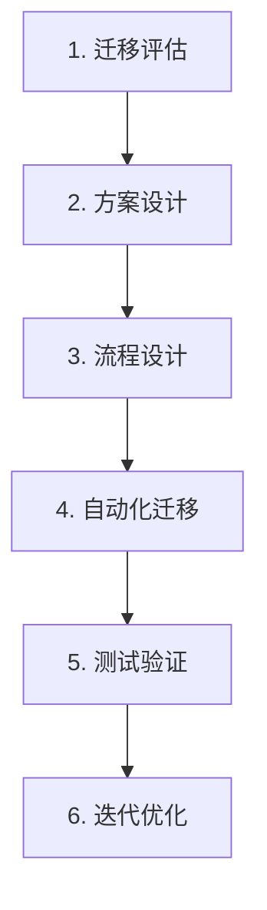

# KingbaseES 数据迁移指南

本技能提供从 Oracle、SQL Server、MySQL 等异构数据库迁移至 KingbaseES 的完整流程指南，涵盖迁移评估、环境准备、数据搬迁、应用适配、测试验证和系统割接六大阶段。

## 迁移总流程（6 阶段）



- **迁移评估**：划定迁移范围，预估工作量，标识主要风险点
- **方案设计**：根据评估结论定制整体方案，明确离线/在线迁移策略
- **流程设计**：基于成熟方案定制迁移流程，降低过程风险
- **自动化迁移**：使用 KDTS 工具及 KFS 工具进行迁移
- **测试验证**：确保迁移完成后源应用系统功能完好，使用 Katalon 等工具迭代测试
- **迭代优化**：通过性能监控工具 Kmonitor 寻找瓶颈并优化

## 阶段一：迁移评估

### 1. 确定迁移目标

根据用户实际需求确认以下目标：

- 迁移整体工期
- 迁移过程中业务是否可以暂停
- 对象和数据迁移度
- 迁移源数据库规模（各类对象数量、PL/SQL 程序规模）
- 技术指标要求（平台、版本、API、可用性、安全性和性能指标）

使用《数据库需求调研表》作为工作牵引和记录。

### 2. 组建迁移团队

团队成员至少需具备以下知识和技能：

- 熟悉源数据库和 KingbaseES 的 SQL 语言和 PL/SQL 语言特性及兼容特性
- 熟悉源数据库和 KingbaseES 的各种应用编程接口
- 熟悉源数据库和 KingbaseES 的相关客户端工具

### 3. 评估迁移任务

使用金仓在线评估工具 KDMS（访问地址：https://www.kingbase.com.cn）辅助评估，从多个角度分析：

- 迁移源数据库规模（各类对象数量、PL/SQL 程序规模）
- 数据库对象种类和特征（简单/复杂对象比例）
- 迁移难易程度（KES 不支持功能、大对象、大量约束等）
- 技术指标要求
- 移植过程中可能遇到的其他问题

## 阶段二：方案设计

根据评估结论定制迁移方案，关键决策：

- **离线迁移**：业务可停机，使用 KDTS 即可完成完整迁移
- **在线迁移**：业务不停机，需 KDTS 完成历史数据搬迁 + KFS 追平增量数据

## 阶段三：迁移准备

### 1. 部署目的数据库服务器

遵循以下原则：

- CPU、内存、网络等硬件尽量采用较高配置
- 源数据库规模超过 1GB，建议源库和目标库部署在不同物理机
- 尽量将 KingbaseES 和源库部署到同一局域网内

### 2. 获取并安装必要的软件

- 源数据库系统、KingbaseES 数据库系统
- PL/SQL Developer、JDBC 和 ODBC 驱动程序
- C 语言开发工具、OCI 软件、DCI 软件
- TPC-C 测试工具、LoadRunner 等

### 3. 数据库/用户创建

在目的 KingbaseES 上执行：

- 创建与源数据库用户同名的用户
- 创建与源数据库同名的数据库，属主为上一步指定用户
- 创建与源数据库同名的模式

### 4. 目标库参数优化（大规模迁移场景）

迁移数据规模较大时，建议对 KingbaseES 进行优化：

```ini
max_connections = 2000
shared_buffers = RAM * 0.4GB          # 最大 64GB
work_mem = 10MB
maintenance_work_mem = 6GB
effective_cache_size = RAM * 0.5GB
max_locks_per_transaction = 1024
max_wal_size = 100GB
checkpoint_timeout = 5min
checkpoint_completion_target = 0.9
max_worker_processes = 100
max_parallel_workers = 80
max_parallel_maintenance_workers = 64
```

## 阶段四：数据迁移

### 离线迁移：KDTS 工具

KDTS（Kingbase Data Transfer Service）是操作简单、稳定高效的数据库迁移工具，支持多线程异步处理。

#### 支持的源端数据库

| 源端数据库 | 支持版本 |
|-----------|---------|
| Oracle | 9i, 10g, 11g, 12c, 19c |
| MySQL | 5.X, 8.X |
| SQL Server | 2000, 2005, 2008, 2012, 2014, 2016, 2017, 2019 |
| DM | 7, 8 |
| PostgreSQL | 9, 10, 12 |
| Db2 | 9, 10, 11 |
| Gbase | 8s, 8g, 8t, 8sV8 |
| KingbaseES | V7, V8R3, V8R6, V8R6C7, V9 |

#### 支持的迁移对象

表（含指定表/排除指定表）、视图、序列、函数、存储过程、程序包、同义词、触发器、用户自定义类型、注释

#### KDTS 部署

**位置**：`{KES_HOME}/ClientTools/guitools/KDts/`

- Web 方式：`KDTS-WEB/`
- SHELL 方式：`KDTS-CLI/`

**预部署条件**：

- JDK 11 及以上（根据 CPU 架构选择匹配版本）
- 磁盘空间 500MB 以上（取决于迁移数据量）
- JVM 内存：启动脚本自动按可用内存的 2/3 分配，可手动调整 `JAVA_MEMORY` 参数

**启动/停止**：

```bash
# Linux
bin/startup.sh     # 启动（后台运行）
bin/shutdown.sh    # 停止

# Windows
bin/startup.bat    # 启动
bin/shutdown.bat   # 停止
```

#### KDTS Web 模式操作流程

1. **登录**：默认 URL `http://localhost:54523/`，默认账号 `kingbase / Kb_DI@2019`

2. **创建数据源连接**：
   - 源数据库：连接名称、数据库类型、版本、地址、端口、用户名、密码、数据库
   - 目标数据库：同上，还需指定驱动和 URL

3. **新建迁移任务**（四步向导）：
   - 选择数据源 → 选择模式 → 选择迁移对象 → 配置参数

4. **配置参数**：
   - 迁移配置：表处理方式、排序依据、读写规则、大表拆分阈值
   - 数据类型映射：源端类型 → 目标端类型的映射规则
   - 线程配置：根据 CPU 核心数设置，公式为 `线程数 = CPU核心数 / (1 - 阻塞系数)`，阻塞系数 0.8~0.9

5. **执行迁移**：点击"保存并迁移"或先"保存"后"启动"

6. **查看结果**：迁移结果模块展示成功/失败/略过数，可查看错误日志

#### KDTS SHELL 模式操作流程

1. **激活配置文件**：修改 `kdts-plus/conf/application.yml` 中 `active` 值为对应源库类型

2. **配置数据源**：编辑对应 `datasource-xxx.yml` 文件
   - `source:` 部分 — 源数据库连接信息（dbType, dbVersion, url, driver-class-name, username, password）
   - `target:` 部分 — 目标数据库连接信息

3. **配置迁移对象**：
   - `schemas:` 指定迁移的模式
   - `table-includes` / `table-excludes` 指定/排除表
   - `migrate-xxx` 参数控制各类对象是否迁移

4. **性能配置**：
   - `fetch-size`：源库游标读取记录数
   - `large-table-split-threshold-rows`：大表拆分阈值行数
   - `write-batch-size`：目标库批量提交记录数
   - 大对象表：调整 `table-with-large-object-fetch-size` 和相关线程池

5. **执行迁移**：运行启动脚本

6. **查看结果**：`logs/` 目录下查看日志，`results/` 目录下查看迁移报告（index.html）

### 在线迁移：KDTS + KFS

适用于业务不停机的场景：

1. **KDTS 完成历史数据搬迁**：同离线迁移步骤
2. **KFS 追平增量数据**：
   - 在源端创建一致性快照（复制槽）
   - 启动 KFS 源端到 offline 状态
   - 使用 ONLINE 命令指定 SCN/复制槽开始追平
   - 启动目标端 KFS，等待数据追平

判断追平完成：`fsrepctl services` 查看 `appliedLatency` 接近 0 且 `appliedLastSeqno` 与源端一致

### 数据校验

迁移完成后使用迁移工具自动进行源库和目标库的数据量对比，确认数据迁移无损正确。若发生错误，可使用 KDTS 的二次迁移功能再次迁移。

## 阶段五：应用迁移

### JDBC 适配

```java
// Oracle → KingbaseES
// 驱动类
Class.forName("com.kingbase8.Driver");  // 原: oracle.jdbc.driver.OracleDriver

// 连接串
String url = "jdbc:kingbase8://192.168.0.1:54321/databasename";

// JDK 版本对应 jar 包
// kingbase8-9.0.0.jre6.jar → JDK 1.6
// kingbase8-9.0.0.jre7.jar → JDK 1.7
// kingbase8-9.0.0.jar       → JDK 1.8+
```

### ODBC 适配

- **Windows**：通过 ODBC 数据源管理器创建 KingbaseES ODBC 数据源
- **Linux**：配置 `odbcinst.ini` 和 `odbc.ini` 文件

### Hibernate 适配

将 `dialect` 改为 `org.hibernate.dialect.Kingbase8Dialect`，选择对应版本的方言 jar 包。

### MyBatis 适配

```properties
jdbc.driverClassName=com.kingbase8.Driver
jdbc.url=jdbc:kingbase8://192.168.0.1:54321/test
```

MyBatis 3.2.8、3.3.0、3.4.5 均通过验证。

### Flyway 适配

直接使用 PG 形态驱动：`org.postgresql.Driver`，连接串 `jdbc:postgresql://localhost:54321/test`。若使用 Oracle 模式 PL/SQL，需用 KES 对应版本的 Flyway 包替换。

### Liquibase 适配

使用 PG 形态驱动。注意：创建包含 blob/clob 类型的表时，需使用 `<sql></sql>` 标签定义 SQL 语句，不能使用 `type` 属性指定列类型。

### Activiti 适配

使用 PG 形态配置，`databaseSchemaUpdate` 设为 `true`（无表时自动创建）。

### 其他语言适配

- **PHP**：`pdo_kdb` 扩展，DSN 格式 `kdb:host=localhost;dbname=TEST;port=54321`
- **Perl**：`DBD::KB` 模块
- **Go**：`gokb` 驱动
- **Node.js**：`kb` 包
- **Python**：`ksycopg2` 驱动
- **.NET**：`Kdbndp.dll` / `EntityFramework6.Kdbndp` / `Kdbndp.EntityFrameworkCore.KingbaseES`

## 阶段六：测试与调试

### 功能测试

对迁移后应用系统的每一个模块和功能进行全面回归测试，确保功能正确性。

### 性能测试

- 构造与实际生产数据规模相同的测试数据
- 模拟未来 1/2/5 年数据增长进行测试
- 使用 BenchmarkSQL、TPCC、LoadRunner 等工具进行自动测试
- 对未达标模块及 SQL 进行优化

### 高可用方案测试

- 7 × 24 不间断服务
- 单点故障不导致服务终止
- 模拟集群节点软件故障、硬件故障、网络故障
- 记录恢复时间、数据丢失情况及数据一致性

## 系统割接

### 1. 割接评估

- 数据库及应用系统是否满足生产需求
- 对用户感知和业务的影响程度
- 是否具备割接条件

### 2. 割接准备

- 管理层面：系统公告、客户回访计划
- 技术层面：硬件设备、环境准备、割接方案制定

### 3. 割接操作

- **原系统停用**：中止对外服务，断开网络（不关闭原系统）
- **最终数据同步**：原生产系统与 KES 环境进行最终数据同步
- **新系统上线**：基于 KES 的应用系统开始对外服务

### 4. 回退机制

在规定时间内无法完成或割接后运行不稳定时，启用回退流程：还原配置信息，启用原系统。

### 5. 割接后观察

- 成立专门监护小组观察系统
- 建议观察期在三个完整的业务周期以上
- 可采用双轨运行：应用系统运行在一个数据库上，数据实时同步到另一个数据库

## 快速参考

### 数据库版本查询

| 数据库 | 版本查询语句 |
|--------|-------------|
| Oracle | `select * from v$version;` |
| MySQL | `select version();` |
| SQL Server | `select @@version;` |
| DM | `select * from v$version;` |
| KingbaseES | `select version();` |

### KDTS 默认登录信息

- 用户名：`kingbase`
- 密码：`Kb_DI@2019`
- HTTP 地址：`http://localhost:54523/`
- HTTPS 地址：`https://localhost:54524/`

### 线程数计算公式

```
线程数 = CPU核心数 / (1 - 阻塞系数)
阻塞系数一般取 0.8 ~ 0.9
```

### 迁移对象顺序

1. 序列
2. 表结构 → 表数据 → 主键约束 → 索引 → 唯一性约束
3. 外键约束
4. 检查约束 → 视图 → 函数 → 存储过程 → 包
5. 同义词
6. 触发器
7. 注释

## 参考文档

```
kes-migration/
├── SKILL.md                     # 本文件：迁移全流程指南
├── test-cases.md                # 迁移测试用例
└── ref/
    ├── migration-tools.md       # KDTS Web/SHELL 模式操作 + KFS 持续同步
    ├── migration-best-practice.md  # V8→V9 迁移最佳实践 + SQL Server→KES 最佳实践
    └── migration-faq.md         # 常见问题排查及解决方法
```
