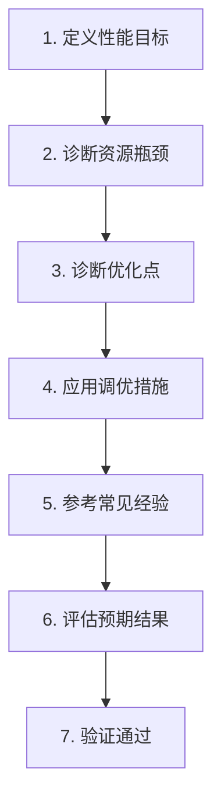

# KingbaseES SQL 调优指南

本技能指导用户完成 SQL 性能诊断和优化全流程，从"查询慢"到"验证修复"。

## 诊断流程：7 步工作流



### 第 1 步：定义性能目标

**明确问题范围与指标**

1. **确定性能指标**
   - 响应时间（单个请求的端到端时延）
   - 吞吐量（单位时间处理的请求数）
   - 关键业务指标（报表生成时间、接口 TPS）

2. **确定问题涉及范围**
   - 哪个数据库实例？哪个 Schema/表？哪些用户/查询？哪个时间段？

3. **确定问题类型**
   - 突发型：某个时间点后突然变慢
   - 渐进型：随着数据增长逐渐变慢
   - 随机型：间歇性变慢

4. **量化性能差距**
   ```sql
   -- 当前性能：SELECT COUNT(*) FROM large_table WHERE created > '2025-01-01';  返回时间：10秒
   -- 预期性能：1秒
   -- 性能差距：9秒（900% 变量）
   ```

5. **确定基线状态** — 是否有性能基准？最近配置/数据发生了什么变化？

### 第 2 步：诊断资源瓶颈

**两种定位方法**

1. **资源利用率分析**
   - CPU 使用率 → NMON 监控
   - 磁盘 IO 使用率 → iostat
   - 内存使用 → free/top
   - 网络流量 → netstat

2. **响应时间测量**
   - 应用侧响应时间、数据库侧响应时间、用户感知响应时间

**核心概念：数据库时间（DB Time）**
```
数据库时间 = CPU 时间 + 非空闲等待时间
性能调优的核心目标：缩短数据库时间
```

**瓶颈识别标准**：CPU 利用率接近 100%、磁盘 IO 接近 100%、Swap 开始使用、网络带宽打满、数据库内部长时间等待。

### 第 3 步：诊断优化点

1. **时间模型分析（KWR）**
   - 收集性能快照：`CALL sys_kv_wrm_take_snapshot();`
   - 分析性能计时树，识别耗时节点

2. **等待事件分析**
   - IO 等待、锁等待、网络等待、其他等待

3. **CPU 分布分析**
   - 使用 KWR 发现 TOP SQL
   - 使用动态性能视图（`v$session_longagg`, `v$cursor_stats`）
   - 对耗时节点分析执行计划

4. **自动化诊断（KDDM）**
   ```sql
   CALL sys_kv_kddm_analysis();
   SELECT * FROM sys_kv_kddm_reports;
   ```

### 第 4 步：应用调优措施

**SQL 优化方向**：
- 添加合适的索引
- 考虑分区（大表按时间/ID 分区）
- 使用 HINT 控制执行计划
- 启用并行查询
- 改写低效 SQL

### 第 5 步：参考常见经验

常见调优经验参见：`ref/perf-optimization-experience.md`

**快速参考**：

| 问题 | 原因 | 解决方案 |
|------|------|----------|
| 大表无索引 | 全表扫描 | 添加索引 |
| 统计信息过期 | 估算不准确 | 运行 ANALYZE |
| shared_buffers 过小 | 无法缓存热数据 | 调整为物理内存 1/3 |
| work_mem 过小 | 排序/哈希溢出到磁盘 | 根据 JOIN/排序规模设置 |
| 大表 JOIN | 小表驱动 | 使用 leading hint 或改写 SQL |
| 回表频繁 | 无堆表索引 | 添加索引避免回表 |

### 第 6 步：评估预期结果

| 优化措施 | 典型性能提升 | 可能下降 |
|---------|------------|---------|
| 添加索引 | 10-100 倍 | 写入性能下降 3-5% |
| SQL 改写 | 5-50 倍 | 知识维护成本 |
| 参数调优 | 2-10 倍 | 系统整体资源调整 |

### 第 7 步：验证通过

1. **业务验证**：关键指标是否达标？是否有负面影响？
2. **回归测试**：其他查询是否受影响？
3. **长期监控**：设置性能告警，记录基线数据

## 工具链

### KWR（Kingbase Workload Repository）

```sql
-- 收集性能快照
CALL sys_kv_wrm_take_snapshot();

-- 生成性能报告
CALL sys_kv_wrm_report('start_tag', 'end_tag');

-- 查看快照列表
SELECT * FROM sys_kv_wrm_snapshot;

-- 对比两个快照的 DIFF
CALL sys_kv_wrm_report_diff('snapshot1_tag', 'snapshot2_tag');
```

### KSH（Kingbase Session Helper）

```sql
-- 查看当前活跃会话
SELECT * FROM sys_kv_ksh_show_active_sessions;

-- 查看会话详细信息
SELECT * FROM sys_kv_ksh_show_session_detail('session_id');

-- 强制终止会话（需谨慎）
SELECT * FROM sys_kv_ksh_kill_session('session_id');
```

### KDDM（Kingbase Diagnostic Management）

```sql
CALL sys_kv_kddm_analysis();
SELECT * FROM sys_kv_kddm_reports;
SELECT suggestion, severity FROM sys_kv_kddm_reports;
```

### kbbadger（日志分析）

```bash
kbbadger --hostname=127.0.0.1 --port=54321 --database=test --output=log_report.html
```

## 动态性能视图

**实时统计**：`v$session`、`v$session_wait`、`v$active_session_history`、`v$cursor_stats`、`v$session_time_model`、`v$sys_time_model`、`v$sys_stat`

**TOP SQL**：`v$sqlarea`、`v$sql`、`v$sql_sa_top_sql_time_agg`、`v$sql_sa_top_sql_cpu_agg`、`v$sql_sa_top_sql_block_io_agg`

## 使用建议

### 最佳实践

1. **先诊断，后优化** — 不要猜测，通过 KWR/KSH 分析定位瓶颈
2. **小步快跑** — 单次优化一项措施，每次优化后立即验证
3. **测量优于猜测** — 永远先测量，使用 KWR 对比优化前后

### 常见误区

- ❌ 盲目添加索引 — 索引会增加写入开销和存储空间
- ❌ 一次性大规模优化 — 风险极高，应逐步验证

## 参考文档

```
kes-sql-tuning/
├── SKILL.md                          # 本文件
├── ref/
│   ├── explain-plan.md               # EXPLAIN 执行计划解读
│   ├── sql-optimization-patterns.md  # SQL 改写模式 + 手动优化模式 + HINT
│   ├── auto-tuning.md                # SQL 优化顾问 + SQL 监控
│   └── perf-optimization-experience.md               # 15+ 常见优化经验
└── test-cases.md
```
