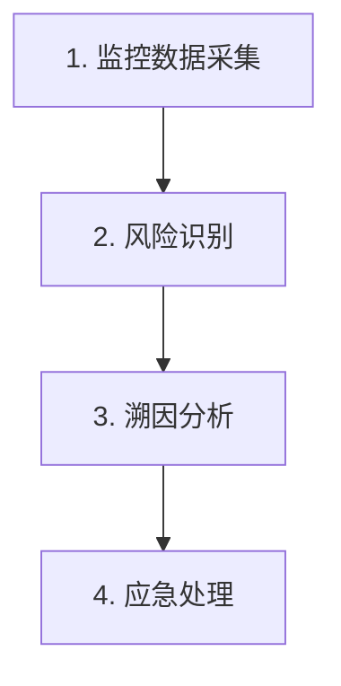

# KingbaseES 故障排查指南

本技能提供从问题识别到根因分析再到应急处理的标准排查方法论，涵盖集群状态异常、资源耗尽、数据安全、性能瓶颈等问题分类。

## 排查方法论（4 步）



1. **监控数据采集**：持续采集数据库、操作系统、集群状态信息
2. **风险识别**：通过阈值告警、趋势分析、经验判断识别问题
3. **溯因分析**：从直接原因→间接原因→根本原因逐层深入
4. **应急处理**：紧急处理（避免影响扩大）→ 完整处理（根除原因）

## 问题分类体系

| 分类 | 子类 | 典型表现 |
|------|------|---------|
| 集群状态异常 | 节点状态 | 节点关库、coredump、双主、timeline 冲突 |
| 集群状态异常 | 守护进程 | 节点未注册、repmgrd 退出 |
| 集群状态异常 | 流复制 | WAL 缺失、复制延迟 |
| 集群状态异常 | 复制槽 | 数量/类型/活动状态异常 |
| 集群状态异常 | 进程无响应 | D 态进程、I/O 子系统无响应 |
| 资源耗尽 | 存储容量 | 数据/WAL/归档/备份目录满了 |
| 资源耗尽 | CPU/内存/网络/IO | 利用率超过阈值 |
| 资源耗尽 | 连接数 | 达到 max_connections |
| 资源耗尽 | 长事务 | age 超过安全值 |
| 资源耗尽 | 事务号 | 事务号耗尽风险 |
| 资源耗尽 | 封锁 | 等待封锁进程数量异常 |
| 资源耗尽 | License | 即将过期 |
| 数据安全 | 基础数据丢失 | 磁盘故障、数据损坏、人为误删 |
| 数据安全 | 备份数据丢失 | 备份任务失败、WAL 归档中断 |
| 性能瓶颈 | 慢 SQL | 查询响应时间长 |
| 性能瓶颈 | 并发吞吐量低 | 并发场景下处理能力下降 |
| 性能瓶颈 | 响应时间持续上升 | 系统逐渐变慢 |

## 识别手段

### 1. 阈值告警

监控项达到预设告警值时触发。常用监控指标与告警阈值：

| 监控项 | 频率 | 告警条件 |
|--------|------|---------|
| 节点状态 | 1 分钟 | `repmgr cluster show` 中 status 非 running |
| 守护进程 | 1 分钟 | `repmgr service status` 中 repmgrd 非 running |
| 流复制 | 1 分钟 | `sys_stat_replication` 中 state 非 streaming |
| 复制槽 | 10 分钟 | 复制槽数量/active 状态异常 |
| 存储容量 | 5 分钟 | 数据/WAL/归档/备份目录用量超过预设比例 |
| CPU/内存/IO | 1 分钟 | 用量超过预设比例 |
| 连接数 | 5 分钟 | 超过 max_connections 的 80% |
| 长事务 | 1 小时 | age 超过 2^32 - 30,000,000 |
| 事务号 | 1 小时 | age/mxid_age 超过 2^32 - 30,000,000 |
| 封锁 | 1 分钟 | 等待封锁进程数超过预设值 |
| License | 每天 | 剩余天数 > 0 且 < 30 |

### 2. 趋势分析

对比一定时间内的数据变化趋势：

- 存储容量：应在一定范围内周期性波动或按一定幅度稳定增长
- CPU/内存/网络/IO：应在一定范围内周期性波动
- 连接数：应在一定范围内周期性波动

### 3. 经验判断

基于历史经验预判风险，如已知业务高峰即将到来。

## 信息采集工具

### 日志采集

- **数据库日志**：`data/sys_log/` 目录
- **高可用组件日志**：`kbha.log`、`hamgr.log`
- **操作系统日志**：`/var/log/messages`、`journalctl`

推荐日志配置：

```ini
log_statement = 'ddl'
log_autovacuum_min_duration = 600000
```

### 一键健康检查

使用 `KBchk.sh` 工具进行周期性数据库状态检查，频率至少每天。

### Core dump 分析

数据库进程崩溃时生成 core 文件，默认在数据目录中：

```bash
gdb {kingbase二进制路径} {core文件路径}
# 进入 gdb 后执行 bt 显示堆栈，bt full 显示参数值
```

### 进程调用栈

数据库无响应时采集所有进程调用栈：

```bash
(for i in $(ps -ef | grep kingbase | grep -v grep | awk '{print $2}'); do pstack $i; done) > pstack.kingbase
```

或在不安装 gdb 的情况下：

```bash
cat /proc/<PID>/stack
```

### WalMiner

集群环境中使用 WalMiner 日志逻辑解码工具收集、加工、多机日志整合，降低分析难度。

## 处理策略

### 紧急处理 vs 完整处理

| 类型 | 目的 | 特点 |
|-----|------|------|
| 紧急处理 | 避免影响扩大 | 可能不确认根因，可能有副作用 |
| 完整处理 | 根除问题 | 明确原因后的彻底解决 |

## 快速导航索引

### 按故障现象快速定位

- **集群启动失败** → 高可用排查 → 节点状态异常
- **节点无法自动恢复** → 高可用排查 → 故障节点恢复
- **数据库响应慢** → 性能诊断 → 慢 SQL 分析
- **磁盘空间不足** → 高可用排查 → 资源耗尽 → 存储容量
- **连接被拒绝** → 高可用排查 → 资源耗尽 → 连接数
- **数据丢失** → 数据防丢失 → 恢复处理
- **事务号即将耗尽** → 高可用排查 → 资源耗尽 → 事务号使用

## 参考文档

```
kes-troubleshooting/
├── SKILL.md                    # 本文件：排查方法论总览
├── test-cases.md               # 故障排查测试用例
└── ref/
    ├── ha-troubleshooting.md   # 高可用故障排查（节点/守护进程/流复制/资源耗尽）
    ├── data-security.md        # 数据防丢失运维
    ├── performance-diagnosis.md # 性能问题诊断
    └── common-commands.md      # 常用命令速查
```
