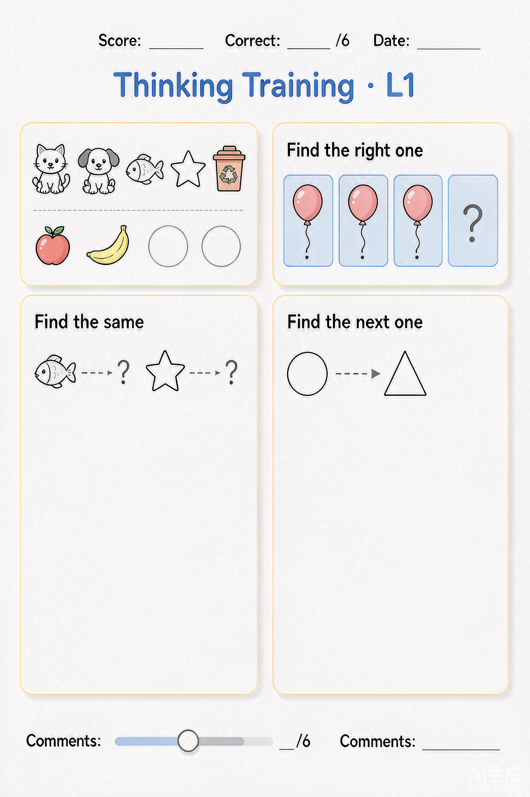
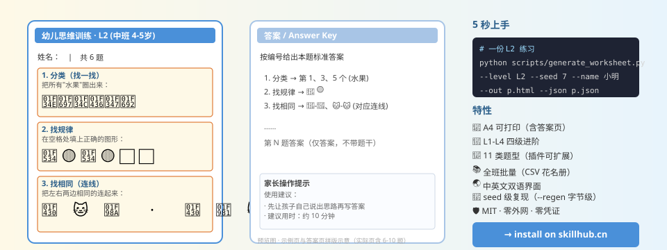

# 幼儿园思维课程体系 · Skill

> 面向 3-7 岁幼儿的思维启蒙与逻辑训练体系课程。
> 一句话让大模型为你出题、批改、定级、给出家长指导。

[]()
[]()
[]()
[]()
[]()

---

## 一图看懂

<p align="center">
  
</p>

<p align="center">
  <sub>真实生成的 L1 练习页样张 · A4 可打印 · 默认姓名留空下划线 · 6 题 · 含评分栏</sub>
</p>

<p align="center">
  
</p>

> 💡 上面是真实生成的练习页样张；下面是架构示意图，三句话说清**生成的练习页长什么样 / 答案页长什么样 / 怎么一行命令就能跑起来**。

---

## 5 秒上手

```
"帮我给中班孩子出一份找规律的练习"
"做一份思维诊断卷"
"我家娃 4 岁，从哪个等级开始练？"
```

只要告诉 WorkBuddy 幼儿 + 思维意图，剩下的由本 Skill 自动完成：
**诊断 → 选级 → 组卷 → 打印 → 批改 → 进阶建议**。

## 命令行（脚本方式）

```bash
# 一份练习（默认姓名空白可填）
python scripts/generate_worksheet.py --level L2 --seed 7 \
    --out 练习.html --json 答案.json

# 开启评分栏 + 预填姓名
python scripts/generate_worksheet.py --level L1 --name 小明 --score \
    --out 练习.html --json 答案.json

# 诊断卷
python scripts/generate_worksheet.py --preset diagnostic \
    --out 诊断.html --json 诊断.json

# 错题重练
python scripts/generate_worksheet.py --review 答案.json --wrong 4,7 \
    --out 重练.html --json 重练.json

# 一键复现某次练习页（读完 JSON 里的 seed 等参数，HTML 字节级一致）
python scripts/generate_worksheet.py --regen 答案.json \
    --out 复现.html --json 复现.json

# 全班卷子批量（姓名强制空白，给老师用）
python scripts/batch_roster.py --roster 花名册.csv --level L1 \
    --seed 7 --no-name --score --out-dir 全班L1/

# 列出全部题型与等级映射
python scripts/generate_worksheet.py --list

# 上架前回归自检
python scripts/test_skill.py

# skillhub 发布前合规自检（输出 SHIP_REPORT.md）
python scripts/preflight.py --zip ../kindergarten-thinking-course.zip
```

## 四级课程体系

| 等级 | 适用年龄 | 核心能力 | 主要题型 |
|---|---|---|---|
| **L1** 小班 | 3-4 岁 | 基础分类、一一对应、初步观察 | classify, match, same, diff, compare, position, maze |
| **L2** 中班 | 4-5 岁 | 排序、规律、图形、方位完整能力 | + order, pattern, shape |
| **L3** 大班 | 5-6 岁 | 模式推理、等量代换、复杂逻辑 | + swap |
| **L4** 幼小衔接 | 6-7 岁 | 综合逻辑思维 | 全部题型混合 |

## 项目结构

```
kindergarten-thinking-course/
├─ SKILL.md                    ← WorkBuddy 触发词与执行逻辑（必读）
├─ README.md                   ← 你正在看的文件
├─ LICENSE                     ← MIT
├─ CHANGELOG.md                ← 迭代记录
├─ scripts/
│  ├─ generate_worksheet.py    ← 主生成器（CLI）
│  ├─ batch_roster.py          ← 全班批量
│  ├─ test_skill.py            ← 功能回归自检（19 项）
│  ├─ preflight.py             ← 上架合规自检（输出 SHIP_REPORT.md）
│  ├─ common.py                ← 共享样式 / I18N / 等级池 / 主题色
│  └─ generators/              ← 题型插件（新增题型只需丢 g_*.py）
│     ├─ __init__.py           ← 插件自动加载
│     ├─ g_classify.py         (classify / match / same / diff)
│     ├─ g_sequence.py         (order / pattern)
│     ├─ g_spatial.py          (position / maze)
│     ├─ g_compare.py          (compare / shape)
│     ├─ g_maze.py             (maze)
│     └─ g_swap.py             (swap)
├─ references/
│  ├─ curriculum.md            ← 课程大纲与等级映射
│  ├─ activity-spec.md         ← CLI 参数表与配方示例
│  └─ pedagogy.md              ← 教学话术与家长反馈
└─ assets/
   ├─ icon.png                 ← Skill 图标（skillhub 卡片用）
   ├─ preview.png              ← README 首屏真实样张
   ├─ gallery.png              ← 四级课程体系画廊预览图
   ├─ preview.svg              ← 架构示意图
   └─ progress-journal.md      ← 学习档案模板
```

## 特性

- **A4 可打印**：每张练习页一份，CSS 适配 A4 + 打印保留背景色
- **可手填姓名栏**：默认空白下划线框；可 `--name` 预填；批量全班用 `--no-name` 强制空白
- **得分栏可开关**：`--score` 开启页尾得分/正确数/日期/评语手填栏
- **完全可复现**：JSON 自带 seed、--regen 一键回放
- **中英文双语**：`--lang en` 题型指令与答案同步翻译
- **插件化架构**：加新题型只需在 `generators/` 丢 `g_*.py` 并声明 `TOPICS`
- **上架自检**：`python scripts/test_skill.py` 一键跑 19 项回归

## 故障排查

- **打印没有背景颜色** → 浏览器打印对话框勾选「背景图形」
- **答案与题目同页** → 检查浏览器是否禁用 `@media print`（默认开启，换页不显示）
- **JSON 无法被 `--regen` 复现** → 该 JSON 来自 `seed=0` 默认版本（v1.0 之前），重新生成新版带 seed 字段的 JSON
- **题型大写/拼错** → 会被自动剔除；拼错会列出合法值

## 姊妹 Skill · K12 启蒙系列

当前 Skill 专注**非数值**的思维能力。同一套课程体系代码（L1-L4 + 题型插件 + 诊断/批改/进阶）已抽象为可复用模板，以下姊妹 Skill 复用约 80% 架构：

| Skill | 与本品的关系 |
|---|---|
| `kindergarten-math-course` | 数运算（识数 / 加减法 / 分解组成） |
| `kindergarten-english-course` | 英文启蒙（字母 / 自然拼读 / 句型） |
| `kindergarten-pinyin-course` | 拼音启蒙（声母 / 韵母 / 拼读） |

> 想把本品改造为其它学科？`scripts/generators/` 是插件目录，按主题加 `g_*.py` 并声明 `TOPICS` 即可，主脚本无需改动。**License 为 MIT，可自由改造商用。**

## 许可

MIT — 详见 [LICENSE](LICENSE)
