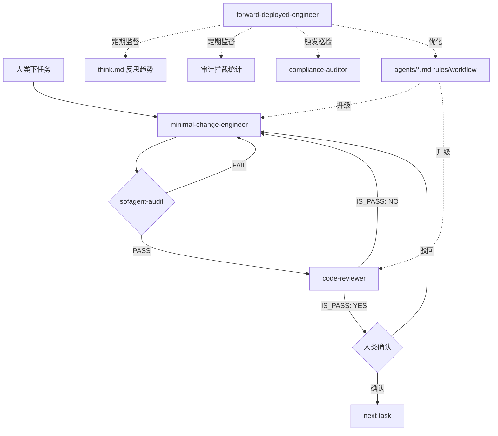

# 自迭代循环设计

> sofagent 怎么用自己的工具开发自己。
>
> Agent 定义见 [`agents/`](../agents/)——遵循 [Agency Agents](https://github.com/jnMetaCode/agency-agents-zh) 格式标准。编排层通过 [DeepAgentsJS](https://github.com/langchain-ai/deepagentsjs) `createDeepAgent()` 接入 LangGraph StateGraph。

## 整体流程

```
人类下任务 → engineering-minimal-change-engineer 写代码 → git commit
    → sofagent-audit (pre-commit hook) 硬证据审计
    → engineering-code-reviewer 代码审查
    → 审查报告交给人类确认
    → 通过 → git push → 下一轮
    → 不通过 → engineering-minimal-change-engineer 修复 → 回到审计
```

4 层防线：

| # | 防线 | 谁做 | 看什么 | 可绕过？ |
|---|------|------|------|:--:|
| 1 | 构建验证 | engineering-minimal-change-engineer | build + test 必须通过才提交 | 不可——规则写死在 Agent 定义里 |
| 2 | 硬证据审计 | sofagent-audit (TS CLI) | git diff → A1-A11 模式匹配 | 不可——pre-commit hook |
| 3 | 代码审查 | engineering-code-reviewer (LLM) | 代码变更 → 语义/影响/质量 | 可配置——改 `agents/engineering-code-reviewer.md` |
| 4 | 人类确认 | 你 | 审查报告 → 直觉判断 | 最终决定权 |

## 一个迭代周期

```
  人类
   │
   │  "修复登录页 token 过期问题"
   ▼
┌─────────────────────────────────────────────┐
│              engineering-minimal-change-engineer                    │
│        (agents/engineering-minimal-change-engineer.md)             │
│                                              │
│  1. Read 相关文件                            │
│  2. 规划变更（只改任务范围内的文件）          │
│  3. Write/Edit 代码（最小变更原则）          │
│  4. npm run build（失败→停止，修复后重试）    │
│  5. npm test（失败→停止，修复后重试）         │
│  6. git commit                               │
│     └→ sofagent-audit hook 触发              │
│        ├─ A1/A2 拦截 → 返回修复               │
│        └─ PASS → commit 成功                  │
│  7. 写 think.md（反思记录）                   │
│                                              │
└─────────────────────────────────────────────┘
   │
   │  提交的 diff
   ▼
┌─────────────────────────────────────────────┐
│              engineering-code-reviewer                    │
│        (agents/engineering-code-reviewer.md)             │
│                                              │
│  1. 读 git diff + commit message             │
│  2. 语义正确性审查（逻辑/边界/bug）           │
│  3. 影响范围审查（调用方/类型兼容性）         │
│  4. 铁律合规审查（A1-A11 语义层面）           │
│  5. 代码质量审查（命名/结构/重复）            │
│  6. 输出审查报告（🔴/🟡/💭 + IS_PASS）        │
│                                              │
└─────────────────────────────────────────────┘
   │
   │  审查报告（🔴 阻断 / 🟡 建议 / 💭 小改进）
   ▼
  人类确认
   │
   ├─ IS_PASS: YES → git push → 下一轮任务
   └─ IS_PASS: NO  → 反馈给 engineering-minimal-change-engineer 修复
```

## 为什么 engineering-minimal-change-engineer 不审查自己的代码

银行转账——录入和复核是两个人。engineering-minimal-change-engineer 看自己写的代码不是审查，是自我说服过程。engineering-code-reviewer 的独立 session 保证了它只能看到最终 diff，没有开发过程的上下文污染。

这是 sofagent 架构中的"评判者与执行者分离"原则——和 `loop-evaluate.md` 的设计一脉相承。

## 为什么人类确认还在循环里

Agent 出问题人负责。LOOP 不是替代人类，是升级人类的角色——从逐行读 diff 变成看审查报告做判断。engineering-minimal-change-engineer 和 engineering-code-reviewer 把"我该担心什么"提炼出来了，人类只需要确认"这个担心对不对"。

三道护栏（fde.md 规则覆盖 / 编排可回滚 / 审计独立）中，人类确认是第一道光。

## DeepAgentsJS + LangGraph 编排层（计划中）

当 engineering-minimal-change-engineer 和 engineering-code-reviewer 各自独立跑通后，用 [DeepAgentsJS](https://github.com/langchain-ai/deepagentsjs) 的 `createDeepAgent()` API 和 LangGraph `StateGraph` 串流程：



伪代码示意（DeepAgentsJS v1.10.7）：

```typescript
// LOOP 引擎入口——任何 Agent 平台通过 OpenClaw 调用此入口
async function runLOOP(task: string, platform: string) {
  // 内层循环：任务执行
  const result = await innerLoop.invoke({ task });
  
  // 如果任务完成且审查通过
  if (result.reviewPassed && result.humanConfirmed) {
    // 外层循环：FDE 检查是否需要优化
    await fdeAgent.invoke({
      task: "检查本次任务的 think.md 和审计统计",
      context: { lastTaskThinkMd: result.thinkMd, auditStats: result.auditStats }
    });
  }
  
  return {
    codeChanges: result.diff,
    reviewReport: result.reviewReport,
    taskReflection: result.thinkMd,
  };
}

```typescript
import { createDeepAgent } from "deepagents";
import { StateGraph } from "@langchain/langgraph";

// 内层循环 Agents
const codingAgent = createDeepAgent({
  model: "claude-sonnet-4-20250514",
  systemPrompt: loadPrompt("agents/engineering-minimal-change-engineer.md"),
  middleware: [fsMiddleware()],
});

const reviewAgent = createDeepAgent({
  model: "claude-sonnet-4-20250514",
  systemPrompt: loadPrompt("agents/engineering-code-reviewer.md"),
  middleware: [fsMiddleware()],
});

// 外层循环 Agents
const fdeAgent = createDeepAgent({
  model: "claude-sonnet-4-20250514",
  systemPrompt: loadPrompt("agents/forward-deployed-engineer.md"),
  middleware: [fsMiddleware(), subAgentMiddleware()],  // 可以触发 compliance-auditor
});

const complianceAgent = createDeepAgent({
  model: "claude-sonnet-4-20250514",
  systemPrompt: loadPrompt("agents/security-compliance-auditor.md"),
  middleware: [fsMiddleware()],
});

// 内层循环 StateGraph
const innerLoop = new StateGraph(LoopState)
  .addNode("coding", codingAgent)
  .addNode("audit", runAuditHook)
  .addNode("review", reviewAgent)
  .addNode("human", humanConfirm)
  .addConditionalEdges("audit", auditResult, {
    fail: "coding", pass: "review",
  })
  .addConditionalEdges("review", reviewResult, {
    reject: "coding", approve: "human",
  });

// 外层循环：定时触发
cron.schedule("0 9 * * 1", async () => {  // 每周一早 9 点
  await fdeAgent.invoke("分析本周 think.md 趋势和审计拦截统计");
});

cron.schedule("0 9 1 * *", async () => {  // 每月 1 号
  await complianceAgent.invoke("全量 Workflow 巡检");
});

// 外层循环：发版后触发——四份验证文件自进化
async function postReleaseEvolution(version: string) {
  // 前三份：FDE 直接做（纯增量操作）
  await fdeAgent.invoke(`更新 fresh-eyes-review.md：新增本版本审查盲区`);
  await fdeAgent.invoke(`更新 regression-checklist.md：追加本版本 P0/P1 检查项`);
  await fdeAgent.invoke(`更新 openclaw-acceptance-test.md：新增本版本边缘 case`);

  // 第四份：FDE 提议 → 作者确认（含修改操作，需人类把关）
  const releasingDiff = await fdeAgent.invoke({
    task: `检查 releasing.md：① 数字过期 ② 新工具未纳入 ③ 流程漏洞沉淀`,
    context: { version, changelog: readChangelog(version) }
  });
  // releasingDiff = { suggestions: [...], diff: "..." }
  if (releasingDiff.suggestions.length > 0) {
    const approved = await humanConfirm(releasingDiff.diff);
    if (approved) await applyDiff("docs/verification/releasing.md", releasingDiff.diff);
  }
}
```

## 当前限制

- **OpenClaw 依赖**：Sub-agent 通过 `session.spawn` 启动（当前阶段）
- **DeepAgentsJS 未集成**：`createDeepAgent()` 代码示例仅为计划，未实际运行
- **不是无人值守**：人类确认还在循环里
- **未验证端到端**：Agent 定义有了（Agency Agents 格式），但实际运行尚未测试

## LOOP 与发版流程的对应

sofagent 的版本发布遵循 [`docs/verification/releasing.md`](../docs/verification/releasing.md) 的 8 阶段 SOP。LOOP 将其中可由 Agent 自动化的步骤映射到对应的 Agent：

| releasing.md 阶段 | 当前（人类做） | LOOP 映射 |
|---|---|---|
| 阶段一：审查 | 陌生视角审查（`docs/verification/fresh-eyes-review.md`） | review-agent + 全新 session |
| 阶段一：审查 | 回归检查（`docs/verification/regression-checklist.md`，176 维度） | FDE 触发 compliance-auditor |
| 阶段二：开发 | 修复 P0/P1/P2 | minimal-change-engineer（7 步开发流程） |
| 阶段三：自测 | `npm run build` + `npm test` + `acceptance-test.sh`（11 场景） | minimal-change-engineer 自检 |
| 阶段四：审核 | 独立审核者逐项核对 | review-agent（全新 session） |
| 阶段五：文档收尾 | bump-version + CHANGELOG/ROADMAP 更新 + 内容新鲜度检查 | FDE |
| 阶段六：确认关口 | 作者确认改动清单 | 人类确认（不可自动化） |
| 阶段七：发布 | OpenClaw 验收测试（`docs/verification/openclaw-acceptance-test.md`，5 场景） | review-agent 执行验收 |
| 阶段七：发布 | npm publish + git tag + Skill 分发 | 人类操作（不可自动化） |
| 阶段八：发布后 | 陌生视角审查 + npm 验证 | review-agent（全新 session）|
| 阶段八：发布后 | SOP 自我进化——沉淀教训 + 更新过期数字 + 纳入新工具 | FDE 提议 → 作者确认 |

### LOOP 中的验证文档

以下 5 份验证文档已集成到 LOOP 中，由对应 Agent 在特定阶段调用：

| 文档 | 在 LOOP 中的角色 | 谁执行 |
|------|------|------|
| `docs/verification/fresh-eyes-review.md` | 发版前/后陌生视角审查（7 视角 × 3 轮） | review-agent（全新 session） |
| `docs/verification/regression-checklist.md` | 发版前全局回归检查（176 维度） | FDE 触发 compliance-auditor |
| `docs/verification/openclaw-acceptance-test.md` | 发版前 Agent 端到端验收（5 场景） | review-agent |
| `tools/acceptance-test.sh` | 发版前 CLI 端到端验收（11 场景） | minimal-change-engineer 自检 |
| `docs/verification/releasing.md` | LOOP 的整体流程参照——哪个阶段谁做什么 | FDE（流程监督者） |

### 未来：DeepAgentsJS + LangGraph 实现

v1.0.4 当前是**文档定义阶段**——Agent 定义在 `agents/` 下，流程定义在 `LOOP/` 下。等 Agent 各自通过 OpenClaw 跑通后，下一步是用 DeepAgentsJS + LangGraph 把流程**代码化**：

- `agents/` 下的 Agent 定义 → `createDeepAgent()` 的 `systemPrompt` 参数
- `LOOP/loop.md` 中的 Mermaid 流程图 → LangGraph `StateGraph` 的节点和边
- `docs/verification/releasing.md` 的 8 阶段 SOP → StateGraph 中的条件路由（自动执行 vs 人类确认）
- 验证文档 → StateGraph 节点的输入参数
- **平台无关的触发机制** → 用户在任意 Agent（WorkBuddy/Codex/Claude Code/Hermes/Cursor）中，一条 prompt 即可触发整套 LOOP。用户的 Agent 作为"遥控器"，OpenClaw 作为"引擎"，按 StateGraph 自动调度所有 sub-agent

**当前不是落代码的阶段。** 先把 Agent 定义写好、把 flow 画清楚、把验证文档映射好。这些都对了，写 LangGraph 代码就是照图施工。

### 平台无关触发（已设计，待代码化）

LOOP 设计为**平台无关**——不依赖特定 Agent 平台。运行原理：

```
你的 Agent（WorkBuddy / Codex / Claude Code / Hermes / Cursor）
  │
  │  "@openclaw 启动 LOOP：修复 issue #123"
  ▼
OpenClaw（sofagent 底座，随 sofagent 安装）
  │
  │  按 LOOP/loop.md 的 StateGraph 自动调度：
  ├→ session.spawn engineering-minimal-change-engineer
  ├→ run sofagent-audit (pre-commit hook)
  ├→ session.spawn engineering-code-reviewer
  └→ 审查报告返回给用户 Agent
```

**用户不需要知道 sub-agent 的存在。** 他们只看到自己的 Agent 完成了任务并附带了审查结果。背后的 LOOP 流程对用户透明。

## 外层循环：持续监督与优化

内层循环跑的是每一次任务。但需要一个外层循环来监督这个流程本身是否健康。

```
                ┌──────────────────────────────────────┐
                │         forward-deployed-engineer      │
                │        (agents/forward-deployed-engineer.md)     │
                │                                        │
                │  定期执行：                              │
                │  1. 分析 think.md 反思趋势              │
                │     → minimal-change-engineer 在重复犯同类错误？  │
                │     → 如果是，优化它的 Agent 定义文件    │
                │                                        │
                │  2. 审查 code-reviewer 的报告质量        │
                │     → 审查在变"橡皮图章"吗？             │
                │     → 如果是，调整审查维度或标准         │
                │                                        │
                │  3. 分析 sofagent-audit 拦截统计         │
                │     → 哪种违规在增加？                   │
                │     → 需要新增审计规则吗？               │
                │                                        │
                │  4. 触发 compliance-auditor 巡检         │
                │     → Workflow 节点定义是否完整？         │
                │     → 审计配置是否一致？                 │
                │     → 知识库是否有死链？                 │
                │                                        │
                │  5. 根据发现优化 Agent 定义               │
                │     → 改 agents/*.md 的 rules/workflow  │
                │     → 内层循环自动升级                   │
                │                                        │
                │  6. 发版后 SOP 自我进化（提议→确认）       │
                │     → 读 think.md + changelog 提取流程漏洞 │
                │     → grep 检查 releasing.md 数字过期     │
                │     → 对比 tools/ 和 releasing.md 新工具遗漏 │
                │     → 生成 diff 格式更新建议             │
                │     → 交给作者确认后 apply               │
                │                                        │
                └──────────────────────────────────────┘
```

### 外层循环的触发节奏

| 频率 | 做什么 | 谁做 |
|------|------|------|
| 每次任务后 | 读 think.md 反思记录 | forward-deployed-engineer（被动） |
| 每周 | 分析拦截统计趋势 + think.md 模式 | forward-deployed-engineer（主动） |
| 每月 | 全面 Workflow 巡检 | compliance-auditor |
| 发版前 | 跨仓库一致性审计 + 知识库健康度 | compliance-auditor |
| 发版后 | 四份验证文件自进化（fresh-eyes / regression / acceptance / releasing） | FDE（前三份直接做，releasing.md 提议→作者确认） |
| 发现模式时 | 优化 Agent 定义文件 | forward-deployed-engineer |

### 外层循环的产物

- **优化后的 Agent 定义**：`agents/*.md` 的 rules 和 workflow 更新
- **审计规则调整**：`.sofagent/config.yml` 的新增或修改
- **合规审计报告**：compliance-auditor 产出的周期性报告
- **优化记录**：think.md 中记录"本次优化了什么、为什么、预期效果"

### 四个验证文件的自进化

每次发版后，外层循环自动推进以下四份文件的进化：

| 文件 | 当前位置 | 每次发版后做什么 | 谁做 |
|------|------|------|------|
| `fresh-eyes-review.md` | `docs/verification/` | ① 审视上轮审查发现的盲区 → 新增视角/任务 ② 过时的角色/问题 → 删除或更新 ③ 本轮新发现的"反复出现的同类问题" → 抽象为新的通用视角 | FDE |
| `regression-checklist.md` | `docs/verification/` | ① 本轮修复的 P0/P1 → 抽象为新的检查项（从 177 开始编号）② 审查体系更新建议中"建议追加到回归检查"的条目 → 正式写入 | FDE |
| `openclaw-acceptance-test.md` | `docs/verification/` | ① 新增的审计规则 → 新增对应测试场景 ② 新功能（如 SkillOpt）→ 新增验收场景 ③ 上一版本被绕过的边缘 case → 新增为测试场景 | FDE |
| `releasing.md` | `docs/verification/` | ① 本版本发布过程中遇到的流程漏洞 → 沉淀到「历史教训」区 ② 检查 SOP 中的数字是否过期（维度数、检查项数、doctor 项数等）③ 新增的工具/脚本是否已纳入对应阶段 ④ 把更新后的 releasing.md 同步到 LOOP.md 的映射表 | FDE 提议 → 作者确认 |

**这不是可选操作——是 LOOP 外层循环的核心职责。** 如果发版后这四份文件没有更新，外层循环就是失败的。这四份文件是 LOOP 的"经验存储器"——每次发版的经验必须变成下次审查更锋利的武器。

前三份是**纯增量**操作（追加检查项/视角/场景），FDE 直接做。第四份 `releasing.md` 包含**修改**操作（更新数字、改步骤）——FDE 生成更新建议（diff 格式），作者确认后 apply。这和内层循环的"code-reviewer 生成审查报告 → 人类确认"是同构的。

### 文件位置的说明

三份审查文件已从维护者本地（`~/Workbuddy/`）移入 `docs/verification/`，成为项目的一部分，供所有贡献者使用。`tools/acceptance-test.sh` 已在仓库中。`docs/verification/releasing.md` 是发版 SOP，位置不变。

### 为什么外层循环是必须的

内层循环是"每任务"级别的自动化。但 Agent 的行为会漂移、审查会变松、审计规则会过时。没有外层循环，LOOP 只是一个"自动化的代码工厂"——快，但不知道自己越来越差。

外层循环让 LOOP 具备**自我改进能力**：不只是跑得快，而且是越跑越好。

## 下一步

1. 验证 OpenClaw `session.spawn` 能加载 engineering-minimal-change-engineer（Agency Agents 格式 → convert.sh → SOUL/agents/IDENTITY）
2. 让 engineering-minimal-change-engineer 完成一个真实任务（比如修 README 里的 typo）
3. 让 engineering-code-reviewer 审查那次提交
4. 人工判断审查报告质量
5. 审查报告不达标 → 改 `agents/engineering-code-reviewer.md` 重新跑
6. 审查报告达标 → 开始写 DeepAgentsJS + LangGraph 编排代码
