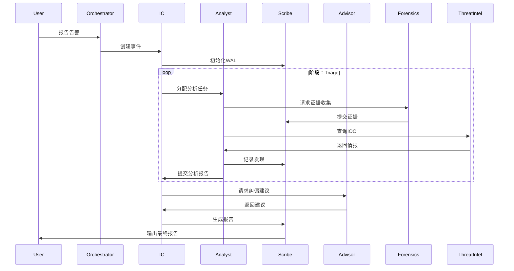

# 多智能体应急响应系统架构设计

> 目标：将单人应急流程改造为多智能体协作模式，实现角色分工、并行分析、智能协调、自主决策。
> 架构：基于分层协作模型，包含协调层、执行层、支持层。

---

## 一、架构总览

```
┌─────────────────────────────────────────────────────────────┐
│                        用户界面层                              │
│  (Web UI / CLI / API Gateway / Chat Interface)              │
└─────────────────────────────────────────────────────────────┘
                              ↓
┌─────────────────────────────────────────────────────────────┐
│                    协调层（Coordinator）                       │
│  ┌──────────────┐  ┌──────────────┐  ┌──────────────┐     │
│  │  Orchestrator │  │ Task Router   │  │Conflict Resolver│   │
│  │  (总协调器)    │  │ (任务路由器)   │  │ (冲突解决器)    │   │
│  └──────────────┘  └──────────────┘  └──────────────┘     │
└─────────────────────────────────────────────────────────────┘
                              ↓
┌─────────────────────────────────────────────────────────────┐
│                     执行层（Agents）                           │
│  ┌──────────┐  ┌──────────┐  ┌──────────┐  ┌──────────┐  │
│  │IC Agent   │  │Analyst   │  │Scribe    │  │Advisor   │  │
│  │(指挥官)   │  │Agent     │  │Agent     │  │Agent     │  │
│  │           │  │(分析师)   │  │(记录员)   │  │(顾问)    │  │
│  └──────────┘  └──────────┘  └──────────┘  └──────────┘  │
│  ┌──────────┐  ┌──────────┐  ┌──────────┐  ┌──────────┐  │
│  │Forensics │  │Threat    │  │Recovery  │  │Compliance│  │
│  │Agent     │  │Intel     │  │Agent     │  │Agent     │  │
│  │(取证)    │  │Agent     │  │(恢复)    │  │(合规)    │  │
│  └──────────┘  └──────────┘  └──────────┘  └──────────┘  │
└─────────────────────────────────────────────────────────────┘
                              ↓
┌─────────────────────────────────────────────────────────────┐
│                      支持层（Services）                        │
│  ┌──────────┐  ┌──────────┐  ┌──────────┐  ┌──────────┐  │
│  │Memory     │  │Tool      │  │Knowledge │  │Monitor   │  │
│  │Service    │  │Service   │  │Base      │  │Service   │  │
│  │(记忆服务)  │  │(工具服务) │  │(知识库)   │  │(监控)    │  │
│  └──────────┘  └──────────┘  └──────────┘  └──────────┘  │
└─────────────────────────────────────────────────────────────┘
```

---

## 二、智能体角色定义

### 2.1 协调层智能体

#### Orchestrator（总协调器）
- **职责**：
  - 全局事件管理
  - 智能体生命周期管理
  - 资源分配与调度
  - 全局状态监控
  
- **能力**：
  - 创建/销毁子智能体
  - 任务优先级排序
  - 全局时间线维护
  - 异常处理与恢复

- **决策权限**：
  - 批准高风险操作（HITL）
  - 终止失控智能体
  - 调整应急策略

#### Task Router（任务路由器）
- **职责**：
  - 任务分类与分发
  - 负载均衡
  - 任务队列管理
  
- **能力**：
  - 智能任务匹配
  - 并行任务调度
  - 任务依赖解析

#### Conflict Resolver（冲突解决器）
- **职责**：
  - 检测智能体间的决策冲突
  - 解决资源竞争
  - 统一不同意见
  
- **能力**：
  - 冲突检测算法
  - 投票机制
  - 专家系统决策

---

### 2.2 执行层智能体

#### IC Agent（指挥官智能体）
```yaml
name: IC Agent
role: Incident Commander
responsibilities:
  - 定义事件范围与优先级
  - 审批高风险操作（HITL）
  - 协调各智能体工作
  - 与人类决策者沟通
  
capabilities:
  - 风险评估
  - 资源调度
  - 决策授权
  - 状态汇报
  
decision_authority:
  - approve_containment: true  # 批准遏制措施
  - approve_eradication: true  # 批准清除操作
  - escalate_to_human: true    # 升级到人工决策
  
communication:
  - receive: [alerts, status_reports, requests]
  - send: [orders, approvals, escalations]
  
tools:
  - note.py
  - generate_report.py
  - risk_assessment.py
```

#### Analyst Agent（分析师智能体）
```yaml
name: Analyst Agent
role: Lead Analyst
responsibilities:
  - 技术研判与分析
  - 证据链构建
  - 时间线重建
  - IOC提取与验证
  
capabilities:
  - 日志分析
  - 流量分析
  - 恶意代码分析
  - 攻击链还原
  
specializations:
  - malware_analyst: 恶意软件分析
  - network_analyst: 网络流量分析
  - host_analyst: 主机取证分析
  - ai_analyst: AI基础设施分析
  
communication:
  - receive: [tasks, evidence, iocs]
  - send: [findings, reports, recommendations]
  
tools:
  - log_analysis.py
  - traffic_analysis.py
  - malware_analysis.py
  - ioc_extractor.py
```

#### Scribe Agent（记录员智能体）
```yaml
name: Scribe Agent
role: Scribe
responsibilities:
  - 全过程记录（WAL）
  - 证据文件管理
  - 时间线维护
  - 报告生成
  
capabilities:
  - 自动记录关键事件
  - 结构化数据存储
  - 证据完整性校验
  - 报告模板填充
  
communication:
  - receive: [events, evidence, iocs, timeline]
  - send: [records, reports, summaries]
  
tools:
  - note.py
  - evidence_manager.py
  - timeline_builder.py
  - generate_report.py
```

#### Advisor Agent（顾问智能体）
```yaml
name: Advisor Agent
role: Advisor
responsibilities:
  - 检测打转/无进展
  - 提供纠偏建议
  - 推荐最佳实践
  - 知识检索与推荐
  
capabilities:
  - 循环检测
  - 相似案例检索
  - 专家知识推荐
  - 策略优化建议
  
communication:
  - receive: [status, progress, blockers]
  - send: [recommendations, alternatives, best_practices]
  
tools:
  - loop_detector.py
  - knowledge_retrieval.py
  - best_practice_engine.py
```

#### Forensics Agent（取证智能体）
```yaml
name: Forensics Agent
role: Forensics Specialist
responsibilities:
  - 现场证据收集
  - 内存取证
  - 磁盘取证
  - 网络取证
  
capabilities:
  - 自动化证据收集
  - 内存镜像分析
  - 文件系统分析
  - 流量抓包与分析
  
specializations:
  - memory_forensics: 内存取证（Volatility）
  - disk_forensics: 磁盘取证（Autopsy/Sleuth Kit）
  - network_forensics: 网络取证（Wireshark/NetworkMiner）
  - mobile_forensics: 移动设备取证
  
communication:
  - receive: [targets, scope, collection_requests]
  - send: [evidence, analysis_results, findings]
  
tools:
  - collect_evidence.py
  - volatility_analyzer.py
  - disk_analyzer.py
  - pcap_analyzer.py
```

#### Threat Intel Agent（威胁情报智能体）
```yaml
name: Threat Intel Agent
role: Threat Intelligence Analyst
responsibilities:
  - IOC丰富与验证
  - 威胁情报检索
  - 攻击者归因
  - 威胁态势感知
  
capabilities:
  - 多源威胁情报集成
  - IOC自动化查询
  - 攻击模式匹配（MITRE ATT&CK）
  - 威胁情报报告生成
  
integrations:
  - VirusTotal
  - AlienVault OTX
  - MISP
  - MITRE ATT&CK
  
communication:
  - receive: [iocs, indicators, queries]
  - send: [enrichment, attribution, intel_reports]
  
tools:
  - threat_intel_lookup.py
  - attack_pattern_matcher.py
  - ioc_enrichment.py
```

#### Recovery Agent（恢复智能体）
```yaml
name: Recovery Agent
role: Recovery Specialist
responsibilities:
  - 制定恢复计划
  - 执行恢复操作
  - 验证业务恢复
  - 数据备份与恢复
  
capabilities:
  - 系统恢复自动化
  - 备份验证
  - 业务连续性规划
  - 恢复测试
  
communication:
  - receive: [recovery_requests, system_state, backup_info]
  - send: [recovery_plans, status, verification_results]
  
tools:
  - recovery_planner.py
  - backup_manager.py
  - system_restorer.py
  - verification_tester.py
```

#### Compliance Agent（合规智能体）
```yaml
name: Compliance Agent
role: Compliance Officer
responsibilities:
  - 合规性检查
  - 监管报告生成
  - 数据隐私保护
  - 审计日志维护
  
capabilities:
  - 合规要求匹配
  - 监管报告自动生成
  - 敏感数据脱敏
  - 审计追踪
  
compliance_frameworks:
  - GDPR
  - 等保2.0
  - ISO 27001
  - SOC 2
  - 行业特定法规（金融、医疗等）
  
communication:
  - receive: [events, data, requests]
  - send: [compliance_reports, audit_logs, alerts]
  
tools:
  - compliance_checker.py
  - data_anonymizer.py
  - audit_logger.py
  - regulatory_reporter.py
```

---

## 三、多智能体通信协议

### 3.1 消息格式标准

```json
{
  "message_id": "msg-20260429-001",
  "timestamp": "2026-04-29T10:30:00Z",
  "sender": {
    "agent_id": "analyst-01",
    "agent_type": "Analyst Agent",
    "role": "malware_analyst"
  },
  "receiver": {
    "agent_id": "ic-01",
    "agent_type": "IC Agent",
    "broadcast": false
  },
  "message_type": "request",
  "priority": "high",
  "content": {
    "action": "analyze_malware",
    "target": "/tmp/suspicious.exe",
    "context": {
      "incident_id": "inc-2026-001",
      "phase": "triage",
      "evidence_id": "ev-001"
    },
    "parameters": {
      "analysis_depth": "deep",
      "timeout": 300
    }
  },
  "metadata": {
    "correlation_id": "corr-001",
    "retry_count": 0,
    "ttl": 3600
  }
}
```

### 3.2 通信模式

#### 请求-响应模式
```
Analyst Agent -> IC Agent: 请求批准遏制操作
IC Agent -> Analyst Agent: 批准/拒绝 + 理由
```

#### 发布-订阅模式
```
Scribe Agent: 发布"新证据已收集"事件
订阅者: Analyst Agent, Forensics Agent, Threat Intel Agent
```

#### 广播模式
```
Orchestrator: 广播"事件升级"通知
接收者: 所有活跃智能体
```

#### 协作模式
```
Analyst Agent <-> Forensics Agent: 协作分析恶意文件
Analyst Agent <-> Threat Intel Agent: 协作丰富IOC信息
```

### 3.3 通信通道

```yaml
channels:
  control_channel:
    purpose: 控制命令传输
    participants: [Orchestrator, IC Agent]
    message_types: [start, stop, pause, resume, escalate]
    
  task_channel:
    purpose: 任务分发与状态更新
    participants: [Task Router, all_agents]
    message_types: [task_assign, task_update, task_complete]
    
  data_channel:
    purpose: 数据与证据传输
    participants: [all_agents]
    message_types: [evidence_upload, ioc_share, report_submit]
    
  event_channel:
    purpose: 事件通知
    participants: [all_agents]
    message_types: [alert, milestone, error, warning]
    
  knowledge_channel:
    purpose: 知识共享
    participants: [Advisor Agent, Knowledge Base]
    message_types: [query, recommendation, best_practice]
```

---

## 四、协作工作流设计

### 4.1 标准应急响应流程（多智能体版）



### 4.2 并行分析工作流

```
┌─────────────────────────────────────────────────────────┐
│  IC Agent: 接收告警，创建事件                              │
└─────────────────────────────────────────────────────────┘
                         ↓
        ┌────────────────┼────────────────┐
        ↓                ↓                ↓
┌──────────────┐  ┌──────────────┐  ┌──────────────┐
│Analyst Agent │  │Forensics     │  │Threat Intel  │
│(并行分析)     │  │Agent         │  │Agent         │
│              │  │(并行取证)     │  │(并行查询)     │
└──────────────┘  └──────────────┘  └──────────────┘
        ↓                ↓                ↓
        └────────────────┼────────────────┘
                         ↓
┌─────────────────────────────────────────────────────────┐
│  Scribe Agent: 汇总结果，更新WAL                           │
└─────────────────────────────────────────────────────────┘
                         ↓
┌─────────────────────────────────────────────────────────┐
│  IC Agent: 综合研判，制定策略                              │
└─────────────────────────────────────────────────────────┘
```

### 4.3 HITL人工确认流程

```
IC Agent检测到高风险操作
    ↓
发送确认请求到人类决策者
    ↓
等待人类响应（超时=拒绝）
    ↓
    ├─ 批准 → 执行操作
    ├─ 拒绝 → 选择替代方案
    └─ 超时 → Advisor Agent提供建议
```

### 4.4 冲突解决流程

```
多个Analyst Agent提出不同结论
    ↓
Conflict Resolver检测冲突
    ↓
    ├─ 投票机制（简单多数）
    ├─ 权重机制（基于历史准确率）
    ├─ IC Agent最终决策
    └─ 升级到人类决策
```

---

## 五、智能体状态机

### 5.1 智能体生命周期状态

```
Created → Initialized → Active ↔ Paused → Completed → Terminated
                        ↓
                      Error → Recovered
```

### 5.2 智能体工作状态

```yaml
states:
  idle: 空闲，等待任务
  working: 工作中，执行任务
  waiting: 等待输入/确认
  blocked: 阻塞，等待资源/依赖
  error: 错误状态
  completed: 任务完成
  
transitions:
  idle -> working: 接收任务
  working -> waiting: 需要输入/确认
  waiting -> working: 收到输入/确认
  working -> blocked: 资源不可用
  blocked -> working: 资源就绪
  working -> error: 发生错误
  error -> working: 错误恢复
  working -> completed: 任务完成
  completed -> idle: 准备新任务
```

---

## 六、记忆与知识管理

### 6.1 共享记忆架构

```yaml
memory_architecture:
  working_memory:
    type: ephemeral
    storage: memory/working/current_session.json
    purpose: 当前会话状态
    access: all_agents
    sync: real-time
    
  episodic_memory:
    type: persistent
    storage: memory/episodic/
    purpose: 历史事件快照
    access: read-only (except Scribe)
    retention: 365 days
    
  semantic_memory:
    type: knowledge_graph
    storage: memory/semantic/ir-patterns.json
    purpose: 应急模式库
    access: read-only (except Advisor)
    evolution: candidate_review_merge
    
  procedural_memory:
    type: playbooks
    storage: playbooks/
    purpose: 处置流程
    access: read-only (all_agents)
```

### 6.2 知识共享机制

```python
# 知识共享协议
class KnowledgeSharingProtocol:
    def share_finding(self, agent_id, finding_type, data):
        """智能体共享发现"""
        pass
    
    def query_knowledge(self, agent_id, query):
        """查询共享知识"""
        pass
    
    def update_pattern(self, pattern_id, update_data):
        """更新应急模式（需要审核）"""
        pass
```

---

## 七、性能与可扩展性

### 7.1 智能体池管理

```yaml
agent_pool:
  min_agents:
    ic: 1
    analyst: 1
    scribe: 1
    advisor: 1
    
  max_agents:
    ic: 1
    analyst: 10
    scribe: 3
    advisor: 2
    forensics: 5
    threat_intel: 3
    
  scaling_policy:
    trigger: cpu_usage > 70% OR task_queue > 10
    action: spawn_new_agent
    cooldown: 60 seconds
    
  load_balancing:
    algorithm: round_robin
    health_check_interval: 30 seconds
```

### 7.2 任务队列与优先级

```python
class TaskQueue:
    def __init__(self):
        self.queues = {
            'critical': [],  # P0级别，立即执行
            'high': [],      # P1级别，5分钟内
            'medium': [],    # P2级别，30分钟内
            'low': []        # P3级别，24小时内
        }
    
    def enqueue(self, task, priority='medium'):
        """入队"""
        pass
    
    def dequeue(self, agent_capabilities):
        """出队（匹配智能体能力）"""
        pass
    
    def rebalance(self):
        """重新平衡（超时任务升级优先级）"""
        pass
```

---

## 八、容错与恢复

### 8.1 智能体故障恢复

```yaml
failure_handling:
  agent_crash:
    detection: heartbeat_timeout (60s)
    action: restart_agent
    state_recovery: from_last_checkpoint
    
  agent_timeout:
    detection: task_timeout
    action: reassign_task
    escalation: notify_ic_agent
    
  conflict_resolution:
    detection: voting_deadlock
    action: escalate_to_ic_or_human
    fallback: safe_default
    
  resource_exhaustion:
    detection: memory > 80% OR cpu > 90%
    action: scale_down_non_critical_agents
    escalation: notify_orchestrator
```

### 8.2 检查点机制

```python
class CheckpointManager:
    def create_checkpoint(self, agent_id):
        """创建检查点"""
        pass
    
    def restore_from_checkpoint(self, agent_id, checkpoint_id):
        """从检查点恢复"""
        pass
    
    def auto_checkpoint(self, interval=300):
        """自动检查点（每5分钟）"""
        pass
```

---

## 九、安全与权限

### 9.1 智能体权限模型

```yaml
permission_model:
  roles:
    ic_agent:
      permissions:
        - approve_containment
        - approve_eradication
        - escalate_to_human
        - create_agent
        - terminate_agent
        
    analyst_agent:
      permissions:
        - read_evidence
        - read_logs
        - execute_analysis_tools
        - write_findings
        
    scribe_agent:
      permissions:
        - read_all
        - write_wal
        - generate_reports
        
    advisor_agent:
      permissions:
        - read_wal
        - query_knowledge_base
        - write_recommendations
        
    forensics_agent:
      permissions:
        - collect_evidence
        - execute_forensics_tools
        - write_evidence
      
  constraints:
    - 高风险操作必须HITL
    - 敏感数据访问必须审计
    - 跨智能体通信必须加密
```

### 9.2 审计追踪

```python
class AuditLogger:
    def log_action(self, agent_id, action, target, result):
        """记录智能体操作"""
        audit_entry = {
            "timestamp": now_iso(),
            "agent_id": agent_id,
            "action": action,
            "target": target,
            "result": result,
            "ip": get_agent_ip(agent_id),
            "permissions": get_agent_permissions(agent_id)
        }
        self.write_to_audit_log(audit_entry)
```

---

## 十、实施路线图

### 阶段一：基础框架（1个月）
- [ ] 实现核心智能体框架
- [ ] 实现通信协议
- [ ] 实现任务路由器
- [ ] 实现基础记忆服务

### 阶段二：核心智能体（2个月）
- [ ] 实现IC Agent
- [ ] 实现Analyst Agent
- [ ] 实现Scribe Agent
- [ ] 实现Advisor Agent

### 阶段三：专业化智能体（2个月）
- [ ] 实现Forensics Agent
- [ ] 实现Threat Intel Agent
- [ ] 实现Recovery Agent
- [ ] 实现Compliance Agent

### 阶段四：高级特性（2个月）
- [ ] 实现冲突解决器
- [ ] 实现智能体池管理
- [ ] 实现检查点与恢复
- [ ] 实现性能监控

### 阶段五：集成与测试（1个月）
- [ ] 端到端测试
- [ ] 压力测试
- [ ] 安全测试
- [ ] 用户验收测试

---

## 十一、预期收益

### 效率提升
- ⏱️ 并行分析，响应时间缩短 **50%**
- 🔄 自动化记录，人工干预减少 **60%**
- 🎯 智能路由，资源利用率提升 **40%**

### 质量提升
- 📊 多专家协作，分析准确率提升 **30%**
- 🔍 知识共享，误报率降低 **40%**
- ✅ 交叉验证，漏报率降低 **35%**

### 可扩展性
- 📈 智能体池，支持并发事件处理
- 🔌 模块化设计，易于扩展新能力
- 🌐 分布式架构，支持跨地域部署
