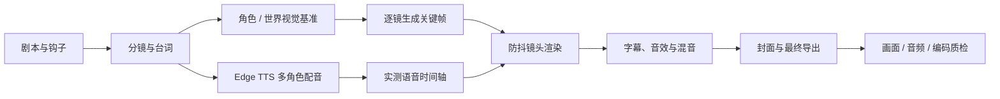

# Make Motion Comic

用 AI 图片、Edge TTS 与 FFmpeg 制作低成本、高一致性、可维护的动态漫画。

[](LICENSE)
[](SKILL.md)
[](https://ffmpeg.org/)
[](https://github.com/rany2/edge-tts)

`make-motion-comic` 是一个面向 Codex 的动态漫画制作 Skill。它把“剧本 → 角色视觉基准 → 逐镜图片 → 多角色配音 → 防抖镜头 → 字幕与混音 → 成片质检”固化为可复用的生产流程，不依赖生成式视频模型。

它适合：

- 动态漫画、漫剧、条漫视频；
- 竖屏悬疑、情感、科普和连续短剧；
- 用少量关键帧制作有声音、有节奏的故事视频；
- 修复角色漂移、机器人配音、字幕错位和 `zoompan` 微抖动。

> 当前版本重点支持普通话、9:16 竖屏和 FFmpeg 工作流。


## 为什么做这个 Skill

图片生成模型已经能够产出质量很高的漫画关键帧，但将图片直接拼成视频通常会出现四类问题：

1. 人物在镜头之间变脸、换衣服或改变年龄；
2. 系统 TTS 缺乏情绪，破坏画面建立的氛围；
3. 低分辨率 `zoompan` 产生一像素跳动和细线闪烁；
4. 配音、字幕、镜头和片尾各自计时，返工后全部错位。

本项目为这些问题提供明确的生产规则和可执行脚本：

- 始终使用原始角色视觉基准作为身份锚点；
- 默认使用多角色中文 Neural Edge TTS；
- 根据真实语音文件重建时间轴；
- 在 2 倍工作画布上进行缓动，再用 Lanczos 缩回 1080p；
- 对编码、黑帧、响度、字幕冲突和片尾衔接进行验收。

## 工作流



默认成片规格：

- 1080×1920，9:16；
- 30 fps，H.264 / AAC；
- 45–90 秒；
- 6–12 张关键帧；
- 约 −16 LUFS，True Peak 不高于 −1.5 dBTP。

## 安装

### 1. 克隆到长期维护目录

```bash
git clone https://github.com/ToBeWin/make-motion-comic.git
cd make-motion-comic
```

### 2. 让 Codex 发现 Skill

推荐使用符号链接，维护源码时安装版本会同步更新：

```bash
mkdir -p "${CODEX_HOME:-$HOME/.codex}/skills"
ln -s "$(pwd)" "${CODEX_HOME:-$HOME/.codex}/skills/make-motion-comic"
```

如果目标位置已经存在，请先确认它是否是需要保留的安装版本，不要直接覆盖。

### 3. 安装依赖

需要：

- Codex，以及可用的内置 Image Generator；
- Python 3.9+；
- FFmpeg / FFprobe；
- Zsh；
- [`edge-tts`](https://github.com/rany2/edge-tts)。

安装 Edge TTS：

```bash
python3 -m pip install edge-tts
```

运行环境检查：

```bash
./scripts/preflight.sh
```

返回以下结果即可开始制作：

```json
{"ok":true,"warnings":[]}
```

## 快速使用

在 Codex 中：

```text
使用 $make-motion-comic，把这个故事制作成一集 60 秒的竖屏动态漫画：
一名女孩每天都会收到已经去世的哥哥发来的天气预报。
```

Skill 会依次处理：

1. 剧情结构、钩子和反转；
2. 角色视觉基准与分镜提示词；
3. 逐镜图片生成与一致性检查；
4. Edge TTS 多角色配音；
5. 实测时间轴、字幕与镜头时长；
6. 防抖推拉、平移和静止镜头；
7. 环境声、音效、混音、封面与成片；
8. 编码、黑帧、响度和视觉检查。

## 核心原则

### 角色一致性

- 先生成包含正面、侧面、全身、表情和服装的视觉基准图；
- 每个镜头都回到原始基准图获取身份；
- 上一镜头只能作为姿势或构图参考；
- 禁止单纯采用 A → B → C 的连续参考链；
- 对人物、服装、手部、人数、关键道具和意外文字逐项验收。

详细说明见 [`references/image-consistency.md`](references/image-consistency.md)。

### 配音与时间轴

- 正式成片默认不使用 macOS `say`；
- 每句台词单独生成，角色长期保持固定音色；
- Edge TTS 网络错误采用有界重试，不静默降级；
- 修改台词、音色或语速后自动失效旧缓存；
- 最终时长以 `ffprobe` 测量结果为准。

详细说明见 [`references/audio-and-tts.md`](references/audio-and-tts.md)。

### 防抖运动

慢速 `zoompan` 每帧可能移动不足一个像素。整数取整会形成“停顿—跳一像素”的微抖动，而漫画细线会进一步放大这种现象。

本项目使用：

- 2592×4608 源工作画布；
- 2160×3840 运动输出；
- 余弦缓入缓出；
- 30 fps；
- Lanczos 缩放至 1080×1920；
- 单镜头只使用一个主要运动参数；
- 情绪反转镜头优先静止。

详细说明见 [`references/motion-and-qc.md`](references/motion-and-qc.md)。

## 脚本

### 批量生成 Edge TTS

从模板创建配音清单：

```bash
cp assets/templates/tts-script.json ./tts-script.json
```

生成独立语音文件：

```bash
python3 scripts/synthesize_edge_tts.py \
  --manifest tts-script.json \
  --out audio/lines \
  --speed 1.00
```

特点：

- 每句独立 MP3 / WAV；
- 网络错误自动重试；
- 通过内容指纹安全复用缓存；
- 支持无变调语速微调；
- 48 kHz 单声道输出。

### 构建真实时间轴

```bash
python3 scripts/build_timeline.py \
  --manifest tts-script.json \
  --audio-dir audio/lines \
  --out timeline
```

输出：

- `timeline/voice.wav`
- `timeline/subtitles.srt`
- `timeline/timeline.json`
- `timeline/voice-concat.txt`

### 渲染防抖镜头

```bash
./scripts/render_still_clip.sh \
  --input images/shot-01.png \
  --output video/shot-01.mp4 \
  --duration 6.5 \
  --motion push \
  --fps 30 \
  --strength 0.035
```

可用运动：

- `push`
- `pull`
- `pan-left`
- `pan-right`
- `hold`

推拉强度通常保持在 `0.02`–`0.05`。

## 项目结构

```text
make-motion-comic/
├── SKILL.md
├── README.md
├── LICENSE
├── agents/
│   └── openai.yaml
├── assets/
│   └── templates/
│       └── tts-script.json
├── docs/
│   └── demo-cover.jpg
├── references/
│   ├── audio-and-tts.md
│   ├── image-consistency.md
│   ├── motion-and-qc.md
│   └── story-and-shots.md
└── scripts/
    ├── build_timeline.py
    ├── preflight.sh
    ├── render_still_clip.sh
    └── synthesize_edge_tts.py
```

## 验收

Skill 要求至少检查：

```bash
ffprobe -v error \
  -show_entries format=duration:stream=codec_name,width,height,r_frame_rate,sample_rate,channels \
  -of json final.mp4

ffmpeg -v error -i final.mp4 -f null -

ffmpeg -hide_banner -i final.mp4 \
  -vf blackdetect=d=0.3:pix_th=0.05 \
  -an -f null -

ffmpeg -hide_banner -i final.mp4 \
  -af loudnorm=I=-16:LRA=9:TP=-1.5:print_format=summary \
  -f null -
```

还需要人工检查：

- 人物身份、服装和关键道具是否漂移；
- 手部和人数是否正确；
- 细线、头发、眼睛和瓶口是否抖动或闪烁；
- 字幕是否遮挡脸部；
- 最后一句字幕是否与片尾卡重叠；
- 手机扬声器音量下是否仍能听清对白。

## 已知限制

- Edge TTS 是微软在线语音端点的非官方客户端，需要网络且没有 SLA；
- 当前脚本重点针对普通话与 9:16 竖屏；
- Image Generator 的角色一致性仍需人工视觉验收；
- 当前版本提供可靠的生产组件，还不是完全一键式渲染器；
- BGM 必须自行生成或使用明确允许复用的素材。

## 路线图

- 统一的 `episode.json` 单一数据源；
- 一键式全片编排与导出；
- 自动字幕排版和片尾安全区检查；
- BGM 自动 ducking 与 SFX 时间轴；
- 横屏、方形和多平台规格；
- 可插拔 TTS 供应商；
- 自动角色漂移检测；
- 自动生成 QC 报告和版本对比视频。

## 贡献

欢迎提交 Issue 和 Pull Request。贡献代码时请：

1. 保持 `SKILL.md` 简洁，把细节放入 `references/`；
2. 为新增脚本提供可复现的运行示例；
3. 运行环境预检和 Skill 验证；
4. 不提交第三方版权音乐、密钥、Token 或生成缓存；
5. 说明改动如何改善稳定性、质量或可维护性。

## English summary

`make-motion-comic` is a Codex Skill for producing low-cost motion comics from AI-generated keyframes, multi-character Mandarin Edge TTS, captions, sound design, and deterministic FFmpeg assembly.

It focuses on four recurring production problems:

- character identity drift across generated shots;
- robotic or inconsistent speech;
- subtitle and timing desynchronization;
- micro-jitter caused by low-resolution integer-rounded `zoompan`.

The default pipeline targets 1080×1920, 30 fps vertical videos without requiring a generative video model.

## License

Released under the [MIT License](LICENSE).

