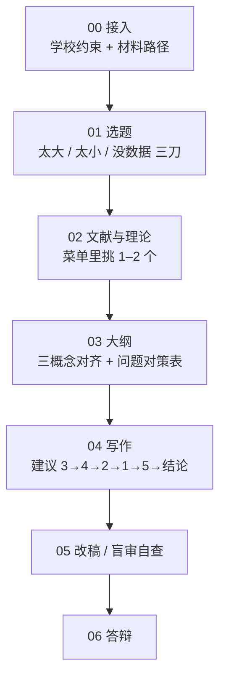

# MBA 毕业论文 AI 辅助写作指导

面向中国高校 MBA / EMBA（也可用于其他应用型管理硕士）的 **AI 辅助写作指导**：告诉人和 Agent 怎么把一篇论文写对——选题收窄、五章结构、证据与理论落地、对策可执行、答辩能讲清。

AI 拆任务、对照清单、指出缺口。题目、材料、判断和最终表述仍由你来。这不是代写工具。

> 你负责研究对象、材料、判断和最终表述。Agent 按本目录的清单与闸门拆任务、指出缺口、对照章节规范。引用、数据、学校规定，一律由使用者核验。

微信搜一搜 **MBA第二导师计划**，扫码关注。在职 MBA 从开题到答辩的实战方法，持续更新在这里。


## 这是什么

一套给 **应用型管理学位论文** 用的写作闸门：先把题目收到能做的粒度，再按五章把证据、理论和对策对齐，最后能拿去开题、盲审和答辩。

它帮你做的是「怎么写对」，不是「替你写完」。在职 MBA 从开题到答辩，常见卡点它都能接：

- **选题被打回**：把「某公司数字化转型 / 人力资源研究」收到一家能进得去的对象、一个看得见的落差、一条现在就走得通的证据路径
- **五章立不住**：按通行五章制分配篇幅，第 4 章做重心；问题、原因、对策一一对应，对策写清谁做、何时、用什么资源
- **理论不会选**：营销、人力、运营、质量、财务、战略、数字化、经营管理八个方向有菜单，自己删并到 1–2 个，不默认套 4P
- **方法对不上**：问卷、访谈、案例怎么写进第 1 章；学校要加问卷、导师要 SEM、内部数据批不下来时怎么改
- **初稿像工作报告**：指出缺口，把空对策和套话框架拦下来
- **不知道 AI 能用到哪**：安全 / 灰色 / 高危分开；判断和材料仍由你来
- **答辩讲不清**：把机制、边界和「为什么是这个理论 / 方法」收成能讲的结构

人和 Agent 都可以用：你自己对着清单写，或把本目录加载成 Skill，让 Agent 按阶段拆任务、对照规范。

| 会做 | 不会做 |
|---|---|
| 把大题目收到一家对象 + 一个可观察的落差 | 代写正文、编数据、编文献、编导师评语 |
| 按主方向给 1–2 个可选理论，让你自己删并 | 默认套 STP + 4P，或把 SWOT 当第 4 章方案 |
| 告诉你问卷 / 访谈 / 案例怎么写进第 1 章、材料变了怎么改 | 承诺过查重、过 AIGC 检测、过盲审 |
| 对照清单指出缺口：问题与对策对不上、对策没有责任人 | 按清华 `thuthesis` / LaTeX 排版 |

学校字数、查重率、是否允许问卷、论文类型，以培养手册为准。启动时由 Agent 从项目文件推断，缺的再用提问补全，写入论文项目根目录的配置——**不用你手改 YAML**。和本仓库冲突时听学校。

## 适用谁

适合：

- 在职 MBA / EMBA，正在写或即将写毕业论文
- 研究对象是一家能触达的企业（或边界清楚的业务单元、医院、银行网点、门店体系）
- 学校要的是 **五章制应用型论文**（绪论 → 理论 → 现状/问题 → 方案 → 保障/结论），正文常见 3 万字以上
- 主方向是营销、人力、运营、质量、财务、战略、数字化、经营管理之一

不默认覆盖：纯理论期刊论文、理工科实验论文、清华 `thuthesis` LaTeX 流程。

口诀：**对象可触达，问题有落差，证据有路径。** 题目粒度对照 [`examples/corpus-index.md`](examples/corpus-index.md)，不要写成「某公司人力资源研究」「数字化转型策略研究」这种筐。

## 为什么要选这个 Skill

市面上不少「论文 Skill」其实是通用润色，或默认给你一套营销 4P + SWOT。本仓库是给 **中国高校应用型 MBA / EMBA 毕业论文** 写的操作手册：选题怎么收、五章怎么摆、理论怎么挑、方法怎么写、对策怎么落到人。

| 你可能已经试过 | 这里不一样的地方 |
|---|---|
| Word 模板、万能「营销策略研究」 | 八个方向各自有理论菜单和题名粒度，不默认 4P |
| 让大模型直接成章 | 不代写、不编数据；Agent 拆任务、对照清单、指出缺口 |
| 堆 4 个理论、SWOT 当第 4 章 | 全书 1–2 个理论贯穿第 3、4 章；SWOT / PEST / 五力只做铺垫 |
| 换一台 AI 就要重写 Prompt | 标准 `SKILL.md` 技能包，同一套闸门带到你正在用的 Agent 上 |
| 只改词句、结构仍空 | 先把问题–原因–对策立住；成节后的措辞加强交给姐妹项目 humanize |

方法来自公众号 **MBA第二导师计划** 一线辅导里反复用过的做法，不是从期刊论文模板倒过来的。学校规定优先；本工具不保证过开题、盲审或答辩。

### 能在哪些 Agent 上用

本仓库遵循开放的 [Agent Skills](https://platform.claude.com/docs/en/agents-and-tools/agent-skills/overview) 规范：根目录一个 `SKILL.md`，细则放在 `references/` 等目录。只要产品能加载这种技能文件夹，就可以用，不绑某一家模型。

国内常用：

- **WorkBuddy**（腾讯）：放到**该篇论文项目**下的 `.workbuddy/skills/mba-thesis-writing-guidance/`（不要装到家目录全局）
- **Kimi**（Kimi Code CLI 等）：按该产品的 skills 目录加载；`npx skills add` 也可指定 `kimi-cli`
- **Claude Code / Claude**
- **Cursor**
- **OpenAI Codex**
- **Grok**（以及同类终端 Agent）

同类、同样认 `SKILL.md` 的环境还包括：OpenCode、OpenClaw、GitHub Copilot、Cline、Gemini CLI、Windsurf、Roo Code、Amp 等。

**建议装在论文项目里（项目级），不要全局安装。** 每篇论文的学校、对象、材料都不同；装到 `~/.claude/skills/` 这类家目录里，容易串配置，也会在别的项目里误触发「帮我写论文」。没有命令行时，把整个仓库拷进**该论文项目**的 skills 目录（不要只拷 `SKILL.md`）。路径见下面「怎么安装」。

## 怎么安装

**先进入你的毕业论文项目，再安装。** 装在这一篇论文的目录里，不要全局（不要 `-g`，也不要装到 `~/.claude/skills/`、`~/.workbuddy/skills/`）。每篇论文的学校、对象、材料都不同。

启动之后 **不用手填 YAML**。Agent 按 [`workflows/00-intake.md`](workflows/00-intake.md) 扫项目、能读到的先写入根目录配置，缺的用提问补上。

### 推荐：npx

```bash
cd /path/to/your-mba-thesis
npx skills add stephenlzc/MBA-thesis-writing-guidance
```

Claude Code、Cursor、Codex、OpenCode、Kimi CLI 等都能用这条。装完对 Agent 说：

> 先读 SKILL.md，按我现在的阶段走。我在写 MBA 毕业论文。

项目里应出现完整技能目录（`SKILL.md`、`references/`、`workflows/`、`templates/` 等）。缺 `references/` 就等于没装上。

没有 Agent、只自己对着文件写：同样先 `cd` 进论文项目，把仓库 clone 进来，再按「[怎么用](#怎么用)」打开对应阶段。配置仍建议让 Agent 启动时写。

姐妹项目 [humanize-mba-text](https://github.com/stephenlzc/humanize-mba-text-skill) 可一起加载：本仓库把论文写对，那边成节之后改仍像模板的措辞。配合见[下文](#和-humanize-mba-text-怎么配合)。

### 人工安装（没有 npx 时）

先进入论文项目，再 clone 进该产品的**项目** skills 目录，不要 clone 到家目录：

```bash
cd /path/to/your-mba-thesis

# Claude Code / Cursor 等
git clone https://github.com/stephenlzc/MBA-thesis-writing-guidance.git \
  .claude/skills/mba-thesis-writing-guidance

# 若该产品认 .agents/skills
git clone https://github.com/stephenlzc/MBA-thesis-writing-guidance.git \
  .agents/skills/mba-thesis-writing-guidance

# WorkBuddy
git clone https://github.com/stephenlzc/MBA-thesis-writing-guidance.git \
  .workbuddy/skills/mba-thesis-writing-guidance
```

OpenClaw 可在论文项目里：`openclaw skills install git:stephenlzc/MBA-thesis-writing-guidance`。必须加载**整个目录**，不能只拷 `SKILL.md`。

### 给正在读这段的 Agent

1. 已在论文项目且已装本 Skill → 打开 [`SKILL.md`](SKILL.md)，先跑 `workflows/00-intake.md`。不要让用户手改 YAML。  
2. 用户要安装 → 先确认当前目录是论文项目，再执行 `npx skills add stephenlzc/MBA-thesis-writing-guidance`（不要 `-g`）。没有 npx 再用上面的人工 clone。不要装到家目录，不要只下载一个 `SKILL.md`。  
3. 用户同时提到去 AI 痕迹 → 再加载 [humanize-mba-text](https://github.com/stephenlzc/humanize-mba-text-skill)。

## 八个方向，不默认营销

Word 模板最常见的走样，是不管题目是绩效、交期还是授权，第 4 章都写成产品 / 价格 / 渠道 / 促销。本仓库按**现场落差**认一个主方向，第 4 章结构跟这个方向走。

| 主方向 | 现场通常在痛什么 | 理论从哪挑 | 题名粒度 |
|---|---|---|---|
| 营销 | 客户不来、来了不成交、渠道窜货 / 价盘乱 | [`theory-menu.md`](references/methods/theory-menu.md) 营销 | [`corpus-index.md`](examples/corpus-index.md) 营销 |
| 人力资源 | 招不进、留不住、考核把行为带歪 | 同上「人力资源」 | 同上「人力资源」 |
| 运营 | 交期、库存、排程、产能卡住 | 同上「运营」 | 同上「运营 / 质量」（按落差二选一） |
| 质量 | 缺陷、追溯断点、放行、客诉闭环失败 | 同上「质量」 | 同上 |
| 财务 | 账实不符、预算空转、利润与现金流背离 | 同上「财务」 | 同上「财务」 |
| 战略 | 做不做、做哪块、资源往哪投 | 同上「战略」 | 同上「战略」 |
| 数字化 | 系统上了没人用、两套数、数据没进决策 | 同上「数字化」 | 同上「数字化」 |
| 经营管理 | 一管就死、一放就乱，制度空转、组织扯皮 | 同上「经营管理」 | 同上「经营管理」 |

认不准时问自己：第 4 章若只能留一套小节结构，你希望按客户切、按岗位 / 激励切、按流程节点切，还是按组织权限切？答案即主方向。辅方向可以有，不能两个主方向抢第 4 章。

## 写作时记住的十条

细则在 [`references/principles.md`](references/principles.md)。执行时只记这些：

1. **实践导向**：落在可观察的管理现场，不写行业评论。
2. **小题深做**：`[对象] + [领域] + [可观察的落差] + 研究`。
3. **用事实**：没有数字或出处的「重要 / 显著 / 全面」删掉。
4. **数据能溯源**：写不出源头的数字不要出现。
5. **理论 1–2 个**：按主方向从菜单挑，贯穿第 3、4 章。
6. **问题–原因–对策一一对应**：没有对策的问题删掉或降为背景。
7. **对策可执行**：谁做、做什么、何时、用什么资源、如何验收。
8. **结构完整**：节下有目；第 4 章是篇幅重心。
9. **格式跟学校**：通用底线见 [`references/format-standards.md`](references/format-standards.md)。
10. **结论有边界**：针对本案例、可证伪；禁止「企业应加强……」。

落笔时的句长、连接词、现场词见 [`references/prose.md`](references/prose.md)。写每一节就用，不要等整章写完再改腔调。

## 五章怎么摆

学校另有规定的听学校。没有规定时，用这张配比（事实源：[`references/corpus-guide.md`](references/corpus-guide.md) §3）：


| 章 | 这一章要回答 | 怎么写 | 常见翻车 |
|---|---|---|---|
| 第 1 章 绪论 | 研究谁、什么问题、为何值得做、用什么方法 | [`references/chapters/chapter-1-introduction.md`](references/chapters/chapter-1-introduction.md) | 写成企业宣传 + 方法名称清单 |
| 第 2 章 理论 | 后面按什么维度拆问题、出方案 | [`references/chapters/chapter-2-theory.md`](references/chapters/chapter-2-theory.md) | 堆 4 个理论；SWOT 当核心理论 |
| 第 3 章 现状 / 问题 | 现在怎样、2–3 个问题、成因为何 | [`references/chapters/chapter-3-analysis.md`](references/chapters/chapter-3-analysis.md) | 列 8–10 条「存在的问题」 |
| 第 4 章 方案 ★ | 每条问题对应谁、何时、用什么资源做什么 | [`references/chapters/chapter-4-solutions.md`](references/chapters/chapter-4-solutions.md) | SWOT 矩阵当方案；4P 四段凑齐 |
| 第 5 章 保障 | 组织、制度、资源、阶段、风险 | [`references/chapters/chapter-5-implementation.md`](references/chapters/chapter-5-implementation.md) | 和对策正文重复粘贴 |
| 结论 | 发现、不足、边界 | [`references/chapters/chapter-conclusion.md`](references/chapters/chapter-conclusion.md) | 「建议公司重视……」 |

**第 4 章三条红线：**

- SWOT / PEST / 波特五力只做第 2–3 章铺垫，不能当第 4 章主框架。
- 每个重要论断至少有一种可展示证据（有出处的数字、可核对事件、访谈 / 问卷原话、跨期或对标）。
- 主框架跟主方向走，不要因为题目里有「策略」就写成营销 4P。

填空大纲：[`templates/five-chapter-outline.md`](templates/five-chapter-outline.md)。填的时候在旁边附一张「3.3 问题 ↔ 4.3 对策」对照表。

## 从开题到答辩

建议按阶段走，不要一上来就写第 4 章。Agent 入口是 [`SKILL.md`](SKILL.md)（瘦路由，只负责按阶段打开文件）。



| 阶段 | 你在做什么 | 打开 | 过关再往下 |
|---|---|---|---|
| 00 接入 | 学校、对象、材料、剩余时间 | [`workflows/00-intake.md`](workflows/00-intake.md) | Agent 扫项目 + 提问补全，写入项目根目录 yaml；不通例冒充学校规定 |
| 01 选题 | 从现场收窄到可做的一句话 | [`workflows/01-topic.md`](workflows/01-topic.md) | 对象 + 落差 + 证据路径；用户确认候选题 |
| 02 文献与理论 | 综述写成对话，理论自己删并 | [`workflows/02-literature.md`](workflows/02-literature.md) | 1–2 个理论能映射到第 3、4 章 |
| 03 大纲 | 五章三级标题 + 问题对策表 | [`workflows/03-outline.md`](workflows/03-outline.md) | 开题三概念（内容 / 目标 / 关键问题）对齐 |
| 04 写作 | 按章写；先 3、4 章再倒装绪论 | [`workflows/04-writing.md`](workflows/04-writing.md) | 问题与对策仍一一对应；方法写清怎么用 |
| 05 改稿 | 盲审视角自查 | [`workflows/05-revision.md`](workflows/05-revision.md) | 数据有出处、对策可执行、结论有边界 |
| 06 答辩 | 10 分钟能讲清机制 | [`workflows/06-defense.md`](workflows/06-defense.md) | 打得住「为什么是这个理论 / 这个方法」 |

已有初稿、想往「优秀」抬：先跑 [`references/diagnosis/internal-questions.md`](references/diagnosis/internal-questions.md) 五个内部问题，再按 [`references/diagnosis/style-a-vs-b.md`](references/diagnosis/style-a-vs-b.md) 改第 4、5 章。五个问题没答完，不要做优秀层改写。

写作顺序建议：**第 3 章 → 第 4 章 → 第 2 章 → 第 1 章 → 第 5 章 → 结论 → 摘要**。先有问题和方案，再倒装绪论。

## 理论怎么挑、方法怎么写

三件套不要混：

| | 管什么 | 写在哪 | 例子 |
|---|---|---|---|
| 理论 | 解释现象、约束方案结构 | 第 2 章，贯穿第 3、4 章 | 期望理论、PDCA、竞争战略类型、管控三模式 |
| 方法 | 取证与分析路径 | 第 1 章写清，第 3 章执行 | 案例、访谈、问卷、财务分析 |
| 工具 | 辅助整理 | 第 3 章图表或附录 | SWOT、鱼骨、AHP、甘特图 |

**理论：** 打开 [`references/methods/theory-menu.md`](references/methods/theory-menu.md) 对应方向，勾 2–4 个候选，问两句——第 3 章能否按它的维度拆问题？第 4 章能否按同一套维度出方案？留 1–2 个。条数规则见 [`references/methods/theory-selection.md`](references/methods/theory-selection.md)。

**方法：** 先问题后方法。怎么选、第 1 章四种信息怎么写、学校要问卷 / 导师要 SEM / 内部数据批不下来时怎么改：[`references/methods/method-guide.md`](references/methods/method-guide.md)。复杂度刹车（SEM、多案例、实验、没内部数据）见 [`references/methods/research-design.md`](references/methods/research-design.md)。

不要默认「文献法 + 案例法 + 问卷法」三件套。用不上的删。AHP、回归、鱼骨图是方法或工具，不占第 2 章理论名额。

## 怎么用

安装见上面「[怎么安装](#怎么安装)」（项目级，不要全局）。已经加载后，对人说：「先读 `SKILL.md`，按我现在的阶段走。」

第一次由 Agent 跑 [`workflows/00-intake.md`](workflows/00-intake.md)：从培养手册、开题稿、已有章节里推断，缺的用提问补上，写入项目根目录的 `school-format.yaml` 和 `thesis-config.yaml`。你不用打开 YAML。还没有题目时，用提问盘人 / 流程 / 记录 / 客户 / 反复出现的现象。

| 你现在卡在 | 打开 |
|---|---|
| 学校要求还没写进配置 | `workflows/00-intake.md` |
| 还没想清楚题目 | `workflows/01-topic.md` + `examples/corpus-index.md` |
| 方向有了、不知道用哪套理论 | `references/methods/theory-menu.md` |
| 方法不会选、学校要加问卷 | `references/methods/method-guide.md` |
| 不知道五章怎么分配 | `templates/five-chapter-outline.md` |
| 正在写某一章 | `workflows/04-writing.md`（点名打开对应章） |
| 初稿像工作报告 / 对策很空 | `references/diagnosis/` |
| 导师评语看不懂 | `references/advisor.md` |
| AI 能不能用、用到哪一步 | `references/ai-use.md` |
| 要答辩 | `workflows/06-defense.md` |

可直接勾的清单在 `checklists/`（选题可行性、文献综述、研究方法、数据分析、改稿、结论、答辩）。

## 和 humanize-mba-text 怎么配合

本仓库和 [humanize-mba-text](https://github.com/stephenlzc/humanize-mba-text-skill) 是同一条写作链上的两段，不是两套互相替代的工具。

| 顺序 | 做什么 | 用谁 |
|---|---|---|
| 1 | 题目收窄、五章立住、证据和对策一一对应；**落笔时**就按 [`references/prose.md`](references/prose.md) 写（句长有长短、连接词省着用、用现场词） | 本仓库 |
| 2 | 一节已经能站住，仍整齐、仍像模板 | [humanize-mba-text](https://github.com/stephenlzc/humanize-mba-text-skill) 做加强：改措辞，不改判断 |
| 3 | 加强之后回看：主线有没有被改跑、数字和出处还在不在 | 再回到本仓库的改稿清单 |

humanize 是 enhancement，不替代写作习惯。本仓库不维护检测词表，也不跑检测脚本。两边都加载时按这个顺序接，不要先通篇 humanize 再补结构。

## 仓库里有什么

| 路径 | 里面是什么 |
|---|---|
| [`SKILL.md`](SKILL.md) | Agent 入口：硬性边界、十条标题、按阶段打开哪份文件 |
| [`assets/mba-second-mentor.png`](assets/mba-second-mentor.png) | 公众号「MBA第二导师计划」搜一搜卡片 |
| [`references/principles.md`](references/principles.md) | 十条原则的展开 |
| [`references/prose.md`](references/prose.md) | 落笔行文：句长、连接词、现场词 |
| [`references/ai-use.md`](references/ai-use.md) | AI 安全 / 灰色 / 高危三区 |
| [`references/advisor.md`](references/advisor.md) | 导师反馈怎么翻译、怎么回 |
| [`references/corpus-guide.md`](references/corpus-guide.md) | 五章结构、字数配比、领域大纲（结构事实源） |
| [`references/format-standards.md`](references/format-standards.md) | 格式与引用底线（先问学校） |
| [`references/chapters/`](references/chapters/) | 第 1–5 章 + 结论：每一章要回答什么、怎么验收 |
| [`references/diagnosis/`](references/diagnosis/) | 先诊断再往优秀抬（内部问题、写法 A/B、量表） |
| [`references/methods/theory-menu.md`](references/methods/theory-menu.md) | 八个方向的可选理论 / 框架 |
| [`references/methods/theory-selection.md`](references/methods/theory-selection.md) | 理论条数与死理论规则 |
| [`references/methods/method-guide.md`](references/methods/method-guide.md) | 方法选用、第 1 章写法和调整 |
| [`references/methods/research-design.md`](references/methods/research-design.md) | SEM / 案例个数 / 实验 / 无内部数据的刹车 |
| [`workflows/`](workflows/) | 闸门式阶段 00–06 |
| [`checklists/`](checklists/) | 可勾选的清单 |
| [`templates/`](templates/) | 字段模板；真正填写由 Agent 写到论文项目根目录 |
| [`examples/corpus-index.md`](examples/corpus-index.md) | 各领域小题深做题名示例（不含 PDF） |

## AI 能做什么

判断一条用途落在哪一区，只看三问（全文：[`references/ai-use.md`](references/ai-use.md)）：

1. 它替你做了本该由你完成的判断吗？
2. 它产出的内容你能核验真伪吗？
3. 学校问起来你敢如实说吗？

| 区 | 可以 | 例子 |
|---|---|---|
| 安全 | AI 打杂，判断留给自己 | 对已有选题提反对意见、整理你亲手记的文献笔记、改病句 |
| 灰色 | 能用，过三道闸：查校规 → 留痕 → 该披露就披露 | 润色你写的初稿、搭提纲骨架 |
| 高危 | 做了就是学术不端 | 编文献 / 数据 / 访谈；成段替写当正文；校规要求声明却隐瞒 |

**AI 是杠杆，人是刹车。** 选题、证据、判断不外包。

## 学术诚信

- 不编造数据、访谈、问卷、文献、DOI
- 企业内部材料需授权或脱敏后再写进论文
- 查重率、AIGC 检测、是否允许使用 AI 辅助，以学校规定为准
- 本工具按现状提供，不保证通过开题、盲审或答辩

## 方法从哪来

本仓库的判断标准、闸门和工作表，吸收了公众号 **MBA第二导师计划**（Uncle Cong）一线辅导里反复验证过的做法：选题从工作现场盘点、题目三级收窄、文献写成对话、方法先刹车再加码、对策必须可执行、AI 只做杠杆、判断留给作者。结构与篇幅按中国高校应用型 MBA 通行的五章制来写，学校另有规定的以学校为准。

## 致谢

本仓库的方法也受到以下项目启发，正文为独立撰写，**不包含对方原文**。

感谢 [wangzhexuan/mba-thesis-template](https://github.com/wangzhexuan/mba-thesis-template)（AI瓦尔登湖）。该项目把 MBA 论文拆成从初始化到答辩的阶段工作流，并用配置文件固定学校要求与研究设计；用户主导、AI 辅助的分工也来自这一思路。其许可为 [CC BY-NC 4.0](https://github.com/wangzhexuan/mba-thesis-template/blob/main/LICENSE)。

感谢 [chao1208/mba-thesis-advisor](https://github.com/arisng/openclaw-skills/tree/f4411db6032f429eabab596faca40594274c95b8/skills/chao1208/mba-thesis-advisor)（作者 lichao，镜像快照 v1.0.0，MIT）。该 Skill 强调先诊断再改写、用内部视角挖机制、把「套 SWOT 写对策」与「写清因果机制和边界」区分开。本仓库面向中国高校 Word 五章制，没有采用其清华 `thuthesis` / LaTeX 默认路径。

## 相关项目

姐妹项目（同一条写作链，配合方式见[上文](#和-humanize-mba-text-怎么配合)）：

- [humanize-mba-text](https://github.com/stephenlzc/humanize-mba-text-skill) — 成节之后的加强：检测仍像模板的说法并改措辞，不改判断

下列项目本轮只作对照，不吸收正文：

- [TimZhou3940/mba-thesis-topic-advisor](https://github.com/TimZhou3940/mba-thesis-topic-advisor) — 选题闸门（最小输入、负面清单、可行性打分）
- [lovstudio thesis-polish](https://github.com/lovstudio/skills/tree/main/skills/thesis-polish) — 成稿后的四维润色
- [ks91/gamer-pat](https://github.com/ks91/gamer-pat) — 早稻田商科论文写作助手（语境不同）

## 许可

MIT。见 [`LICENSE`](LICENSE)。
