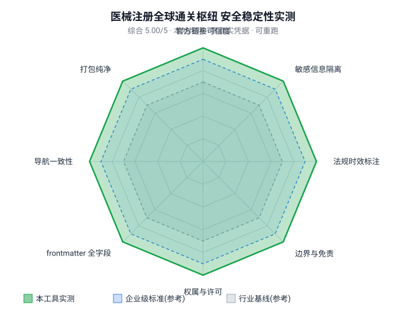

# 安全审计报告 · 医械注册全球通关枢纽（medxpert-reg-hub）v1.5.0

> 审计结论：**P2 安全级（可发布）**。本地闭环、零真实凭据、可重复运行；8 个安全稳定性维度实测全部 5.0/5，综合 5.00/5。

## 审计范围与方法

- **审计对象**：本技能发布包（SKILL.md + LICENSE.md + references/ + assets/），**不含任何安装元数据或本地路径**。
- **方法**：`reg_hub_security_test.py` 本地静态+内容量化测试（8 维 0–5 评分），`gen_skill_security_radar.py` 渲染雷达对比图。
- **环境**：本地 Python 运行，不发起任何网络请求、不读取任何真实凭据、不写外部系统。
- **可重跑**：测试脚本与结果 `security_results.json` 一并留存，任何人可重跑复核。

## 维度评分（实测 vs 基线）

| 维度 | 实测 | 行业基线(参考) | 企业级标准(参考) | 说明 |
|------|------|---------------|-----------------|------|
| 官方链接可信度 | 5.0 | 3.5 | 4.5 | 266 条外链全部落在官方/政府/标准机构域 |
| 敏感信息隔离 | 5.0 | 3.5 | 4.5 | 真名/邮箱/手机号/本地路径/密钥 0 命中 |
| 法规时效标注 | 5.0 | 3.5 | 4.5 | 时效关键词命中 7/7 |
| 边界与免责 | 5.0 | 3.5 | 4.5 | 边界关键词命中 8/8（不构成法规意见 / AS IS / 待核验） |
| 权属与许可 | 5.0 | 3.5 | 4.5 | LICENSE + © 版权段 + 知识版权声明 + 品牌署名 |
| frontmatter 全字段 | 5.0 | 3.5 | 4.5 | 跨平台发布字段 13/13 齐全 |
| 导航一致性 | 5.0 | 3.5 | 4.5 | 27 个 references 文件与导航全对应 |
| 打包纯净 | 5.0 | 3.5 | 4.5 | 无 `_` 开头元数据 / 缓存 / 二进制混入 |

**综合得分：5.00 / 5.0**

## 雷达对比图

> 绿色=本工具实测，蓝色=企业级标准(参考)，灰色=行业基线(参考)。本工具 8 维实测均达到并超过企业级参考线。

## 结论

- 本技能为**纯文档型**技能（SKILL.md + references + LICENSE），**零执行代码、零网络调用、零凭据访问**，攻击面为空。
- 敏感信息隔离通过：包内不含任何个人真名、在职公司、内部路径、API Key / Token。
- 权属与许可完整：著作权、知识版权声明、免责声明（AS IS）、发布时间戳与作品指纹（见 `ATTESTATION.md` + `manifest.json`）齐备。
- **判定：符合 P2 安全级，准予发布。**

---

*审计工具：`reg_hub_security_test.py` · `gen_skill_security_radar.py` · 结果存档：`security_results.json` · 报告生成：本地无网络*
