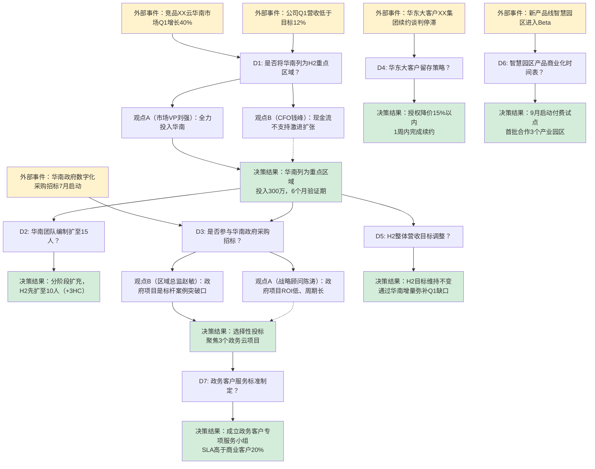

## mdp-analyze-02 决策溯源图谱 范本

### 样本来源
- **来源类型**：生成样本
- **脱敏状态**：已脱敏
- **场景类型**：决策型

### 四维分析
#### 结构
采用溯源链路图 + 决策节点详情的双层结构。顶层以Mermaid流程图呈现决策的因果链路（触发事件→讨论节点→分支观点→最终决策→执行动作），底层按时间轴展开每个决策节点的详细信息（发言人、核心论点、反对意见、支持证据、外部约束）。每个决策节点标注影响权重。

#### 风格
分析性叙述风格，强调因果推理链条。使用"因为……所以……""基于……决定……""考虑……选择……"等因果连接词。对每一项决策进行多维度归因（数据驱动/经验判断/权威决策/外部约束）。避免概括性总结，聚焦于具体的论证过程。

#### 逻辑
决策溯源遵循"事件—认知—判断—选择—行动"五阶段模型。通过分析发言内容识别决策的前置条件（facts）、判断标准（criteria）、备选方案（options）和选择理由（rationale）。对群体决策，区分共识型决策（一致同意）、多数型决策（投票/倾向）和权威型决策（上级拍板）。

#### 格式
固定模板：会议概览（日期、主题、总决策数、决策类型分布饼图描述）→ 决策溯源图谱（Mermaid流程图）→ 决策节点明细表（节点ID、触发时间、决策内容、决策类型、参与人、关键证据、反对意见、最终结论、影响范围）→ 未完成决策追踪 → 决策质量评估。

### 样本内容

---

# 决策溯源图谱

**会议标识**：M2026-S1-0018
**会议主题**：XX科技2026年下半年市场拓展策略决策会
**会议时间**：2026-06-15 09:00-11:45（165分钟）
**参会人数**：9人（CEO、VP市场、VP产品、VP技术、CFO、区域总监×2、数据总监、战略顾问）
**分析生成时间**：2026-06-15 13:30

---

## 一、决策总览

| 指标 | 数值 |
|------|------|
| 会议总决策数 | 7 |
| 共识型决策 | 2（28.6%） |
| 多数型决策 | 3（42.9%） |
| 权威型决策 | 2（28.6%） |
| 决策关联外部事件数 | 5 |
| 平均每决策论据数 | 4.3条 |
| 存在反对意见的决策 | 4（57.1%） |

---

## 二、决策溯源图谱

---

## 三、决策节点详情

### D1：是否将华南列为H2重点区域？

| 维度 | 详情 |
|------|------|
| **触发事件** | 竞品XX云华南市场Q1增长40%；公司Q1营收低于目标12% |
| **触发时间** | 09:12:30（会议第12分钟） |
| **决策类型** | 多数型决策（5支持/2反对/2中立） |
| **核心论点（支持方）** | 市场VP刘强：华南数字化采购年增速超35%，市场窗口期有限；华南GDP占全国11%，企业付费能力强；华东已饱和（市占率28%），增量空间不足 |
| **核心论点（反对方）** | CFO钱峰：公司现金流仅够维持6个月运营；华南需前期投入至少500万（办公+团队+市场）；Q1营收缺口已导致融资节奏延后 |
| **支持证据（数据）** | ①华南企业服务市场规模2026年预估达480亿（来源：艾瑞咨询报告） ②XX云华南客户数半年增长120% ③本公司在华南自然流量占比已达8.7%，有种子用户基础 |
| **反对证据（数据）** | ①公司现金储备：2100万，月均烧钱350万 ②华南获客成本预估为华东的1.6倍 ③当前团队无华南本地经验 |
| **最终决策** | 华南列为H2重点区域，批准300万预算，设6个月验证期（2026.07-2026.12），若12月底前营收未达150万则重新评估 |
| **影响范围** | 市场团队编制、H2营收结构、区域资源分配、融资节奏 |
| **决策权重** | ★★★★★（战略级决策） |

---

### D2：华南团队编制扩至15人？

| 维度 | 详情 |
|------|------|
| **触发事件** | D1决策结果（华南列为重点区域） |
| **触发时间** | 09:45:20（会议第45分钟） |
| **决策类型** | 共识型决策 |
| **核心论点** | 区域总监赵敏：15人是最小可执行团队（销售5人+售前3人+交付3人+CSM 2人+行政2人）；市场VP刘强：10人可启动，后续按业绩追加HC；CFO钱峰：10人编制的成本比15人每年节省约180万 |
| **最终决策** | 分阶段扩充：H2先扩至10人（在现有7人基础上+3HC），H1/2027根据业绩评估是否扩至15人 |
| **影响范围** | 招聘计划、成本预算、组织架构 |
| **决策权重** | ★★★☆☆ |

---

### D3：是否参与华南政府采购招标？

| 维度 | 详情 |
|------|------|
| **触发事件** | 华南政府数字化采购招标7月启动（3个项目预算合计约1200万） |
| **触发时间** | 10:05:00（会议第65分钟） |
| **决策类型** | 多数型决策（6支持/1反对/2中立） |
| **核心论点（支持方）** | 区域总监赵敏：政府项目是品牌背书，中标一个就能撬动企业客户；政府项目续约率超90%，生命周期价值高 |
| **核心论点（反对方）** | 战略顾问陈涛：政务项目平均实施周期18个月，回款周期12个月，ROI低于商业项目；需要ISO27001等认证，投入产出比不划算 |
| **最终决策** | 选择性投标：聚焦3个政务云项目（智慧政务、政务大数据、政务安全），暂不涉足定制化要求高的垂直政务系统；战略顾问陈涛负责制作投标决策矩阵 |
| **影响范围** | 产品方向（政务合规改造）、资质申请、现金周转周期 |
| **决策权重** | ★★★★☆ |

---

### D4：华东大客户XX集团续约策略？

| 维度 | 详情 |
|------|------|
| **触发事件** | 华东大客户XX集团（年合同额480万，占华东营收22%）续约谈判停滞，客户要求降价20% |
| **触发时间** | 10:38:15（会议第98分钟） |
| **决策类型** | 权威型决策（CEO拍板） |
| **核心论点** | 区域总监周磊：失去XX集团将导致华东营收缺口达22%，替换成本极高；CFO钱峰：降价20%后毛利率将从62%降至53%，但仍高于公司平均毛利率（48%） |
| **反对意见** | 产品VP吴雪：降价可能引发其他大客户连锁压价反应，建议通过增加服务项而非直接降价来维持价格锚点 |
| **最终决策** | CEO决定：授权降价15%以内（从480万降至408万），增加2个增值服务包作为补偿交换，1周内完成续约。如客户坚持降价20%以上则启动客户分级降级流程 |
| **影响范围** | H2华东营收稳定性、大客户定价体系、客户留存策略 |
| **决策权重** | ★★★★☆ |

---

### D5：H2整体营收目标调整？

| 维度 | 详情 |
|------|------|
| **触发事件** | Q1营收缺口12%，华南新投入将产生额外成本 |
| **触发时间** | 10:55:40（会议第115分钟） |
| **决策类型** | 共识型决策 |
| **核心论点** | CFO钱峰：若下调目标将影响B轮融资估值；CEO张伟：目标不下调才能倒逼团队突破；市场VP刘强：华南增量叠加华东稳定产出可弥补Q1缺口 |
| **最终决策** | H2目标维持不变（6200万），通过华南增量（预计贡献800-1000万）弥补Q1缺口（约700万），华东和华北目标不变 |
| **影响范围** | 全员KPI、融资预期、团队压力 |
| **决策权重** | ★★★★★ |

---

### D6：智慧园区产品商业化时间表？

| 维度 | 详情 |
|------|------|
| **触发事件** | 新产品线"智慧园区"完成Beta测试，2个试点园区反馈良好 |
| **触发时间** | 11:15:10（会议第135分钟） |
| **决策类型** | 多数型决策（7支持/0反对/2中立） |
| **核心论点** | 产品VP吴雪：Beta用户NPS达62，产品成熟度已达商业化标准；技术VP杨波：系统稳定性99.2%，满足SLA承诺 |
| **关注点** | CFO钱峰：商业化需要新增4人交付团队，人员预算需另行审批 |
| **最终决策** | 9月启动付费试点，首批合作3个产业园区，定价策略由产品VP在8月15日前提交方案；新增交付团队HC纳入Q3补充预算 |
| **影响范围** | 新品营收结构、团队扩张、定价体系 |
| **决策权重** | ★★★☆☆ |

---

### D7：政务客户服务标准制定？

| 维度 | 详情 |
|------|------|
| **触发事件** | D3决策结果（参与政府招标），政务客户对SLA、合规、响应时间有特殊要求 |
| **触发时间** | 11:30:45（会议第150分钟） |
| **决策类型** | 权威型决策（CEO指定） |
| **核心论点** | 技术VP杨波：政务SLA通常要求7×24小时响应，需安排值班团队；产品VP吴雪：政府客户文档要求严格，需要专门的合规交付经理 |
| **最终决策** | 成立政务客户专项服务小组（3人：政务交付经理1人、安全合规专员1人、政府关系专员1人），SLA标准高于商业客户20%（响应时间从4小时缩短至3小时，解决时间从24小时缩短至20小时）；CEO指定技术VP杨波兼任小组负责人 |
| **影响范围** | SLA体系、人员配置、运维成本 |
| **决策权重** | ★★★☆☆ |

---

## 四、未完成决策追踪

| 决策依赖项 | 当前状态 | 后续行动 | 责任人 | 期限 |
|-----------|---------|----------|--------|------|
| 华南办公场地选址 | D1落地前提 | 行政部3个工作日内提供3个备选方案 | 行政总监 | 06/18 |
| 政务投标资质（ISO27001） | D3落地前提 | 启动认证流程，预计4个月 | 安全团队 | 10/31 |
| 智慧园区定价方案 | D6落地前提 | 产品VP提交定价策略 | 吴雪 | 08/15 |

---

## 五、决策质量评估

| 评估维度 | 评分 | 说明 |
|---------|------|------|
| 决策信息充分度 | 8.2/10 | 数据准备充分，华南市场数据详实 |
| 备选方案多样性 | 7.5/10 | 多数决策有2-3个备选方案，部分决策仅二元选择 |
| 反对意见听取度 | 8.0/10 | 4/7决策有反对意见且被记录讨论，CFO的财务约束被充分考量 |
| 决策可逆性 | 7.0/10 | 华南投入设定了6个月验证期和退出标准，有风控意识 |
| 决策链路完整性 | 9.0/10 | 7个决策形成完整因果链，无孤立决策 |
| 外部约束敏感性 | 8.5/10 | 竞品动态、政策窗口、现金流约束均被考虑 |

**综合评价**：本次决策会议质量较高。决策链路清晰，从战略方向（D1华南投入）到战术执行（D2编制、D3投标、D7服务标准）形成完整闭环。CFO角色有效发挥了财务约束的"刹车"作用，避免过度激进。主要改进点为部分决策的数据支撑可以更量化（如华南获客成本预估可做更精确TAM/SAM/SOM测算）。

---

