# 术语

| 术语 | 解释 |
| --- | --- |
| 服务 | 能完成一组功能的服务端程序 |
| 业务 | 具有完整的前后端功能的服务程序，与服务并没有明显的界限 |
| 实例 | 运行了一个或多个服务的服务器或虚拟机 |
| 平台 | 包括企业私网中的服务侧、端侧以及提供公共能力的云侧 |
| AZ | Available Zone可用区，通常可理解为一个机房，同城跨AZ部署，建议AZ距离20km左右（取自天津港事件） |
| Region | 区域，通常可理解为一个城市，如果用于异地容灾，建议距离大于500公里（取自唐山、汶川地震最远破坏距离） |
| 分区 | Partition，分区是逻辑上的，一个分区一定在一个AZ中；同一个分区中的服务实例是共享的；除了公共分区（分区号0-1023），不同分区之间不可互访 |

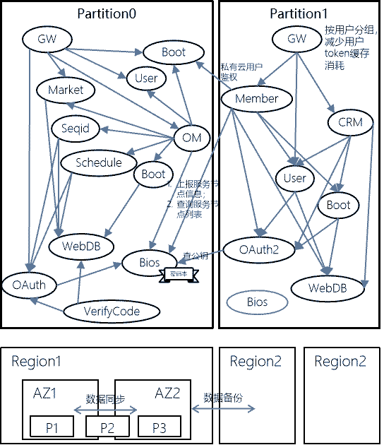
---

# 版本号定义
服务版本号定义采用Semantic原则，由三组数字组成，各组之间用“.”分隔，分别代表主版本号、次版本号、修订号，比如1.2.3。

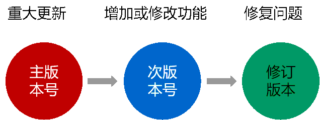

具体到至简网格，分成两种版本号，一种是至简网格平台的版本，一种是运行于至简网格中服务的版本。

任何平台的版本变化都需要重新安装平台版本；服务版本变化分成三种情况：

1. 修订版本变化，只会在交互上做调整，可以随意升级； 
2. 次版本号变化，会增加一部分功能，涉及接口或界面，甚至会出现数据库小范围调整，升级后需要重启后才能完全生效； 
3. 主版本号变化，代表着功能、数据库都出现了较大变化，需要重启服务端后才可以完成升级，此类升级有风险，所以升级前一定要做好数据备份。

---
# 简介

至简网格是一款基于HTTP协议的、完全服务化、极具弹性的通用业务服务器，用于开发基于数据库的端云结合的服务程序，服务程序可以运行在资源极其有限的设备上，比如安卓手机、树莓派等，使得服务器可以尽量前移到生产端，可以运用于边沿计算、企业信息化、办公自动化等场景。

它致力于简化开发、部署与运维工作；通过简单的配置即可实现数据库、接口开发；内置了可靠性、安全性能力，业务开发无需过多关注；具备伸缩能力，单例模式可以安装在一部老旧的安卓手机上；集群模式可以跨实例、跨机房、跨城市部署，承载巨大的访问量。

本文主要用于指导至简网格服务端程序开发，包括数据库定义、接口定义等。

至简网格[服务端](https://gitee.com/zhijian_net/MeshServer)、[服务](https://gitee.com/zhijian_net/enterprise)都已开源。
如果文档中未写明白的，可以直接参照代码获得更深入的理解。

服务器最小可以安装在一部老旧的安卓手机上，使得管理企业服务与使用普通手机应用一样简单。 只需要简单操作就可以实现企业服务的安装、启停、升级、卸载等维护工作，无需聘请专门的技术人员。

至简网格提供的业务软件都是开源的，永久免费使用，只有在使用每日备份等需要占用服务端资源的服务时，才会产生极少的费用，一般每年只需几十元。

如果您的企业有更高的要求，需要对服务进行定制，至简网格为此提供了极大的便利。 服务源码都是JSON格式的文本，即使不是程序员，也容易理解；客户端程序就是普通的页面，通过简单的自学，非常容易掌握，可以根据需要自行修改。实在掌握不了的情况下，也可以聘请低级别的程序员进行修改，因为它的难度对于了解软件开发的人来说，是极其简单的。

安全性与可靠性实现难度高，日常使用时，体现不出价值，但是一旦出现问题，却是致命的。所以，至简网格内置了安全、可靠的特性，应用开发时，不必关注底层的安全与可靠性的实现细节，这样，极大方便了服务的实现。

无论是服务端还是客户端，都竭尽全力地简化，降低开发难度与使用难度。总之，它是一套非常好用的端云结合的开发框架。

以下是至简网格“端&云”结合的总体部署框架：

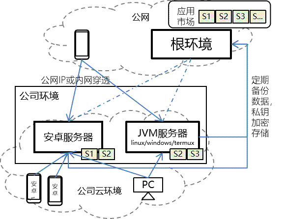

---
# 为什么要造轮子

已经有很多服务端开发框架与端侧开发框架，为什么还要重复造端&云两个轮子？

首先，没有找到合适的端云配合的框架。

其次，虽然有spring cloud这样的框架，但是它们都太大，一旦使用就会扯进一堆一堆的组件，在资源极其受限的环境下使用，会带来无穷尽的兼容性问题， 让开发无法推进下去。而至简网格不会放弃安卓、树莓派等平台的兼容性，所以只能放弃。 客户端框架有Capacitor、electron等，因为没有时间研究透彻，不敢轻易使用；又因为当前的需求并不多，所以自己动手，减少研究它们的时间消耗。

最后，除了上面那些需要重复造轮子的原因，至简网格还有哪些优势值得选择呢？

1. 小到极致

    服务端、客户端，都不超过10M，PC客户端甚至不到6M。
    极小的端侧体现不出优势，但是极小的服务侧，就便于服务器边沿部署，一部手机、一个树莓派就绰绰有余。因为小，运用场景就可以扩大。 随着通讯能力提升，边缘计算、物联网会变得普遍，至简网格可以方便地部署到各类设备上，将计算尽量下沉。

2. 大到跨市

    麻雀虽小五脏俱全，它可以部署在一部旧手机上，也可以跨城市多活部署。 底层实现是完全分布式的，只要采取合适的分片策略， 或者开启数据备份，完全可以跨机房、跨城市多活部署，不必担心单个设备、单个机房故障导致业务中断。 至简网格在底层实现时就为数据分片提供了便利。

3. 非常简单

	- A) 开发简单 

    	服务前、后端代码量很小，代码很简单。服务侧业务开发，绝大部分情况使用简单的JSON配置就能完成；端侧交互开发，只要懂vue就能胜任。
    	比如至简网格提供的CRM、会员两个服务，其中CRM较大，接口定义部分约3500行JSON配置，端侧交互约3500行js代码，总共7000左右，安装包不到100K。
    	代码即成本，代码量少，开发&维护的成本就少；开发难度低，即使是初级程序员也能开发维护。
		
		支持vibecoding上创建技能，利用AI，用自然语言就可以生成服务，降低50%的开发工作量；生成的代码，人阅读起来毫无障碍。

	- B) 维护简单	

		无需专门的运维人员，服务器一键启停，服务下载安装不过几秒钟；端侧应用更加简单，秒级安装，自动升级。

	- C) 使用简单 

		持安卓与Windows客户端，端侧安装使用极其简单；服务端一键启停，通过简单的命令行安装、升级、卸载服务。

	- D) 权限控制简单 

		支持多维度灵活的授权控制；可以控制部分用户只能在企业内网使用，部分用户可以在公网访问。

4. 可靠安全	

	安全与可靠设计融入到至简网格的方方面面，可靠与安全相关的设计实现，在至简网格随处可见，比如：

	- A) 分区隔离、公司隔离；

	- B) 传输都采用https，使用ECC256证书，安全性达到RSA3072的强度；

	- C) 每个服务实例都自动分配了独一无二的证书；

	- D) 服务间访问都需要token，两个服务器即使在同一个局域网内，默认也不能窜访；

	- E) 用户密钥经过PBKDF2加密存储，即使数据库泄露，也无法解开密码；

	- F) 数据库两份拷贝，支持每日往云端备份……


---
# 服务侧开发指导
## 服务开发概览

在至简网格中，每个服务对应一个独立的目录，目录中存放端侧界面实现，以及服务定义、数据库定义、接口定义，这些定义文件的内容都是json格式的，很容易理解。

### 服务目录结构

服务的根目录下有api、file两个子目录，以及service.cfg与database.cfg两个文件。

```
├── service.cfg         # 服务描述
├── database.cfg        # 数据库定义
├── api/                # 接口定义目录
│   ├── init.cfg        # 启动初始化时调用的接口
│   ├── root.cfg        # 接口定义文件，root.cfg中定义的接口，在访问时url不用加文件名
│   ├── user.cfg        # 用户接口定义文件，访问时url需要加user，比如/api/user/add
│   ├── power.cfg       # 用户授权接口
│   └── pub.json        # 静态定义，比如服务的角色定义
└── ui/                 # 端侧ui目录
    ├── index.html      # 应用加载的html，加载vue、quasar等库，并初始化vue、quasar
    ├── favicon.png     # 应用图标，在应用列表、首页左上角都会显示此图片
    ├── users.js        # 显示公司所有帐号，可以模糊搜索
    ├── user.js         # 显示某个帐号的详情，在此可以重置密码、修改信息、修改授权等
    ├── language.js     # 多语言标签定义
    └── authorizes.js   # 帐号按服务授权
```

1. api子目录中存放所有的接口定义文件，如果无接口定义，可以没有此目录，每个文件中可以定义多个接口；
	- A) 在调用接口时，url需要携带文件名及接口名，比如调用user.cfg中的接口add，则url为/user/add;
	- B) root.cfg是特殊的，访问其中的接口不必携带/root，直接传/xxxx即可；
	- C) json扩展名的文件存放一个Map结构，Map的每一项都是一个静态接口，其中的内容直接返回，比如roles:{...}，访问时直接调用/roles即可得到大括号中的内容；
	- D) def扩展名的文件是宏定义文件，也是Map结构，每一项都是一个process，在接口定义文件的process部分可以引用宏定义。
2. ui子目录存放所有的交互页面，属于[端侧开发](client_dev_guide.md)， 使用vue+quasar实现，起始页固定为index.html，在index.html中import所需的组件；
	- A) 端侧在安装应用时，下载的就是ui子目录的压缩包；
	- B) 建议一个组件对应一个js文件，比如home.js、customer.js等;
	- C) 如果无交互界面，可以没有此目录，如果希望服务有一个个性化logo，建议增加ui目录，并存放适合的favicon.png文件。
3. service.cfg中定义了服务的名称、依赖的服务等信息；
4. database.cfg中定义了服务的数据库表结构，treedb、searchdb无需建表，但是也需要在里面申明，如果只在本实例使用的数据库，定义在database.loc.cfg文件中，定义方法与database.cfg完全相同。

### service.cfg

service.cfg配置非常简单，格式如下：
```JSON
{
    "author":"flyinmind@zhijian.net.cn", //作者
    "company" : "zhijian.net.cn", //公司或组织名称
    "version":"0.1.0", //版本号
    "displayName":"客户关系管理系统", //对外显示的名称
    "dependencies":[
        //依赖的服务列表，如果不申明，就不能调用这个服务
        //webdb、bios、oauth等服务无需申明依赖
        //单例运行，会根据此处的定义自动添加服务依赖
        //非单例版本，需要在OM平台上设置依赖关系
        {"name":"user", "minVersion":"0.1.0", "maxVersion":"0.2.1"}
    ]
}
```

配置中没有name这样的配置，因为服务的name就是工程的目录名称。

### database.cfg

database.cfg定义了rdb的表结构，treedb、searchdb没有建表操作，但是必须在此申明。
在单例模式（比如在安卓服务器中）运行时，至简网格会自动执行database中的建库、建表操作，根据服务器已有的数据版本，执行对应版本的升级操作。
```JSON
[
    {
        "name":"crm", //库名称
        "version":"0.2.0", //版本号
        "type":"rdb", //类型，有rdb（关系型数据库）、tdb（树形数据库）、sdb（搜索数据库）
        "versions":[
            {
                //minVer与maxVer指定了最小、最大可执行版本
                //如果运行中的数据库版本不在此范围内，sqls中的sql不会执行
                "minVer":"0.0.0",
                "maxVer":"0.1.0",
                "toVer":"0.2.0", //升级后的数据库版本号
                "sqls":[
                    //建表或升级sql，一个字符串，字符串中可以换行，可以有多条sql
                    "create table if not exists orders ( -- 订单信息
                        id int not null primary key, -- seq_id
                        ...
                    )"
                ]
            },
            {
                //另一个版本的初始或升级脚本
            }
        ]
    },

    {
        "name":"crm", //searchdb的名称，与rdb同名，表示与rdb在同一个库中
        "type":"sdb"
    },

    {
        //treedb的名称，与rdb同名，表示与rdb在同一个库中
        //与rdb共库的情况，需要表名不能有dir、item，否则会造成表名冲突
        "name":"crm",
        "type":"tdb"
    }
]
```
如果数据库只用在当前实例，每个服务实例上的数据是独立的（比如地址查询，每个实例都有完整的地址信息记录），无需同步、备份，这种数据库可以用database.loc.cfg定义，定义方法与database.cfg完全相同。

### 接口定义文件

接口定义文件分成3类，扩展名分别为cfg、json、def。每个”.cfg“文件中，是一个json数组，数组中每个元素定义一个接口。访问时url有接口定义文件以及接口名称共同决定。比如，在接口文件customer.cfg中定义了create接口，则可以通过 "/customer/create" 访问。
```JSON
[
    {
        "name": "create", //接口名称
        "method":"POST", //调用的method，如果调用方使用的method错误，会返回API_NOT_FOUND错误
        "property" : "private", //public或private，private接口必须在请求头中携带服务token才可以访问，
        "tokenChecker" : "USER", //鉴权类，USER|OAUTH|OM|APP
        "comment":"创建客户，需要在电子流中审批", //描述
        "request": [...],
        "process" : [...],
        "response":[...]
    },
    ...
]
```
### 接口宏定义

".def"文件定义宏，宏定义只能是process，可以在接口的process里引用它。比如在def文件中定义一个check\_accounts宏：
```JSON
"check_accounts":{
    "name":"check_accounts",
    "comment":"检查帐号是否都存在",
    "type" : "call",
    "service": "user",
    "method":"POST",
    "url":"/user/userid",
    "tokenSign":"OAUTH",
    "parameters":"{\"accounts\":#ACCLIST#}"
}
```

这个宏可以在接口中多次引用，比如：
```JSON
"process" : [
	{"macro": "check_accounts", "#ACCLIST#":"@{JSON|to,0}"},
	...
]
```
宏可以传递参数，宏参数名称前后要加上“#”，比如上例中的"#ACCLIST#"，这些宏参数最终都转成了字符串替换到宏定义中。

---
## 接口定义<a id="interfacedef"></a>

绝大部分服务都需要服务端接口配合客户端实现端云交互，接口定义的文件都在服务根目录的api子目录下，扩展名有cfg、def、json三种，每种文件记录的都是json格式的接口配置。def文件是宏定义，配合cfg完成接口定义，json文件中记录返回静态内容的接口，本章只讲解cfg文件中的接口定义。

### 总体格式

服务端开发主要是接口定义，每个接口定义分成5个部分， 基本信息（名称、请求方法、属性、token检查方法、接入检查方法等）、变量定义vars、请求参数request、处理逻辑process、响应体response。总体结构如下：
```JSON
{
    "name":"api名称",
    "method":"可接受的请求方法，不设置表示不限,POST|GET|PUT|DELETE",
    "property":"属性，private或public",
    "tokenChecker": "认证方式，property有public时不必设置，[USER,UNIUSER,OAUTH,COMPANY,INIT,MNT,APP,APP-调用方服务名或/*](#serviceauth)",
    "aclChecker": "接入检查，只支持RBAC(Role Based Access Control)或者自定义实现",
    "sameAs":"如果接口的request、vars、process、response与某个其他的接口完全一致，则可以增加此配置，指定为那个接口的路径，比如与stats.cfg中的report接口相同，则可以写成/stats/report，此时request、vars、process、response不必配置",
    "feature": "特性，与RBAC配合，用于更加细致的控制[角色授权](#鉴权)",
    "comment":"描述，用于生成接口描述，可不提供",

    "vars":[
        [变量列表，可以有多个](#vars)，每一个都是json对象
    ],

    "request":[
        [请求参数列表，可以有多个，支持嵌套复杂结构](#请求request)
    ],

    "process":[
        [处理逻辑，可以有多个](#处理process)，也可以应用宏定义
    ],

    "response":[
        [响应结果，可以有多个，支持嵌套复杂结构](#响应response)
    ]
}
```
多个接口定义可以放在同一个接口定义文件中，扩展名必须是“.cfg”。以json数组方式存储，每个接口定义是数组中的一个元素，比如:[api1DefineJson, api2DefineJson,...]

### 请求request

请求参数是一个json数组，每个元素是一个请求参数定义，可以指定参数名称、类型、取值范围等信息，比如：
```JSON
"request": [
    {"name":"name","type":"string","must":true,"regular":"^[a-z0-9]{1,30}$"},
    {"name":"val","type":"int","must":true,"max":0,"min":10}
]
```

参数与变量可以看作是一类，在脚本中都使用@{paraName}引用。

#### 参数定义

根据参数类型，每类参数的配置项有所不同，下表列出了所有的配置项，前面是所有参数共有的配置项，后面根据参数类型列出了特有的配置项。

| 配置项 | 定义 | 类型 | 备注 |
| --- | --- | --- | --- |
| name | 参数名称 | String | 同一个接口的参数列表中，必须唯一 |
| type | 参数类型，不区分大小写 | String | STRING、INT、LONG、FLOAT、BOOL、DATE、DOUBLE、OBJECT、BYTES、NOW、UUID、SEQUENCE、CONFIG、JSON。 <br>几个特殊类型： <br>Config：从bios的服务配置项中获取内容； <br>Json：json串，作为响应参数时会被转成json对象，作为输入参数时，被转为json字符串 |
| must | 是否为必须参数 | Bool | 如果为true，当请求未携带此参数时，校验失败 |
| max | Number型：最大值； String型：最大长度 | 与type指定的类型一致 | 数值型的情况，默认为该类型能够表达的最大值，比如type为int时，默认为Integer.MAX\_VALUE。 long、double、float以此类推。 String类型默认为255 |
| min | Number型：最小值； String型：最小长度 | 与type指定的类型一致 | 数值型的情况，默认为该类型能够表达的最大值，比如type为int时，默认为Integer.MIN\_VALUE。 long、double、float以此类推。 String类型默认为0 |
| list | 是否为list | Bool | list中每个元素类型都由此参数的type指定； 在Json类型参数中，list指定json是否为一个数组，true时为数组，否则为map |
| maxSize | list中最多的元素个数 | Int | list为true时，才有意义，默认为10240 |
| minSize | list中最少的元素个数 | Int | list为true时，才有意义，默认为0 |
| default | 参数默认值 | 与type指定的参数类型一致 | 当不是必须参数时，可以设置默认值，当参数没有传递时，则参数使用此值。 <br>数值型、String、Bool：填写对应类型的值； <br>Datetime：日期，格式由format指定； <br>Bytes：base64字符串，用keytool生成； <br>Json：一个json字符串； |
| const | 是否为常量参数 | Bool | 常量参数，无需在请求时传递， 必须指定default值，接口定义中可以像普通参数一样使用 |
| dataSeg | 响应体中的字段名 | String | 默认就是name属性指定的名称。当响应体是一个复杂的结构时，可以在dataSeg中指定分级，每级用“.”分隔 |
| options | 可选值列表 | List | 对String、Int类型有效，如果请求参数不在可选列表中，则参数校验失败 |
| log | 是否可以打印在日志中 | Bool | 默认为true，表示可以打印到日志中 |
| | | | **Object特有的配置项** |
| props | 嵌套定义复杂的结构 | List | 每一项是一个基本参数配置，用于指定object中的字段。props里面的字段还可以设为object类型，以此实现复杂的结构嵌套。 {"name":"infos", "type":"object", "must":true, "props":[{"name":"name", "type":"string"}, {"name":"val", "type":"string"}]} |
| checkAll | 是否检查每个字段 | Bool | 默认为true，检查props中定义的每个字段合法性。 如果是响应内容，checkAll为false时，无论object有什么冗余内容，都会原样放过。 |
| | | | **数值、日期类型特有的配置项** |
| biggerThan | 必须大于的参数的名称 | String | 指定必须大于的参数的名称，long、int、float、double、date中有效 |
| smallerThan | 必须小于的参数的名称 | String | 指定必须小于的参数的名称，long、int、float、double、date中有效 |
| | | | **String特有的配置项** |
| len | 字符串长度 | Int | 本质是将min、max设置成相同的值 |
| maps | 映射关系 | Map | 将一个值映射成其他值，通常用于多版本的兼容中 |
| regular | 字符串合法性正则检查 | String | 正则判断是比较耗时的操作，尽量使用其他检查项替代 |
| tail | 末尾添加的内容 | String | 在字符串的末尾额外添加的内容 |
| trim | 是否去除首尾空格 | Bool | 默认为false |
| codeMode | 编码模式 | String | 需要指定keyName，keyName在OM中配置 encode:加密数据 decode：解密数据 |
| keyName | 加密密钥名称 | String | keystore中密码的名称，密钥第一次使用时会在keystore服务中自动创建 |
| | | | **Password特有配置项（继承了所有String参数的配置项）**|
| rule | 密码强度检查 | String | 以逗号分隔成四个部分，从后向前，可以省略一部分，它们分别为： <br>minLen:最短长度，默认为4 <br>charTypeNum:字符类型数量（大写字母、小写字母、数字、英文标点、其他），默认为3 <br>differentCharNum:不同字符数量，默认为4 <br>accountPara:账号字段名称，用于判断密码是否与账号类似，默认为null，表示不判断 |
| equalsTo | 需要等于的字段 | String | 用在确认密码中，判断本参数必须要等于另外一个参数 |
| | | | **IP特有配置（继承了所有String参数的配置项）** |
| format | 检查字符串是否为合法的IP地址 | String |V4:是否为IPv4地址 <br>V6:是否为IPv6地址 <br>PORT:是否携带了端口号 <br>LAN:是否为内网地址 <br>WAN:是否为外网地址 <br>LIST:以逗号分隔的多个地址 |
| | | | **Sequence特有配置** |
| len | 序列值字节数 | Int | 只可以为4或8，为4时返回Int类型，为8时返回Long类型 |
| | | | **Config特有配置** |
| item | 配置项名称 | String | 在服务设置中配置项的名称 |
| | | | **Datetime、Now特有配置** |
| format | 日期格式 | String | 指定日期输出格式，作为输入参数时，只接受UTC时间戳 |
| | | | **UUID特有配置** |
| base64 | 是否为base64格式 | Bool | 如果为true，则按base64输出，否则按hex输出 |

#### 变量

组合一个或多个参数，经过复杂计算后，得到一个新的变量，得到的结果可以在脚本中像普通请求参数一样引用，多次引用并不会导致多次计算。

1. val：配置中可以使用内置[占位符](#placeholder)；
2. toResp：默认为false，如果设为true，生成的变量会插入到响应的data中。
```JSON
"vars":[
    {"name":"flowid", "val":"@{SEQUENCE|'flow',i}", "toResp":true, "comment":"流程id"},
    {"name":"curDay", "val":"@{NOW|unit86400000}", "comment":"距UTC第一天的天数"}
]
```

### 处理process

一个接口中，可以包括多个处理，常用的处理类型有 js、java、rdb、treedb、search、localrdb、localtreedb、localsearch、call、static、dataexists。

也可以自定义类型，实现IProcessor接口，或继承已有的实现类，再通过AbstractProcessor.register注册到至简网格中； 配置接口时，将处理的type设置成注册的名称后，就可以使用。 或者不注册，直接将handler设置成对应的类即可。 相应的class文件要打包成jar，放在服务根目录下的libs文件夹中，这属于 [高阶开发](#advancedev)，在此不赘述。

除static处理外，其他处理类型都有四个共同配置：
| 属性    |  说明   |
|--------|---------|
| cache  |是否缓存历史结果，只能指定一个占位符，比如@{HASH\|cid,service}，此内容作为缓存的key值，读取缓存时，也用相同的key，缓存有效期默认为10分钟|
| ignores|可以忽略的错误码列表，如果发生的错误码在这个列表中，就忽略它，返回OK，否则结束当前处理以及后继的其他处理，返回错误码；[-1]表示忽略所有错误码|
| when   |一个逻辑表达式，确定当前process是否执行，如果返回false则直接跳过当前process<br>只能使用请求参数、变量、请求头或上一步的响应参数作为判断条件|
| convert|将start-end（包括start、end）范围内的错误码全部转换成"to"指定的错误码，info指定错误信息<br>如果“to”为OK，则可以设置data，data必须为一个json字符串，可以使用占位符<br>如果start与end相同，可以简化成code|
| onSuccess | 如果process处理OK，则执行onSuccess补充逻辑，有两种方式补充方式：<br>1）直接返回一个json对象字符串，json对象中的成员会直接添加到响应体的data中；<br>2）设置condition(一个或多个@{CONDITION})、errorCode、errorInfo，如果condition为真，则当前处理最终返回OK，如果为假则返回errorCode及errorInfo，处理失败，并终止后继的处理，见下面的例子 |


onSuccess较为复杂，举几个例子来更清楚的说明它的用法。<a id="onsuccess"></a>

**直接返回json字符串**

在后继的处理中可以用@{!publicKey}引用。
```JSON
{
    "name" : "authInfo",
    "type" : "biosmeta",
    "actions": [
        {"action":"get", "key":"/service/@{service}/key"},
        {"action":"get", "key":"/service/@{service}/dbs/@{callee}/type", "as":"features"}
    ],
    "onSuccess":"{
        \"publicKey\":\"@{ECKEYPAIR|public,!key}\"
    }"
}
```

**用condition判断是否结束处理**

condition中可以有一个或多个@{CONDITION}判断。
```JSON
{
    "name":"save_up_msg",
    "type":"rdb",
    "db":"device",
    "sqls":[
        ...
    ],
    "onSuccess":{
        "condition":"@{CONDITION|!total,'i.>',0} && @{CONDITION|!msg_num,'i.>',0}",
        "errorCode":"NOT_EXISTS",
        "errorInfo":"device not exsits"
    }
}
```

**使用@{SWITCH}根据不同的情况返回不同的JSON内容**

解析时，如果发现有code字段，则解析为响应结果，否则解析为普通的data。所以，这种方式是不能返回带有code字段的data的。
```JSON
{
    "name" : "query_customer_data",
    "type" : "rdb",
    "db": "crm",

    "sqls" : [{
        "multi":false,
        "merge":true,
        "metas" : "each",
        "sql":"select name cname,flSta 'status' from customers where id=@{customer}"
    }],
    "onSuccess" : "
        @{SWITCH|!cname,'s.==','', `{\"code\":\"NOT_EXISTS\",\"info\":\"customer not exist\"}`,
        |,!status,'i.!=',100, `{\"code\":\"DATA_WRONG\",\"info\":\"customer not approved\"}`,
        |,`{\"code\":\"OK\",\"info\":\"Success\"}`}
    "
}
```

处理的配置中用type指定处理的类型，现在支持的类型有以下几种，分别一一介绍。

#### RDB

RDB是使用最多的处理类型，调用webdb/api/rdb/request实现数据库读写。

拼接sql是至简网格不得不采用的方法，在做sql占位符替换时，内部会将单引号变成两个单引号；数值型参数在定义时必须明确指定类型，参数检查时会校验类型，不能用字符串参数替代。

```JSON
{
    "name" : "sys",
    "type" : "rdb",
    "db":"companydb",
    "sharding":"@{cid}",
    "sqls" : ["replace into config(cid,service,k,v) values(@{cid}, '@{service}', '@{k}', '@{v}')"]
}
```
| 属性     | 说明  |
| ------- | ---  |
| db      |指定需要操作的数据库 |
| sharding|指定分片计算方法，可以引用请求参数、变量、请求头或者上一步的返回结果， 也可以使用token中的数据或请求头中的数据，但是最终结果要转换为一个无符号整型数，更多详情在 [数据分片](#数据分片)中|
| sqls    |可以只有一个sql，也可以有多个；<br>A) 多个sql是顺序执行的；<br>B) 下一个sql可以使用上一个sql的查询结果，通过[占位符](#placeholder)@\[!xxx\]引用(注意是中括号不是大括号)；<br>C) 每个sql的配置可以是一个字符串，也可以是一个map，通常增删改操作可以写成一个字符串，查询操作写成map，因为需要对返回结果进行定义；<br>D) 多个写sql是放在一个事务中执行的，如果一个发生了错误，则所有操作都会回滚|
| any     |多个sql的情况，如果any为true，则，任意一个执行成功就返回结果，否则将所有sql的执行结果都汇总后再返回|

##### 普通SQL

SQL操作是最常见的接口操作。增删改比较简单，只有成功失败的返回；而查询SQL，因为要设置结果集的返回格式，所以每个sql还有name、multi、metas、merge配置。

```JSON
{
    "name":"vips",
    "multi":true,
    "metas":"each",
    "sql":"select id,name,mobile,update_time from vips order by update_time desc LIMIT @{num} OFFSET @{offset}",
    "comment":"返回字段与search保持一致"
}
```

| 属性  | 说明 |
| ---  | ---  |
|name  |执行结果的名称，在merge为true时，无意义，只用于日志中打印|
|multi |返回结果是否为多行|
|metas |返回结果中每一行是否携带字段名信息<br>each：返回的每行记录中，每个字段都带有列名，如，{mobile:189…}<br>none：  每行记录都是一个数组，如，返回[1,"hello",4]，这样可以减少响应体大小<br>oneCol：如果结果集有多行，且只有一列，可以指定oneCol，返回一个数组， 如，ids:[1,2,3,4...]，这样可以减少响应内容<br>列信息字段名：数据记录按数组返回，但是在最后添加一行各列的列名，如，cols:["name","age",...]，这里的cols就是用metas指定的， 解析时可以利用它，既可以减少返回内容的体积，又可以方便标识每一列|
|merge |是否将结果直接存在HandleResult.data中，当multi为false时才有效<br>false：响应形如data.'name'.mobile:189…，其中的name就是sql配置中的列名称<br>true：响应形如data.mobile:189…，省去了中间一层|
|expected|如果是增删改操作，用expected指定期望的受影响行数，如果真实情况不是如此，就返回指定的返回码及错误信息，比如<br>"expected":{"num":1,"errorCode":"NO_RIGHT","errorInfo":"order is completed"}|

【注意】

1. update_time字段是系统在建表语句中插入的字段，用于辅助数据复制，查询时可以使用；
2. 简单增删改，系统自动添加update\_time及对应的当前时间戳；
3. 复杂sql，比如批量插入，系统需要将它们变成多行简单的sql，并逐行添加update\_time；
4. 增删改操作会返回操作受影响的行数，响应中的字段名为“操作名称+_result”。

##### 带JS的SQL

如果SQL比较复杂，需要一些简单的逻辑来拼装，则可以用“js:”开头，后面跟一段复杂的js脚本生成SQL，比如实现一个批量插入数据的处理：
```Javascript
js:var sqls=['insert into tb(a,b,c,d) values']
var vv=@{signers};
for(var i in vv){
    if(i>0)sqls.push(',');
    sqls.push("(@{a},'@{b}',");
    sqls.push(DB.clearInjection(vv[i])); //字符串参数最好先清除sql注入
    sqls.push(",@{ABSHASH|c,d})")
}
DB.sql(sqls.join(''));
```

使用js拼装sql时，所有占位符都可以用，也可以使用服务端内置的js函数（请参考4.3.5）。
js中占位符解析时会将字符串中的单引号“'”变为两个单引号“''”。

在用js拼接时，要注意sql注入问题，对于字符串参数调用DB.clearInjection处理一下，并调用DB.sql将sql传递给数据库。该函数中对sql做了严格的注入检查，sql中非字符串部分不得出现“--、/*、//”等注释开始标识，“or、||、union”不容许出现在单引号后。如此判断可能会导致误判，所以使用时注意避免。

##### 带RS的SQL

运行时通过占位符拼接出来的sql，加载配置时还无法知道sql类型，需要以"rs:"(runtime script)开头。
通常用来拼接一个批量执行的sql，常用@{FOR}、@{SWITCH}等占位符，比如：

```Javascript
rs:@{FOR|services, `;`, `update srvstatus set srvstatus='N',ver='`, e.ver,
`' where partId=@{partId} and service='`, e.name, `' and addr='@{addr}'`}
```
假设servies为
```JSON
[
    {ver:"1.0",name:"test1"},{ver:"1.1",name:"test2"}
]
```

运行后会将请求参数services中所有元素拼接成多个update操作，每个update操作之间用“;”分隔。其中的e.ver就是指请求services参数每个元素中的ver字段。
rs中的占位符，包括循环占位符(e.开头)，在运行替换时都会将单引号替换成两个单引号。

```SQL
update srvstatus set srvstatus='N',ver='1.0' where partId=250000 and service='test1' and addr='1.1.1.1';
update srvstatus set srvstatus='N',ver='1.1' where partId=250000 and service='test2' and addr='1.1.1.1'
```

rs效率远高于js，所以，如果逻辑不复杂，尽量不用js，或使用rs替代js，比如上面的js例子可以改成：
```SQL
insert into tb(a,b,c,d) values @{FOR|signers,`,`, `(@{a},'@{b}',`, e, `@{ABSHASH|c,d})`}
```
上面例子中因为insert开头，至简网格指定sql类型，所以并不以rs开头；另外，在循环@{ABSHASH|c,d}是不推荐的，建议增加一个var处理，定义一个变量存放计算后的结果，再传入@{FOR}中，避免多次计算hash值。
```JSON
{
    "name":"calculate_abshash",
    "type":"var",
    "vars":[
        {"name":"cdHashVal", "val":"@{ABSHASH|c,d}"}
    ]
}
```

然后将上例改写为：
```SQL
insert into tb(a,b,c,d) values @{FOR|signers,`,`, `(@{a},'@{b}',`, e, `@{cdHashVal})`}
```

#### dataexists

执行查询sql，根据sql执行的返回计数，判断数据是否存在。

```JSON
{
    "name": "judge_not_used",
    "type": "dataexists",
    "expect": false, //如果存在，20001
    "errorCode": "20001",
    "errorInfo":"used by products",
    "sql":"select * from products where supplier=@{id}"
}
```

| 属性       | 说明 |
| ---       | --- | 
| expect    | true:返回计数大于0时，返回OK，否则默认返回NOT_EXISTS<br>false:返回计数等于0时，返回OK，否则默认返回EXISTS |
| errorCode | 未设置，则默认为NOT_EXISTS/EXISTS |
| errorInfo | 发生错误时的响应信息 |
| numSeg    | 返回计数的字段名，比如“select count(*) productNum from products where supplier=@{id}”，numSeg为productNum<br>如果使用select *方式，内部处理时将sql变为"select (select *...) as exists_or_not"，此时的numSeg为exists_or_not，如上例，numSeg不用配置 |


#### TreeRDB

TreeDB是记录树状关系数据的数据库，比如：
```
/
└── service
    ├── crm
    │   ├── key
    │   ├── configs
    │   └── dbs
    │       └── crm
    │           ├── type
    │           └── tabledef
    └── user
        ├── key
...
```

```JSON
{
    "name" : "createDb",
    "type" : "biosmeta",
    "actions" : [
        {"action":"crtDir", "key":"/service/crm/dbs"},
        {"action":"crtDir", "key":"/service/crm/dbs/crm"},
        {"action":"put", "key":"/service/@{service}/dbs/crm/tabledef", "value":""},
        {"action":"put", "key":"/service/@{service}/dbs/crm/type", "value":"@{type}"},
        {"action":"get", "key":"/service/@{service}/dbs/crm/type"}
    ]
}
```
1. action是区分大小写的；
2. 所有的action都有key选项，key唯一指定一个记录；
3. value用于存储key对应的值，如果是一个dir，不必指定value；
4. 一个dir下可以有多条K-V键值对。

| action | 作用 | 备注 |
| --- | --- | --- |
| crtDir | 创建dir | 创建key之前，必须创建对应的父目录，然后在其下面才可以创建多个K-V键值对 |
| rmvDir | 删除dir | 删除dir之前，必须保证dir没有K-V |
| put | 新增或更新键值对 | 必须保证父dir都存在 |
| putIfAbsent | 不存在则添加 | 如果键值对不存在则创建，否则放弃操作，返回2000错误码 |
| putList | 插入数组 | 把value当作一个数组，在其中添加元素；  如果key不存在，则创建它，如果存在，且value不在数组中，则添加 |
| putMap | 插入对象 | 把value当作一个Map；  如果key不存在，则创建它，并将value转为json存入；  如果存在，覆盖它;  传入的value是一个Map |
| puts | 在目录插入多对K-V | 在有key指定的目录下插入多对K-V，value参数是一个Map对象，指定多对K-V |
| get | 获得键值对 | 获得有key指定的value，value以字符串形式返回；返回值的名称可以有as指定，不指定则默认为key参数的最后一段 |
| gets | 获得一个目录下的所有键值对 | 键值对以Map数组返回，每个元素中有key、val、ut；返回值的名称可以有as指定，不指定则默认为key参数的最后一段 |
| getSubs | 列举所有子目录 | 返回由key指定目录下的所有子目录，不包括K-V；返回值的名称可以由as指定，不指定则默认为key参数的最后一段 |
| getSubsAndItems | 列举所有子目录及其拥有的键值对 | 返回由key指定目录下的所有子目录，及它们下面的K-V；每行包括name,key,val三个字段；返回值的名称可以有as指定，不指定则默认为key参数的最后一段。  比如/service/config/dbs下的所有子目录，及各子目录下的所有K-V项 |
| names | 列举目录下所有key | 返回目录所有key的列表；返回值的名称可以有as指定，不指定则默认为key参数的最后一段 |
| getMap | 从Map中取一个字段 | 从Map形式返回，如果未用value指定字段名，则返回整个Map，指定了则只返回字段名指定的值；返回值的名称可以有as指定，不指定则默认为key参数的最后一段 |
| getsMap | 返回目录下所有K-V-UT | 返回由key指定目录下的所有K-V，以及UT更新时间；返回值的名称可以有as指定，不指定则默认为key参数的最后一段 |
| getId | 获得目录id | 返回目录id |
| list | 列举所有子目录 | 返回由key指定目录下的所有子目录，返回内容包括id、name、ut；返回值的名称可以有as指定，不指定则默认为key参数的最后一段 |
| rmv | 删除key |  |
| rmvFromMap | 删除value中的一个key | 把value当作map，删除Map中由value参数指定的key |
| rmvFromList | 删除value中一个元素 | 把value当作list，删除List中由value参数指定的元素 |
| rmvs | 删除目录下全部K-V | 删除由key指定的目录下的所有K-V |

#### Search

SearchDB是逆向索引的数据库，用于分词查找。action有put、update、get、rmv。 db指定搜索的库名称，table指定虚拟表名（并不存在实体的表），did指定内容对应的数据唯一标识。

##### put

添加搜索内容，title指定标题，summary指定摘要内容，content指定具体内容；
```JSON
{
    "name" : "createSearch",
    "type" : "search",
    "db": "crm",
    "action" : "put",
    "table":"customer",
    "did" : "@{custId}",
    "title" : "@{name}",
    "summary" : "@{address}",
    "content" : "@{CLEAN|comment} @{business} @{taxid}"
}
```
title、summary、content并无本质区别，只是对照一篇文章的结构逻辑上分成标题、摘要、内容三部分。 每个部分在入库时都会经过分词处理，变成一个一个独立的词语存入库中，也可以在输入时就人为加空格，以提供分词的准去率。

##### update

更新搜索内容，如果数据不存在，则，功能类似put，如果数据已存在，则可以更新title、summary、content，如果某项未传，则此项不更新

##### rmv

删除内容，只需传did参数；

##### get

搜索，get后面可以增加传回的最大结果集行数，content指定要搜索的内容，可以用空格分隔成多个词。
```JSON
{
    "name" : "docs",
    "type" : "search",
    "db": "user",
    "table":"user",
    "action" : "get @{limit}",
    "content" : "@{s}"
}
```

content即为要查找的内容，查找前会经过分词处理，也可以人为在词之间添加空格，以提升分词的准确率。
查询结果是匹配数据id数组，在响应体中的名称与处理的name属性一致，比如上例中为docs。

##### 应用举例
比如，要实现记录客户信息，同时可以模糊搜索到客户信息，就需要先在database.cfg中创建一个全文搜索库：
```JSON
{
    "name":"crm",
    "type":"sdb" //在同一个db上建立搜索db
}
```

在创建记录时，同时将需要搜索的字段存入搜索库中：

```JSON
{
    "name": "create",
    "method":"POST",
    "property" : "private",
    "tokenChecker" : "USER",
    "comment":"创建客户",

    "request": [
        {"name":"name", "type":"string", "must":true, "min":1, "max":30, "comment":"客户名称"},
        {"name":"address", "type":"string", "must":true, "min":1, "max":100, "comment":"客户地址"},
        {"name":"business", "type":"string", "must":true, "min":1, "max":100, "comment":"主营业务"},
        {"name":"comment", "type":"string", "must":false, "default":"", "comment":"扩展信息，可自定义"}
    ],

    "process" : [
        {
            "name":"judge_if_customer_exists",
            "type":"dataexists",
            "db":"crm",
            "expect" : false, //如果存在则返回EXISTS，否则返回OK
            "sql":"select * from customers where taxid='@{taxid}'"
        },
        {
            "name":"get_customer_id",
            "type" : "var",
            "vars":[
                {"name":"custId", "val":"@{SEQUENCE|i,'customer'}"}
            ]
        },
        {
            "name" : "add_customer",
            "type" : "rdb",
            "db": "crm",
            "comment":"添加客户，并设置权限控制",
            "sqls" : [
                "insert into customers(id,name,taxid,address,business,createAt,cmt)
				values(@{custId},'@{name}','@{taxid}','@{address}','@{business}',@{NOW|unit60000},'@{comment}')"
            ]
        },
        {
            "name" : "createSearch", //创建搜索
            "type" : "search",
            "db": "crm",
            "action" : "put",
            "table":"customer", //不是真实的表，查询时必须使用相同的表名
            "did" : "@{custId}",
            "title" : "@{name}",
            "summary" : "@{address}",
            "content" : "@{CLEAN|comment} @{business} @{taxid}"
        }
    ],
    "response":[]
}
```

搜索时，先模糊搜索找到符合条件的客户ID列表，再用这个列表从数据表中查询客户信息：

```JSON
{
    "name": "search",
    "method":"GET",
    "property" : "private",
    "tokenChecker" : "USER",
    "comment":"查询客户信息",
                
    "request": [
        {"name":"s", "type":"str", "must":true, "min":1, "comment":"模糊搜索内容"},
        {"name":"limit", "type":"int", "must":true, "min":1}
    ],

    "process" : [
        {
            "name" : "docs",
            "type" : "search",
            "db" : "crm",
            "action" : "get @{limit}",
            "table" : "customer",
            "content" : "@{s}"
        },
        
        {
            "name":"customers",
            "type":"rdb",
            "db":"crm",
            "sqls":[{
                "name":"customers",
                "multi":true,
                "metas" : "cols",
                "sql":"select id,name,address,createAt
                 from customers where id in(@{LIST|!docs})"
            }]
        }
    ],
    
    "response": {
        "check":false,
        "segments":[
            {"name":"customers", "type":"object", "list":true, "props":[
                {"name":"id", "type":"string", "comment":"客户id，因为js中long有精度损失，所以用string"},
                {"name":"name", "type":"string", "comment":"名称"},
                {"name":"address", "type":"string", "comment":"地址"},
                {"name":"createAt", "type":"int", "comment":"创建时间"},
                {"name":"status", "type":"int", "comment":"状态，100表示已最后确认"}
            ]}
        ]
    }
}
```

#### LocalxxxDB

每种db都对应有本地版本，localrdb、localtreedb、localsearch。

本地版的各类数据处理的数据，只在服务实例本地可用，数据不会在不同实例间复制，没有两份拷贝，也不会往云端备份。比如地址库，包括了localrdb、localsearch，它只能在一个服务实例中使用。如果服务需要多实例运行，每个实例上的数据库不能有更新操作，否则不同实例上的数据会不一致，导致请求分发到不同会得到不同的结果。

#### js

如果基本的数据库操作无法满足处理逻辑，可以使用js进行开发。脚本中可以使用参数、变量，通过@{xxx}引用，前面processor返回的结果可以通过@{!xxx}引用。
```JSON
{
    "name" : "judgeExists",
    "type" : "js",
    "script" : "
        if(@{!vipNum}>0) {
            Mesh.error(RetCode.EXISTS,'vip already exists');
        } else {
            Mesh.success({});
        }
    "
}
```

##### JS内置函数

除了js基本功能外，系统提供了Mesh、DB、Logger、String、Secure扩展接口，以便于使用js实现更复杂的功能，以Secure类接口最为突出。
除了用在script中，在RDB的"js:"开头的sql中也可以使用，比如拼接sql时有字符串参数，建议使用clearInjection处理一下再拼接。

| 函数 | 备注 |
| --- | --- |
| **Mesh类中的函数** ||
| success(jsonData) | 返回成功的HandleResult，jsonData是返回数据，可以为"{}"，表示无数据 |
| error(errCode, info) | 返回失败的HandleResult，errCode在[RetCode](#返回码)中定义 |
| **DB类** | |
| sql(sql) | 对sql进行检查或做出改变，正常则返回修改后的sql，否则返回FORBIDDEN错误码 |
| sqlError(code, info) | 在js中做sql处理时，如果发生错误，调用它返回错误信息 |
| clearInjection(val) | 在js中拼接sql是危险的操作，使用此函数对字符串参数进行处理，避免sql注入 |
| **Logger类** | | |
| debug(s) | 输出debug级别的日志 |
| info(s) | 输出info级别的日志 |
| warn(s) | 输出warn级别的日志 |
| error(s) | 输出error级别的日志 |
| **String类** | | |
| uuid() | 产生uuid字符串，使用base64编码 |
| replaceChars(str, ch, replaceWith) | 在str中寻找ch，并替换成replaceWith |
| chkCreditCode(s) | 判断是否为合法的统一信用码 |
| base64CharCode(c) | 返回一个字符的base64编码，c必须是“a-z,A-Z,0-9,\_,-”中的一个 |
| isLanIP(v) | 判断是否为局域网IP，支持IPv4与IPv6判断 |
| isIPv4(v) | 是否为一个合法的IPv4地址 |
| isIPv6(v) | 是否为一个合法的IPv6地址 |
| **Secure类** | | |
| pbkdf2(pwd, iterCount) | 使用pbkdf2算法，将pwd迭代iterCount次 |
| pbkdf2Check(pwd, savedPwd) | 检查输入的pwd与savedPwd是否一致，savedPwd由pbkdf2函数生成 |
| hash(s) | 计算多int型hash值 |
| longHash(s) | 计算字符串long型hash code |
| absHash(s) | 与longHash类似，但是返回的是大于0的hash code |
| intHash(s) | 将几个字符串连在一起，计算int型hash code |
| cbcEncrypt(plain, key) | 使用AES-CBC算法加密，plain为明文，key为密钥，keyLen可以选择16/24/32。IV为随机产生，并记录在密文的前面16字节中。 |
| cbcDecrypt(cipher, key, kenLen) | 使用AES-CBC算法解密，cipher为密文，其中包括了随机IV |
| gcmEncrypt(plain, key) | 使用AES-GCM算法加密，plain为明文，key为密钥，keyLen可以选择16/24/32。IV为随机产生，并记录在密文的前面16字节中。 |
| gcmDecrypt(cipher, key) | 使用AES-GCM算法解密，cipher为密文，其中包括了随机IV |
| md5(str) | 使用MD5算法对str进行不可逆运算 |
| sha1(str) | 使用SHA1算法对str进行不可逆运算 |
| sha256(s) | 使用SHA256算法对s1,s2,s3…进行不可逆运算，在它们之间会增加分隔符“-” |
| random(fmt) | fmt指定要生成的随机数格式，支持int(i)、long(l)、float(f)、double(d)、string(s)，类型后面可以用"."分隔，指定最大值；对于字符串类型指定的是最大长度，后面还可以再加一个"."，指定用什么进制(16/32/64)，比如's.16.32'，表示返回16位32进制的随机字符串 |
| hmacSHA256(str) | 使用SHA256算法对str进行不可逆运算。随机生成16字节key，并记录在结果的前面 |
| hmacSHA256Check(str, saved) | 验证str与saved内容是否一致，saved是hmacSHA256算法生成的 |
| hmacSHA1(str, key) | 使用HMAC-SHA1算法对str进行不可逆运算，key可以是一个随机字符串 |
| isPwdStrong(acc, pwd, min, max, charTypeNum, diffCharNum) | 判断密码强度是否足够。 <br>acc：帐号<br>pwd：密码<br>min：最小长度 <br>charTypeNum：不同字符的数量<br>diffCharNum：不同类型字符数量，0-9\|a-z\|A-Z\|其他，共四类，所以diffCharNum最大为4，最小为1 |
| keyPair(pwd) | ecc算法，产生密钥对，并用pwd加密后返回 |
| privateKey(kp,pwd) | ecc算法，先用pwd解密kp，然后取出密钥对中的私钥 |
| publicKey(keyPair) | 从密钥对中取出公钥 |
| eccEncrypt(plain, publicKey) | Ecc算法，用公钥publicKey加密plain内容 |
| eccDecrypt(cipher,privateKey) | Ecc算法，用私钥privateKey解密cipher内容 |
| keyPairEncrypt(kp,plain) | ecc算法，用密钥对加密plain |
| keyPairDecrypt(kp,pwd,cipher) | 算法，用pwd解密密钥对，并用该密钥对解密cipher |
| changeKeyPairPwd(kp, oldPwd, newPwd) | ecc算法，用原密码oldPwd解密密钥对，然后用新密码加密密钥对后返回 |

##### 循环中的占位符

因为占位符是在执行script之前已解析、替换完毕，所以如果在js循环中使用，循环中的占位符并不会被多次执行，比如：
```Javascript
//items=[{product:1,subTotal:100},{product:2,subTotal:10}]
var sql=['insert into sales_items(id,product,subTotal) values'];
for(var i in items) {
    var item=items[i];
    if(i>0)sql.push(',');
    sql.push(`(@{SEQUENCE|'sales_item'},`, item.product, `,`, item.subTotal, `)`);
}
DB.sql(sql.join(''));
```

最终生成的两行插入记录不会如期望的那样有不同的id，而会是这样的：

```SQL
insert into sales_items(id,product,subTotal) values(1,1,100),(1,2,10)
```

@{RANDOM}、@{UUID}、@{UNIQUEID}等占位符有相同问题，不会在循环中被多次执行，因为在执行js之前已被替换成具体内容了。
与占位符不同，js内置函数Secure.random与String.uuid是可以在循环中被多次执行产生不同内容。

#### call

用于在一个接口中，调用其他服务接口或本服务的其他接口，可以并发几个调用。call只能调用同一个分区或公共分区中的服务。

| 属性     |  说明   |
| ---      | ---    |
|service   |指定需要调用的服务|
|url       |指定url，其中不必包括“/api”|
|method    |指定调用的方法，只支持POST/GET/PUT/DELETE四种|
|parameters|指定请求参数，可以引用参数或上一步的返回结果，比如GET方法，写成a=1&b=2…；POST方法，只能用json格式，比如：{a:1,b:"x"…}<br>此json串可以直接写出，也可以放在字符串中，比如："{a:1,b:\"x\"…}"|
|tokenSign |表示使用的token类型，可以选择OMKEY、OAUTH、APPKEY三种|
|trans     |表示请求是否将参数全部传递给被调服务|

```JSON
{
    "name" : "addAcl",
    "type" : "call",
    "service":"bios",
    "method":"POST",
    "url":"/acl/set",
    "tokenSign":"OM",
    "trans":true
}
```
如果一个处理中需要发起多个请求，可以在calls中指定多个调用。此时，如果any设为true（默认为false），则只要一个请求成功，则最终结果为成功，其他请求的响应都丢弃；如果为false，则只要有一个响应失败，就返回失败，所有响应都成功的情况下，会将多个响应合并在一起返回。
```JSON
{
    "name" : "dbs&partInfo",
    "type" : "call",
    "any":false,
    "calls" : [
        {
            "service":"bios",
            "method":"GET",
            "url":"/db/serviceDbsDetail",
            "tokenSign":"OM",
            "parameters":"service=@{service}"
        },
        {
            "service":"bios",
            "method":"GET",
            "url":"/company/partInfo",
            "tokenSign":"OM",
            "parameters":"id=@{cid}"
        }
    ]
}
```

#### static

##### 静态处理
只有一个data配置项，定义一个静态的json串，响应时始终返回data中的内容。
```JSON
{
    "name" : "segs",
    "type" : "static",
    "data": {"segs":["name","taxid","address","business","creator","createAt"]}
}
```

##### 静态数据
与static不同，这种接口中直接写"接口名:{接口返回的data}"，必须写在".json"文件中。
与静态处理的不同之处在于“这些接口必须public的”，常用在roles接口、端侧配置类接口中。roles接口是定义服务中用户角色的，aclChecker为RBAC时用到它，比如：
```JSON
{
    "roles": {
        "admin":{"name":"企业主","rights":{"sku":"\*","report":"\*","proxy":"\*"}},
        "sales":{"name":"销售","rights":{}},
        "finance":{"name":"财务","rights":{"report":"\*"}},
        "support":{"name":"服务","rights":{}}
    }
}
```
在其他服务中就可以通过调用”/roles“获得服务中支持的角色，以及角色可以执行哪些接口。

##### 特殊接口

**接口列表(/api/apis)**

接口是一个特殊的public接口，返回当前服务所有接口列表。比如调用/bios/api/apis返回：
```JSON
{
  "code": 0,
  "info": "Success",
  "data": {
    "apis": [
      {
        "method": "GET",
        "property": "PRIVATE",
        "cls": "db",
        "url": "/bios/api/db/getconfig",
        "tokenChecker": "APP"
      },
      {
        "method": "GET",
        "property": "PUBLIC",
        "cls": "service",
        "url": "/bios/api/service/getpubkey"
      },
      ...
    ]
  }
}
```

**端侧信息(/api/client_info)**

返回端侧UI信息，包括版本号、依赖服务的端侧UI等，用于端侧启动时及时升级UI。
```JSON
{
  "code": 0,
  "info": "Success",
  "data": {
    "level": 10000,
    "displayName": "极简CRM(业财一体)",
    "author": "flyinmind@zhijian.net.cn",
    "name": "icrm",
    "type": 0,
    "version": 3002,
    "dependencies": [ //依赖服务的端侧UI列表
      {
        "name": "ifinance",
        "minVer": 1000
      },
      ...
    ]
  }
}
```
#### var

定义一个或多个参数，与请求中的[vars](#vars)定义相同，在下一步可以当作普通参数使用，比如@{varName}。
toResp为true时，内容会作为响应的字段返回。

```JSON
{
    "name":"get_user_id",
    "type" : "var",
    "vars":{
        {"name":"uid","val":"@{SEQUENCE|'userid',i}","toResp":true}
    }
}
```

var处理中也可以加[onSuccess](#onsuccess)，比如用于判断生成的结果是否符合要求：
```JSON
{
    "name" : "check",
    "type" : "var",
    "vars" : [
        {"name":"pbkdfChkResult", "val":"@{PBKDFCHECK|pwd, !pwd}"},
        {"name":"pwdSignature", "val":"@{SHA256|pwd, '-', !ut, '-', !balance}"}
    ],
    "onSuccess" : "
	@{SWITCH|!left, 'f.<', 0, `{\"code\":\"SERVICE_ERROR\",\"info\":\"balance un-sufficient\"}`,
	  |, pbkdfChkResult, 'b.!=', true, `{\"code\":\"WRONG_PARAMETER\",\"info\":\"fail to check pwd\"}`,
	  |, pwdSignature, 's.!=', !sign, `{\"code\":\"SERVICE_ERROR\",\"info\":\"invalid balance sign\"}`,
	  |, `{\"code\":\"OK\",\"info\":\"Success\"}`}
    "
}
```

#### 组合处理

一个接口可能由多个processor组合而成，比如用户注册接口，首先校验验证码，然后判断用户是否已经存在，最后才是将用户名、密码录入数据库。每个processor可以是基本的数据库操作，也可以调用其他服务的接口。

多个processor是逐个执行的，后面的processor可以使用前面processor的返回结果，通过@{!xxx}引用，与请求参数唯一不同的地方是在名称前加一个感叹号。

当前存在一个限制，如果多个processor都是数据库写操作，比如有A、B、C三个数据库写操作，当A成功，B失败，则C不会执行，但是A写入的内容不会回滚。这一点，在接口设计时必须给以特别关注。

下面是创建用户的例子，首先判断是否存在，如果存在，则在第一步就返回错误码了；然后生成用户id；再然后记录用户数据；最后产生模糊搜索的内容。

四个步骤中，任何一个步骤出错，都会直接退出，并返回错误码。比如第三步创建用户数据成功后，但是创建搜索数据失败，则创建用户失败，但是用户数据并不会回退。

```JSON
{
    "name": "add",
    "method":"POST",
    "property" : "private",
    "feature" : "user",
    "aclChecker" : "RBAC",
    "tokenChecker":"USER",
    "comment":"添加新用户",
    "request": [
        {"name":"account", "type":"string", "must":true, "regular": "^[a-zA-Z0-9_]{1,40}$"},
        {"name":"password", "type":"string", "must":true, "min":1, "max":40},
        {"name":"nickName", "type":"string", "must":true, "min":1, "max":40, "comment":"昵称"}
    ],

    "process" : [
        {
            "name" : "judge_whether_user_exists",
            "type":"dataexists",
            "db":"user",
            "expect" : false, //如果存在，则返回EXISTS，否则返回OK
            "numSeg":"rowNum",
            "sqls" : [{
                "name":"countUser",
                "metas" : "each",
                "merge":true,
                "multi":false,
                "sql":"select count(*) rowNum from user where account='@{account}'"
            }]
        },

        {
            "name":"get_user_id",
            "type" : "var",
            "toResp" : true,
            "vars":{"uid":"@{SEQUENCE|'userid',i}"
        },
    
        {
            "name" : "register",
            "type" : "rdb",
            "db":"user",
            "sqls" : [
                "insert into user(id,account,nickName,pwd)
                values(@{uid},'@{account}','@{nickName}','@{PBKDF|6,password}')"
            ]
        },

        {
            "name" : "create_search",
            "type" : "search",
            "db":"user",
            "action" : "put",
            "table":"user",
            "did" : "@{uid}",
            "title":"@{account}",
            "summary":"@{nickName}"
        }
    ],

    "response":[
        {"name":"uid", "type":"int", "comment":"用户id"}
    ]
}
```


### 响应response

#### 响应字段定义

如果对response没有做特殊转换，可以不用定义，各个处理返回内容会全部响应给请求方。当需要对响应的字段做格式检查、转换、解密等情况时，必须定义。responose可以是一个json对象也可以是一个json数组，其中字段定义与request中的请求参数定义形式相同。

比如，下面这段是会员中的/vip/get接口的响应格式定义，因为mobile字段需要解密，所以需要定义response的格式。
```JSON
"response": [
    {"name":"creator", "type":"string"},
    {"name":"createAt", "type":"long", "comment":"建档时间"},
    {"name":"name", "type":"string", "comment":"VIP称呼"},
    {"name":"birth", "type":"int"},
    {"name":"sex", "type":"string"},
    {"name":"mobile", "type":"string", "codeMode":"decode", "keyName":"vipKey"},
    {"name":"ext", "type":"json", "comment":"扩展信息，解析为json"}
]
```

响应内容的解析是需要占用CPU的，如果不是特别需要，可以不用定义。考虑到有些服务希望自动生成文档，那么就需要定义响应字段，可以设置在运行时不解析。这时就需要将response定义成一个json对象，例如：
```JSON
"response":{
    "check":false, //默认为true，即，只要定义了response，就默认解析
    "segments":[
        {"name":"ver", "type":"int", "comment":"版本"},
        {"name":"serviceId", "type":"int", "comment":"服务id"},
        {"name":"digest", "type":"string", "comment":"版本校验码"},
        {"name":"updateAt", "type":"string", "comment":"更新时间"},
        {"name":"features", "type":"string", "list":true, "comment":"更新的点"}
    ]
}
```

如果中间处理过程产生了响应内容，但是又不希望它们返回，可以定义一个空的response。
```JSON
"response":[]
```
#### 响应内容

所有响应的顶层结构都是一样的，包括返回码code、信息info，如果是查询类的请求，会包括数据data字段，每个查询类接口的data都不相同。data中存放的内容就是在response中定义的。
```JSON
{
    code:0,
    info:"Success",
    data:{
        a:1,
        b:"xxx",
        c:{…},
        d:[…]
    }
}
```

1. 如果定义了返回格式，在返回前，只返回定义了的字段内容，并且检查其合法性，其他内容都会丢弃；
2. 如果无response定义，则不会做任何过滤，处理中返回什么内容，全部返回；
3. 如果是一个长度为0的response，则会丢弃所有内容，如："response":[]。

#### 返回码

响应体中的code为返回码，如果无错误则为OK(0)，返回码在js脚本、errorCode中可以用RetCode.xx直接引用，code定义如下：

| 名称 | 值 | 含义 |
| --- | --- | --- |
| OK | 0 | 成功 |
| DEPRECATED | 1 | 接口即将废弃 |
| INTERNAL\_ERROR | 100 | 内部错误 |
| INVALID\_TOKEN | 102 | 无效token |
| EMPTY\_BODY | 103 | 请求体错误，用在POST请求中 |
| DB\_ERROR | 104 | 数据库错误 |
| INVALID\_SESSION | 105 | 无效的session |
| SERVICE\_NOT\_FOUND | 106 | 服务不存在 |
| TOO\_BUSY | 107 | 系统太忙 |
| SYSTEM\_TIMEOUT | 108 | 系统超时 |
| NOT\_SUPPORTED\_FUNCTION | 109 | API存在，但是所需的功能不支持 |
| API\_NOTFOUND | 110 | API不存在 |
| NO\_RIGHT | 111 | 无权调用 |
| NO\_NODE | 112 | 找不到可用的节点提供服务 |
| INVALID\_NODE | 113 | 无效的节点，比如数据库分片的情况下，请求发到错误的webdb实例上 |
| THIRD\_PARTY\_ERR | 114 | 调用第三方服务失败 |
| UNKNOWN\_ERROR | 150 | 未知错误 |
| EXISTS | 2000 | 已经存在 |
| NOT\_EXISTS | 2001 | 不存在 |
| API\_ERROR | 3000 | API错误 |
| WRONG\_JSON\_FORMAT | 3001 | JSON体解析失败 |
| INVALID\_VERSION | 3002 | 版本错误 |
| DATA\_WRONG | 3003 | 数据错误 |
| WRONG\_PARAMETER | 4000 | 参数错误，在参数定义中列表中，第几个参数错误，就加多少，比如第一个参数错误，返回4001，以此类推 |
| SERVICE\_ERROR | 5000 | 业务相关错误，可以自定义 |
| INVALID\_STATE | 5001 | 无效的状态 |
| CLIENT\_ERROR | 100000 | 客户端发生错误 |
| NO\_OPERATION | 200000 | 没有任何可以执行的操作，只用于服务侧 |

此处未定义的返回码直接写数字，不能在errorCode或JS中随意写一个名字，比如以下定义就是错误的，因为ALREADY_DONE没有定义。

```JSON
{
    "name":"mark_completed",
    "sql":"update purchase_orders set status=1 where id=@{id} and status=0",
    //幂等：已完成的订单再次完成时受影响行数为0，直接报错，避免重复加库存、重复累计报表
    "expected":{"num":1,"errorCode":"ALREADY_DONE","errorInfo":"order already completed"}
}
```

#### 响应类型
响应体中还可以指定输出类型，目前支持JSON、DOCX、XLSX、TEXT，默认是JSON格式，就是"响应内容"中的样子。如果type为DOCX、XLSX、TEXT，则会在服务端将数据输出到指定的模板中，再以文件方式返回。

```JSON
"response":{
    "check":false,
    "type":"DOCX",
    "template":"/conf/service_logs.zip",
    "saveAs":"@{!userName}_logs.docx"
}
```
上例中，template指定模板文件，template的目录是相对于服务根目录的，不可以出现".."这样的相对路径。
如果模板不是zip，则直接将数据输出到模板中，形成一个临时文件；如果是zip（DOCX、XLSX本质都是zip文件），服务端每次会解开zip到一个临时目录，然后对目录下每个文件执行模板替换操作，最后再将临时目录打包成zip。

以下是DOCX(word文档)模板中document.xml的例子，最终返回一个字符串。
```Javascript
js:
var xml=[`<?xml version="1.0" encoding="UTF-8" standalone="yes"?>...`];

var baseSegs=@{!baseSegs};
var baseInfo=@{!baseInfo};
var seg, name;
for(var i in baseInfo) {
    seg=baseSegs[i];
	name=seg?seg.n:i;
	xml.push(`<w:p><w:pPr><w:rPr><w:rFonts w:hint="default" w:eastAsiaTheme="minorEastAsia"/><w:vertAlign w:val="baseline"/><w:lang w:val="en-US" w:eastAsia="zh-CN"/></w:rPr></w:pPr><w:r><w:rPr><w:rFonts w:hint="eastAsia"/><w:vertAlign w:val="baseline"/><w:lang w:val="en-US" w:eastAsia="zh-CN"/></w:rPr><w:t>`,name,`:`,baseInfo[i],`</w:t></w:r></w:p>`);
}

xml.push(`</w:tc></w:tr><w:tr>...`);

var logs=@{!logs};
var cols=[["1337","creator"],["1553","createAt"],["4026","comment"],["1200","val"],["1200","balance"]];
var t;
var dt=new Date();

for(var log of logs) {
	dt.setTime(log.createAt);
	log.createAt=dt.toLocaleDateString();
    xml.push(`<w:tr><w:tblPrEx><w:tblBorders><w:top w:val="single" w:color="auto" w:sz="4" w:space="0"/><w:left w:val="single" w:color="auto" w:sz="4" w:space="0"/><w:bottom w:val="single" w:color="auto" w:sz="4" w:space="0"/><w:right w:val="single" w:color="auto" w:sz="4" w:space="0"/><w:insideH w:val="single" w:color="auto" w:sz="4" w:space="0"/><w:insideV w:val="single" w:color="auto" w:sz="4" w:space="0"/></w:tblBorders><w:tblCellMar><w:top w:w="0" w:type="dxa"/><w:left w:w="108" w:type="dxa"/><w:bottom w:w="0" w:type="dxa"/><w:right w:w="108" w:type="dxa"/></w:tblCellMar></w:tblPrEx>`);
    for(var c of cols) {
		xml.push(`<w:tc><w:tcPr><w:tcW w:w="`,c[0],`" w:type="dxa"/></w:tcPr><w:p><w:pPr><w:rPr><w:rFonts w:hint="default" w:eastAsiaTheme="minorEastAsia"/><w:vertAlign w:val="baseline"/><w:lang w:val="en-US" w:eastAsia="zh-CN"/></w:rPr></w:pPr><w:r><w:rPr><w:rFonts w:hint="eastAsia"/><w:vertAlign w:val="baseline"/><w:lang w:val="en-US" w:eastAsia="zh-CN"/></w:rPr><w:t>`,log[c[1]],`</w:t></w:r></w:p></w:tc>`)
	
	}
	xml.push('</w:tr>');
}

xml.push(`</w:tbl>...`);
xml.join('');
```

模板中可以使用处理中返回的所有内容，所有的占位符都可以使用。

[word(DOCX)](https://blog.csdn.net/flyinmind/article/details/139258334?spm=1001.2014.3001.5502)、[excel(XLSX)](https://blog.csdn.net/flyinmind/article/details/143379744?spm=1001.2014.3001.5502)模板定义方法并不难，请参照方法定义。

最终生成的文件以chunked格式返回，文件名由saveAs指定。


### 初始化接口

初始化接口与普通接口没有本质区别，用在首次启动时做一些初始化工作。接口定义所存放的文件名不受限制，定义方式与普通接口完全相同，但是接口名称前面要加上“__”。这类接口只能在启动时被系统以INIT权限自动调用。

比如，在ifinance中用到seq服务与schedule服务，则需要做初始化：
```JSON
{
    "name" : "__initseqid",
    "method" : "GET",
    "property" : "private",
    "tokenChecker" : "INIT",
    "comment" : "初始化序列号。两个下划线开头的接口，在启动时会自动调用",

    "process" : [{
        "name" : "init_finance_sequences",
        "type" : "call",
        "service" : "seqid",
        "method" : "POST",
        "url" : "/inits",
        "tokenSign" : "APP",
        "comment" : "初始化finance的序列号",
        "parameters":"{
            \"ids\":[
                {\"name\":\"balanceid\",\"begin\":100},
                {\"name\":\"bankaccid\",\"begin\":1},
                {\"name\":\"incomeid\",\"begin\":1},
                {\"name\":\"payid\",\"begin\":1}
            ]
        }"
    }],
    "response":[]
},
{
    "name" : "__init_schedule",
    "method" : "GET",
    "property" : "private",
    "tokenChecker" : "INIT",
    "comment" : "初始定时任务",

    "process" : [{
        "name" : "init_finance_schedule",
        "type" : "call",
        "service" : "schedule",
        "method" : "POST",
        "url" : "/task/create",
        "tokenSign" : "APP",
        "comment" : "初始化定时任务，每月保存快照",
        "calls":[
            {
                "parameters":"{
                    \"name\":\"save_snapshot\",
                    \"sync\":\"Y\",
                    \"maxRetry\":3,
                    \"minTime\":10,
                    \"type\":\"M\",
                    \"val\":-480,
                    \"url\":\"/saveSnapshot\"
                }"
            }
        ]
    }],
    "response":[]
}
```

这类接口必须保证能够重入，因为每个实例每次重启时都会调用，如果不能重入，则每次启动都会影响服务的状态。

---
## 占位符<a id="placeholder"></a>

在sql、js脚本，以及一些配置项中（比如searchdb、 treedb的action、 title、 when中），用占位符引用请求参数、变量、响应参数、系统参数、请求头。

### 基本引用占位符

| 格式     | 类型 | 说明 |
| ---     | --- | --- |
| @{xxx}  | 请求参数 | 引用参数列表中的字段或vars中定义的变量；如果引用了不存在的请求参数，启动时会失败；名称中可以包含'.'，表示多级引用 |
| @{^xxx} | 请求头参数 | 引用http请求头中的字段 |
| @{#xxx} | 系统参数 | 1)tokenCaller、tokenCallee、tokenPartId、tokenAcc、tokenCid、tokenExt：token中的信息，在私有接口中才有；<br> 2)reqAt参数：接受到请求时的utc时间戳；<br> 3)shard分片号：从接口配置的sharding字段计算得出；<br> 4)result：上一步的执行结果，与convert结合使用才有意义，因为任何一个处理只要返回值不是OK，则整个处理就终止了，不会走到下一步。 |
| @{!xxx} | 响应参数 | 前面处理的响应内容；名称中可以包含'.'，表示多级引用 |
| @[!xxx] | 前面操作的响应内容 | 只用在RDB处理中，当有多个sql时，上一个查询sql处理完毕，下一个sql可以使用上一个sql的结果集，比如@[!UserNum]； 这种参数在请求端不会被编译替换，而是在webdb中执行时才会被替换，这会增加少许webdb的负担，但是减少了网络交互 |

### 不同处理间的引用占位符
如果process中有多个不同的处理，后面的处理可以引用前面处理的结果，下面的@{FOR|!items...}是前一个处理get_items的查询结果（名称由sql的name指定，而不是处理的name指定）。比如在一个数据库中查询内容，然后更新到另外一个数据库中。
```JSON
"process": [
    {
        "name": "get_items",
        "type": "rdb",
        "db": "log",
        "sqls": [{
            "name": "items",
            "multi": true,
            "metas": "each",
            "sql": "select productId,quantity,subTotal from purchase_items where orderId=@{id}"
        }]
    },
    {
        "name": "update_product_stock",
        "type": "rdb",
        "db": "inventory", //与上一个处理使用不同的数据库
        "sqls":[
           "rs:@{FOR|!items, `;`, `update products set stock=stock+`, e.quantity, ` where id=`, e.productId}"
        ]
    }
    ...
]
```

### 不同操作间的引用占位符
同一个数据库处理中，有多个数据库操作的情况，后面的操作可以引用前面操作的响应结果，下面的@[FOR|!items...]就是这样的例子，items是上一个查询操作的结果。前面查询操作的结果集直接在webdb中使用，减少了网络交互。
```JSON
"process":[{
    "name": "update_status",
    "type": "rdb",
    "db": "log", //在同一个库中才可以使用@[!xxx]
    "sqls": [
        {
            "name":"items",
            "metas":"each",
            "multi":true,
            "merge":false,
            "sql":"select productId,subTotal from sales_items where orderId=@{id}"
        },
        //确认时就按天统计计入报表，避免查询报表时再求和
        "insert or ignore into sales_stats(day,type,productId) values@[FOR|!items, `,`, `(@{day},'SAL',`, e.productId, `)`]",              
        "rs:@[FOR|!items, `;`, `update sales_stats set amount=amount+`, e.subTotal, ` where day=@{day} and type='SAL' and productId=`, e.productId]"
    ]
}]
```


### 复杂功能占位符
单纯的参数引用不能够满足某些特定的功能，比如要对字段加解密，这时需要用到一些函数，使用时，将函数名放在参数前面，并用“|”分隔，参数可以是请求参数、响应参数，也可以是系统参数、请求头，比如:
```
@{HASH|#token...,para,!resp,1,'xxx'}
```

下表是系统可以支持的函数占位符：

| 名称 | 功能 | 说明 |
| --- | --- | --- |
| HASH | 计算HASH值 | @{HASH\| #token..., name, 1, \`xxx\`}<br> 返回HASH值，HASH算法与Java保持一致；如果有多个参数，它们之间使用“-”连接；<br>默认为long型，如果第一个参数是“i”或“int”，则返回int型hash值 |
| ABSHASH | 计算绝对HASH值 | @{ABSHASH\| #token..., name, 1, \`xxx\`}<br>  返回HASH绝对值，HASH算法与Java保持一致；如果有多个参数，它们之间使用“-”连接；默认为long型，如果第一个参数是“i”或“int”，则返回int型hash绝对值 |
| HASHMOD | 计算HASH绝对值，并求余 | @{HASHMOD\|mod, #token..., name, 1, \`xxx\`}<br> 将参数进行HASH计算后得到一个整型绝对值，得数与mod求余；如果有多个参数，它们之间使用“-”连接；HASH算法与Java保持一致 |
| MD5 | 计算MD5 | @{MD5\|#tokenxxx, name,1,\`xxx\`}<br>格式类似HASH，可有多个参数，它们之间用“-”连接，输出一个base64编码的字符串。 |
| SHA256 | 计算SHA256 | @{SH256\|#tokenxxx,name,1,\`xxx\`}<br>类似MD5，只是算法不同 |
| HMACSHA256 | 计算HMACSHA256 | @{HMACSHA256\| para1, name, 1, \`xxx\`}<br> 类似MD5，只是算法不同；算法中的可以是随机生成的16字节内容，记录在结果的前16字节；在js脚本中可以使用 Secure.hmacSHA256Check(str, savedStr)进行校验，其中savedStr就是此处生成的字符串 |
| PBKDF | 计算PBKDF2 | @{PBKDF\| iter,para} <br>iter为迭代次数，para为被混淆的字符串；在js脚本中可以使用Secure.pbkdf2Check(str, savedStr)进行校验，其中savedStr就是此处生成的字符串，也可以用进行校验，返回true或false |
| PBKDFCHECK | PBKDF2校验 | @{PBKDFCHECK\| str, savedStr} <br>str为传入参数，savedStr是用来检验的参数，比如从数据库取出 |
| UTC | 对UTC时间戳进行格式化 | @{UTC\|utcPara,offset[,outputFmt[,inputUnit]} 在offset指定的时区中使用outputFmt格式化输出时间戳。 <br>@{UTC\|utcPara,480,dayofmonth,unit60000} 东八区，输入UTC分钟，输出某月的几号 @{UTC\|utcPara,460,'yyyy-MM-dd HH:mm'} 东七区，输入UTC毫秒，输出完整日期加时间 @{UTC\|utcPara,460,monthstart,month} 东七区，输入UTC月份数，输出此月第一秒的时间戳 <br> offset定义输出时的时区，单位为分钟； <br>inputUnit定义输入utc值的单位，默认为1ms，比如传入的是分钟，应为60000。 <br>month、ymd是两个特殊的单位，month表示传入的utc的是从公元元年1月到现在的月份数，ymd表示传入的utc格式为yyyyMMdd的一个整数； <br>outputFmt定义输出格式：其中hex（16进制形式）、base64、unitxxx（unit后面指定毫秒数，比如输出天数为unit86400000）， 这三个格式只是改变了utc时间戳的表现形式，对时区无要求，填任意值都可以。 <br>以下格式化依赖时区偏移offset设置： yyyy-MM-dd HH:mm:ss 格式化输出utc时间戳 <br>months：从公元元年1月1号到时间戳指定时间的月数 <br>month：时间戳指定时间的月数，1月返回0，'MM'格式化1月返回的是1 <br>dayofmonth：时间戳所在月度的几号，1号返回0 <br>dayofyear：时间戳所在年份的第几天，第一天返回0 <br>monthstart：返回utc所在月度的第一天00:00:00的UTC时间戳 <br>monthend：返回utc所在月度的下个月第一天00:00:00的UTC时间戳 <br>weekstart：返回utc所在星期的第一天00:00:00的UTC时间戳 <br>weekend：返回utc所在星期的下个星期第一天00:00:00的UTC时间戳<br>daystart：返回utc当日00:00:00的UTC时间戳 <br>dayend：返回utc所在日期下一天00:00:00的UTC时间戳|
| NOW | 当前时间 | @{NOW\|unit86400000}转换成UTC天数 @{NOW\|yyyy-MM-dd HH:mm:ss,480} 转换成东八区时间字符串 <br> @{NOW\|[fmt[,offset]]}当前UTC时间戳， 与@{#reqAt}是同一个值，在一次请求中，多次引用@{#reqAt}或@{NOW}，结果都相同； 不同点在于@{NOW}可以携带格式化信息，@{#reqAt}不可以;#reqAt可以在其他占位符中使用，但是NOW不行，比如@{MD5\|#reqAt,'test'}； 无fmt的情况，默认返回当前utc时间戳；有fmt时，定义与UTC相同<br>offset是时区偏移，如果不设置，则默认使用服务器的时区设置。 |
| NEXTPERIOD | UTC时间的下一个周期 | @{NEXTPERIOD\|'D',0}明天的0点 @{NEXTPERIOD\|period,bias}，其中period、bias为请求参数或变量名称 <br> @{NEXTPERIOD\|type(D/M/W/H/C),val}， type、val都可以为参数名称，也可以是具体的值 当type为D/W/M/H时，val为与起点的时间间隔，type为C时，val为周期时长;val的单位为毫秒 |
| COALESCE | 返回第一个非空值 | @{COALESCE\| para1, para2, \`\`}<br>如果para1为空，则返回para2，如果para2也为空，则返回空字符串 |
| IFVALID | 非空则连接其他参数并返回，否则返回空字符串 | @{IFVALID\| para1, \`xx-\`, para2} <br>如果para1为空返回“”，否则返回“xx-para2”，用于解决sql不能处理java的null问题 |
| IFNULL | 非空则返回，否则返回第二个参数指定的字符串 | @{IFNULL\|[!]para1,null[,num/number/obj/object]} <br> 如果para1为空返回null字符串，否则返回para1的值；如果指定为num/number/obj/object类型，则返回时不会加引号 |
| CONCAT | 连接多个参数 | @{CONCAT\|para1, \`-\`, para2, \`-\`…}|
| ENCODE | 数据加密 | @{ENCODE\| keyName, paraName [,keyTime]}<br>keyName指定密钥的名称，运行时，如果keystore服务中不存在此密钥，会自动创建；加密时可以加keyTime(最大有效天数，默认为366天，最短1天)，到期后会产生新密钥，但是老密钥仍然可以解密；在一些安全性要求很高的场景中，可以设置较短的有效期。 在js或sql中可以通过@{DECODE\| keyName, paraName}解密。也可以在参数配置中将codeMode设为decode，并且设置keyName |
| DECODE | 数据解密 | @{DECODE\| keyName, paraName}<br>keyName指定密钥名称。无需事先创建，运行时，如果无此密钥则会自动创建它 |
| UPPER | 将参数转为大写 | @{UPPER\| paraName} |
| LOWER | 将参数转为小写 | @{LOWER\| paraName} |
| CLEAR | 清除字符串中指定的字符 | @{CLEAN\|str,'char\_list'}<br>char\_list中列出所有需要清除的字符，支持转义，比如'\\t\\0\\n' |
| SUBSTR | 取子字符串 | @{SUBSTR\|pname, 0, 2}取字符串参数前面两个字符<br>@{SUBSTR\| paraName, start[, len]} start开始位置，len指定子字符串的长度，可以未指定，则表示从start到末尾，如果len超过字符串末尾，则取到末尾为止 |
| ECKEYPAIR | 使用ECC密钥对进行加解密、签名&验签 | @{ECKEYPAIR\|encode, keypair, content, pwd}，使用ecc密钥对进行操作<br> @{ECKEYPAIR\|cmd, keypair, content[, pwd]} cmd有new、public、encode、decode、sign、verify： <br>1）@{ECKEYPAIR}，不用带任何参数，产生一个不加密的密钥对； <br>2）@{ECKEYPAIR\|new, pwd}，产生一个用指定密码加密的密钥对； <br>3）@{ECKEYPAIR\|public, keypair}，获取密钥对公钥，携带了版本号信息，因为公钥不加密，所以无论keypair是否加密都可以获取； <br>4）@{ECKEYPAIR\|sign, keypair, content[, pwd]}，用密钥对对content进行签名； <br>5）@{ECKEYPAIR\|verify, keypair, content, signature[, pwd]}，用密钥对验证签名，需要多一个signature； <br>6）@{ECKEYPAIR\|encode/decode, keypair, content[, pwd]}，用密钥对加密或解密。 keypair为密钥对，content是待加解密、签名&验签的内容，pwd是密钥对的加密密码，如果没有，可以不提供。 它们都可以用参数名，也可以是直接的字符串内容 |
| SPLIT | 字符串切割 | @{SPLIT\|para,len\_or\_spliterChar, spliter}<br> 将para参数按固定长度len切割成多段（不足len的不会填充尾部）；或者通过分隔符分成多段；分隔后再使用分隔符spliter连接起来，连接时会加上合适的引号 |
| STRPART | 字符串切割后的一个单元 | @{STRPART\|para,spliter,partNo}<br> 将字符串按spliter分隔成多个子字符串，取出编号为partNo的子字符串，编号从0开始，如果partNo小于0，表示返回最后一个。spliter可以是正则表达式 |
| REPLACE | 字符串查找替换 | @{REPLACE\|para,regular,replaceWith}<br> 将字符串中所有匹配regular的部分替换成replaceWith。regular可以是正则表达式 |
| URL | 对URL参数等进行编码或解码 | @{URL\|cmd,para}<br> 对para进行URL编码或界面，cmd可以是encode、decode或append。 如果是append，格式为@{URL\|cmd,urlPara,k1,v2,k2,v2...} |
| LIST | 将LIST连接为字符串 | @{LIST\|[!]paraName[.segName\|colNo][,quote]} <br>1)对象列表：@{LIST\|uids.uid,\`\`}； <br>2)普通列表：@{LIST\|uids,\`'\`} <br>3)列表的列表：@{LIST\|uids.0,\`\`} <br>4)map：@{LIST\|members.v,\`'\`}<br> 多个元素用逗号“,”分隔。用于解决NORMAL中数组自动加“[]”的问题，加了“[]”，在sql中就无法使用。 如果list中元素是对象(map)，segName指定字段名，处理时取出每个对象的指定字段；list元素也可以是list，此时segName是数字，用以指定列号，列号从0开始。 如果没有segName，则当作普通list处理，直接将list中元素转为字符串列出来。 |
| ELEMENT | 从对象或数组中取出元素 | @{ELEMENT\|[!]paraName,sn/name/[!]paraName]}<br>1)如果是数组，则第二个参数必须为数字，否则返回null； <br>2)如果是对象，则第二个参数指定字段名称，可以支持用'.'分隔多级 |
| JSON | 将复杂对象转为JSON串 | @{JSON\|para[,defaultVal[,quote,safeQuote]]}<br> para为任意类型的参数，defaultVal是在para为空时的默认值，一个字符串；同时可以指定引号 |
| CLEAN | 清除JSON中的字段名称 | @{CLEAN\|json}<br>只可用于JSON类型的参数，将json字段名全部清除，返回一个字符串。通常用在生成全文索引中 |
| SIZE | 返回参数的长度 | @{SIZE\|[!]para}<br> para可以是list、map或string |
| SUM | 对列表中元素求和 | @{SUM\|type,[!]paraName[.segName\|colNo]} <br>1)简单列表：@{SUM\|double,scores}； <br>2)对象列表：@{SUM\|d,students.score}； <br>3)列表的列表：@{SUM\|i,students.0}<br> 将所有成员求和，如果指定了字段名，则源数据必须为一个对象列表； 如果是列表的列表，segName可以指定为列号；都不指定，则认为传入的是数值列表。 <br>type支持long、double、int、float等，也可以用简写l、d、i、f，浮点数支持精度控制，比如f.3，与@{CALCULATE}相同 |
| MIN | 从列表中找到最小的一项 | @{MIN\|int,list}从列表list中取最小值<br>@{MIN\|int,list.a}列表元素是对象，取每行字段a的最小值<br>@{MIN\|int,list.0}列表元素是列表，取每行第1列的最小值 <br>@{MIN\|type,[!]paraName[.segName/colNo]} 从列表paraName中取最小值，如果是对象列表，可以指定对象中字段的名称；如果是列表的列表，可以指定列表的列号 |
| MAX | 从列表中找到最大的一项 | @{MAX\|int,list}从列表list中取最大值<br>@{MAX\|int,list.a}列表元素是对象，取每行字段a的最大值<br>@{MAX\|int,list.0}列表元素是列表，取每行第1列的最大值<br> @{MAX\|type,[!]paraName[.segName/colNo]} 从列表paraName中取最大值，如果是对象列表，可以指定对象中字段的名称；如果是列表的列表，可以指定列表的列号 |
| FOR | 对变量进行循环处理 | @{FOR\|pl,\`,\`,\`(\`, i, \`,'\`, p2, \`',\`, e.a, \`,\`, e.b, \`,\`, \`,'')\`} <br>pl必须是一个list或数组，第二个参数是分隔符；后面都是要拼接的参数或常量，每循环一次，将他们拼接起来，然后加一个分隔符<br>例子中如果pl=[{a:11,b:"x"},{a:12,b:"y"}]，p2="hello",运行后将得到: (0,'hello',11,x,''),(1,'hello',12,y,'')<br>@{FOR\|pl[e.a,'i.>',1 && e.a,'i.<',20],\`,\`,\`(\`, i, \`,'\`, p2, \`',\`, e.a, \`,\`, e.b, \`,\`, \`,'')\`} 运行后将得到: (0,'hello',11,x,'')<br> 对list或数组参数进行循环。<br>每个元素用e代表；如果e是对象，可以用“e.”开头引用成员；<br>i是循环序数，从0开始； <br>所有需要用引号的地方，建议都使用"\`"，而不是单引号。sql本身使用单引号，特别是出现“;”或“)”的地方，不可以使用单引号，否则无法解析。 <br>支持设置过滤条件，在变量名后面加“[]”，在其中加过滤条件，条件判断与@{CONDITION}完全一致 |
| ADD、SUB、MULTI、DIV | 加减乘除运算 | @{ADD\|类型[.精度], para1, para2}<br>类型有int、long、float、double，指定了参数类型与返回类型， 类型为float、double时可以设置精度，范围在0-7，可以不指定； para1与para2必须是对应类型的数值 |
| CALCULATE | 将类型后面的所有内容拼接成一个四则算式并计算结果 | @{CALCULATE\|类型[.精度],p1,'+(',p2,'-',p3,')-',p4}<br> @{CALCULATE\|类型[.精度],\`@{p1}+(@{p2}-@{p3})-@{p4}\`}<br>@{CALCULATE\|类型[.精度],p1+(p2-p3)-p4}<br>类型与ADD等的定义相同，参数必须是数值类型。参数拼接的结果是个字符串算式，算式必须符合四则运算规则，可以很复杂，ADD等只能执行两个数值的运算，但是比CALCULATE高效 |
| CONDITION | 条件判断 | @{CONDITION\|p1,relation,p2,o1,o2}<br>p1与p2必须是relation中给定类型的参数 <br>relation为关系运算符，格式为"类型+'.'+比较运算符"，比较运算符支持>,<,>=,<=,\=\=,!=；类型有:int(i)、long(l)、float(f)、double(d)、string(s)、object(o)、bool(b)、size，可以用括号中的缩写 ，size用来比较列表的长度，第一个参数必须是list类型<br>如果p1、p2满足条件，则返回o1，否则返回o2，o1、o2可以不传，默认为1、0 ，@{CONDITION\|p1,'i.>',p2,'1','0'}与@{CONDITION\|p1,'i.>',p2}等同<br>@{CONDITION\|p1,'i.<',p2,o1,o2}<br>@{CONDITION\|3,'i.>',5,o1,o2} <br>如果是string，还支持\~、!\~，用于判断p1是否匹配正则表达式p2，@、!@用于判断p1是否包含在p2中<br>@{CONDITION\|'a','s.@','abc'}<br>@{CONDITION\|p1,'s.\=\=',p2,'true','false'}<br> 如果是object、bool，只支持!=,\=\=，object可以支持null，bool支持true、false<br>@{CONDITION\|p1,'o.\=\=',null,o1,o2}<br>@{CONDITION\|p1,'b.\=\=',true,o1,o2}  |
| SWITCH | 将多个IF-ELSEIF-ELSEIF...-ELSE汇聚在一起，用“\|”分隔 | 每个判断与CONDITION中判断方式相同 如果为true，则将判断之后的内容拼接起来返回 在第一个为true的判断后结束，后面即使有true的也不会运行<br>@{SWITCH\|p1,'i.>',p2,'a','b','c',\|,'def'}如果p1>p2则返回abc，否则返回def字符串 用'\|'分隔多个if、else if以及else。else分支必须有 |
| VERCONVERT | 将字符串版本号转为一个整数，或者将整数转为版本号 | @{VERCONVERT\| \`11.22.33\`}、@{VERCONVERT\|1001,tostr}<br> 版本号的没段存成十进制数的3位，比如例子中转为整数11022033，所以版本号中每段不能超过三位数 |
| CONST | 常数 | @{CONST\|type,name}<br> type支持int(i)、long(l)、float(f)、double(d)、char(c)，name支持min、max、ver、tzOffset，tzOffset的类型只支持int(i) |
| SRCIP | 请求的源地址 | @{SRCIP\|remote}、@{SRCIP} <br> 设置了remote表示返回地址考虑了nat转换，否则返回链路中上一跳的地址 |
| CONFIG | 服务级配置项 | @{CONFIG\|configItem}<br>configItem指定配置项名称，实际存储时会在前面增加"para\_"前缀 |
| SEQUENCE | 在集群多实例的情况下实现持续增长的id，不保证连续 | @{SEQUENCE\|i,\`customer\`} @{SEQUENCE\|customer,[len[,cidParaName]} <br>第一个参数指定类型，有i/int、l/long两个选择，不输入则默认为int； 第二个参数是名称，可以加单引号，也可以不加，在同一个服务内必须唯一； len指定返回顺序数的后面多少个十进制位，0表示全部返回； 如果在公共接口中使用，没有token，系统不知道从属的公司id，所以需要提供cid参数的名称 |
| COUNTER | 服务实例级别的计数器，每次重启后从0开始 | @{COUNTER\|4,'head'}、@{COUNTER\|para}<br> 默认输出长度为0（原样输出），不加头部。len大于0，则超出len部分截断，不足部分补0； 同一服务的相同实例上是连续递增的，不同实例之间无法保证连续性，实例重启后又从0开始 |
| RANDOM | 产生随机数 | @{RANDOM\|l/i/d/f/c/s, min, max]} @{RANDOM\|s,len,base]}<br> l:长整型数，i:整型数，d:双精度浮点数，f:单精度浮点数，c:字符（0-65535）。min、max指定最小、最大值； s:包含base64/base32/hex字符的字符串，len指定字符串长度，base有16、32、64可选，默认为64 |
| UUID | 产生UUID字符串 | @{UUID\|16}、@{UUID\|64}<br>可以指定输出格式，16表示HEX方式，64表示base64方式 |
| UNIQUEID | 先产生UUID字符串，然后输出该字符串的HASH绝对值 | @{UNIQUEID\|int}、@{UNIQUEID\|l}<br> 默认为long型，如果有参数“i”或“int”，则返回int型hash绝对值； 此ID并发真正的唯一ID，经测试，int型有千分之一的重复率，long型约百万分之一的重复率。 如果需要真正的唯一ID请使用SEQUENCE占位符 |
| FILE | 将指定文件存到模板临时目录 | @{FILE\|para,path[,rootpath]}<br> 用在服务端模板中，存文件到指定目录，可以是base64格式，也可以是原始文件 |
| BASE64IMG | 将指定图片存到模板临时目录 | @{BASE64IMG\|para,path[,rootpath]}<br> 用在服务端模板中，存图片到指定目录，可以是base64格式，也可以是原始文件 |

---
## 认证&鉴权

### 服务间认证&鉴权<a id="serviceauth"></a>

服务间调用如果不加限制，会导致滥用却难以定位的问题。认证后，可以清晰地知道请求方是谁，并能做相应的限制，比如流控、鉴权等。

当接口定义的property中有private属性，则在服务接口定义中可以指定tokenChecker来对请求鉴权，tokenChecker有以下几种：

| 名称  | 描述  |
| ---   | ---  |
| OAUTH | 服务间认证，必须在管理台设置调用关系；在安卓服务器中，启动时已根据service.cfg中申明的依赖关系，自动设置 |
| INIT  | 服务初始化调用的接口，运行OM服务调用、后台服务调用或服务自身的调用 |
| APP   | 同一个服务内部不同接口之间的互相调用，比如webdb的数据同步接口； <br>如果是“APP-允许的调用方服务名”，则表示只允许某个服务调用此接口，这点极大地方便了服务回调，调用方服务调用时，必须使用自身的私钥签名；  也可以指定为APP-\*，表示任何服务都可以调用 |
| MNT   | 管理类接口，容许后天服务调用或OM服务的调用 |

服务间OAUTH认证是最重要的一类认证，APP(调用方服务名)、OM也是服务间认证，除了实现不同，其他是一样的。 以下主要介绍服务间OAUTH认证。

#### 认证

OAUTH依赖oAuth2服务，如下图，Service1访问Service2：

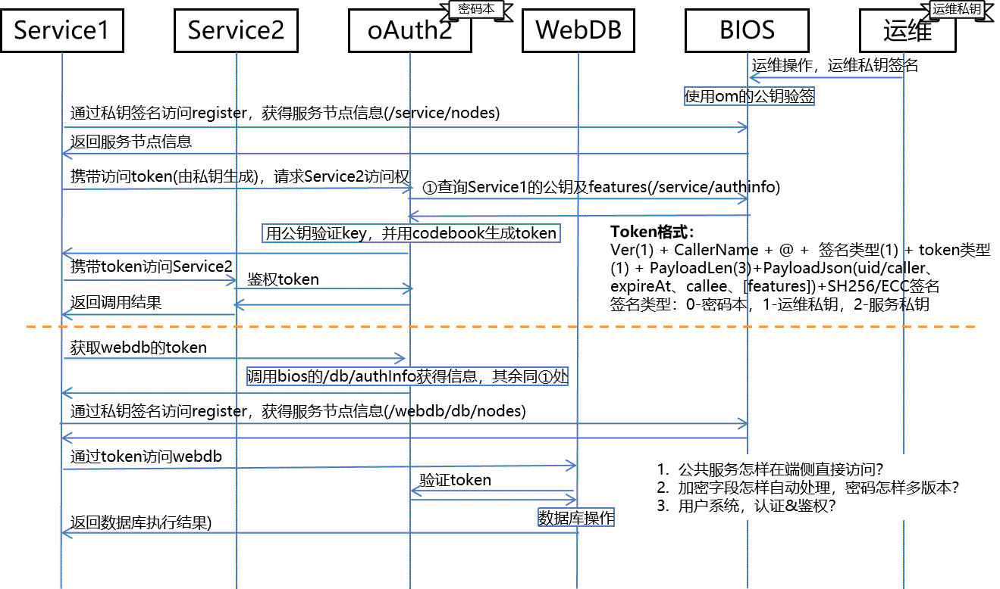

1. Service1先用自己的私钥签名生成AppToken，访问oAuth2；
2. oAuth2从BIOS中获得Service1的公钥与可访问的features列表，并用公钥验证AppToken；
3. 如果通过，则用自己的codebook生成Service2的token返回给Service1；
4. Service1用这个token调用Service2的接口，Token中包括分区、调用方、被调方、超时时间、可调用features列表等信息；
5. Service2接到请求后，向oAuth2验证token是否有效，通过后才会执行后继操作。

以上的Service1获取token、oAuth2获取公钥、Service2验证token，在服务中都会做缓存，不会每次请求都完整走一遍oAuth过程。

oAuth2服务使用的密码本，在安卓服务器中，第一次启动时生成，每个实例都不相同，保证不同私有云服务器之间不能互访，以此来解决多家公司在同一个局域网的问题。

#### 鉴权

在token中携带了Service1可以访问的features，Service2中通过判断接口的feature来判断Service1是否可以调用该接口。

#### 数据库访问

数据库是一种特殊的服务，但是认证操作与普通服务类似，只是token中的callee字段填写的是db的名称，features填写“\*”。

因为业务只能访问自己的数据库，所以不做C、R、U、D的权限限制，也就是说，业务对数据库具备所有权限，但是不建议数据库执行DDL类SQL，DML类SQL不建议单次做大批量操作。

数据库有OM接口，拥有OM权限的服务才可以访问，可以指定数据库只读、可读写。只读状态下，写入都会失败。此特性可用于数据库升级等OM操作时。
```URL
/webdb/api/om/setWritable?service=xxx&db=yyy&writable=trueORfalse
```

### 用户认证&鉴权

| 名称    | 描述 |
| ---     | --- |
| USER    | 端侧公司用户调用服务侧接口时使用，端侧必须登录了一个公司帐号才可以通过 |
| UNIUSER | 端侧个人用户调用服务侧接口时使用，端侧必须登录了个人帐号才可以通过分详细描述 |
| COMPANY | 只有知道公司密码的情况下才可以调用，用户只能是admin |

接口定义的property中有private属性，公司服务的tokenChecker为USER，个人服务tokenChecker为UNIUSER。 这样的接口，需要用户输入账号、密码登录后才可以访问。

【注意】UNIUSER只能在至简网格服务端提供的个人服务中使用，企业服务中需要进行用户认证USER。

#### 认证

公司服务的用户认证通过user服务实现，个人服务的用户认证通过uniuser服务实现，包括登录、验证等基本操作，uniuser还包括注册功能。

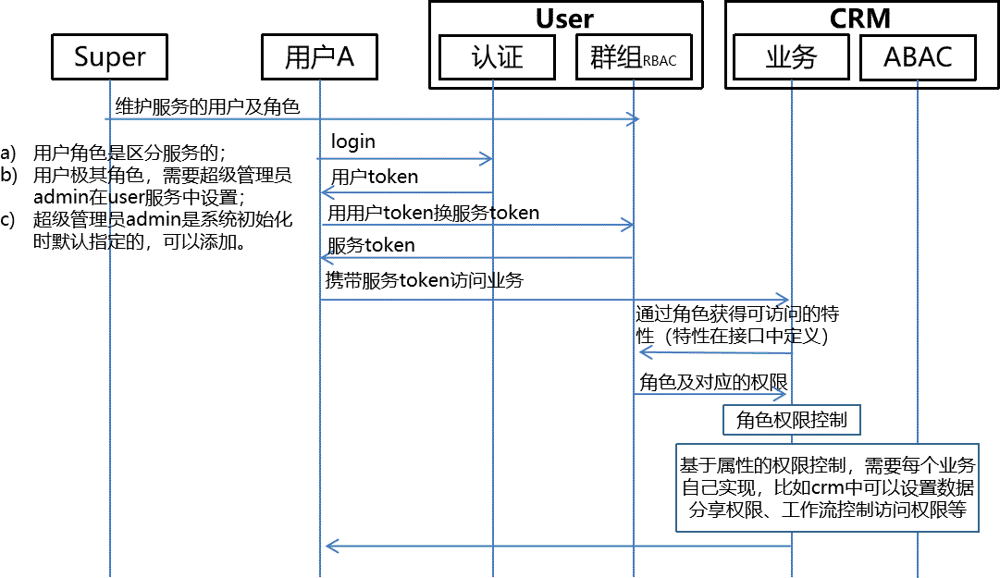

上图示例展示CRM服务的用户认证鉴权过程：

1. 用户从端侧向CRM服务发起请求前，需要输入用户名、密码，获得用户token；
2. 如果是访问user服务本身的接口，携带用户token即可访问；
3. 如果访问CRM服务，则需要拿用户token向user服务换取服务token；
4. 携带服务token请求CRM服务接口，CRM服务根据token中的用户信息，向user服务获得该用户的角色确定用户可以调用哪些feature的接口；
5. 如果权限确认通过，才会执行后继的业务逻辑。

#### 鉴权

鉴权分为RBAC(Role Based Access Control基于角色的访问控制)与ABAC(Attribute Based Access Control基于属性的访问控制)。

##### RBAC

在至简网格中，RBAC在user服务中实现。在user服务中，为某个服务添加用户时，需要指定角色。 
角色是服务实现时定义的，通常放在pub.json文件中，指定角色可以访问的接口范围，通过服务的/roles接口提供给user服务。

```JSON
"roles": {
    "admin":{
        "name":"企业主",
        "rights":{
            //sku是接口定义文件的名称(sku.cfg)，* 表示其中的所有特性的接口都可以调用
            "sku":"*",
            //如果接口定义中指定了feature，就可以更加细致的授权
            "report":"featureA,featureB...",
            "proxy":"*"
        }
    },

    "sales":{
        "name":"销售",
        "rights":{
            //这里没有指定任何接口文件，则，只能访问没有设置feature的接口
        }
    }
    ...
}
```
为了实现对角色功能更加细致的限制，在每个接口中都可以定义feature，在角色定义时，限制角色在某个接口定义文件中，只能执行特定的几类接口。详情请参照 [接口定义](#interfacedef)。

##### ABAC

ABAC的权限控制更加精细化，与业务紧密相关，无法提供统一实现，每个服务需要自己实现，有两种实现方式：

1. aclChecker设置为ABAC：配置aclProcess（与process配置方法完全相同），返回OK则表示通过；
2. 不设置aclChecker：在process中自行判断。

方法1只是将鉴权部分从process中分离出来，放在aclProcess中，但是，aclProcess中的返回结果集都不会被放到响应中，系统只判断它的返回码是否为OK。
比如，CRM中有独立的powers表，控制每个用户可以访问哪些数据，权限控制达到行级别。数据分享、工作流赋权等使用aclProcess可以控制到单个客户、联系人、订单级别。

##### RoAAC

先基于角色鉴权，如果通过，则返回成功；否则，再基于属性判断，如果通过，则返回成功；否则返回失败。 注意，必须同时提供aclProcess配置，与ABAC一样。

##### RaAAC

先基于角色鉴权，如果通过，再基于属性鉴权，如果都通过，则返回成功，否则返回失败。 注意，必须同时提供aclProcess配置，与ABAC一样。

---
## 数据库开发

### 数据库定义

至简网格支持三种数据库，分别是RDB、SDB、TDB，其中RDB关系型数据库最为常用，分为本地与webdb两种。

1. webdb数据库（在服务根目录的database.cfg文件中定义）
	- 由webdb服务统一管理，所以可以跨实例访问，支持数据跨实例同步与定期异地备份；
	- 如果用sqlite，由webdb实现同步与定期备份；
	- 如果是mysql、sqlserver等大型数据库，需要数据库自身实现同步与备份，webdb实现数据库连接的收敛。

2. 本地数据库（在database.loc.cfg文件中定义）
	- 数据只存在于本服务根目录dbs下，比如address服务的数据库，只能用sqlite；
	- 因为数据是存在本地的，每个服务实例上数据初始化时都一样，如果有写入操作，实例间数据会出现差异；
	- 服务接口实现时，直接读本地数据库，所以它性能更好，但是它不会同步与定期备份；
	- 适合存放需要经常访问，但是极少变更的数据，变更操作放到线下不定期操作。

#### SDB搜索数据库

实现对内容进行分词以及模糊搜索的功能，使用方法请参照 “[处理](#处理process)”部分的描述。不涉及表结构定义，只需要在其中申明即可，type设为sdb，如下所示：
```JSON
{
    "name":"crm",
    "type":"sdb"
}
```

#### TDB树状数据库

实现树状关系数据的增删改查，使用方法请参照 “[处理](#处理process)”部分的描述。不涉及表结构定义，只需要在其中申明即可，type设为tdb，如下所示：
```JSON
{
    "name":"crm",
    "type":"tdb"
}
```

#### RDB关系型数据库

实现关系型数据的增删改查，使用方法请参照 “[处理](#处理process)”部分的描述。涉及多个版本表结构升级或定义：
```JSON
{
    "name":"crm",
    "version":"0.2.0", //升级后的目标版本
    "type":"rdb",//固定为rdb
    "versions":[] //每个版本对应map对象
}
```

versions中可以有多个map对象，在执行时会判断本地版本是否在 minVer（包括）、maxVer（包括）所指定的范围之中。如果包括，则执行其中sqls中每个数据库脚本。

每行脚本最好只指定一条DDL语句，多条DDL语句指定多个SQL执行。

DDL语句执行完毕，会将本地数据库版本号改为toVer，然后再继续后面version执行。
```JSON
{
    "minVer":"0.0.0", //最新
    "maxVer":"0.1.0",
    "toVer":"0.2.0",
    "sqls":[...]
}
```

### 数据分片

数据量较小时（Sqlite：<1百万行记录，MySQL：<1千万行记录）不必分库，超过此量级时建议分库，因为单个实例数据量太大会引起性能下降、维护困难。

分库是针对某个服务的某个数据库的，分库首先要计算每行数据的分片号，再将其分配到不同的数据库中。 至简网格的分片号范围为大于或等于0，小于或等于32767，也就是最大支持32768个分片。

多个分片可以放在一个实例中，也可以一个分片单独放在一个实例中，即，最多可支持32768个分库实例，如果一个实例最大存1百万行记录，最大可容纳约327亿行记录。

分片号计算结果只能是一个整型数，可以用多个字段共同计算得到，所以通常用ABSHASH占位符。参与计算字段可以是请求参数、系统参数或前面处理的响应结果，比如：
```JSON
"sharding" : "@{ABSHASH | account, #tokenCaller, !custId, ^agent...}"
```

其中的account是请求参数，或者接口中定义的变量；#tokenCaller是token中的字段；!custId是前面的响应结果；^agent是请求头中的字段。参数定义请参照[占位符](#placeholder)的介绍。
数据库分片的实现原理，如下图所示：

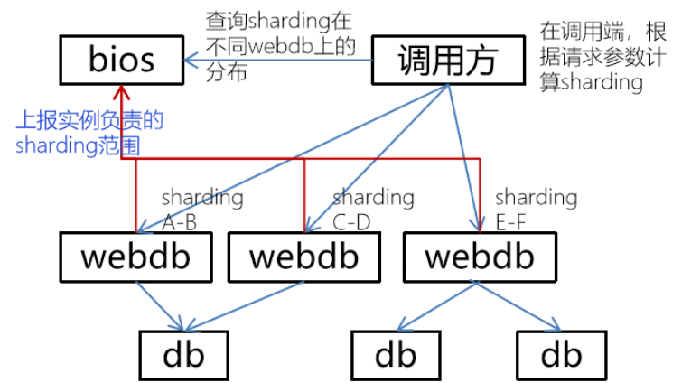

每个webdb实例负责一个连续的分片范围，在它启动后会定期向bios服务上报自己的分片范围，调用方发起请求时需要先从bios中获得分片分布情况，然后再根据接口定义中sharding计算结果，找到合适的webdb实例。

【注意】
1. webdb只管记录数据，如果调用端选择了错误的分片号，webdb只会返回INVALID\_NODE(113)错误，此错误需要调用方自己处理；
2. 如果分片信息发生了调整，需要重启相关的webdb实例，调用方需要等待几分钟才会更新分片分布信息，如果需要及时调整，调用方也需重启；
3. 无论是使用sqlite还是mysql等大型数据库，都支持此分片逻辑；
4. treedb、searchdb不支持分片。

---
## 高阶开发<a id="advancedev"></a>

如果sql脚本、js脚本已不能满足业务要求，则需要做Java开发。内置的类型本质上是使用type来指定内置的处理类，自定义的处理类，必须写完整的“包名+类名称”来指定处理类。
内置的Java实现逻辑，在发布版本时已编译连接进去了。
因为安卓的字节码不同于JVM的字节码，Java编译后的class文件不能在安卓上直接使用，所以在安卓服务器不能使用自定义类。

实现自定义处理时，需要用Java实现IProcessor接口，或继承AbsProcessor、AbsDBProcessor、AbsRDBProcessor、RDBProcessor、TreeDBProcessor等类进行扩展。 在process中，指定handler为自定义的实现类即可，比如：
```JSON
{
    "name" : "get\_token",
    "type" : "java",
    //因为type为java，所以SampleDBProcessor必须继承自AbstractProcessor，或者IProcessor
	//类似的情况，比如treedb、search必须分别继承自TreeDBProcessor、SearchProcessor
    "handler" : "cn.net.zhijian.mesh.builtin.xsv.SampleDBProcessor"
}
```

至简网格中内置了加载第三方jar的能力，但是，因为安卓中需要对jar做转换后才能加载，对研发人员有很高要求，所以没有放开此能力。如果对此有需求，有三种方法可以解决此问题：

1. 使用JS或改业务流程规避；
2. 请在开源社区提需求让它将功能内置到系统中，如果是通用功能，一般会加入；
3. 放弃兼容性，只提供java版本，这是最不希望看到的。

---
## 基础服务

给其他服务调用的基本能力，如果没有这些基础服务，所有业务都无法正常运行起来。
以下基础服务都已上传至[码云](https://gitee.com/zhijian_net/enterprise/tree/master)、[Github](https://github.com/ZhiJianMesh/endterprise)。

### bios
系统中最为基础的服务，记录了所有服务节点、数据库节点的信息，以及当前的运行状态，它与服务的Watcher进程配合，完成服务、数据库节点的注册发现工作。
主要完成以下功能：
1. 服务节点的注册、发现；
2. 数据库节点的注册、发现；
3. 服务公共配置维护，比如oAuth的密码本。


### webdb
webdb是一个特殊的服务，它实现在数据库实例上执行DDL\DML。执行这些语句时，会根据sql的不同，增加一些可靠性操作。
1. 使用内置的sqlite作为数据库引擎时，webdb提供跨实例同步、备份能力。
	- A）sqlite数据库适合小型系统使用，配合分库逻辑，极限可以做到100亿级数据记录；
	- B）数据库的分库操作需要bios配合，在调用方实现，webdb不实现分库，但是会拒绝不属于当前实例的分片请求；
	- C）使用update_time阻止主备库双写混乱，每次增、改，都会更新update_time字段，目的端重放时，只对大于本地update_time的记录进行重放，update_time字段是webdb自动为每个表添加的。
2. 使用MySQL、Oracle等大型数据库时，建议使用它自身的同步能力。

### oauth2
提供服务间调用的认证与鉴权。
比如A服务需要调用B服务，可以在bios中B服务的caller下，增加A服务信息，并指定可以调用B服务的哪些feature（每个接口中可以指定feature，不指定，则表示不限制）。

### keystore

存储数据字段密码、数据根密钥对，为数据加解密提供支撑。

公司在注册时，已经产生了数据根密钥对，使用公司密码加密后保存在根环境。之所以加密保存在根环境是为了防止它丢失，导致老数据不能加解密。

首次运行时，keystore从根环境获取数据根密钥对存入keystore中。因为需要用公司密码解密此根密钥对，所以，首次登录时命令行中需要提供公司密钥，以后再启动时无需提供。

在两种情况下需要用到keystore服务：
1. 每日数据备份时数据库是加密后上传的，加密的密码使用此根密钥对加密；
2. 数据字段的加密密码是经过此根密钥对加密后存在keystore中，并且会定期更换。

如果更换公司密码，需要提供原来的公司密码解密根密钥对，再用新密码加密后更新根环境的备份。

### assets
assets不是通常意义的服务，不运行于服务侧，只用于给每个服务对应的端侧提供公共库。
它没有任何接口，只提供了vue、quasar、echarts等基本的UI库，以及一些内置的vue组件、公共函数等。

---
## 公共服务

公共服务为企业服务提供支撑，降低企业服务开发的难度、工作量。
以下公共服务都已上传至[码云](https://gitee.com/zhijian_net/enterprise/tree/master)、[Github](https://github.com/ZhiJianMesh/endterprise)。比如公司帐号服务对应user目录、序列ID服务对应seq目录...


### 公司帐号服务User

维护一个企业内部的用户数据，包括对用户数据、群组数据的增删改查，以及用户授权。

#### 帐号数据维护

系统初始化时，已经创建了超级用户admin，密码默认为“123456”， 建议第一次使用时就更改这个密码，并且记住它。

默认情况，超级用户可以对用户数据进行增删改查，admin可以初始化任何一个用户的密码（解决忘记密码的情况），admin也可以添加其他的超级用户，但是admin不可以删除自己。

#### 用户授权

只实现按角色的授权(RBAC)，管理员在为每个服务添加用户时，可以指定它在其中的角色，根据角色决定用户可以执行哪些操作。

为了实现这点，需要服务在实现时，对接口做功能划分， 并在角色定义中指定可执行的功能范围。

给用户授予某个业务系统中的角色时，还可以指定是否可以外网接入的权限。 此权限在开通外网访问的情况下有效，只有开通此权限的用户才可以在公网环境访问公司内网的服务。

用户在调用服务接口时，必须携带服务token，此token会在用户系统中进行验证，通过后才可以访问。


### 序列ID服务Seq

实现一个持续增长（不保证连续）的ID服务，通过SEQUENCE占位符获得。 此占位符可以用在sql、js脚本中，也可以用在 [vars的val](#vars)中， 或者[var处理](#var)中。

### 定时任务Schedule

如果需要定期执行一个任务，比如定期备份等，可以在service.cfg中申明依赖schedule服务完成。

定时任务是通过定期调用服务提供的接口实现业务需要的功能。此接口不能占用太长时间，否则会堵塞定时任务执行。 如果此任务需要占用很长时间，建议在接口中先返回RetCode.EXECUTING(2)，然后启动一个线程执行耗时的任务。 等任务完成后，再调用schedule的/callback接口，传回taskId、code、info三个参数，异步告知执行结果。 在任务执行期间，schedule每分钟会检查服务是否已经返回了结果，如果返回code为RetCode.OK(0)， 则本轮定时任务结束，否则会在下一次重试时间到达时，再次发起调用。

在服务的初始化接口中调用schedule的/task/create接口创建定时任务，此接口可以多次调用，以最后一次为准。 创建定时任务的请求的tokenSign为APP，请求参数如下：

| 名称    | 说明 | 举例 |
|---------|-----|-----|
| name    | 任务名称，必须为数字字母下划线 | test123 |
| type    | 周期类型，有D(天)、W(星期)、M(月)、C(周期性) | D |
| val     | 从起点推后的分钟数，D/W/M:离周期起点间隔，C:周期的分钟间隔 | 比如type为D，val为540，表示每天9点执行；type为W，val为1440，表示每周一0点执行 |
| minTime | 最小重试时间间隔，单位为分钟，每重试一次翻一倍；此参数的大小取决于定时任务耗时长短，比如预计最长5分钟完成， 则设置为5分钟，通常设置时要保有一定的余量，比如预计耗时5分钟，设置为10分钟 | 1 |
| maxRetry| 最大失败重试次数，每重试一次减1，到0时，本轮周期内停止尝试 | 3 |
| url     | 给定时服务调用的服务接口url，特别注意：此接口的tokenChecker为"APP-schedule"，且必须尽快返回，否则会堵塞定时任务服务 | /om/backup |

### 验证码服务VerifyCode

当前只提供图片验证码。

1. /image?w=xx&h=yy：返回一个base64形式的验证码图片img，与一个session；
2. /verify?session=xxx&code=yyy：在服务端验证输入是否正确，session是/image接口返回的。

### 配置服务Config

存放K-V形式存储的配置，每个公司是独立的，所以请求必须是公司级的。 端侧公司用户发起请求，会在请求头中携带cid，服务端接到请求后，将cid通过头部再转给config服务。

提供了put、putIfAbsent、remove、get、list接口，详细定义请查看接口定义文件config/api/root.cfg。

### 工作流服务Workflow

工作流服务中可以定义一个工作流程中的步骤，在业务中控制工作的推进，每一步可以向下一步推进，也可以回退到上一步。每一步可以写入当前责任人的意见，并指定下一步的执行人（可多人）。 每一步操作，都有详细的记录，在需要回溯工作时，可以清晰地查看每一步的记录。

/workflow/api/flow.cfg定义了工作流定义的相关接口，在管理界面使用。
工作流服务提供了默认的管理页面与工作流操作页面，业务中引入"/assets/v3/settings/workflow.js"与"/assets/v3/components/workflow.js"即可，样例请参照/ibfbase/tasks.js。 

```JavaScript
import {_WF_} from "/assets/v3/components/workflow.js"
import WfSettings from "/assets/v3/settings/workflow.js";

export default {
inject:['ibf'],
components:{
    "wfsettings":WfSettings,
    "alert-dialog":AlertDialog,
    "confirm-dialog":ConfirmDialog
},
data() {return {
    confirmDlg:null,
    alertDlg:null,
	...
}},
mounted(){//不能在created中赋值，更不能在data中
    this.confirmDlg=this.$refs.confirmDlg;
    this.alertDlg=this.$refs.errMsg;
},
methods:{
showWorkflow(flow,did) { //显示某条记录对应的工作流
    _WF_.showPage(flow, did, this.$router);
},
...
}
...
}
```

定义工作流：
```HTML
<wfsettings v-model="flow" ref="wfSet" class="q-pa-md"
 :confirmDlg="confirmDlg" :alertDlg="alertDlg"
 :service="service.value" :flowTags="tags.flowTags"></wfsettings>
<alert-dialog :title="tags.failToCall" :errMsgs="tags.errMsgs" ref="errMsg"></alert-dialog>
<confirm-dialog :title="tags.alert" :close="tags.cancel" :ok="tags.ok" ref="confirmDlg"></confirm-dialog>
```

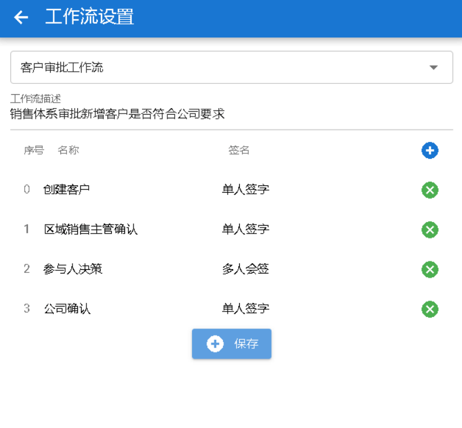

/workflow/api/root.cfg中定义启动、删除、确认、查询任务的接口，这类接口在业务中调用。

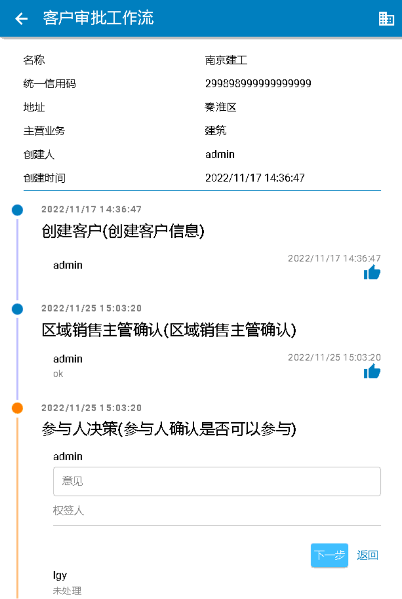


# 端侧UI开发

## 概述

至简网格客户端本质是一个轻应用开发平台，端侧的开发，就是使用html+js+vue+quasar开发网页，如果需要输出报表，可以使用echarts。至简网格在客户端中提供了一些原生接口，使得与至简网格的服务端对接变得非常方便，其他开发与普通网页开发是完全一致的。

至简网格并没有限制使用什么前端js框架，但是推荐使用vue+quasar，并且内置了vue与quasar，服务开发时，可以直接引用它们。

## 服务目录结构

端侧UI开发是放在服务的ui子目录中的，比如是user服务的目录结构，ui目录中存放的就是端侧UI实现。服务在启动时会自动根据service.cfg生成一个app.cfg文件，将它与ui目录一起打包成一个zip文件。客户端在安装、升级时，用的就是这个zip文件。

```
├── service.cfg         # 服务描述
├── database.cfg        # 数据库定义
├── api/                # 接口定义目录
│   ├── init.cfg        # 启动初始化时调用的接口
│   ├── root.cfg        # 接口定义文件，root.cfg中定义的接口，在访问时url不用加文件名
│   ├── user.cfg        # 用户接口定义文件，访问时url需要加user，比如/api/user/add
│   ├── power.cfg       # 用户授权接口
│   └── pub.json        # 静态定义，比如服务的角色定义
└── ui/                 # 端侧ui目录
    ├── index.html      # 应用加载的html，加载vue、quasar等库，并初始化vue、quasar
    ├── favicon.png     # 应用图标，在应用列表、首页左上角都会显示此图片
    ├── users.js        # 显示公司所有帐号，可以模糊搜索
    ├── user.js         # 显示某个帐号的详情，在此可以重置密码、修改信息、修改授权等
    ├── language.js     # 多语言标签定义
    └── authorizes.js   # 帐号按服务授权
```

端侧ui在安装、升级时，下载此zip文件，并且解压到本地目录，然后加载其中的index.html文件，显示服务的UI。所以，如果服务需要在客户端显示内容，则，ui目录下必须有一个index.html文件。在index.html文件中，完成vue、quasar的初始化加载，如果要用报表，还需要加载echarts。


#### 服务中的网络请求

在端侧开发中，对网络的请求不可以使用任何一种ajax框架，比如axios、jquery等，因为为了实现至简网格服务端的灵活部署，内置webview时，禁用了它的网络访问能力。如果需要实现网络请求，必须使用原生的Http函数，request是用来请求至简网格服务端接口的，download是用来下载文件的，getExternal是用来访问非至简网格服务中的内容的。

#### 服务起始页样例
```HTML
<!DOCTYPE html><-- DOCTYPE不可省略 -->
<html>
<head>
<meta charset="utf-8" />
<meta name="content-type" content="text/html;charset=utf-8" />
<meta name="viewport" content="width=device-width, initial-scale=1.0" />
<-- 避免加载favicon -->
<link rel="icon" href="data:image/ico;base64,aWNv">
<-- 如果使用quasar，则必须加载以下两个css -->
<link href="/assets/v3/quasar_font.css" rel="stylesheet" type="text/css">
<link href="/assets/v3/quasar.css" rel="stylesheet" type="text/css">
<title>CRM</title>
</head>
<body style="overflow:hidden">
<-- app.mount('#app')用到div的id，v-cloak使得vue在没有得到值之前，不显示变量名 -->
<div id="app" v-cloak>
<-- router-view，应用的页面都在此加载 -->
<router-view></router-view>
</div>
</body>
<-- 必须加载的js -->
<script src="/assets/v3/vue.js"></script>
<script src="/assets/v3/vue-router.js"></script>
<script src="/assets/v3/quasar.js"></script>
<script src="/assets/v3/osadapter.js"></script>
<-- 根据需要选择是否加载 -->
<script src="/assets/v3/echarts.js"></script>
<script src="/assets/v3/qrcode.js"></script>
<script type="module">
import Language from "./language.js"
//延迟加载，引入公共组件，这样import可以兼容安卓7
//如果不考虑兼容android 7，则可以按需加载，在VueRouter.createRouter的routes中直接import
import DateInput from "/assets/v3/components/date_input.js"
import UserSelector from "/assets/v3/components/user_selector.js"
import AlertDialog from "/assets/v3/components/alert_dialog.js"
import ConfirmDialog from "/assets/v3/components/confirm_dialog.js"
const l=(typeof os)=='undefined' ? navigator.language : os.language();
const tags = l.indexOf("zh") == 0 ? Language.cn : Language.en;
//router定义
const router = VueRouter.createRouter({"history": VueRouter.createMemoryHistory(),
    routes:[
        //定义router，安卓7不支持按需加载import
        {path:'/home', component:()=>import('./home.js')},
        ...
    ]
});

//service定义
const service = {
    go_back() { //返回，在页面中通过service.go_back调用
        router.back();
    },
    jumpTo(url) {
        router.push(url);
    }
};

//app主体定义
const app = Vue.createApp({
provide:{tags:tags, service:service, icons:icons},
created(){
    service.baseInfo();
    this.$router.push('/home').catch(err => {err}) //避免报NavigationDuplicated，此错误不影响功能
},

mounted() {
    window.sys_go_back = this.sysGoBack;//给webview调用
},

methods:{
    sysGoBack() {
        //声明全局函数，在webview中调用，
        //实现按回退按钮回退到历史页面，如果无历史，则退出activity或应用
        if(this.$router.currentRoute.value.path==="/home") {
            return false;
        }

        this.$router.back();
        return true;
    }
}
});

app.use(Quasar);//必须：设置Quasar
app.use(router);//必须：设置route
//注册全局组件，按需选择，另外还有address控件
app.component('component-user-selector', UserSelector);
app.component('component-alert-dialog', AlertDialog);
app.component('component-confirm-dialog', ConfirmDialog);
app.component('component-date-input', DateInput);
app.mount('#app');//必须：启动APP
</script>
</html>
```

#### 交互页面样例

以下为一个删减了所有细节的首页实现，具体的实现可以参照已在gitee、csdn、github开源的服务实现。
```JavaScript
export default {
inject:['service', 'tags'], //引用全局对象，页面中可以像使用data中变量一样使用
data(){return{
    name:"test"//数据定义，在页面中{{xxx}}括起的部分，在此都必须定义
}},

created(){
    this.init(); //初始化加载，在mounted
},

methods:{
    init(){
        //处理逻辑
    }
},

//注意"`"不是单引号，是键盘左上角的反单引号(backquote)
template:`
<q-layout view="lHh lpr lFf" container style="height:100vh">
<q-header elevated>
<!-- 非必须，页眉内容 -->
</q-header>
<q-footer elevated>
<!-- 非必须，页脚内容 -->
</q-footer>
<q-page-container>
<q-page class="q-pa-md">
<!-- 中间内容 -->
{{name}}
</q-page>
</q-page-container>
</q-layout>
`//用反单引号结尾
}
```

### 多语言标签
UI开发中如果将文字部分直接写在组件中，以后要支持其他语言时，必须研发逐字逐句的修改，而研发并不善于翻译工作，而善于翻译工作的人不善于编程。所以需要将多语言标签独立出来。

至简网格客户端将语言标签作为一个模块独立地放在language.js中。language.js中除了放多余语言标签，也可以放一些按语言差异化处理的函数，比如日期格式化函数。

```JavaScript
export default {
en:{
  app_name:"Settings",
  ok:"OK",
  ...
},
zh:{
  app_name:"设置",
  ok:"确定",
  ...
}
}
```
en对应英文，zh对应中文，通过Platform.language()可以获得当前的语言名称（前两个字符，转小写）。
Android客户端是这样获取的：
```Java
public String language() {
    return Locale.getDefault().getLanguage().substring(0,2).toLowerCase();
}
```
Windows中是这样获取的：
```C#
public string language() {
    //System.Globalization.CultureInfo.InstalledUICulture.Name是安装时操作系统的语言
    return System.Globalization.CultureInfo.CurrentUICulture.Name.Substring(0,2).ToLower();
}
```

所以在index.html中使用时，参照以下方法：
```JavaScript
import Language from "./language.js"

const lang=Platform.language();
const langTags = Language[lang] ? Language[lang] : Language.en;

const app = Vue.createApp({
provide:{tags:langTags},
...
});
```
组件中需要先inject tags，然后在模板中以“tags.”引用。当操作系统的语言设置发生变化时，引用的标签也会变化。再因为独立了，翻译与开发工作可以分离。
```JavaScript
export default {
inject:['tags'],
...
template: `
<div>{{tags.app_name}}</div>
`
}
```

### Http请求

在内置浏览器中禁用了所有网络访问能力，即使使用axios也不能访问，必须通过request(opts, service)、download(opts, service)、getExternal(url)三个接口实现。它们在assets/v3/osadapter.js中定义，调用内置的Http类。

#### request

request函数中不可以传入完整的url，只需传入服务名、接口名，request内部根据组网情况，选择合适的服务器，自动拼接出完整的请求url。
```JavaScript
request({method:"POST", url:"/api/customer/create", data:dta}, "crm").then(resp => {
    if(resp.code != RetCode.OK) {
        this.$refs.errMsg.showErr(resp.code, resp.info);
        return;
    }
    //如果有响应数据，在这里处理resp.data
})
```

##### 请求参数

request、download的service参数为被请求的服务名称，opts为请求选项，包括method、url、data、private四项，file\_name是download特有的。

| 选项   |  说明 |
| ---   | ---   |
|method |支持GET/POST/PUT/DELETE方法，如果是GET/DELETE|
|url    |请求URL，可以在"?"后面带参数|
|data	|请求参数，必须是json对象，如果method是GET/DELETE，则无需传opts.data参数|
|isCloud|表示无论当前选中的是哪个公司，请求都会发到根环境的云上服务中|
|private|可以不传递，默认为true，表示需要做用户鉴权，如果访问public接口，将private设为false即可；<br>如果客户端已登录，则会自动使用用户token获取服务token，然后用服务token访问服务接口；如果用户未登录，则操作失败，建议在收到NO\_RIGHT错误码时，跳出提醒登录的窗口|
|timeout|单位毫秒，不设置或设成小于或等于8000的值，则使用默认的HttpClient，超时为8秒，否则创建一个临时HttpClient，使用此timeout值；<br>不推荐使用此设置，除非万不得已，比如安装服务、备份数据等请求，因为每次都会新建一个HttpClient，既耗时又耗资源|

##### 响应处理

request是用来请求接口的，返回都是json格式。如果响应中需要携带数据内容，必须放在data字段中，没有响应数据时，data可以省略。

响应处理中，首先判断code是否为RetCode.OK，只有OK是正常处理，其他错误码则根据情况处理，比如EXISTS，在某些情况下是正常的响应码，这需要业务实现时判断。响应数据在resp.data中，data是一个js对象。

###### 响应整体结构

所有响应的顶层结构都是一样的，包括返回码code、信息info；如果是查询类的请求，会包括data字段，每个查询类接口的data都不相同。
```JSON
{
    code:0,
    info:"Success",
    data:{
        a:1,
        b:"xxx",
        c:{…},
        d:[…]
    }
}
```

###### 返回码

响应体中的code为返回码，客户端的返回码与服务端完全一致。如果无错误则为OK(0)，返回码在js脚本中用RetCode.xx直接引用，code定义如下：

| 名称 | 值 | 含义 |
| --- | --- | --- |
| OK | 0 | 成功 |
| DEPRECATED | 1 | 接口即将废弃 |
| INTERNAL\_ERROR | 100 | 内部错误 |
| INVALID\_TOKEN | 102 | 无效token |
| EMPTY\_BODY | 103 | 请求体错误，用在POST请求中 |
| DB\_ERROR | 104 | 数据库错误 |
| INVALID\_SESSION | 105 | 无效的session |
| SERVICE\_NOT\_FOUND | 106 | 服务不存在 |
| TOO\_BUSY | 107 | 系统太忙 |
| SYSTEM\_TIMEOUT | 108 | 系统超时 |
| NOT\_SUPPORTED\_FUNCTION | 109 | API存在，但是所需的功能不支持 |
| API\_NOTFOUND | 110 | API不存在 |
| NO\_RIGHT | 111 | 无权调用 |
| NO\_NODE | 112 | 找不到可用的节点提供服务 |
| INVALID\_NODE | 113 | 无效的节点，比如数据库分片的情况下，请求发到错误的webdb实例上 |
| THIRD\_PARTY\_ERR | 114 | 调用第三方服务失败 |
| UNKNOWN\_ERROR | 150 | 未知错误 |
| EXISTS | 2000 | 已经存在 |
| NOT\_EXISTS | 2001 | 不存在 |
| API\_ERROR | 3000 | API错误 |
| WRONG\_JSON\_FORMAT | 3001 | JSON体解析失败 |

#### download

request用来请求服务端接口，返回都是json格式的，download是用来下载文件的，返回内容是二进制格式。

opts中，除了支持request的所有选项外，还需要增加一个file\_name参数，用来指定被下载的文件在存到本地时的名称，如果不指定，就用url中的uri作为文件名。

如果不是通过接口访问获得文件，还可以增加一个file参数，设为true时，使用的url中将不会携带api。 其他参数与request相同。
```JavaScript
download({file_name: fn,/*attatchment*/ url:'/downloadlog?n=' + encodeURIComponent(f)}, "crm").then(resp => {
    if(resp.code == RetCode.OK) {
        this.dlList.splice(0, 0, {file:resp.data.saveAs, size:resp.data.size, bg:'#00000000'})
    } else {
        this.dlList.splice(0, 0, {file:f, size:0, bg:'#884444'})
    }
    this.dlDlg=true;
});
```
#### getExternal

用于请求访问非至简网格服务的http资源，它的响应内容全部当作普通文本处理，服务在处理响应结果时，必须自己理解它的格式定义。
```JavaScript
getExternal({url:’https://domain/pathtores....’,headers:{...}}).then(txt=> {
	var resp = JSON.parse(txt);
	if(resp.code != 0) {
		...
	}
});
```

### JS内置函数

在客户端UI编程中，有些功能js不能或不易实现，比如加解密、文件读写等，只能在平台中通过原生的方式实现。
在端侧，至简网格提供了一些内置的JS函数，随着系统的完善，会有更多的内置能力通过js函数方式开放出来。

#### 函数列表

| 函数 | 备注 |
| --- | --- |
| 公共函数    | |
| request(opts, service) | 向service指定的服务发起请求，详细内容请参考[Http](http://www.zhijian.net.cn/docs/client/http)中的描述 |
| download(opts, service) | 下载文件，请求参数与request完全相同，响应的内容是一个文件，并且存到端侧指定的目录中，此目录是端侧工作目录下的download子目录 |
| getExternal(opts) | 请求其他网站的URL，opts与request中定义相同，只是URL需要传递完整的值，比如https://www.gitee.com/xxxx |
| Platform类    | |
| height() | 以像素为单位的浏览器可见区域高度，如果使用了quasar，建议使用$q.screen.height |
| width() | 以像素为单位的浏览器可见区域宽度，如果使用了quasar，建议使用$q.screen.width |
| portrait() | 变成竖屏 |
| landscape() | 变成横屏 |
| undefineOrientation() | 不定义横竖屏，恢复成原来的样子 |
| language() | 当前系统选择的语言，比如zh-CN |
| isSupported(feature) | 判断一个功能是否被支持，当前只有scancode(识别二维码、条形码)、orientation(改变屏幕显示方向)可选 |
| showTools() | 显示工具栏 |
| hideTools() | 隐藏工具栏，注意，此功能在windows客户端不起作用 |
| scanCode(jsCbId) | 扫描二维码、条码，jsCbId请参照 [扫码案例](#scan2dbar)，通过\_\_regsiterCallback(callback)注册回调时获得 |
| Console类  | 日志输出到端侧的日志文件中，而不是浏览器的控制台上；输出到控制台请使用小写的console |
| debug(s) | 输出debug级别的日志 |
| info(s) | 输出info级别的日志 |
| warn(s) | 输出warn级别的日志 |
| error(s) | 输出error级别的日志 |
| File类    | 本地文件处理 |
| init() | 初始化，使用之前必须初始化，为服务创建私有目录，所以以下函数中的fileName都不必提供完整路径，自动会加上服务对应的根目录 |
| append(fileName,s) | 向fileName指定的文件末尾追加内容， |
| write(fileName,s) | 向fileName指定的文件写入内容，如果已存在该文件，则会覆盖掉。服务只可以读写服务根目录或其子目录下的文件。 |
| read(fileName) | 从fileName指定的文件读出内容，返回一个字符串。此功能不宜用于读取超大文件 |
| JStr类    | |
| uuid() | 产生uuid字符串，使用base64编码 |
| replaceChars(str,ch,replaceWith) | 在str中寻找ch，并替换成replaceWith |
| chkIdNo(s) | 判断是否为合法的身份证号码 |
| chkCreditCode(s) | 判断是否为合法的统一信用码 |
| base64CharCode(c) | 返回一个字符的base64编码，c必须是“a-z,A-Z,0-9,\_,-”中的一个 |
| base64Char(v) | 将0-63数值，转为“a-z,A-Z,0-9,\_,-”中的一个 |
| intHash(s) | 返回字符串的整型hash值 |
| longHash(s) | 返回字符串的长整型hash值 |
| absHash(s) | 返回字符串的长整型hash的绝对值 |
| isLanIP(v) | 判断是否为局域网IP，支持IPv4与IPv6判断 |
| isIPv4(v) | 是否为一个合法的IPv4地址 |
| isIPv6(v) | 是否为一个合法的IPv6地址 |
| Secure类    | |
| pbkdf2(pwd, iterationCount) | 使用pbkdf2算法，将pwd迭代iterationCount次 |
| pbkdf2Check(pwd, savedPwd) | 检查输入的pwd与savedPwd是否一致，savedPwd由pbkdf2函数生成 |
| cbcEncrypt(plain, key) | 使用AES-CBC算法加密，plain为明文，key为密钥。IV为随机产生，并记录在密文的前面16字节中。 |
| cbcDecrypt(cipher, key) | 使用AES-CBC算法解密，cipher为密文，其中包括了随机IV |
| gcmEncrypt(plain, key) | 使用AES-GCM算法加密，plain为明文，key为密钥。IV为随机产生，并记录在密文的前面16字节中。 |
| gcmDecrypt(cipher, key) | 使用AES-GCM算法解密，cipher为密文，其中包括了随机IV |
| keyPair(pwd) | 产生ECC密钥对，pwd为加密密钥对的密钥；返回内容为一个字符串 |
| publicKey(kp) | keyPair产生密钥后，通过此函数导出公钥 |
| privateKey(kp,pwd) | keyPair产生密钥后，通过此函数导出私钥，因为私钥是加密的，所以必须提供密码 |
| eccEncrypt(plain, pubKey) | 使用ECC公钥加密，plain为明文，pubKey为publicKey从密钥对中导出的公钥；返回加密后的字符串密文 |
| eccDecrypt(cipher, prvKey) | 使用ECC私钥解密，cipher为密文，prvKey为privateKey从密钥对中导出的私钥（未加密，需注意安全）；返回解密后的字符串明文 |
| keyPairEncrypt(kp, plain) | 使用ECC密钥对中公钥加密plain字符串；返回加密后的密文字符串 |
| keyPairDecrypt(kp, pwd, cipher) | 使用ECC密钥对中私钥解密cipher字符串，pwd为调用keyPair产生密钥对时的密码；返回解密后的明文字符串 |
| saveItem(k, v) | 使用系统根密钥加密存储服务信息；使用此函数时需注意，系统根密钥加密的内容只在当前系统可以解密，离开当前系统则无法解密 |
| readItem(k) | 使用系统根密钥解密存储的服务信息，如果不存在，则返回空字符串 |
| md5(str) | 使用MD5算法对str进行不可逆运算 |
| sha1(str) | 使用SHA1算法对str进行不可逆运算 |
| sha256(s) | 使用SHA256算法对s1,s2,s3…进行不可逆运算，在它们之间会增加分隔符“-” |
| hmacSHA256(str) | 使用SHA256算法对str进行不可逆运算。随机生成16字节key，并记录在结果的前面 |
| hmacSHA256Check(str, saved) | 验证str与saved是否一致，saved是hmacSHA256算法生成的 |
| hmacSHA1(str, key) | 使用HMAC-SHA1算法对str进行不可逆运算，key可以是一个随机字符串 |
| isPwdStrong(acc, pwd, min, max, charTypeNum, diffCharNum) | 判断密码强度是否足够。 acc：帐号，用于判断密码是否与帐号接近 pwd：密码 min：最小长度 charTypeNum：不同字符的数量 diffCharNum：不同类型字符数量，0-9\|a-z\|A-Z\|其他，共四类 |
| Database类   | 虽然浏览器内置了数据库实现，但是，浏览器内置数据库标准已废弃，考虑到未来的兼容性，提供此类。除了open函数，所有函数异步返回，结果的形式为：{code:ressult\_code,info:error\_infomation,data:{...}} |
| open(db) | 打开一个本地的数据库，此处以及后面函数中出现的db参数都是指是数据库名称；返回0表示失败，1表示已打开过了，2表示新建成功 |
| initialize(db,sqls) | 初始化数据库，sqls是一个字符串，包括一条或多条建表语句，多条时，用分号分隔 |
| execute(db,sql) | 执行一条增、删、改类的sql语句；返回data:{lineNum:xxx}，lineNum为受影响的行数 |
| executes(db,sqls) | 执行一条或多条增、删、改类的sql语句，多条时，用分号分隔；返回内容与execute相同 |
| queryArrays(db,sql) | 执行一条查询sql，结果以数组方式返回，不包括列名；比如，data:{rows:[[a,b,c],[d,e,f]...]}，每行记录的列顺序与sql中的列顺序一致 |
| queryMaps(db,sql) | 执行一条查询sql，结果以对象数组方式返回，包括列名，比如，data[{c1:a,c2:b,c3:c},{c1:d,c2:e,c3:f}...] |
| queryMap(db,sql) | 执行一条查询sql，结果以对象方式返回，比如，data:{c1:a,c2:b,c3:c} |

#### 使用举例
##### 使用数据库
```JavaScript
var db='test_db';
if(Database.open(db)>0) {
    alert(xxx);
    return;
}
Database.initialize(db,"create table if not exists testtab(...);create index if not exists ...").then(res=>{
    if(res.code!=RetCode.OK){
        ...
        return;
    }
    ...
});
Database.execute(db, "insert into testtab(...),values(...)").then(res=>{
    if(res.code!=RetCode.OK){
        ...
        return;
    }
    if(res.data.lineNum>0){
        ...
    }
});
Database.queryMaps(db, "select c1,c2 from testtab where ...").then(res=>{
    if(res.code!=RetCode.OK){
        ...
        return;
    }
    for(var row of res.data.rows) {
        Console.info(row.c1 + "," + row.c2);...
    }
});
```

##### 扫码<a id="scan2dbar"></a>
```JavaScript
var jsCbId=__regsiterCallback(resp => {
    if(resp.code!=RetCode.OK) {
        this.$refs.alertDlg.showErr(resp.code, resp.info);
        return;
    }
    var data = JSON.parse(resp.data.value);
    ......
});
Platform.scanCode(jsCbId);
```
##### 生成二维码

如果需要生成二维码，必须在起始页index.html中包含qrcode（已内置到客户端版本中）。
```JavaScript
<script src="/assets/v3/qrcode.js"></script>

function showQrCode() {
    var txt = JSON.stringify({data...});//待生成的内容必须为一个字符串
    new QRCode(this.$refs.qrCodeArea, {
        text: txt,
        width: width, //必须像素为单位
        height: width,
        colorDark: '#000000',
        colorLight: '#ffffff',
        correctLevel: QRCode.CorrectLevel.H
    });
}
```

如果是在一个dialog中显示，需要在dialog的show事件中处理显示二维码的工作，否则无法显示。
```HTML
<q-dialog v-model="qrCodeDlg" @show="showQrCode">
<q-card :style="{'min-width': width+'px'}" bordered><q-card-section>
<div ref="qrCodeArea" :style="{width:width+'px',height:width+'px'}"></div>
</q-card-section></q-card>
</q-dialog>
```

### 内置组件

端侧内置了一些常用组件，有地址选择、告警对话框、确认对话框等。

使用时，首先，在index.html中import它们，比如：
```JavaScript
import DateInput from "/assets/v3/components/date_input.js"
import UserSelector from "/assets/v3/components/user_selector.js"
import AlertDialog from "/assets/v3/components/alert_dialog.js"
import ConfirmDialog from "/assets/v3/components/confirm_dialog.js"
```

其次，在app.mount('#app')之前将这些组件都注册进去：
```JavaScript
app.component('component-user-selector', UserSelector);
app.component('component-alert-dialog', AlertDialog);
app.component('component-confirm-dialog', ConfirmDialog);
app.component('component-date-input', DateInput);
app.mount('#app')
```

最后，使用时当作标签使用
```HTML
<component-user-selector :label="tags.signers" :accounts="newCust.nextSigners"></component-user-selector>
```

#### addr\_dialog

以一个对话框的形式，提供三级（省、市、县/区）的地址选择，这些数据都是从云上查询接口得到的。它支持以下属性：

| 属性名称 | 备注 |
| --- | --- |
| country | 国家码，字符串类型，默认为156（中国） |
| label | 标签，字符串类型，显示在地址选择框上方，默认为空 |
| ok | 确定按钮的标签，字符串类型，默认为"确定"，点击此按钮，会触发confirm:modelValue |
| cancel | 取消按钮的标签，字符串类型，默认为"取消" |

#### addr\_input

以一个输入框的形式，提供多级的地址选择，输入任意关键字，会模糊搜索一个完整的地址。它支持以下属性：

| 属性名称 | 备注 |
| --- | --- |
| label | 标签，字符串类型，显示在地址选择框上方，默认为空 |

注意：此组件在安卓7中无法正常显示，并且，oppo的安卓8中也会无法显示。如果考虑兼容，请使用addr\_dialog。

#### addr\_select

用三级输入框选择地址，每一级选择后，后面的级会自动更新。支持以下属性：

| 属性名称 | 备注 |
| --- | --- |
| label | 标签，字符串类型，显示在地址选择框上方，默认为空 |

#### alert\_dialog

提示对话框，此对话框在点击空白处时会消失。支持以下方法：

| 方法名 | 备注 |
| --- | --- |
| show(msg) | 显示msg |
| showErr(code,info) | 显示错误码及其对应的错误信息，如果errMsgs中包括了错误码信息，则显示errMsgs，否则显示默认的错误信息 |

支持以下属性：

| 属性名称 | 备注 |
| ---     | --- |
| errMsgs | 错误码与错误信息的对应关系，对象类型，比如{4000:"参数错误"} |
| title   | 标题，字符串类型，默认为“警告” |
| close   | 关闭按钮的标签，字符串类型，默认为“关闭” |

使用时先引入组件，注意要增加ref属性，比如errMsg。
```HTML
<component-alert-dialog ref="errMsg"></component-alert-dialog>
```

需要显示错误信息时，调用showErr函数：
```JavaScript
this.$refs.errMsg.showErr(errCode, errInfo)
```

showErr会根据errCode查找对应的错误信息，这些信息是errMsgs属性传递进来的。找到后在加上errInfo一起输出。
如果需要直接显示一段信息，可以调用show：
```JavaScript
this.$refs.errMsg.show(info)
```

如果是在其他组件中引用本组件，可以参照以下方法：

首先引入本组件：
```JavaScript
import AlertDialog from "/assets/v3/components/alert_dialog.js"
```
然后，在组件中注册组件：
```JavaScript
export default {
    ...
    components:{
        "alert-dialog":AlertDialog
    },
    ...
}
```
并在template中申明组件：
```JavaScript
<alert-dialog :title="failToCall" :close="close" ref="errMsg"></alert-dialog>
```
最后，就可以调用组件的函数了：
```JavaScript
this.$refs.errMsg.showErr(errCode, errInfo);
```

#### confim\_dialog

确认对话框，使用方法与alert\_dialog类似。支持以下方法：

| 方法名 | 备注 |
| ---   | --- |
| show(msg,callback) | 显示msg，并设置点击确认时的回调函数 |

支持以下属性：

| 属性名称 | 备注 |
| ---    | --- |
| title  | 标题，字符串类型，默认为“警告” |
| ok     | 确定按钮的标签，字符串类型，默认为“确定”，点击时会调用回调函数 |
| close  | 关闭按钮的标签，字符串类型，默认为“关闭” |

#### date\_input

日期输入框。quasar本身的日期组件已经很棒，提供此组件，是用于提供一些默认属性，降低代码量。支持以下属性：

| 属性名称   | 备注 |
| ---       | --- |
| label     | 输入框的标题，字符串类型 |
| dateFormat| 日期的显示格式，字符串类型，默认为“YYYY/MM/DD” |
| min       | 最小的日期，字符串类型，格式需要与dateFormat一致 |
| max       | 最大的日期，字符串类型，格式需要与dateFormat一致，也可以使用today，表示当前日期 |
| weekDays  | 从星期天到星期六，每天的名称，字符串数组类型，默认为["日","一","二","三","四","五","六"] |
| months    | 从1月到12月，每月的名称，字符串数组类型，默认为["一月","二月",...] |
| close     | 关闭按钮的标签，字符串类型，默认为“关闭” |

#### datetime_input

日期+时间输入框。quasar本身的日期组件已经很棒，提供此组件，是用于提供一些默认属性，另外在下方可输入时间。支持以下属性：
| 属性名称  | 备注 |
| ---      | --- |
|label     |输入框的标题，字符串类型|
|dateFormat|日期的显示格式，字符串类型，默认为“YYYY/MM/DD”|
|min       |最小的日期，字符串类型，格式需要与dateFormat一致|
|max       |最大的日期，字符串类型，格式需要与dateFormat一致，也可以使用today，表示当前日期|
|weekDays  |从星期天到星期六，每天的名称，字符串数组类型，默认为["日","一","二","三","四","五","六"]|
|months    |从1月到12月，每月的名称，字符串数组类型，默认为["一月","二月",...]|
|showMinute|是否显示分钟，如果不显示则填00，默认为true|
|disable   |是否容许改变，默认为false|
|ok        |确定按钮的标签，字符串类型，默认为“确定”|
|cancel    |关闭按钮的标签，字符串类型，默认为“取消”|

#### time\_input

时间输入框。quasar本身的时间组件选择较为麻烦，此组件提供滚动选择时间。支持以下属性：

| 属性名称 | 备注 |
| --- | --- |
| showSecond | 是否包括秒，默认为true |
| disable | 是否禁止输入，默认为false |

#### month\_input

日期输入框，只能选择年与月。支持以下属性：

| 属性名称 | 备注 |
| --- | --- |
| min | 最小可选择日期，字符串类型，默认为0000/1 |
| max | 最大可选择日期，字符串类型，默认为9999/1 |
| monthName | 月份的标签，默认为“月” |

min、max格式支持yyyy-MM、yyyy/MM、yyyy.MM，还支持cur（当前月份）、+/-m、+/-y（与当前月份相对偏移的月份数或年数）。

#### user\_selector

用户选择输入框。调用公司用户服务中接口获得帐号信息，选择一个帐号。输入帐号、电话号码的部分或全部对帐号进行模糊搜索，并列出搜索结果供选择。

支持以下属性：
| 属性名称 | 备注 |
| ---     | --- |
| label   | 输入框的标题，字符串类型 |
| useid   | 是否返回群组id，布尔类型，默认为false，返回帐号，否则返回帐号id |
| accounts| 选中的帐号或帐号id，数组类型，如果是单选，则只有一个成员 |
| multi   | 是否多选，布尔类型，默认为true，表示可选择多个帐号，在accounts中返回 |
| service | 限定的服务，字符串类型，如果不为空，则只返回在这个服务中获得授权的帐号，默认为空，表示不限制 |
| roles   | 限定的角色，字符串数组类型，必须与service属性一起设置。如果不为空，则只返回在指定服务中获得相应角色的帐号，默认为空，表示不限制 |

#### user_input
帐号输入框。调用公司用户服务中接口获得帐号信息，选择一个帐号。输入帐号、电话号码的部分或全部对帐号进行模糊搜索，并列出搜索结果供选择。
一边输入帐号，一边过滤帐号的组件，返回{id:xxx,account:yyyyy}。与user_selector不同，此组件只能输入一个帐号。
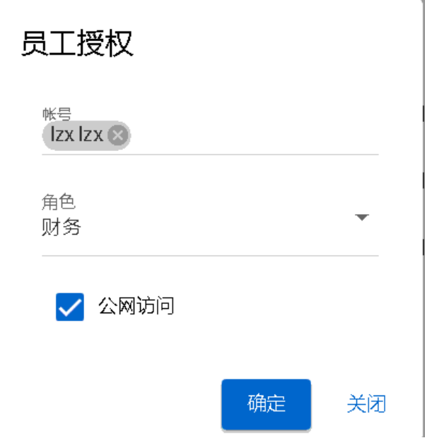

#### login\_dialog

用户登录对话框。输入帐号、密码，调用公司用户服务中接口进行用户登录。支持以下属性：

| 属性名称 | 备注 |
| --- | --- |
| label | 对话框的标题，字符串类型，默认为“登录” |
| accType | 帐号类型，字符串类型，默认为"N"，表示为普通帐号，公司帐号时只能为N |
| account | 帐号，字符串类型 |
| pwd | 密码，字符串类型 |
| cancel | 取消登录按钮标签，字符串类型，默认为“取消” |
| close | 关闭按钮标签，字符串类型，默认为“关闭”，此按钮在登录失败时出现在错误提示框中 |
| failToCall | 错误提示信息，字符串类型，默认为“关闭”，此提示在登录失败时出现在错误提示框中 |

#### service\_selector

服务选择输入框。输入服务名或描述信息模糊搜索服务列表供选择。支持以下属性：

| 属性名称 | 备注 |
| --- | --- |
| label | 对话框的标题，字符串类型，默认为“登录” |
| services | 选中的服务列表，字符串数组类型 |
| type | 服务类型，字符串类型，默认为“enterprise”，表示选中公司类服务，如果为personal，表示选择个人服务 |
| useid | 是否返回服务id，布尔类型，默认为false，返回服务名，否则返回服务id |
| multi | 是否多选，布尔类型，默认为true，表示可选择多个服务，在services中返回，否则只返回一个服务 |

#### scroll_select

滚动选择输入框。界面可见多行，列表可以滚动。支持以下属性：
| 属性名称  | 备注 |
| ---      | --- |
|height    |滚动框高度 |
|width     |滚动框宽度 |
|chkedStyle|选中项风格，默认为{'background-color':'blue',color:'white'}|
|itemClass |所有选项的显示风格 |
|options   |选项，形如[{label:'xx',value:yyy}...]，也可以是['xxx','yyy',...]|

#### process\_dialog

进度提示框，用于显示一个环状进度条，此进度条并不表示当前确定的进度，只是一个表示任务仍在继续的状态。它支持以下方法：

| 方法名 | 备注 |
| --- | --- |
| show(title, info, icon, action, actionDone) | title：对话框的标题<br>info：进度提示信息<br>icon：圆形进度条中间的图标<br>action：点击确定按钮时需要执行的任务，必须为异步函数，传入参数为进度对话框本身，可以调用它的函数，比如setInfo。action可以为空<br>actionDone：任务完成时的回调，会传递两个参数，第一个为进度对话框本身，第二个为action执行之后的返回值。可以为空 |
| setInfo(info) | info参数为进度提示信息，可以在action、actionDone中调用，显示与进度有关的信息 |

支持以下属性：

| 属性名称 | 备注 |
| ---    | --- |
| width  | 对话框的宽度，单位可以是px、vw、vh、em、rem等，字符串类型，默认为“80vw” |
| ok     | 确定按钮的标签，字符串类型，默认为“执行”，点击时会调用action函数 |
| close  | 关闭按钮的标签，字符串类型，默认为“关闭” |

使用时先引入组件，注意要增加ref属性，比如procDlg。
```HTML
<component-process-dialog ref="procDlg"></component-process-dialog>
```

需要显示进度条时，引用ref，调用show函数：
```JavaScript
this.$refs.procDlg.show('数据备份', '确定要执行备份吗？', 'cloud_download',
    (dlg)=> {
        dlg.setInfo('');
        return this.service.command({cmd:"restore"}, 100000); //必须为异步函数
    },
    (dlg,resp)=> {
        if(resp.code!=RetCode.OK) {
            dlg.setInfo(formatErr(resp.code, resp.info));
        } else {
            dlg.setInfo(this.tags.restoreSuccess);
        }
    }
)
```

### 报表开发

至简网格内置了echarts，并默认使用echarts生成图表。为了使用echarts，必须在起始页index.html中引用。
echarts已集成到客户端版本中，业务无需自己下载。 除折线图、柱状图等基本图表外，还包括tree/relation/scatter/sunburst四个高级图表。
```HTML
<script src="/assets/v3/echarts.js"></script>
```
echarts详细使用方法，请参考 [echarts官方文档](https://echarts.apache.org/zh/index.html)

---
## 服务举例

### 极简CRM

客户关系管理系统，为中小微企业管理客户信息，实现客户信息、联系人信息、订单信息、回款信息、售后服务信息记录，实现了基本的业财一体化。

提供了实时的简报，让每个销售人员能够掌握自己当前的销售进展。服务报表中，提供了公司维度的收支报表与按产品维度的收支报表。

### 极简会员

会员管理系统，为服务行业提供的客户会员软件，与CRM不同，这类服务直接面向个人，所以其中不包括企业信息，只有会员信息。可以完成会员登记、订单管理、消费记录，能够输出实时的图形化报表，针对每个会员都可以一键导出所有服务记录存入word文档中，形成服务案例，便于新员工学习，提升服务水平。

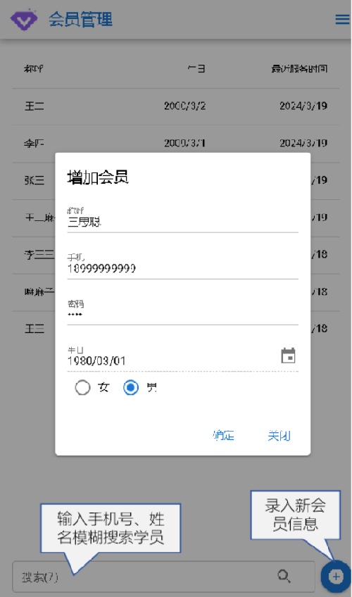

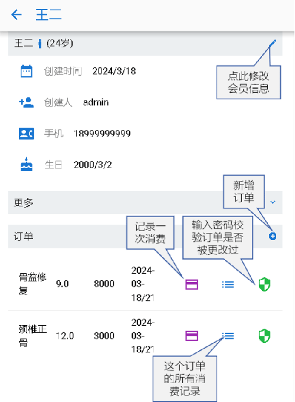

会员详情页，可以创建订单、增加消费记录，当会员对消费记录有不同意见时，可以输入密码校验订单是否被恶意修改过。

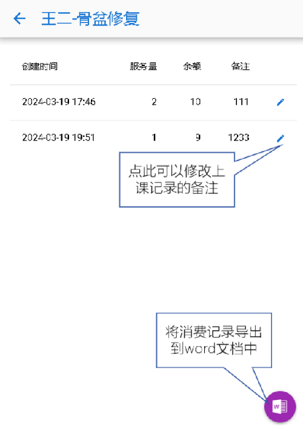

一键导出消费记录到本地的一个word文档。

### ClassHour

课时管理系统，为课外辅导班、兴趣班开发的学员课时管理服务。能够实现学员登记、订单管理、课时管理等，并且能够输出实时的报表。结合一些辅导中心的激励机制，提供了积分奖励功能。

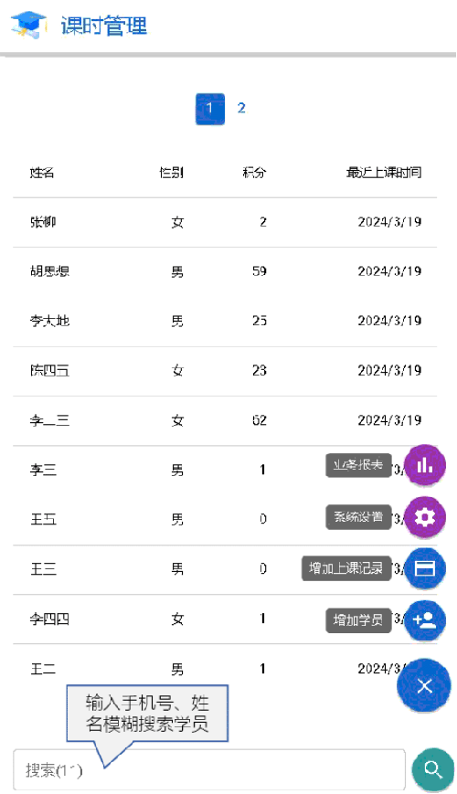

学员信息可以通过模糊搜索查找，也可以在这里为一个或多个学员创建课时记录，课时会自动扣减。

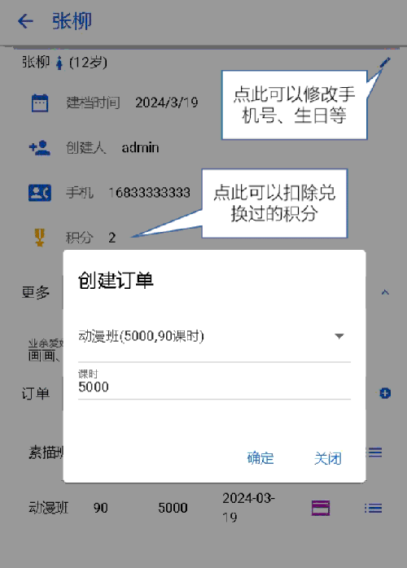

点击学员可以看到学员详情，在这个界面可以创建订单，在订单上记录课时等。

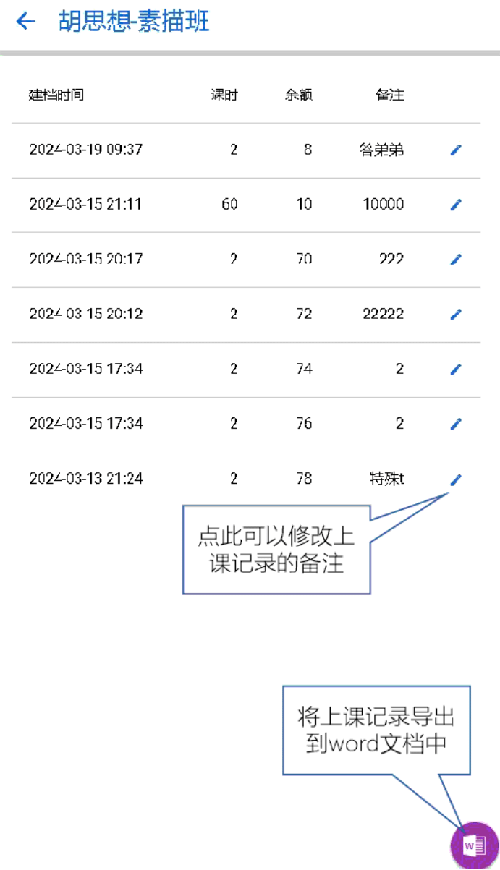

在课时记录中，可以了解学员的学习进度。与会员管理系统类似，它也可以一键导出学员的上课记录到一个word文档中，可以将这个文档转给学员家长。

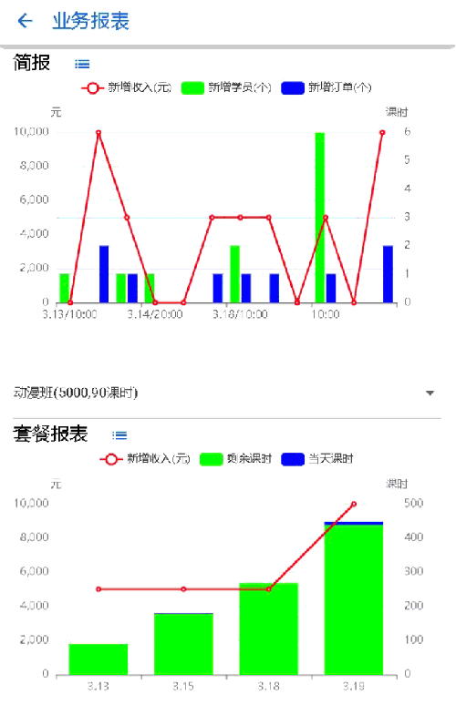

报表中有总体的报表，也有单个套餐的报表，点击报表上面蓝色的图标就可以查看生成报表的原始详细数据。

## 长连接客户端
长连接客户端是特殊的客户端，它不使用http协议进行交互，而是使用tcp长连接进行交互。服务端在给设备下发命令（如，基于ROS实现的自动化系统、工业机器人等），让它执行某个操作时，如果使用http方式，端侧必须定期轮询服务侧获得命令，这种方法会有一定的延迟，并且会产生很多不必要的http请求。 因为有长连接，在当服务侧需要给端侧发消息时，通过长连接，就可以立刻通知到。

为了实现这点，需要端侧与服务侧建立长连接，并实现相应的二进制交互协议。可编程的设备种类繁多，建立长连接的实现也各不相同，所以不能像http那样将实现封装到js中，而是需要每种设备自己实现。

### 建立长连接

每种设备的开发环境不同，但是基本的思路都是与服务器的8524端口建立TCP长连接，并实现交互协议。 此协议是将http协议包裹在一个二进制协议中传输。

客户端与服务端建立长连接，首先需要获得服务端地址，有两种方法：

1. 先使用http协议从公共httpdns中查询内网入口地址，然后调用内网的probe接口，获得所有服务的IP地址；
2. 在设备中直接设置服务的IP地址。

两种方法各有利弊，方法1不需要手动设置，方法2开发简单，并且内网地址可以与MAC地址绑定，让服务器地址保持稳定不变，配置一次就不用变了。

【注意】长连接端侧除了可以用长连接请求服务侧接口，同时也可以使用http协议请求服务侧的接口。

### 实现交互协议

#### 协议头部

Java开发语言与网络传输中都使用大端序，所以协议中的数值类型都是使用大端序。

以下协议定义中字段后面括号中的数字表示字段的字节数，无论是端侧发往服务侧，还是服务侧发往端侧，头部定义都是一样的。
```
报文总长度（4，不包括报文总长度本身的4字节）+命令字（1）+请求ID（4）
```

在异步方式交互时，请求方根据请求ID将响应对应到正确的请求。 响应内容中命令字与请求ID都原样返回，请求方必须保证请求ID在合理的时间段内是唯一的。

#### 服务侧给端侧响应的内容

无论什么命令字，服务侧响应内容的格式都是一样的。除了协议头部以外，还有以下几个部分：
```
状态码（4，同http状态码，通常为200）+响应头长度（4）+响应头+响应体长度（4）+响应体
```

请求头、请求体、响应头响应体是json对象字符串，解析后第一重结构是k-v结构， 在Java中可以使用Map<String,Object>存储，C#中使用IDictionary<string, object>存储， 其他语言可以参照处理。

#### 端侧发往服务侧的命令

端侧发往服务侧的命令字中CONNECT/DISCONNECT/HEARTBEAT是连接管理的命令字，它们没有header、body部分，也没有相应的长度字段。 GET/PUT/DELETE/POST是接口调用命令字，有header、body部分，即使没有，也要有相应的长度字段。
| 命令字  | 编码  | 定义  |
| ---    | ---   | ---- |
|CONNECT |0 | 端侧发起连接<br>版本（4）+资源名称长度（4）+资源名称（UTF8字符串）<br>资源名称是一个字符串，格式为“帐号:密码@公司ID”<br>服务侧响应内容就是端侧login的响应内容，包括access_token/refresh_token/expires_at/token_type/id等内容|
|DISCONNECT |1 |端侧主动断开连接，只有协议头部 |
|HEARTBEAT	|2 |端侧心跳，只有协议头部|
|GET	|3	|GET请求，无请求体<br>GET/PUT/DELETE/POST四个命令字的格式是一致的，在协议头部之后的格式为：<br>url长度（4）+url+请求头长度（4）+请求头+请求体长度（4）+请求体<br>如果没有请求头或请求体部分，仍然须有长度字段，对应的长度为0，后面不跟内容|
|POST	|4	|POST请求|
|DELETE	|5	|DELETE请求，无请求体|
|PUT	|6	|PUT请求|

#### 服务侧发往端侧的命令
| 命令字  | 编码  | 定义 |
| ---    | ---  | ---  |
| CLOSE	 | 7	| 服务侧关闭连接<br>**下次重连时间（4，单位秒）+请求头长度（4，固定为0）+请求体长度（4，固定为0）**|
|CONTROL | 8    | 服务侧给端侧发出的控制命令。<br>**子命令（4，为GET/PUT/DELETE/POST其中之一）+请求头长度（4）+请求头+请求体长度（4）+请求体**<br>如果没有请求头或请求体部分，对应的长度为0，后面不跟内容。<br>因为控制命令都是其他http端侧发到服务侧的，服务侧将端侧的http请求转译成长连接端侧的协议，然后发往长连接端侧。<br>当长连接端侧处理完毕，给服务侧响应后，服务侧再将响应内容转为http响应返回给端侧。<br>端侧实现时，界面中要有恰当的进度提示，设置恰当的超时时间，并处理好可能的响应超时问题。|


# 客户端安装与使用

## 安装

在做端侧UI开发之前，首先需要安装客户端。当前支持windows、android两种客户端，两种界面很接近，操作也一样。 但是有部分安卓中的功能，在windows客户端中没有，比如扫码、横竖屏等。

### windows客户端

从网站下载安装程序后，双击安装即可。

windows客户端需依赖系统的Edge浏览器。此浏览器在windows7及以上版本都可以安装，windows10、windows11中已默认安装。如果未安装，则需要手动下载安装 [Edege浏览器](https://www.microsoft.com/zh-cn/edge/download)。

### android客户端

至简网格安卓客户端至少需要在安卓8.0中安装（2017年8月22日发布）。

至简网格客户端没有上传到各大应用市场，需要使用安卓手机的浏览器扫码下载，然后再安装。

有些情况下，浏览器没有安装应用的权限，会提示确认是否赋予浏览器安装应用的权限，此时必须给予授权。

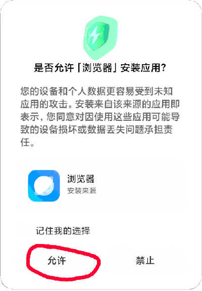

安装时，会有安全提醒，请选中“我已充分了解风险，并继续安装”。因为安卓手机品牌众多、版本众多，提示不尽相同，总之需要容许安装才可以。

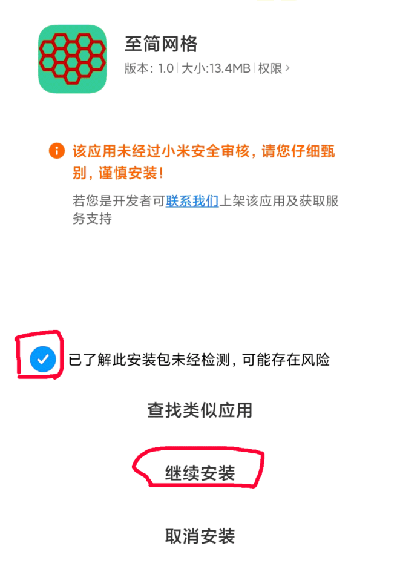

通过以上步骤，安装就完成了，与普通App安装是一样的。

## 端侧设置

帐号分为两类：个人帐号、公司帐号，用户可以登录一个个人账号，登录一个或多个公司的公司账号，比如，一个会计为多家公司代账的情况，就需要登录多家公司的服务，使用时根据需要切换到不同公司的公司帐号。

“设置”中可以进行个人帐号注册与登录，或者公司帐号的登录。

如果当前打开的服务是一个公司服务，则自动使用当前选中的公司的账号；如果是一个个人服务，无论当前选中的是哪个公司的账号，都使用个人账号。

### 个人帐号

在使用一些个人服务时，比如密码箱、专注力等服务，它们不属于任何一家公司，所以必须使用个人帐号。

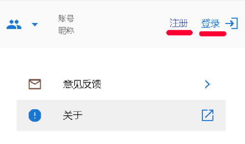

个人帐号需要自己注册，当前只支持自建帐号，没有使用QQ、微信等第三方帐号。

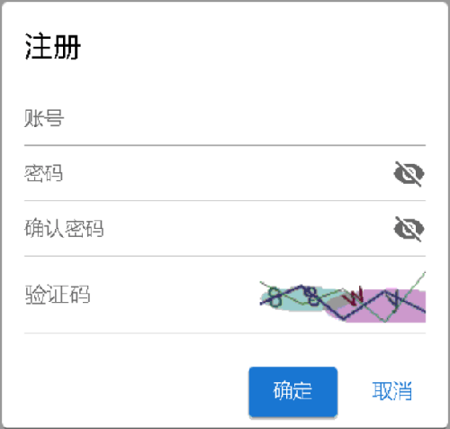

### 公司帐号

公司帐号及其初始密码是公司的超级管理员创建的，创建方法请参照[公司帐号管理](#公司帐号管理)。

在登录公司帐号之前，需要先点击左上角的图标添加公司，待添加的公司必须已经注册过，可以询问公司相关负责人获得公司id与接入码。

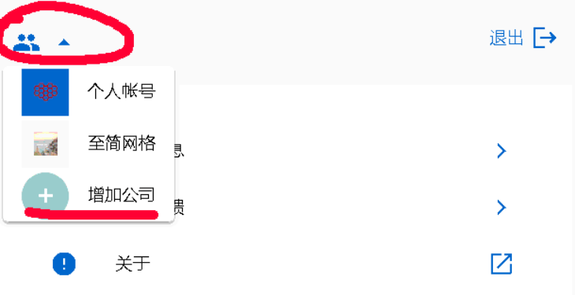

公司ID：公司或组织注册时获得的ID；

接入码：接入密码，需注意，它相当于WIFI密码，不可随意透露给公司外不相关人员。


如果服务器置于内网环境，点击“确定”后，端侧无法知道连接哪个服务器，这时会要求输入“内网地址”。

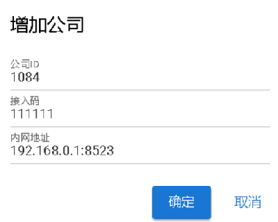

### 登录

个人帐号与公司帐号的登录与退出是一样的。

因为公司帐号是超级管理员添加的，系统默认的公司超级管理员帐号是admin，密码是123456。强烈建议在第一次登录时修改admin密码。

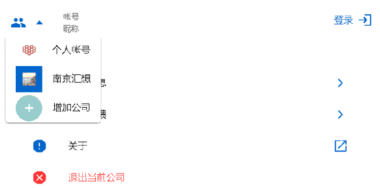

系统支持同时登录一个个人帐号与多个公司帐号，登录时需要点击左上角的图标，选择个人或者某个公司。

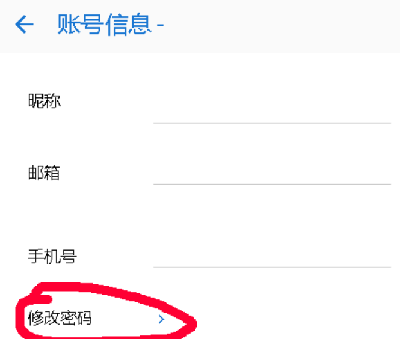

然后再点击右上角的登录，在弹出窗口中输入帐号、密码，点击“登录”即可。


在使用服务时，如果是个人服务，则自动使用个人帐号身份。如果是公司服务，则使用当前选中的公司帐号，在左上角可以切换当前的公司。 如果当前帐号是个人帐号，且有多个公司帐号，因为个人帐号无法在公司级服务中使用，所以默认使用排在最前面的公司帐号。

## 应用市场

应用分成两类，一类是公司应用，如CRM、会员等。公司应用需要单独部署公司服务器才可以使用，服务器程序可以部署在一部安卓手机上，也可以部署在服务器上，或者部署在云端。
一类是个人应用，比如密码箱、专注力等。个人应用为生活提供便利，比如记密码、练习专注力、记单词、算账、杂记等，这些功能不需要部署服务器，安装即可使用。

### 应用列表

在应用列表中点击应用就可以进入详情界面，进行安装或卸载。

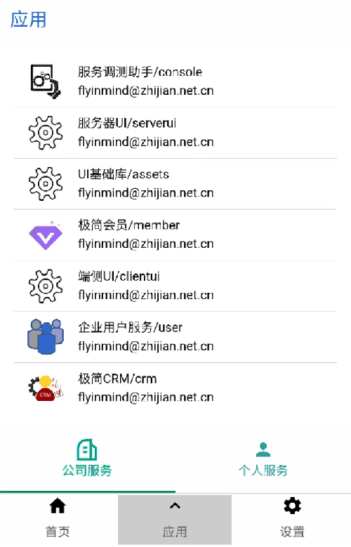

### 应用详情

在详情中有关于应用的详细介绍。如果没有安装，则下方显示“安装”按钮，否则显示“卸载”按钮；当检测到新版本时，会多一个“升级”按钮。

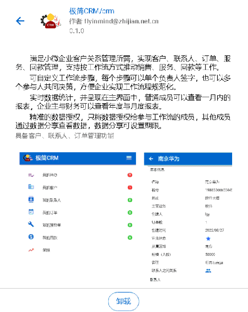

注：以上图例只作为样例，并不代表实际情况。

## 打开应用

在应用主界面的最下方，点击“应用”按钮，出现一个应用栏，里面列出了所有已安装的应用，比如CRM、会员等。 点击一个应用，就可以进入应用的主界面。

每种应用的主界面不同，下图为CRM的主界面。

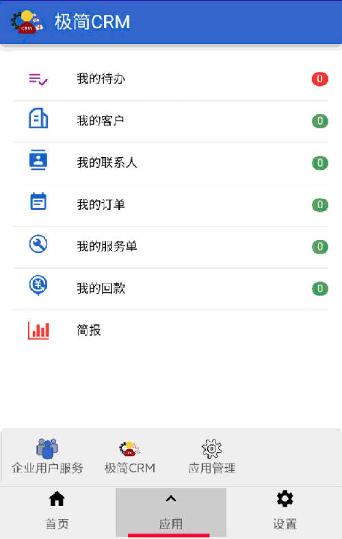

打开一个应用，使用一段时间后，再次点击“应用”按钮，可以切换到其他应用。 如果退出程序，下次打开程序时，会自动进入上次打开过的应用。

Windows版本的客户端与此类似，应用栏显示在屏幕的右侧。

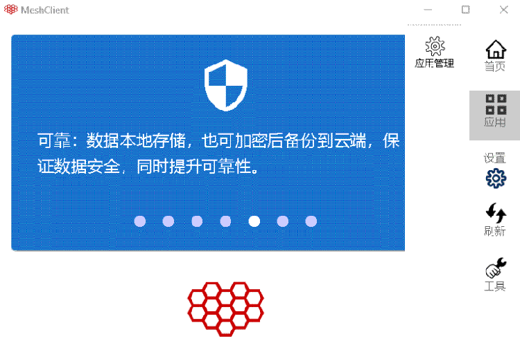

## 公司帐号管理

公司级服务大多依赖公司帐号服务，它记录了公司内所有员工的帐号、密码、授权等信息。主要功能有员工帐号管理、服务授权与群组管理。系统实现中，强依赖帐号管理与服务授权。群组管理在每个业务中根据需要使用，在CRM、会员服务中都未使用群组功能。

### 帐号管理

公司级员工帐号只有超级管理员可以增加、删除，在界面的右上角有“服务授权”与“群组管理”两个图标。

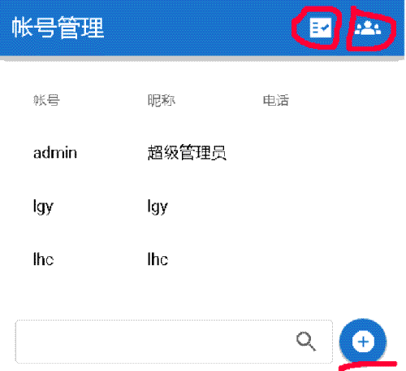

点击某个员工帐号，进入帐号详情界面，在此可以修改员工的邮箱、电话号码等信息。忘记密码时，可以在此重置密码。

注意：重置的密码是随机生成的6个字符，在使用此密码登录后，需及时更改。

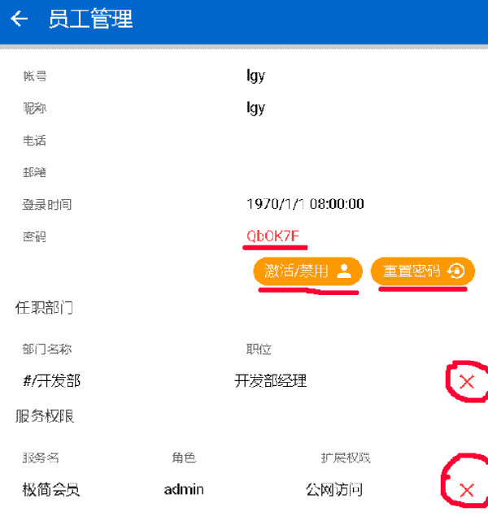

在此还可以禁用帐号，禁用的帐号无法登录系统，也可以重新启用。在此还可以查看帐号从属于哪些组织、在服务中拥有的授权。 如果需要调整，可以删除从属关系与授权。

### 服务授权

员工拥有帐号后，还不能在任何服务中进行操作，只有经过超级管理员授权后，才可以使用相应的服务。 授权时指定的角色，需要服务的开发人员在角色定义接口中定义。

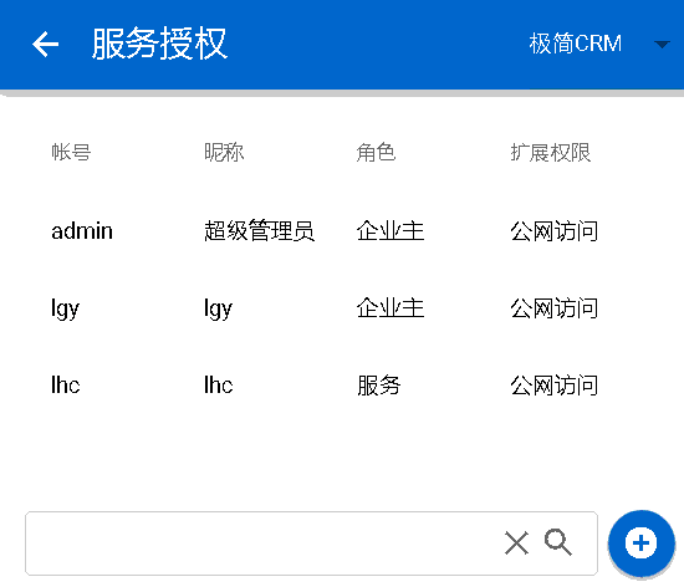

授权时可以指定是否可以在公网访问内网的服务，如果未授权公网访问，则只能在内网访问服务。

# 服务器安装

## 运行环境安装

在Linux、Window、Termux中只需安装OpenJDK11及以上版本即可，安装方法请参照[运行环境安装](#compile_and_install)。

## 服务程序安装

### 1、JVM环境

Linux、Termux、Windows中使用Java运行服务器。Linux、Termux中需要创建mesh用户，以mesh身份下载、安装、运行。

1. 创建server目录；

2. 从[码云](https://gitee.com/zhijian_net/MeshServer)或[GitHub](https://github.com/ZhiJianMesh/MeshServer)下载发布的版本；

3. 解压安装包到server目录；

4. 访问`http://www.zhijian.net.cn/`，点右上角菜单“使用指南”，选择“注册”，进入注册界面，输入注册信息获得注册命令行；

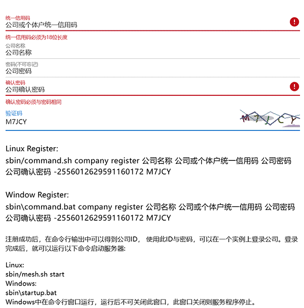

5. 在server目录下运行注册命令，等待注册成功；

6. 在server目录下运行启动命令，等待启动成功。


### 2、Android服务器
Android环境的服务器本质是一个驻留后台的安卓应用，与普通应用没有任何差异，所以安装运行与普通应用也没有任何差异，不需要提前安装运行环境。
1. 从[码云](https://gitee.com/zhijian_net/MeshServer)或[GitHub](https://github.com/ZhiJianMesh/MeshServer)下载发布的安装服务器版本；

2. 安装服务器应用，因为不是从厂商的应用市场下载，安装时会有告警，请忽略；

3. 第一次启动会自动弹出登录&注册界面，如果尚未注册，请先输入信息注册；

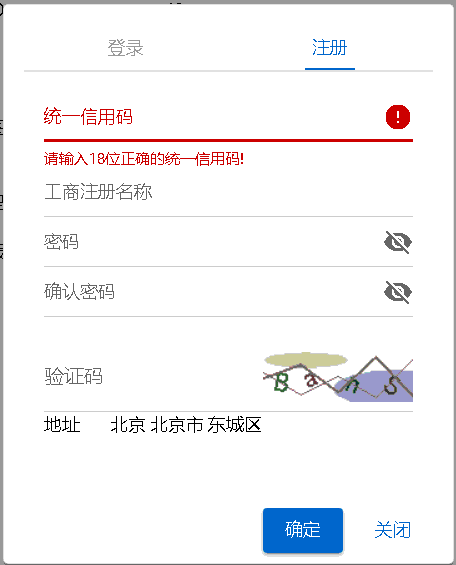

4. 注册完成后，输入公司id及密码登录；

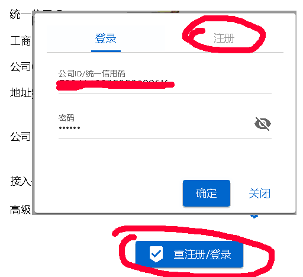

5. 登录完成后就可以点击启动按钮启动服务器。

### 3、数据备份设置

默认不开启每日备份。开启后，每天会自动将数据打包加密后存到至简网格的空间中，会产生一定的费用，每年大约几十元。

因为数据是打包加密的，所以至简网格无法读取您的数据。在恢复数据时必须输入数据备份密码才可以解开。

一旦恢复数据，最多会丢失一天的数据，所以建议只有在极端的情况才执行， 比如手机损坏、丢失，或者换机时才考虑恢复数据。

在换机的情况下，可以先关闭服务器，然后执行“立即备份”，将数据备份到至简网格。 当新手机安装好服务器软件后，再选择恢复数据，这样不会有数据损失。立即备份与定时备份一样，会消耗一次备份机会。

以下几个参数的注意事项：
| 参数 | 注意事项 |
| ---- | ------ |
| 每日备份时间点 | 默认为凌晨2点，时间点建议设置在业务低峰期，通常在凌晨2点 |
|备份站点	| 请选择离自己距离近的备份站点，这样可以缩短备份与恢复时间。每多一个备份站点，数据丢失的可能性越低，系统按“G.年”计费，每多一个站点，相应多占用一份空间 |

在配置发生变更后，会出现“保存”按钮，只有保存后，配置才会生效。

## 服务安装

### 系统管理工具
服务器程序都内置了SystemOM服务，客户端登录公司后，可以在“应用管理-公司服务”中安装此服务。


进入SystemOM就会要求输入公司登录密码（公司注册时设置的密码），验证成功后，在它的应用市场中可以在服务端安装、升级或卸载服务。

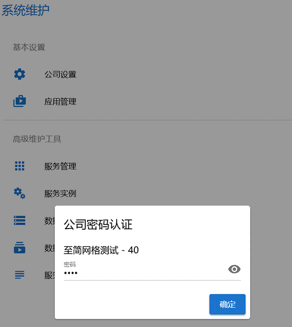

### 常见服务

至简网格提供了二十多个公司服务，能满足大部分中小企业IT工具需求。

| 名称  | 主要功能 |
| ---- | ----    |
| 极简会员 | 会员信息记录、消费信息记录、积分管理等，会员可以选择使用密码，消费记录可以一键导出为word文档 |
| 课时管理 | 学员信息记录、课时信息记录、积分管理等，课时记录可以一键导出为word文档 |
| 业财一体 | 包括ibfbase基础服务、ibusiness差旅、ifinance财务、iproject项目管理、ihr人事管理、iresource资源管理，icrm客户关系管理。ibusiness、iproject、ihr、iresource、icrm都围绕ifinance的收支平衡表展开，支出与收入都记入ifinance服务，ifinance定时输出财务报表；<br>icrm负责客户信息管理、销售机会管理等，关联的销售项目、差旅、采购、发货、回款等调用iproject、ibusiness、iresource、ifinance完成 |
| 简易记账 | 实现分散的团队管理，组织者给队员分发任务，组织者提成、队员分成计算、收支报表等 |
| 消息交换中心 | 接受端侧定时请求，在请求的响应中下发命令，完成对设备的远程管理 |
| 进销存系统 | 实现采购、销售两个主要功能，商品、分类、客户、供应商管理等辅助功能 |
| 用户管理 | 包括公司用户帐号管理、授权管理，是所有服务的基础服务 |