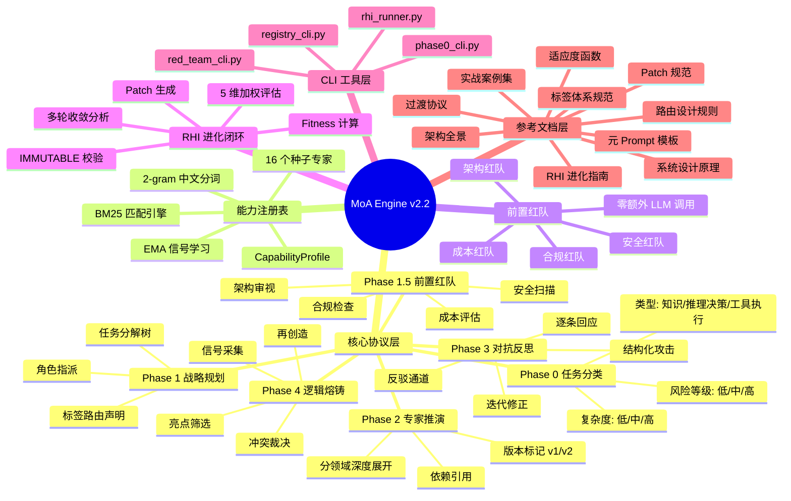

# MoA Engine v2.2 架构全景

> 一份面向开发者与使用者的完整架构说明，涵盖子系统职责、数据流、接口契约与扩展点。

## 目录

- [1. 项目定位](#1-项目定位)
- [2. 架构全景图](#2-架构全景图)
- [3. 五层架构](#3-五层架构)
- [4. 子系统详解](#4-子系统详解)
- [5. 数据流全景](#5-数据流全景)
- [6. 文件索引](#6-文件索引)
- [7. 接口契约](#7-接口契约)
- [8. 扩展点](#8-扩展点)

---

## 1. 项目定位

MoA Engine 是一个**单模型内模拟多智能体协作的编排系统**。通过一套结构化协议（分工-对抗-熔铸），将单次 LLM 调用转化为多角色协同的深度推演流程，产出超越常规回答质量的高阶解决方案。

**核心价值**：把"三个臭皮匠顶个诸葛亮"的朴素智慧，通过精确的沟通协议编程进大模型的思维路径。

---

## 2. 架构全景图



---

## 3. 五层架构

MoA Engine 从底向上分为五层，每层职责清晰、接口稳定。

```
┌─────────────────────────────────────────────────────────────┐
│  5. 参考文档层 (references/)                                 │
│  设计原理 / Prompt模板 / 规范 / 案例 / 指南                    │
├─────────────────────────────────────────────────────────────┤
│  4. CLI 工具层 (scripts/)                                    │
│  phase0  task  registry  redteam  rhi                       │
├─────────────────────────────────────────────────────────────┤
│  3. 进化闭环层 (RHI)                                         │
│  信号采集 → Fitness评估 → Patch生成 → 应用 → 下一轮          │
├─────────────────────────────────────────────────────────────┤
│  2. 执行引擎层 (MoA Core)                                    │
│  Phase 0 → Phase 1 → Phase 1.5 → Phase 2 → 3 → 4          │
├─────────────────────────────────────────────────────────────┤
│  1. 基础设施层 (数据+协议)                                    │
│  XML标签体系 / 精准路由 / CapabilityProfile / [IMMUTABLE]    │
└─────────────────────────────────────────────────────────────┘
```

### 第 1 层：基础设施

| 组件 | 职责 | 关键设计 |
|------|------|---------|
| **XML 标签体系** | 统一信息结构，版本/状态/依赖标记 | Layer 0-4 五层架构 |
| **精准路由** | 按需加载、依赖感知、严重度优先 | 推模式 + 动态批判者追加 |
| **CapabilityProfile** | 专家画像结构化 Schema | 6 维 performance_vector |
| **[IMMUTABLE] 保护** | 核心机制不可被 RHI 侵蚀 | 6 项不可变 + 3 项保护摩擦区 |

### 第 2 层：执行引擎

| 阶段 | 职责 | 产出 |
|------|------|------|
| **Phase 0** | 任务类型判断，策略选择 | `<task_type>` + `<complexity>` + `<risk_flag>` |
| **Phase 1** | 任务分解，角色指派，路由声明 | `<decomposition>` + `<assignment>` |
| **Phase 1.5** | 前置红队风险扫描 | `<pre_risk>` 注入各子任务 |
| **Phase 2** | 专家分领域深度推演 | `<proposal version="v1">` |
| **Phase 3** | 结构化对抗，迭代修正 | `<attack>` → `<revision>` → `<verdict>` |
| **Phase 4** | 逻辑熔铸，信号采集 | `<final_answer>` + `<signal>` |

### 第 3 层：进化闭环

| 步骤 | 输入 | 输出 |
|------|------|------|
| **信号采集** | Phase 4 产出的 `<signal>` 标签 | 结构化信号数组 |
| **Fitness 计算** | 信号数组 + 5 维权重 | `fitness ∈ [0,1]` + 最弱维度 |
| **Patch 生成** | fitness + 信号详情 | 增强指令（仅自由区） |
| **IMMUTABLE 校验** | Patch XML | 通过/拒绝 |
| **下一轮执行** | 增强后的 Prompt | 新一轮 MoA 执行 |

### 第 4 层：CLI 工具

| 工具 | 子命令 | 功能 |
|------|--------|------|
| `phase0_cli.py` | `classify` | 任务类型判断 + 复杂度/风险评估 + 专家推荐 |
| | `list-types` | 列出所有任务类型及其协议 |
| `registry_cli.py` | `match` | BM25 语义匹配，Top-K 专家推荐 |
| | `list` | 列出/按领域筛选专家画像 |
| | `register` | 注册新专家画像 |
| | `update` | 信号学习，EMA 更新 performance_vector |
| | `stats` | 注册表统计信息 |
| `red_team_cli.py` | `run` | 执行前置红队扫描 |
| | `list-teams` | 列出所有红队类型 |
| `rhi_runner.py` | `fitness` | 计算适应度得分 |
| | `enhance` | 生成增强指令 |
| | `analyze` | 多轮分析，输出 fitness 曲线 |

### 第 5 层：参考文档

见下方 [6. 文件索引](#6-文件索引) 表格。

---

## 4. 子系统详解

### 4.1 MoA 核心编排引擎

**职责**：将单次 LLM 调用转化为多角色协同的深度推演流程。

**核心机制**：

```
用户任务
  │
  ▼
Phase 0: 任务类型判断 ──→ 类型/复杂度/风险 → 策略选择
  │
  ▼
Phase 1: 战略规划 ──→ 任务分解树 + 角色指派 + 路由声明
  │                    ↑
  │                    └─ registry_cli.py match (专家推荐)
  ▼
Phase 1.5: 前置红队 ──→ 风险清单注入各子任务
  │                    ↑
  │                    └─ red_team_cli.py run (架构/安全/合规/成本)
  ▼
Phase 2: 专家推演 ──→ 分领域深度展开，版本标记 [v1]
  │
  ▼
Phase 3: 对抗反思 ──→ 批判者攻击 → 专家回应 → 修正 [v2] → 裁决
  │                    ↑ 反驳通道 ← 专家可反驳错误批判
  ▼
Phase 4: 逻辑熔铸 ──→ 亮点筛选 → 冲突裁决 → 再创造 → 信号采集
  │
  ├─→ 最终答案
  │
  ├─→ registry_cli.py update (信号学习 → 画像进化)
  │
  └─→ rhi_runner.py fitness (评估 → 增强 → 下一轮)
```

**触发条件**：当用户需要高质量方案输出、多角度分析、高风险决策审视、跨领域方案设计或深度架构评审时。

### 4.2 能力注册表

**职责**：结构化专家画像存储 + BM25 语义匹配 + 信号学习进化。

**核心数据结构**：

```json
{
  "id": "expert-dist-arch",
  "title": "分布式系统架构师",
  "domains": ["architecture", "distributed_systems", "microservices"],
  "skills": ["系统设计", "技术选型", "容量规划"],
  "thinking_style": "systems",
  "performance_vector": {
    "proposal_depth": 0.5,
    "critique_specificity": 0.5,
    "revision_quality": 0.5,
    "synthesis_novelty": 0.5,
    "token_efficiency": 0.5,
    "adoption_rate": 0.5
  }
}
```

**匹配算法**：BM25 + 2-gram 中文分词（零依赖，纯 Python 实现）。

**进化机制**：每次 MoA 执行后，`<signal>` 标签通过 EMA 公式更新 `performance_vector`：

```
new_value = 0.3 * signal_score + 0.7 * old_value
```

### 4.3 前置红队

**职责**：在专家产出前进行风险预扫描，将对抗前置到 Phase 1.5。

**四种红队**：

| 红队 | 触发条件 | 核心视角 |
|------|----------|---------|
| 架构红队 | 所有推理决策型任务 | 单点故障、扩展性瓶颈、数据一致性 |
| 安全红队 | 涉及 auth/data/net/依赖 | STRIDE 威胁建模、攻击面、供应链 |
| 合规红队 | risk_flag=高 或标注合规域 | GDPR/PCI-DSS/等保/行业法规映射 |
| 成本红队 | 工具执行型或标注成本敏感 | Token/延迟/云资源上下界 |

**关键设计**：零额外 LLM 调用——复用宿主模型，只切换 System Prompt。

### 4.4 RHI 进化闭环

**职责**：通过递归式自我改进，让系统在单任务内自动优化协作方式。

**Fitness 函数**：

```
fitness = 0.30 * synthesis_novelty
        + 0.25 * critique_specificity
        + 0.20 * revision_quality
        + 0.15 * token_efficiency
        + 0.10 * immutability_intact
```

**收敛标准**：fitness >= 0.85 或达到最大轮次（默认 3 轮）。

**IMMUTABLE 保护**：6 项核心不可变（I1-I6），3 项保护摩擦区（P1-P3），Patch 应用前强制校验。

### 4.5 Phase 0 任务分类

**职责**：在执行前自动分析任务特征，选择最优执行策略。

**三种任务类型**：

| 类型 | 识别关键词 | 对抗轮次 | 决策协议 |
|------|-----------|---------|---------|
| 知识密集型 | 解释/说明/对比/概述/合规 | 1 轮 | 共识优先 + 事实核查 |
| 推理决策型 | 设计/架构/策略/规划/分析 | 2 轮 | 辩论 + 深度对抗 |
| 工具执行型 | 生成/编写/实现/配置/部署 | 1 轮 | 质量批判 + 总管调度 |

**复杂度评估**：基于任务长度、技术术语密度、领域跨度的综合判断。

**风险等级**：基于敏感关键词（支付/金融/隐私/安全/合规）的自动识别。

---

## 5. 数据流全景

```
用户输入: "设计高并发消息队列"
  │
  ├─ 1. phase0_cli.py classify
  │    → type: reasoning_decision
  │    → complexity: high
  │    → risk: medium
  │    → domains: [architecture, distributed_systems]
  │
  ├─ 2. registry_cli.py match
  │    → top-3: 分布式系统架构师, API设计专家, 性能优化专家
  │
  ├─ 3. MoA Phase 1: 战略规划
  │    → 任务分解: [消息模型设计, 存储引擎, 网络传输, 客户端SDK]
  │    → 角色指派: 分布式系统架构师→消息模型, 数据库专家→存储...
  │    → 路由声明: 依赖: 存储引擎→消息模型
  │
  ├─ 4. red_team_cli.py run (arch + sec)
  │    → 架构风险: 消息顺序性保障, 数据一致性, 分区容错
  │    → 安全风险: 消息篡改, 认证绕过
  │    → 注入各子任务 <pre_risk>
  │
  ├─ 5. MoA Phase 2: 专家推演
  │    → 各专家输出 [v1] 方案，须回应 pre_risk
  │
  ├─ 6. MoA Phase 3: 对抗反思
  │    → 批判者逐条攻击 → 专家修正 [v2]
  │    → 1-2轮迭代 → 批判者确认无重大风险
  │
  ├─ 7. MoA Phase 4: 逻辑熔铸
  │    → 筛选亮点, 裁决冲突, 再创造
  │    → 产出 <final_answer> + <signal> 标签
  │
  ├─ 8. registry_cli.py update
  │    → 解析 <signal> → EMA更新 performance_vector
  │    → 专家画像进化
  │
  └─ 9. rhi_runner.py fitness
       → fitness = 0.72, 最弱维度: critique_specificity
       → 生成增强指令 → 注入下一轮 Prompt
       → 若 fitness >= 0.85 或 round >= 3 → 收敛
```

---

## 6. 文件索引

### 核心入口

| 文件 | 行数 | 职责 |
|------|------|------|
| `SKILL.md` | 300 | 执行协议入口，含 Phase 0-4 完整流程 |

### CLI 工具

| 文件 | 行数 | 核心功能 | 子命令 |
|------|------|---------|--------|
| `scripts/phase0_cli.py` | 383 | 任务类型自动判断 | classify, list-types |
| `scripts/registry_cli.py` | 564 | 能力注册表 + BM25 匹配 + 信号学习 | match, list, register, update, stats |
| `scripts/red_team_cli.py` | 303 | 前置红队扫描 | run, list-teams |
| `scripts/rhi_runner.py` | 430 | RHI 进化闭环 | fitness, enhance, analyze |

### 参考文档

| 文件 | 行数 | 何时读取 |
|------|------|---------|
| `references/PROJECT_OVERVIEW.md` | 227 | 需要理解全局架构、MoA/RHI 价值定位时 |
| `references/architecture-overview.md` | — | 需要理解系统架构层次、数据流、接口契约时 |
| `references/moa-system-guide.md` | 348 | 需要深入理解 MoA 设计原理时 |
| `references/moa-tag-system.md` | 277 | 需要理解 XML 标签体系、Layer 0-4 层级时 |
| `references/moa-routing-design.md` | 176 | 需要理解路由规则、按需加载、依赖感知时 |
| `references/moa-meta-prompt.md` | 314 | 需要获取完整元 Prompt 模板时 |
| `references/moa-rhi-guide.md` | 419 | 需要深入理解 RHI 进化机制时 |
| `references/moa-phase-transition.md` | 239 | 需要理解 MoA→RHI 过渡协议时 |
| `references/fitness-function.md` | 82 | 需要理解适应度函数公式、权重设计时 |
| `references/patch-spec.md` | 157 | 需要理解 Patch 结构、IMMUTABLE 校验规则时 |
| `references/moa-case-study.md` | 716 | 需要参考完整实战案例时 |
| `references/capability-profiles.json` | 630 | 能力注册表的种子数据（16 个专家画像） |

---

## 7. 接口契约

### 宿主需要提供

| 接口 | 类型 | 说明 | 必需 |
|------|------|------|------|
| `host_model(prompt: str) -> str` | Callable | 统一推理入口 | 是 |
| 任务文本 | str | 用户输入的任务描述 | 是 |

### CLI 工具间的数据交换格式

所有 CLI 工具输出为标准 JSON，通过 stdout 传递，便于管道组合：

```bash
# 完整流程示例（伪代码）
python scripts/phase0_cli.py classify --task "..." --json \
  | python scripts/registry_cli.py match --profiles ... \
  | ... 注入 MoA Prompt ...
```

### 输出格式

| 产出 | 格式 | 说明 |
|------|------|------|
| 最终答案 | `[最终答案]：` 开头 | 熔铸后的完整解决方案 |
| 信号标签 | `<signal>` XML 标签 | 用于 RHI 评估和画像更新 |
| 风险清单 | `<pre_risk>` XML 标签 | 红队产出，注入各子任务 |
| 匹配结果 | JSON | 注册表匹配的专家推荐列表 |

---

## 8. 扩展点

| 方向 | 说明 | 前置条件 |
|------|------|---------|
| **Embedding 升级** | 从 BM25 切换为 ONNX/sentence-transformers | 安装对应依赖，替换 Embedder 实现 |
| **事件总线** | 引入 Pub/Sub 机制，异步解耦 | 多 API 实例场景 |
| **在线自适应调节器** | Phase 间实时调节深度/Token | 信号数据积累 |
| **跨会话知识迁移** | 历史执行记录跨会话复用 | 画像数据积累 |
| **多模型异构** | 不同 Phase 用不同模型 | 多 API Key 配置 |
| **可视化 Dashboard** | MoA Trace 可视化 | 结构化日志输出 |

---

> 文档版本: v2.2 | 最后更新: 2025 | 对应项目: moa-engine