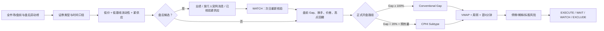

# Money Claw · US Stocks

[English](README_EN.md)

> **别再靠感觉追盘前或盘后涨幅榜。安装 Money Claw，把异动转成可验证、可复盘、可执行的量化决策流程。**

[立即安装](#安装) · [查看使用示例](#使用示例) · [购买定制版量化-SKILL](#购买定制版量化-skill)

**商务合作 / 购买定制版：📧 [hrclaw@126.com](mailto:hrclaw@126.com)**

> **法律提示：** 公开版及定制开发仅定位为通用软件、数据处理和量化研究工具，不提供个性化荐股、证券/期货投资咨询、代客理财、经纪撮合、资金托管或自动代客下单服务。

面向美股低流通盘、低价股和 extreme squeeze 的 Codex SKILL。从盘前或盘后异动榜开始，依次验证股本供应、消息质量、基线流动性、Gap、VWAP、周转速度、停牌及稀释风险，输出可执行的观察与风控清单。

目标是研究和筛选可能触发日内最高涨幅 `+500%` 的极端事件，不预测确定收益。

## 亚太用户与 English Delivery

> **English scope:** Money Claw primarily serves investors and traders in Asia-Pacific countries who
> monitor U.S. market sessions and issuer disclosures. The workflow keeps U.S. Eastern Time (ET) as
> the primary trading reference and can show the user's local time zone as a secondary reference.

英文为亚太跨市场使用场景的默认交付语言；用户明确指定中文或其他语言时遵从其要求。所有
盘前、正式开盘和盘后时段均以 ET 为准；用户提供所在地或时区后，才补充对应本地日期和
时间，避免把不同亚太国家的隔夜行情误读为同一交易日。发行人新闻稿、SEC 标题、URL 与
申报标签保留英文原文。

## 研究案例

该工作流在历史研究和样本外验证中覆盖了以下极端行情案例：

`ELPW` · `TDIC` · `SKK` · `CPOP` · `RGNT` · `CPHI`

这些代码用于验证模型对不同 price-volume path 的识别能力，不代表全部为事前实盘信号，也不构成未来收益承诺。精确研究口径保存在内部 reference 中，README 不展示单只股票的日期和涨幅。

## 盘后榜案例：FGI 与 GXAI

盘后榜不是直接买入信号，而是下一交易日候选发现层。工作流把候选拆成三条可验证路径：

- `AFTER_HOURS_EARNINGS`：以 GXAI 类型为代表，必须有可核验的业绩或正式公司披露支撑。
- `AFTER_HOURS_OFFICIAL_NEWS`：发行人官网、IR 或 newsroom 在核验窗口内直接发布的原始
  消息。必须记录原始 URL、标题、发布时间和事实类型；只有披露客户/合同主体、金额或
  期限、收入影响等事实时，才能称为新增订单证明。
- `AFTER_HOURS_LOW_SUPPLY`：以 FGI 类型为代表，必须核验低总股本/低 float，同时排除 ATM、注册转售、warrant、PIPE、equity line 等新增供给风险。

> **FGI 案例复盘：** 用户反馈 Money Claw 从盘后涨幅榜识别出 FGI，并在后续交易中实现盈利。用户提供的时点截图显示，FGI 总股本约 `193.10万股`、当时涨幅约 `+147.78%`，体现了“盘后异动 + 紧供应 + 次日再确认”路径的研究价值。这是未经独立审计的用户个案，仅用于说明筛选流程，不代表典型结果、事前收益承诺或未来表现。

FGI 与 GXAI 说明同一件事：盘后涨幅本身只是入口，真正可复用的是“消息/供应解释 → 流动性门槛 → 次日盘前与开盘复核”。合格盘后候选最高只输出 `WATCH`，不得直接输出 `EXECUTE`。
官网消息即使尚未对应 8-K，也可构成已核验催化；但战略规划、品牌重启或合作意向必须标记
为 `OFFICIAL_NEWS_NOT_ORDER`，不能写成新订单发酵。官网利好消息不能覆盖 SEC 中已确认的
ATM、注册转售、PIPE 或其他即时供给风险。

## 为什么安装

- **减少盯盘噪音**：把盘前与盘后涨幅榜转换成结构、事件、执行三层筛选结果。
- **拒绝模糊信号**：数据不足时输出 `WAIT_DATA`，不拿猜测替代 float、Gap、VWAP 或 dilution 数据。
- **统一模型状态**：输出 `EXECUTE`、`WAIT_OPEN`、`WAIT_DATA`、`WATCH`、`EXCLUDE`；这些是量化门槛状态，不是针对用户的买卖建议。
- **可以批量复用**：既能让 Codex 分析截图和实时行情，也能用 Python 对 CSV/JSON 股票池批量评分。
- **保留风险纪律**：把停牌、反向拆股、稀释、价差和仓位公式放在交易判断之前。

如果你每天都在手工翻盘前榜、查股本、看公告、算换手，这个 SKILL 可以把重复工作压缩成一条标准化工作流。

## 核心逻辑



模型分为三层：

1. **结构候选**：前收 `$0.30–$5.00`、20日中位成交额不超过 `$1.00m`、低 float 或低总股本。
2. **事件确认**：盘前强度、正式开盘 Gap、供应周转和 VWAP 结构。
3. **可执行交易**：首个5分钟结构、spread、停牌和盘前供给风险核验全部通过；确认存在供给风险直接 `EXCLUDE`。

核心公式：

```text
pre_gap_pct       = (pre_price / prev_close - 1) * 100
official_gap_pct  = (open_price / prev_close - 1) * 100
pre_turnover      = pre_volume / supply_shares
regular_turnover  = regular_volume / supply_shares
spread_pct        = (ask - bid) / ((ask + bid) / 2) * 100
pre_high_fade_pct = (pre_price / pre_high - 1) * 100
after_gap_pct      = (after_price / regular_close - 1) * 100
after_turnover     = after_volume / supply_shares
after_spread_pct   = (after_ask - after_bid) / ((after_ask + after_bid) / 2) * 100
after_high_fade_pct= (after_price / after_high - 1) * 100
```

## 安装

复制项目目录到 Codex skills 目录：

```bash
cp -R money-claw-us-stocks "${CODEX_HOME:-$HOME/.codex}/skills/"
```

Windows PowerShell：

```powershell
$codexRoot = if ($env:CODEX_HOME) { $env:CODEX_HOME } else { Join-Path $HOME '.codex' }
Copy-Item -Recurse -Force '.\money-claw-us-stocks' (Join-Path $codexRoot 'skills\money-claw-us-stocks')
```

安装后重新打开 Codex task，使用 `$money-claw-us-stocks` 显式调用。

**安装完成后，直接复制下一节的提示词即可开始第一次扫描。** 如果你需要接入自己的数据源、券商接口或私有因子，跳转到[购买定制版量化 SKILL](#购买定制版量化-skill)。

## 使用示例

```text
使用 $money-claw-us-stocks 分析今天盘前涨幅前30名，按暴涨因子排序并给出开盘升级条件。
```

```text
使用 $money-claw-us-stocks 判断某只盘中停牌股是否仍符合暴涨候选，并给出复牌后的失效条件和仓位公式。
```

```text
使用 $money-claw-us-stocks 分析今天盘后涨幅榜，区分业绩支撑与紧供应路径，排除新增供给风险，并生成次日复核清单。
```

```text
Use $money-claw-us-stocks to reconcile today's issuer newsroom releases with SEC filings, classify
the catalyst, and distinguish a verified order from a strategy-only announcement.
```

```text
Use $money-claw-us-stocks to rank today's U.S. premarket movers and produce an opening confirmation checklist.
```

## 批量评分

评分器接受 CSV 或 JSON；只有 `symbol` 是语法必填字段，缺失的决策字段保持 `UNKNOWN`，不会被默认为零。

```powershell
python .\scripts\score_candidates.py .\candidates.csv --format markdown
python .\scripts\score_candidates.py .\candidates.json --format json
```

主要输入包括：

- 结构：`security_type`、`listed_days`、`prev_close`、`float_shares`、`total_shares`、`median_dollar_volume_20`
- 盘前：`pre_price`、`pre_high`、`pre_volume`、`bid`、`ask`
- 盘后：`regular_close`、`after_price`、`after_high`、`after_volume`、`after_bid`、`after_ask`、`after_hours_catalyst_quality`、`after_hours_supply_thesis`
- 官网消息：`issuer_news_status`、`issuer_news_checked_at`、`issuer_news_title`、`issuer_news_published_at`、`issuer_news_url`、`issuer_news_type`、`issuer_news_materiality`
- 开盘：`open_price`、`last_price`、`regular_volume`、`vwap`、`first_5m_structure`
- CPHI路径：`prior_abnormal_volume_warmup`、`turnover_expanding`
- 风险：`split_today`、`post_split`、`halted`、`dilution_overhang`、`premarket_supply_risk`、`supply_risk_type/source/checked_at`

JSON输出增加：

- `path_type`：`CONVENTIONAL_GAP`、`CPHI_SUBTYPE`、`AFTER_HOURS_EARNINGS`、`AFTER_HOURS_OFFICIAL_NEWS`、`AFTER_HOURS_LOW_SUPPLY`、`NONE`
- `official_issuer_news`：官网消息的 ET 核验窗口、标题、发布时间、原始 URL、事实类型及订单证明状态
- `risk_flags`：停牌、稀释、post-split、供应代理和缺失数据
- `evidence_score`：证据评分，不是上涨概率

## 决策状态

| 状态 | 含义 |
|---|---|
| `EXECUTE` | 模型门槛全部确认；不等于买入建议或自动下单指令 |
| `WAIT_OPEN` | 强盘前候选，等待正式开盘 |
| `WAIT_DATA` | 关键字段缺失 |
| `WATCH` | 部分因子符合、执行门槛失败、正在停牌，或盘后路径已确认但必须等待次日复核 |
| `EXCLUDE` | 证券类型、当日split、结构/事件强度失败，或正式来源确认存在盘前供给风险 |

## 风控

```text
risk_budget = account_equity * 0.25%
shares = floor(risk_budget / abs(entry - stop))
```

- 禁止盘前或复牌瞬间使用市价单追涨。
- 禁止补仓摊低成本。
- 跌破 VWAP 且周转停止扩张时，优先按供应释放处理。
- halt gap、slippage 和流动性枯竭可能使实际亏损超过计划止损。

## 购买定制版量化 SKILL

公开版适合体验和验证 Money Claw 的完整筛选框架；如果你希望把它真正嵌入自己的交易系统，可以购买私人定制版量化 SKILL。

定制服务仅限软件工程、公开数据处理、研究框架和用户自定规则的技术实现，不包含针对个人情况推荐具体证券、提供买卖时点、承诺收益、代客操作账户或持续提供一对一投资建议。如需求可能构成受监管活动，应由相应司法辖区的持牌机构另行评估和提供，本项目不承接该部分。

定制方向可按需求评估：

- 专属市场、行业、价格区间和股票池规则
- 私有因子权重、回测标签和候选评分模型
- 券商/API、实时行情、新闻公告和告警系统接入
- 将客户自行确定的最大回撤、止损和组合暴露参数工程化；项目方不替客户决定参数
- 每日盘前扫描、开盘确认、盘中停牌和盘后复盘工作流
- Markdown、CSV、JSON、Dashboard 或自动化报告输出

联系时请说明你的交易市场、数据源、策略周期、账户约束和期望交付形式，我会基于需求确认范围和报价。

**现在联系购买定制版：** [hrclaw@126.com](mailto:hrclaw@126.com)

> 想把自己的交易经验变成一套可重复执行的量化 SKILL？直接发邮件，标题注明“Money Claw 定制”。

## 重要法律与风险声明

### 1. 服务性质

- 本项目及相关定制服务仅提供通用软件工具、数据处理、回测工程和量化研究工作流，不构成证券、期货、基金、虚拟资产或其他金融产品的投资建议、投资咨询、研究报告分发、招揽、要约或推荐。
- 本项目不提供经纪、交易执行、自动代客下单、账户管理、资产管理、资金托管、收益分成或代客理财服务。
- 使用、安装、购买软件开发服务或发送邮件，不建立投资顾问、经纪、资产管理、受托、代理或其他信义关系。
- `EXECUTE`、评分、排名、价格区间、止损及其他输出均是模型状态或示例，不是针对任何用户情况作出的买入、卖出或持有指令。

### 2. 中国大陆、香港和澳门特别提示

- **中国大陆：** 有偿提供证券分析、预测、建议，以及具备具体证券选择或买卖时机功能的软件，可能受到证券投资咨询及“荐股软件”规则监管。本项目不以任何未披露或不可核验的持牌资格开展该等业务，也不接受个性化荐股、跟单、喊单或代客理财需求。
- **香港：** `advising on securities` 属香港《证券及期货条例》下的 Type 4 regulated activity。本项目不表示项目方已获香港证监会发牌，也不向用户提供需要相关牌照的个性化证券建议、交易安排或资产管理服务。
- **澳门：** 金融机构及证券中介等金融活动可能需要澳门金融管理局及相关主管机关许可。本项目不表示已取得有关许可，不提供须获许可的金融中介、投资管理或代客交易服务。
- 如果你所在地区把某项软件功能、输出或定制需求认定为受监管活动，请停止使用该功能，并向当地持牌机构及专业律师咨询。**本免责声明不能使原本受监管或违法的活动变为合法。**

### 3. 投资与数据风险

- 低价、低流通盘和停牌股票可能出现极端波动、流动性枯竭、滑点、无法成交、复牌跳空、退市或本金全部损失。
- 历史案例、回测、模拟结果、命中率和样本外验证均不代表未来表现，也不代表任何用户能够按事件最高价成交。
- 行情、股本、float、公司行动、新闻和第三方数据可能延迟、遗漏、复权错误或不准确；用户必须通过券商、交易所、监管披露等独立来源复核。
- 用户自行决定是否交易，并自行承担适当性判断、交易权限、税务、外汇、跨境数据、软件使用及全部投资损益。

### 4. 责任限制

- 在适用法律允许的最大范围内，本项目按“现状”和“可用状态”提供，不保证准确性、完整性、及时性、适销性、特定用途适用性或持续可用性。
- 项目方不对因使用或无法使用本项目产生的交易损失、机会损失、数据错误、系统中断或间接损失承担责任；但本条不排除适用法律规定不得排除或限制的责任。
- 本声明不是法律、税务或合规意见。面向公众销售、持续运营或接入真实交易账户前，应由熟悉目标司法辖区的律师进行独立审查。

### 5. 监管参考

- [中国大陆：《证券、期货投资咨询管理暂行办法》](https://xzfg.moj.gov.cn/front/law/detail?LawID=500)
- [中国证监会：《关于加强对利用“荐股软件”从事证券投资咨询业务监管的暂行规定》](https://www.csrc.gov.cn/csrc/c101838/c1021995/content.shtml)
- [香港证监会：Do you need a licence or registration?](https://www.sfc.hk/en/Regulatory-functions/Intermediaries/Licensing/Do-you-need-a-licence-or-registration)
- [澳门金融管理局：牌照申请](https://www.amcm.gov.mo/zh-hant/bank/bank-license-application)
