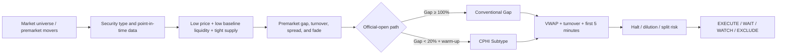

# Money Claw · US Stocks

[中文](README.md)

> **Stop chasing premarket leaderboards by instinct. Install Money Claw and turn unusual moves into a verifiable, repeatable, and executable quantitative workflow.**

[Install Now](#installation) · [Try the Prompts](#usage-examples) · [Purchase a Custom Quant SKILL](#purchase-a-custom-quant-skill)

**Business inquiries / Custom Quant SKILL: 📧 [hrclaw@126.com](mailto:hrclaw@126.com)**

> **Legal notice:** The public edition and all custom development are limited to general-purpose software, data processing, and quantitative research tools. They do not provide personalized stock recommendations, securities or futures advice, brokerage, custody, discretionary management, or automated trading on a client's behalf.

A Codex SKILL for U.S. low-float, low-priced, and extreme-squeeze stocks. It starts with premarket movers, then validates share supply, baseline liquidity, premarket quality, the official opening gap, VWAP, turnover, halts, and dilution risk before producing an executable watchlist and risk checklist.

The model researches and screens extreme events that may reach a `+500%` intraday high. It does not predict guaranteed returns.

## Research Cases

The workflow has covered the following extreme-move cases in historical research and out-of-sample validation:

`ELPW` · `TDIC` · `SKK` · `CPOP` · `RGNT` · `CPHI`

These tickers validate the model across different price-volume paths. They were not necessarily all identified as live pre-event calls, and they do not imply future returns. Exact research definitions remain in the internal references; this README intentionally omits per-stock dates and performance figures.

## Why Install It

- **Reduce screening noise**: convert the premarket leaderboard into structural, event, and execution layers.
- **Reject vague signals**: return `WAIT_DATA` instead of guessing float, gap, VWAP, or dilution fields.
- **Get a consistent model state**: standardize every candidate as `EXECUTE`, `WAIT_OPEN`, `WAIT_DATA`, `WATCH`, or `EXCLUDE`; these are quantitative gate labels, not personalized trading advice.
- **Reuse it at scale**: analyze screenshots and live quotes with Codex or batch-score CSV/JSON universes with Python.
- **Put risk first**: evaluate halts, reverse splits, dilution, spreads, and position sizing before trade execution.

If you manually scan premarket movers, verify share counts, read filings, and calculate turnover every day, this SKILL turns that repeated work into one standardized workflow.

## Core Logic



The model separates three layers:

1. **Structural candidate**: prior close of `$0.30–$5.00`, 20-day median dollar volume no higher than `$1.00m`, and low float or total shares.
2. **Event confirmation**: premarket strength, official opening gap, supply turnover, and VWAP structure.
3. **Executable trade**: first-five-minute structure, spread, halt status, and the premarket share-supply review must all pass; confirmed supply risk is an immediate `EXCLUDE`.

Core formulas:

```text
pre_gap_pct       = (pre_price / prev_close - 1) * 100
official_gap_pct  = (open_price / prev_close - 1) * 100
pre_turnover      = pre_volume / supply_shares
regular_turnover  = regular_volume / supply_shares
spread_pct        = (ask - bid) / ((ask + bid) / 2) * 100
pre_high_fade_pct = (pre_price / pre_high - 1) * 100
```

## Installation

Copy the project directory into the Codex skills directory:

```bash
cp -R money-claw-us-stocks "${CODEX_HOME:-$HOME/.codex}/skills/"
```

Windows PowerShell:

```powershell
$codexRoot = if ($env:CODEX_HOME) { $env:CODEX_HOME } else { Join-Path $HOME '.codex' }
Copy-Item -Recurse -Force '.\money-claw-us-stocks' (Join-Path $codexRoot 'skills\money-claw-us-stocks')
```

Restart the Codex task after installation and invoke the skill explicitly with `$money-claw-us-stocks`.

**After installation, copy one of the prompts below to run your first scan.** If you need private data, broker integrations, or proprietary factors, go to [Purchase a Custom Quant SKILL](#purchase-a-custom-quant-skill).

## Usage Examples

```text
Use $money-claw-us-stocks to rank today's top 30 U.S. premarket movers and provide official-open upgrade conditions.
```

```text
Use $money-claw-us-stocks to evaluate a halted intraday mover and provide resumption invalidation levels and position sizing.
```

```text
使用 $money-claw-us-stocks 分析今天盘前涨幅榜，筛选暴涨候选并给出开盘确认清单。
```

## Batch Scoring

The scorer accepts CSV or JSON. Only `symbol` is syntactically required; missing decision fields remain `UNKNOWN` and never silently become zero.

```powershell
python .\scripts\score_candidates.py .\candidates.csv --format markdown
python .\scripts\score_candidates.py .\candidates.json --format json
```

Primary inputs include:

- Structure: `security_type`, `listed_days`, `prev_close`, `float_shares`, `total_shares`, `median_dollar_volume_20`
- Premarket: `pre_price`, `pre_high`, `pre_volume`, `bid`, `ask`
- Open: `open_price`, `last_price`, `regular_volume`, `vwap`, `first_5m_structure`
- CPHI path: `prior_abnormal_volume_warmup`, `turnover_expanding`
- Risk: `split_today`, `post_split`, `halted`, `dilution_overhang`, `premarket_supply_risk`, and `supply_risk_type/source/checked_at`

Additional JSON output:

- `path_type`: `CONVENTIONAL_GAP`, `CPHI_SUBTYPE`, or `NONE`
- `risk_flags`: halt, dilution, post-split, supply proxy, and missing-data risks
- `evidence_score`: an evidence score, not a probability forecast

## Decision States

| Status | Meaning |
|---|---|
| `EXECUTE` | Quantitative gates are confirmed; this is not a buy recommendation or order instruction |
| `WAIT_OPEN` | Strong premarket candidate awaiting the official open |
| `WAIT_DATA` | Required fields are missing |
| `WATCH` | Partial match, failed execution gate, or active halt |
| `EXCLUDE` | Security type, same-day split, structure/event-strength failure, or confirmed premarket share-supply risk |

## Risk Controls

```text
risk_budget = account_equity * 0.25%
shares = floor(risk_budget / abs(entry - stop))
```

- Do not use market orders to chase premarket moves or halt resumptions.
- Do not average down.
- Treat a VWAP loss with no further turnover expansion as supply release.
- Halt gaps, slippage, and disappearing liquidity can cause losses beyond the planned stop.

## Purchase a Custom Quant SKILL

The public edition is designed to demonstrate and validate the complete Money Claw screening framework. Purchase a private custom Quant SKILL when you want the workflow integrated with your own trading system.

Custom work is limited to software engineering, public-data processing, research frameworks, and technical implementation of rules selected by the client. It does not include recommending specific securities for an individual, selecting entry or exit times, promising returns, operating client accounts, or providing ongoing one-to-one investment advice. Any requirement that may constitute a regulated activity must be assessed and delivered by an appropriately licensed provider; that regulated work is outside this project's scope.

Customization can be scoped for:

- Private market, sector, price-range, and universe rules
- Proprietary factor weights, backtest labels, and ranking models
- Broker/API, live market data, filings, news, and alert integrations
- Technical implementation of drawdown, stop-loss, and exposure parameters selected by the client; the project does not choose those parameters for the client
- Daily premarket scans, opening confirmation, intraday halts, and post-market reviews
- Markdown, CSV, JSON, dashboard, or automated reporting outputs

In your email, describe your market, data sources, strategy horizon, account constraints, and preferred deliverables. I will use that information to confirm scope and pricing.

**Contact me to purchase a custom edition:** [hrclaw@126.com](mailto:hrclaw@126.com)

> Want to turn your trading experience into a repeatable Quant SKILL? Email me with “Money Claw Custom” in the subject line.

## Legal and Risk Disclaimer

### 1. Nature of the Service

- This project and its custom editions provide general-purpose software, data processing, backtesting engineering, and quantitative research workflows only. They are not investment advice, securities or futures advisory services, research distribution, an offer, a solicitation, or a recommendation concerning any financial instrument.
- The project does not provide brokerage, order execution, automated trading on a client's behalf, account management, asset management, custody, profit sharing, or discretionary investment services.
- Installing or purchasing software development, using an output, or sending an email does not create an adviser-client, broker-client, fiduciary, agency, or asset-management relationship.
- `EXECUTE`, scores, rankings, price levels, stops, and other outputs are model states or examples. They are not individualized instructions to buy, sell, or hold a security.

### 2. Mainland China, Hong Kong, and Macao

- **Mainland China:** Paid securities analysis, forecasts, recommendations, and software that selects specific securities or trading times may be regulated as securities investment consulting or stock-recommendation software. This project does not rely on any undisclosed or unverifiable licence and does not accept requests for personalized stock calls, copy trading, trade alerts directed to an individual, or discretionary account operation.
- **Hong Kong:** `Advising on securities` is a Type 4 regulated activity under the Securities and Futures Ordinance. This project does not represent that the provider is licensed by the Hong Kong Securities and Futures Commission and does not provide personalized securities advice, dealing arrangements, or asset management requiring such a licence.
- **Macao:** Financial institutions, securities intermediaries, and related financial activities may require authorization from the Monetary Authority of Macao and other competent authorities. This project does not represent that such authorization has been obtained and does not provide licensed financial intermediation, investment management, or client trading services.
- If local law treats a feature, output, or custom request as a regulated activity, stop using that feature and consult a locally licensed provider and qualified counsel. **This disclaimer does not make an otherwise regulated or unlawful activity lawful.**

### 3. Investment and Data Risks

- Low-priced, low-float, and halted stocks can experience extreme volatility, disappearing liquidity, slippage, rejected orders, resumption gaps, delisting, and total loss of principal.
- Historical cases, backtests, simulations, hit rates, and out-of-sample validation do not predict future performance and do not mean any user could transact at an event's highest price.
- Quotes, share counts, float, corporate actions, news, and third-party data may be delayed, incomplete, adjusted incorrectly, or inaccurate. Users must independently verify material information through brokers, exchanges, regulators, and issuer filings.
- Users make all trading decisions and remain responsible for suitability, trading permissions, taxes, foreign-exchange controls, cross-border data rules, software use, and all gains or losses.

### 4. Warranty and Liability

- To the maximum extent permitted by applicable law, the project is provided “as is” and “as available,” without warranties of accuracy, completeness, timeliness, merchantability, fitness for a particular purpose, or uninterrupted availability.
- The provider is not liable for trading losses, lost opportunities, data errors, system outages, or indirect losses arising from use or inability to use the project. Nothing here excludes or limits liability that cannot lawfully be excluded or limited.
- This disclaimer is not legal, tax, or compliance advice. Obtain an independent review from counsel familiar with each target jurisdiction before public sale, ongoing operation, or connection to a live trading account.

### 5. Regulatory References

- [Mainland China: Interim Measures for the Administration of Securities and Futures Investment Consultancy](https://xzfg.moj.gov.cn/front/law/detail?LawID=500)
- [CSRC: Interim provisions governing stock-recommendation software](https://www.csrc.gov.cn/csrc/c101838/c1021995/content.shtml)
- [Hong Kong SFC: Do you need a licence or registration?](https://www.sfc.hk/en/Regulatory-functions/Intermediaries/Licensing/Do-you-need-a-licence-or-registration)
- [Monetary Authority of Macao: Licensing applications](https://www.amcm.gov.mo/zh-hant/bank/bank-license-application)
