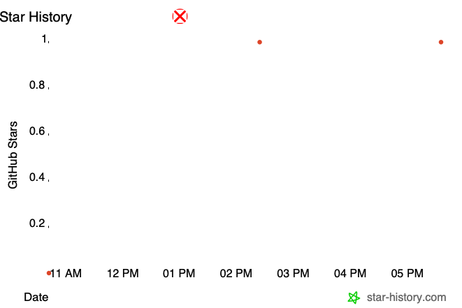

<p align="center">
  <picture>
    
  </picture>
</p>

# 🧠 mu-critical-thinking · 批判性思维提问教练

> 不是讲大道理，而是用批判性提问戳破谬误。把任何一段论证拆成 12 个维度扫描，逐句点名逻辑谬误，并训练你问出能戳破薄弱推理的那几个问题。
>
> 📚 [《学会提问——批判性思维指南》读书笔记 PPT](https://mp.weixin.qq.com/s/SgkY1jdqpi6dOvaA0W6smg)

[English](README.md) | **中文** | [🌐 在线主页](https://muippt.github.io/mu-critical-thinking/)

[](https://mp.weixin.qq.com/s/YLtXENt_7WzO2DgJCFUtPA)
[](https://xhslink.com/m/ESxtgUNMdl)
[](https://item.m.jd.com/product/14547345.html)
[](https://muippt.github.io/mu-skill-hub/)
[](LICENSE)
[](https://github.com/muippt/mu-critical-thinking/releases)
[](https://github.com/muippt/mu-critical-thinking/stargazers)

---

### 💡 使用场景示例

📄 **"这份方案帮我挑挑毛病"**
把文本贴进来，直接输出 12 维度诊断报告：结论清不清楚、理由够不够、隐含假设是什么、证据是哪一层，最后给出强 / 中 / 弱总评级。

🕵️ **"这里面有没有逻辑问题？"**
逐句扫描 12 大逻辑谬误。每命中一处，都会引用原文、说明为什么站不住、给一句可以直接换上的修正话术。

❓ **"训练我，问我几个难回答的问题"**
苏格拉底模式带你走完 5 层递进——表层事实 → 理由证据 → 隐含假设 → 替代可能 → 行动验证，全程不超过 5 轮。

🔎 **"这个决策我要不要拍板？先审一遍"**
12 项决策质量清单 + 可逆性判断 + 最坏情况测试 + 预期后悔法，最后给出明确的 Kill Switch：什么条件下应该掉头。

📊 **"这组数据靠谱吗？"**
把任何图表或报告拆成"这个数据告诉你什么 / 没告诉你什么 / 藏着哪些坑"，对照 7 大数据陷阱和 7 级证据层级逐条排查。

⚔️ **"帮我准备正反两面的论点"**
正反方论点表，各带最佳证据、对方可能的反驳、你的再反驳，另附关键交锋点和你自己最容易犯的谬误。

📋 **"明天评审会，帮我列个提问清单"**
清单模式输出按优先级排序的必问问题，每条标注检验的是哪个维度，以及对方答不上来意味着什么风险。

💼 **"这个职场情境该怎么想？"**
8 大职场场景已预先映射到对应维度：方案评审、面试评估、数据汇报、冲突调解、战略决策、汇报材料审查、向上管理、绩效评价。

---

### ✨ 核心亮点

#### 🧠 12 维度论证扫描 —— 全覆盖，不跳过

基于《学会提问》（Browne & Keeley）构建。每次扫描走完全部 12 个维度，逐项给出 ✅ 通过 / ⚠️ 薄弱 / ❌ 缺陷。信息不足可以标注"无法判断"，但绝不静默跳过。

| # | 维度 | 检验什么 |
|---|------|---------|
| ① | 论题与结论 | 是描述性论题还是规定性论题？结论能不能一句话说清？ |
| ② | 理由 | 理由是否独立、相关、充分（≥2 个）、可验证？ |
| ③ | 歧义与模糊 | 关键概念有没有操作性定义？论证是不是骑在模糊词上？ |
| ④ | 价值观假设 | 价值取舍站了哪一边——效率 vs 公平、短期 vs 长期？ |
| ⑤ | 描述性假设 | 从理由到结论之间跳过了什么未言明的信念？什么条件下失效？ |
| ⑥ | 推理谬误 | 推理链里有没有踩中 12 大谬误？ |
| ⑦ | 证据可信度 | 证据在金字塔第几层？样本量、方法论、利益冲突？ |
| ⑧ | 替代原因 | 有没有混淆变量、反向因果、第三因素，或者纯属巧合？ |
| ⑨ | 数据陷阱 | 基数、口径、时间窗口、平均值还是中位数、呈现方式有没有误导？ |
| ⑩ | 省略信息 | 对立证据、成本代价、长期后果、失败案例、缺席的利益相关方？ |
| ⑪ | 合理结论 | 同样的理由还能推出什么别的结论？是绝对、条件还是程度结论？ |
| ⑫ | 决策质量 | 比较过几个替代方案？最坏情况？可逆吗？有没有 Kill Switch？会不会后悔？ |

#### 🔍 12 大逻辑谬误 —— 速查表 + 修正话术

每条谬误都配齐：定义、识别模式、典型句式、职场示例、可以直接说出口的修正话术。

| 谬误 | 一句话识别 |
|------|-----------|
| 人身攻击 | 攻击发言者的背景，而不是论点本身 |
| 稻草人 | "你的意思是……"后面跟着对方从没说过的极端版本 |
| 滑坡谬误 | A → B → C → D，但每一步之间都没有证据 |
| 错误二分 | "要么……要么……"，但明明存在中间地带 |
| 诉诸权威 | 用"大厂都这么做"替代对适配性的分析 |
| 循环论证 | 理由就是结论换个说法 |
| 以偏概全 | 用几个案例推出"所有 / 每次 / 一向" |
| 虚假因果 | B 在 A 之后发生，就断定 A 导致 B |
| 转移话题 | 回答了一个没人问的问题 |
| 诉诸情感 | 用愧疚和恐惧替代证据 |
| 乐队花车 | 把流行度当成正确性的证明 |
| 错误类比 | "X 就像 Y"，但两者的关键特征根本不同 |

#### 🎯 苏格拉底式追问 —— 5 层递进模型

引导模式不会甩给你一堆问题。每轮最多问 2 个，总共不超过 5 轮，每次回答后都给反馈，第 5 轮结束时总结你的核心薄弱点在哪。

```
第 1 层  表层事实   "具体是什么？数据 / 事例在哪？"
第 2 层  理由证据   "为什么这么说？依据是什么？"
第 3 层  隐含假设   "你假设了什么？这个假设成立吗？"
第 4 层  替代可能   "还有没有其他解释 / 方案？"
第 5 层  行动验证   "怎么验证你的判断？成本多大？"
```

#### 📊 决策审计 + Kill Switch 机制

12 项决策清单的最后一步，是大多数框架都省掉的东西：明确的 Kill Switch —— 事先约定在什么条件下重新评估或直接放弃，让沉没成本绑架不了你。输出包含决策类型（可逆 / 不可逆、风险等级）、论证链完整度（X/12 维度通过），以及可执行 / 需补强 / 建议暂缓的综合评级。

#### ⚠️ 7 大数据陷阱 + 7 级证据层级

| 数据陷阱 | 这样追问 |
|---------|---------|
| 基数谬误 | "分母是多少？绝对值是多少？" |
| 平均值 vs 中位数 | "中位数是多少？分布是什么形状？" |
| 选择性时间窗口 | "为什么从这个点开始？同比和环比一起给。" |
| 幸存者偏差 | "那些失败的、流失的呢？他们什么情况？" |
| 辛普森悖论 | "分组看还是同样的结论吗？" |
| 缺失数据 | "有没有哪些指标在下降但没展示？" |
| 相关当因果 | "中间的因果机制是什么？会不会是 C 同时导致了两者？" |

证据分 7 级，从元分析、随机对照实验一路到专家意见、个人轶事——所以"我以前做过"和"我们的 A/B 测试显示"永远不会被当成同等分量。

#### 💼 8 大职场场景映射

每个场景都预置了主攻维度、必问清单、这个场景最常出现的谬误，以及应对话术。

| 场景 | 主攻维度 | 最常见陷阱 |
|------|---------|-----------|
| 方案评审 | ② ⑥ ⑦ | 诉诸权威 |
| 面试评估 | ⑥ ⑦ ⑧ | 光环效应 / 确认偏误 |
| 数据汇报 | ⑨ ⑩ ⑧ | 选择性呈现 |
| 冲突调解 | ③ ④ ⑤ | 稻草人 |
| 战略决策 | ⑪ ⑫ ⑩ | 滑坡谬误 |
| 汇报材料审查 | ① ② ⑥ | 结论不清 |
| 向上管理 | ② ⑦ ④ | 自我中心式论证 |
| 绩效评价 | ⑦ ⑥ ⑧ | 近因效应 |

---

### 📌 与同类工具对比

| 维度 | mu-critical-thinking | 通用 ChatGPT 提示词 | 图尔敏模型 | 六顶思考帽 |
|------|:--------------------:|:-------------------:|:----------:|:----------:|
| 诊断框架 | 12 维度固定，全覆盖 | 每次结果都不一样 | 6 个论证要素 | 6 种思考视角 |
| 谬误识别 | 12 种谬误，逐句引用原文 | 偶尔提到，不点名 | 不涉及 | 不涉及 |
| 修正建议 | 每种谬误配修正话术 | 泛泛而谈 | 不涉及 | 不涉及 |
| 证据分级 | 7 级证据层级 | 无 | 仅定性描述 | 无 |
| 数据陷阱识别 | 7 种具名陷阱 | 无 | 无 | 无 |
| 决策审计 | 12 项清单 + Kill Switch | 无 | 无 | 部分（黑帽） |
| 互动训练 | 苏格拉底模式，≤5 轮 | 无边界闲聊 | 静态模型 | 会议流程 |
| 辩论准备 | 正反同等力度 + 交锋点 | 默认单边 | 单论证分析 | 非设计用途 |
| 职场落地 | 8 大场景已映射 | 通用泛化 | 偏学术 | 通用泛化 |
| 防过度诊断 | 有——没问题就说"未发现谬误" | 倾向于硬找问题 | 不适用 | 不适用 |
| 输出格式 | 固定报告模板 | 自由文本 | 图示 | 讨论记录 |
| 上手成本 | 放进一个文件夹 | 每次重写提示词 | 需先学理论 | 需培训全团队 |

---

### 🚀 三种交互模式 & 六大工作流

**三种交互模式：**

| 模式 | 行为 | 何时触发 |
|------|------|---------|
| 🚀 快捷模式（默认） | 贴文本 → 自动 12 维度扫描 → 诊断报告 | 直接贴了文本且未指定模式 |
| 💬 引导模式 | 苏格拉底对话 / 决策审计 / 数据教练 | 说"训练""追问""帮我审计""教我看数据" |
| 📋 清单模式 | 输出结构化提问清单，不做对话 | 说"帮我列提问清单""评审要问什么" |

**六大工作流：**

| 工作流 | 场景 | 触发方式 |
|--------|------|---------|
| **论证质量评估** | 手上有份方案 / 材料 / 观点，想知道站不站得住 | 直接贴文本、不指定模式 → 自动 12 维度扫描 |
| **逻辑谬误识别** | 感觉哪里不对，但说不出来是什么 | "这里面有没有逻辑问题" |
| **苏格拉底追问训练** | 想练出反射，而不只是拿一个答案 | "训练我" / "帮我准备追问" |
| **决策质量审计** | 有个要紧的决策即将拍板 | "帮我审计这个决策" / "这事该不该做" |
| **数据解读教练** | 一张图表好看得不太真实 | "这个数据靠谱吗" / "怎么看这组数" |
| **辩论准备** | 选边站之前，先把两面都看清楚 | "帮我准备正反面论点" |

---

### ⚙️ 技术规格

| 项目 | 说明 |
|------|------|
| 类型 | 纯 Markdown 的 AI Skill —— 无代码、无运行时、无构建步骤 |
| 依赖 | 无。零 npm / pip 包，零 API Key |
| 兼容环境 | Claude Code、Claude Desktop，以及任何支持 SKILL.md 约定的 Agent |
| 包体积 | 约 60 KB（SKILL.md + 4 个 references） |
| 文件结构 | 1 个 SKILL.md + 4 个 references（12 维度 / 逻辑谬误 / 证据评估 / 职场场景） |
| 输入支持 | 纯文本、方案、报告、会议记录、数据描述、图表说明 |
| 输出格式 | 结构化 Markdown 报告——诊断表、谬误扫描、决策审计、数据解读、辩论准备 |
| 语言 | 中文为主，同时支持英文输入与输出 |
| 渐进式加载 | reference 文件仅在对应场景触发时才读取，节省上下文 |
| 版本 | 2.0.0 |
| 许可证 | MIT |

**跨 Skill 联动**（可选，装了才生效）：

- `mu-pyramid-principle` —— 批判性思维拆解问题，金字塔原理重构表达
- `mu-humanizer-minesweeping` —— 把产出文稿的 AI 味去掉

---

### 🛠️ 快速开始

**1. 安装** —— 克隆到你的 skills 目录

```bash
git clone https://github.com/muippt/mu-critical-thinking.git ~/.claude/skills/mu-critical-thinking
```

> 用的是别的 Agent？把文件夹放到你的工具加载 skill 的位置即可。项目级也可以：`.claude/skills/mu-critical-thinking`。

**2. 验证** —— 重启 Agent，确认 skill 已被识别

```
列出我可用的 skills
```

**3. 使用** —— 贴段文字就能跑

```
贴任意方案 / 报告 / 观点 → 自动输出 12 维度诊断报告
```

或者直接指定工作流：

```
帮我扫一下逻辑谬误："所有大厂都在做这个方向，我们也必须做——不做就落后，落后就会彻底丢掉市场。"
```

```
帮我审计这个决策：下季度团队规模翻倍，用来把路线图跑完。
```

```
用苏格拉底式追问训练我：远程办公会降低团队生产力。
```

---

### 🔒 安全与隐私

- **纯本地运行** —— skill 只是几个 Markdown 文件，由你的 Agent 读取。不安装任何东西，也不执行任何东西。
- **零网络请求** —— 没有 API 端点、没有外部服务、全程不发起任何远程调用。
- **零遥测** —— 无使用统计、无埋点、无回传。压根没有任何"能够"收集数据的代码。
- **零依赖** —— 不引入 npm / pip / 第三方包，因此不存在供应链攻击面。
- **文本不出你的 Agent** —— skill 不新增任何存储、日志或持久化，你分析过的论证不会被留下。
- **完全可审计** —— 一共 5 个 Markdown 文件，全部人类可读，十五分钟能通读一遍。
- **无需任何凭证** —— 不需要 API Key、Token 或账号。
- **只评估论证，不评判立场** —— IRON LAW 明确禁止充当道德裁判，只对推理质量本身做判断。

---

### ⭐ Star 趋势

如果它帮你在一个糟糕的论证变成糟糕的决策之前拦下了它，点个 Star 就是最好的反馈。

[](https://www.star-history.com/?repos=muippt%2Fmu-critical-thinking&type=date)

> 12 个维度、12 种谬误、7 个数据陷阱——把"总觉得哪里不对"变成"问题具体在这一句，改法是这样"。

---

### 👤 作者简介

🎓 清华大学出版社签约作家 / 2026当当影响力作家 / 某互联网大厂 AI 大模型业务 HR 砖家 / 一级人力资源管理师 / 二级心理咨询师 / 野生设计师

📚 著有[《图解团队管理》](https://item.m.jd.com/product/14547345.html)，服务客户有字节跳动、腾讯、百度、中国移动、SMG、BOE…

💡 [微信公众号](https://mp.weixin.qq.com/s/YLtXENt_7WzO2DgJCFUtPA) / [小红书](https://xhslink.com/m/ESxtgUNMdl)：muippt

🧰 更多 Skill：[mu-skill-hub](https://muippt.github.io/mu-skill-hub/) · [GitHub](https://github.com/muippt)

---

### 📄 许可证与致谢

[MIT](LICENSE) © 2025 muippt

**致谢**

- **《学会提问》（*Asking the Right Questions: A Guide to Critical Thinking*）** —— 作者 **M. Neil Browne** 与 **Stuart M. Keeley**，本项目的方法论根基。12 维度评估框架、描述性论题与规定性论题的区分、价值观假设与描述性假设的分析、替代原因的检验纪律，均源自这本书。本 Skill 只是把它改造成可在职场场景中直接跑起来的操作版本；原书仍然是不可替代的正典，值得完整读一遍。
- 古典苏格拉底方法 —— 递进式追问模型的来源。
- 循证实践（Evidence-Based Practice）社区 —— 7 级证据金字塔的分级思路来自于此。
- 每一位提过 issue、问过让人不舒服的问题、以及当面反驳过我的人。这本来就是这个项目的意义所在。

> 声明：本项目大部分内容由 AI 辅助完成。如您认为您的作品被使用但未获得适当署名，请提交 issue。
