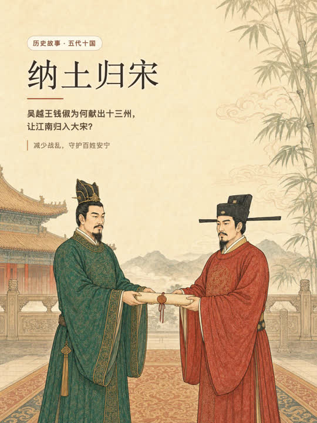

# Narrated Hand-drawn Story Video

An agent-native pipeline for Chinese idiom, history, and children's-story shorts. It turns a story into a vertical 3:4 video with story-specific colored scenes, a complete opening poster at frame 0, local Qwen3-TTS character voices, synchronized captions, and ducked licensed BGM.

## Actual output preview

The image below is the real first frame from the included workflow's **“纳土归宋”** output—not a concept mockup. Its title, category, synopsis, and takeaway are programmatically overlaid by the renderer from frame 0.

<p align="center">
  
</p>

This repository packages an enhanced workflow around a bundled, MIT-licensed copy of [`gnipbao/story-to-handdrawn-video`](https://github.com/gnipbao/story-to-handdrawn-video). The original copyright and license are retained in [`renderer/LICENSE`](renderer/LICENSE).

## What is included

- `SKILL.md`: the agent contract for high-quality story-video production.
- `renderer/`: a 1080×1440 Remotion renderer with scene-reveal animation and generic `opening_poster` support.
- `scripts/synthesize_qwen3.py`: local Qwen3-TTS multi-role voice-plan synthesis.
- `scripts/check_cover_ratio.py`: rejects cover/video aspect-ratio mismatches.
- `scripts/mix_story_audio.py`: poster-delayed narration plus side-chain-ducked BGM.

## Quality rules

1. Every story beat needs a different, story-specific illustration.
2. Caption text and synthesized speech are exactly the same sentence.
3. The cover is displayed from frame 0 and includes tag, title, synopsis, and takeaway.
4. The cover asset must use the exact video aspect ratio; the validator rejects a mismatch.
5. Local Qwen3-TTS is the default. Online Edge TTS is not required.
6. BGM requires a usable license and an attribution file alongside the output.

## Install

```bash
git clone https://github.com/ToBeWin/narrated-handdrawn-story-video.git
cd narrated-handdrawn-story-video/renderer
npm ci
npm run check

# Optional: local Qwen3-TTS runtime
python3 -m venv ../.venv
../.venv/bin/pip install -r ../requirements-qwen3.txt
```

## Storyboard opening poster

Put a normalized 1080×1440 poster image in `renderer/public/assets/posters/`, then add this to `renderer/storyboard.json`:

```json
{
  "opening_poster": {
    "asset": "assets/posters/story-opening.png",
    "duration_sec": 3,
    "tag": "历史故事 · 五代十国",
    "title": "纳土归宋",
    "synopsis": "吴越王钱俶为何献出十三州，\n让江南归入大宋？",
    "takeaway": "减少战乱，守护百姓安宁"
  }
}
```

Run `npm run check` before rendering. It verifies that the first-frame poster uses the same ratio as the video canvas.

## Local Qwen3 multi-role voices

The voice-plan schema has one segment per caption. Use narrator and speaking-character entries independently:

```bash
.venv/bin/python scripts/synthesize_qwen3.py examples/qwen3-voice-plan.json renderer/public --allow-download
```

Each segment generates a local WAV under `renderer/public/`; measure those clips, set each scene duration accordingly, concatenate in scene order, and then render the silent picture track from `renderer/`.

## Final mix

```bash
python3 scripts/mix_story_audio.py \
  --video /absolute/picture_silent.mp4 \
  --voice /absolute/narration.wav \
  --bgm /absolute/licensed-music.ogg \
  --output /absolute/final.mp4 \
  --poster-seconds 3
```

The repository does not distribute generated images, model weights, voice output, BGM, or finished videos. Keep BGM source, author, and license in an `ATTRIBUTION.txt` next to each output.

## License

The orchestration files in this repository are MIT licensed. The bundled renderer retains the upstream MIT license and attribution.
