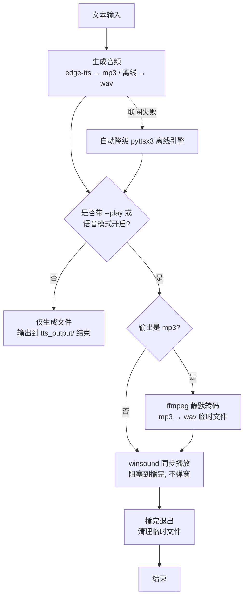

# Local TTS（本地文本转语音）

把任意文本转成本地音频文件，给 agent 或脚本调用。

> ⚠️ **默认行为**：不传任何参数 = **联网 edge-tts + 晓晓女声**（zh-CN-XiaoxiaoNeural）。只有显式加 `--offline` 才走离线引擎。

## 两种引擎（自动选择）

| 引擎 | 音质 | 联网 | 说明 |
|---|---|---|---|
| edge-tts（默认） | ⭐⭐⭐ 神经网络语音，自然 | 需要 | 微软 Edge 同款语音，免费无 key，中文可选晓晓/云希/晓伊等 20+ 音色 |
| pyttsx3（离线） | ⭐ 老式合成音 | 完全离线 | Windows 自带 SAPI（Huihui 中文），断网兜底 |

## 用法

```bash
# 基础用法：edge-tts 神经网络语音（默认晓晓女声）
python scripts/tts.py "要合成的文本" -o 输出路径.mp3

# 生成后自动播放（统一转 wav 用 winsound 同步播放，阻塞到播完，不弹窗；仅 Windows）
python scripts/tts.py "文本" -o out.mp3 --play

# 指定音色（edge-tts）
python scripts/tts.py "文本" -o out.mp3 -v zh-CN-YunxiNeural

# 强制离线引擎（断网可用）
python scripts/tts.py "文本" -o out.wav --offline

# 列出 edge-tts 全部可用音色
python scripts/tts.py --list-voices

# 指定语速/音量（0.5~1.5，默认 1.0）
python scripts/tts.py "文本" -o out.mp3 -r 1.1 --volume 1.2
```

## 自动播放（生成完成后语音播报，可选）

> ⚠️ **内容红线**：语音只播报**最终总结/结论内容**。
> 严禁播放思考过程、执行过程、工具调用过程、中间日志等。若任务无总结，则不播。

### 生成完成 → 自动播放 完整流程



**触发方式对照：**
- 单次任务 → 命令加 `--play`（方案 A）
- 会话级语音回复 → agent 每次回复末尾带 `--play`（方案 B）
- 定时任务 → automation 执行完对摘要文本带 `--play`（方案 C）

**播放技术要求（已固化，勿改）**
- 统一 mp3→wav 静默转码（imageio-ffmpeg 隔离版）→ winsound **同步**播放（阻塞到播完）
- 不用 SND_ASYNC（短进程退出会掐断声音）；不检查 winsound 返回值（成功返回 None）
- 播完即退，不弹窗、不残留临时文件（转码走系统 temp）
- 依赖 Windows `winsound`，`--play` 仅在 Windows 可用；其他平台只生成文件

## 常用中文音色（edge-tts）

- `zh-CN-XiaoxiaoNeural` 晓晓（女，温柔，默认）
- `zh-CN-YunxiNeural` 云希（男，阳光）
- `zh-CN-YunyangNeural` 云扬（男，新闻播报）
- `zh-CN-XiaoyiNeural` 晓伊（女，活泼）
- `zh-CN-liaoning-XiaobeiNeural` 晓北（女，东北话）
- 更多见 `--list-voices` 或 edge-tts 官方列表

## 环境

- Python 3.8+
- 依赖：`pip install pyttsx3 edge-tts imageio-ffmpeg`（imageio-ffmpeg 仅 `--play` 播放时用到）
- **模块级 `import` 延迟到函数内**：`--list-voices`/`--offline` 等场景不会因缺依赖而整体崩溃

## 输出文件规范（agent 调用时遵守）

- **输出路径**：调用方显式指定 `-o`；未指定时固定生成到 **本 skill 目录下 `tts_output/`**（用脚本 `__file__` 定位，与调用时工作目录无关）
- **命名**：建议语义化命名（如 `20260810_新闻早报.mp3`），不用乱码/序号
- **格式**：联网引擎 → `.mp3`；离线引擎 → `.wav`
- **临时转码文件**：`--play` 时的转码 wav 放系统临时目录（local_tts_play.wav），**不会**留在工作区
- **测试产物**：不把测试音频留在工作区根目录；确认后清理

## 坑

- edge-tts 需要能访问微软服务器；失败时脚本自动降级到 pyttsx3 离线引擎（自动兜底）
- 输出格式：edge-tts 生成 mp3；离线引擎生成 wav
- `--play` 播放：**统一静默转 wav 后 winsound 同步播放（阻塞到播完），不弹窗**（ffmpeg 用 imageio-ffmpeg 隔离版，装于 venv 内）；mp3 转码走临时目录 local_tts_play.wav
  - ⚠️ 必须用同步（不带 SND_ASYNC）：agent 调用是"生成即退"短进程，异步播放会在进程退出时被终止 → 听不到声音
  - ⚠️ winsound.PlaySound 成功返回 None（不是 True），**不要检查返回值**，失败会抛异常
- 脚本输出绝对路径到 stdout，方便 agent 直接捕获
