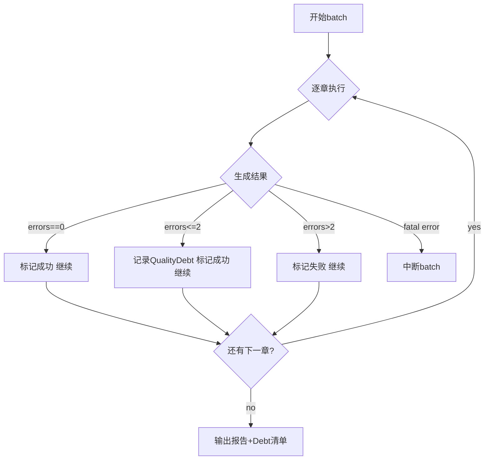

# Quality Gate Workflow

## Pipeline Flow

## Quality Debt Levels

| Severity | Meaning | Action |
|:---------|:--------|:-------|
| warning | Minor issue | Record, continue |
| minor | Recoverable quality flaw | Record, mark chapter as debt, continue |
| major | Needs human review | Record, mark chapter as debt, continue |
| critical | Data integrity failure | STOP |

## Persistence

QualityDebt saved to `追踪/quality_debt.json` after each batch.
