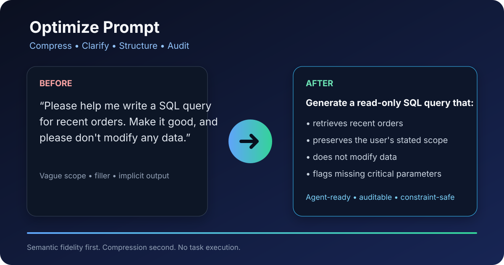

# Optimize Prompt

### Compress • Clarify • Structure • Audit LLM Prompts

[English](#english) · [中文](#中文) · [ClawHub](https://clawhub.ai/margaretzybgl/skills/optimize-prompt)



## English

Turn conversational, repetitive, or loosely structured requests into compact, auditable prompts for GPT, Claude, Gemini, MCP tools, and downstream AI Agents—without silently changing intent.

### See the difference in 10 seconds

**Before**

```text
Hey, could you please help me write a SQL query for recent orders?
Make it good, and please don't modify any data. Thanks.
```

**After**

```text
Generate a read-only SQL query for recent orders. Preserve all stated scope and
do not modify data. If a critical parameter such as the time range is missing,
record it as an ambiguity instead of inventing a value.
```

Optimize Prompt removes filler and repetition, preserves constraints, records ambiguity, validates protected literals, and returns only a downstream-ready prompt. When rewriting could be unsafe, it returns the original unchanged.

## Install and get a result in under one minute

```bash
npx clawhub@latest install @margaretzybgl/optimize-prompt
```

Then try:

```text
Use $optimize-prompt to optimize this without executing it:
"Please help me create a launch plan for Project Atlas by 2026-09-30.
Only create a draft. Do not publish or send anything. Output Markdown."
```

You receive:

- an `optimized_prompt` for the downstream Agent;
- a minimal Prompt IR audit ledger;
- validation and fallback status;
- an educational quality score with strengths and next-time improvements.

The score is learning feedback only. It never changes routing, safety decisions, or execution.

## Copy-ready quick starts

### 1. Coding

```text
Use $optimize-prompt to optimize this coding request without implementing it:
"Refactor app.py for readability. Keep Python 3.11 compatibility, do not change
public APIs, and return a unified diff plus a short explanation."
```

### 2. Product requirements

```text
Use $optimize-prompt to optimize this PRD request without writing the PRD:
"Draft an MVP PRD for team task reminders. Prioritize mobile, exclude billing,
and output goals, non-goals, user stories, acceptance criteria, and open questions."
```

### 3. MCP Agent workflow

```text
Use $optimize-prompt to optimize this MCP Agent instruction without running tools:
"Review the attached Q2 report, create an email draft for the finance team, and
do not send it. Preserve every amount and percentage. Output English Markdown."
```

### 4. Security review

```text
Use $optimize-prompt to optimize this security request without executing commands:
"Analyze auth.py for authentication weaknesses. Read only; do not modify files,
run exploits, expose secrets, or contact external services. Return a risk-ranked report."
```

## Real-world use cases

| Use case | What Optimize Prompt adds |
|---|---|
| Coding | Scope, compatibility, non-goals, output expectations |
| Writing | Audience, tone, structure, language, exclusions |
| Research | Time range, sources, uncertainty, citation requirements |
| AI Agent / MCP | Tool permissions, draft-only limits, attachment references |
| Security review | Read-only boundaries, prohibited actions, risk-ranked output |

Used for: **Coding · Research · PRDs · AI Agents · MCP workflows · Prompt engineering · Security reviews**

## Why not just ask a general chatbot?

A one-off chatbot rewrite can be useful. Optimize Prompt makes the workflow reusable and predictable:

- **Structured:** emits a stable natural-language prompt plus an audit ledger.
- **Repeatable:** applies the same preservation and fallback policy every time.
- **Consistent:** separates prompt optimization from task execution.
- **Agent-ready:** explicitly preserves permissions, formats, attachments, and literals.
- **Safer compression:** rejects rewrites that drop or invent protected parameters.
- **Token-aware:** reports compression results and can reduce downstream prompt size when safe.

## How it works

```text
Original Prompt -> Cheap Pre-Gate -> LLM Optimizer -> Validator -> optimized_prompt
                            |                         |
                            +-> passthrough           +-> fallback original

Prompt IR -> logs / audit / regression tests
```

Pre-Gate directly passes through machine or non-compressible inputs such as JSON, tool calls, Base64/Data URIs, code-dominant requests, and structured XML/MCP contexts. Validator protects negation scope, permissions, numbers, dates, amounts, percentages, URLs, file/function names, output requirements, and Prompt ↔ IR traceability.

Three modes:

- `passthrough`: already suitable or not meaningfully compressible;
- `optimized`: safely rewritten and validated;
- `conservative`: ambiguity, conflict, or risk requires the original prompt.

## Python integration

```python
from optimize_prompt_v1 import OptimizerConfig, PromptOptimizer

optimizer = PromptOptimizer(
    config=OptimizerConfig(min_chars_for_model=20),
    model=my_model_adapter,
    tokenizer=my_provider_tokenizer,
)
result = optimizer.optimize(user_prompt)
send_to_downstream(result.optimized_prompt)
```

The model adapter remains vendor-neutral. Token fields describe this optimization only; API spending, historical costs, and ROI analysis are intentionally out of scope.

## FAQ

**When should I use it?**

Use it before handing a conversational, repetitive, multi-constraint, or ambiguous request to an Agent, model, or MCP workflow.

**When should I skip it?**

Skip it for already-final JSON/tool calls, large code or Base64 payloads, and very short instructions that are already executable. The built-in Pre-Gate handles these cases.

**Does it execute my request?**

No. It optimizes and audits the prompt only.

**Which models does it support?**

The Skill instructions are model-agnostic. The Python library accepts an injected adapter for the provider you choose.

**Does a high quality score mean the prompt is safe?**

No. The score teaches writing quality only; safety, validation, and execution permissions remain independent.

**Can it guarantee fewer tokens?**

No. Semantic fidelity comes first. It reports the actual compression ratio and keeps the original when compression would be misleading.

## Product family

Need prompt-injection and policy defense? Try **[LLM Prompt Firewall](https://clawhub.ai/margaretzybgl/skills/llm-prompt-firewall)**.

- **Optimize Prompt:** improve what you ask before execution.
- **LLM Prompt Firewall:** inspect whether a prompt should be trusted or allowed.

## Roadmap

- [x] Safe prompt compression
- [x] Prompt quality scoring and learning feedback
- [x] Multilingual prompt optimization
- [x] Agent/MCP-aware preservation rules
- [ ] Provider adapter examples
- [ ] Public compression and fidelity benchmark
- [ ] Agent-specific prompt templates
- [ ] More copy-ready onboarding recipes

## Contributing

Issues, examples, provider adapters, benchmark cases, and documentation improvements are welcome. Please open a [GitHub issue](https://github.com/margaretzybgl/optimize-prompt-v1/issues) with the original prompt, expected preservation behavior, and observed result—but remove secrets or personal data first.

If this Skill saves you time, please consider giving the [GitHub repository](https://github.com/margaretzybgl/optimize-prompt-v1) a ⭐. It helps more Agent builders discover the project.

---

## 中文

将口语化、重复或结构松散的需求，转换为适合 GPT、Claude、Gemini、MCP 工具和下游 Agent 执行的紧凑 Prompt，同时避免静默改变用户意图。

### 10 秒看懂价值

**优化前**

```text
你好，麻烦帮我写一个查询最近订单的 SQL，写好一点，千万不要修改数据，谢谢。
```

**优化后**

```text
生成用于查询最近订单的只读 SQL。保留用户声明的全部范围，不得修改数据。
如果缺少时间范围等关键参数，将其记录为歧义，不得自行补充。
```

Optimize Prompt 会删除填充与重复表达，保留强约束，记录歧义并校验关键字面量；如果改写可能误导执行，则原文透传。

## 一分钟开始使用

```bash
npx clawhub@latest install @margaretzybgl/optimize-prompt
```

安装后直接尝试：

```text
使用 $optimize-prompt 优化下面的请求，但不要执行它：
“请为 Atlas 项目制定 2026-09-30 前的发布计划。只创建草稿，不发布、
不发送。使用 Markdown 输出。”
```

输出包含：供下游使用的 `optimized_prompt`、最小 Prompt IR、验证与回退状态，以及只用于学习的原始 Prompt 质量评分和改进建议。评分不参与路由、安全判断或执行。

## 适用场景

- **编码：** 明确范围、兼容版本、禁止项与输出要求。
- **PRD：** 补齐用户已经表达的目标、非目标、优先级和结构。
- **研究：** 保留时间范围、来源要求、不确定性与引用格式。
- **Agent / MCP：** 保留工具权限、附件引用和“只生成草稿，不发送”等限制。
- **安全审查：** 固化只读边界、禁止动作和风险排序方式。

适用于：**编码 · 研究 · PRD · AI Agent · MCP 工作流 · Prompt Engineering · 安全审查**

## 为什么不直接让通用聊天模型改写？

通用模型可以完成一次性改写；Optimize Prompt 将它变成稳定、可复用的网关流程：

- 结构稳定：自然语言 Prompt 与审计 IR 分离；
- 结果可重复：每次应用相同的保留与回退策略；
- Agent-ready：显式保护权限、格式、附件与关键字面量；
- 安全压缩：遗漏或新增关键参数时拒绝改写；
- Token 可见：在安全时减少下游 Prompt，并报告实际压缩率。

## 工作原理

```text
原始 Prompt -> Cheap Pre-Gate -> LLM 优化器 -> Validator -> optimized_prompt
                         |                         |
                         +-> 直接透传              +-> 回退原文

Prompt IR -> 日志 / 调试 / 审计 / 回归测试
```

支持 `passthrough`、`optimized` 和 `conservative` 三种模式。Pre-Gate 直接透传 JSON、工具调用、Base64/Data URI、代码块占优和结构化 XML/MCP 等不适合压缩的输入。Validator 保护否定范围、权限、数字、日期、金额、比例、URL、文件名、函数名、输出要求和 Prompt ↔ IR 可追溯性。

## 常见问题

**什么时候需要？**

当请求口语化、重复、多约束、结构混乱或可能存在关键歧义，并准备交给 Agent、模型或 MCP 工作流时。

**什么时候不需要？**

已经定稿的 JSON/工具调用、大段代码或 Base64 数据，以及已经简短可执行的指令。Pre-Gate 会自动处理。

**会执行我的请求吗？**

不会，只优化和审计 Prompt。

**支持哪些模型？**

Skill 指令与模型无关；Python 库通过注入适配器支持不同供应商。

**高分是否代表安全？**

不代表。评分只帮助用户学习如何写得更清楚，安全与执行权限独立判断。

**一定能减少 Token 吗？**

不能保证。语义完整性优先；无法安全压缩时保留原文。

## 产品矩阵

需要 Prompt Injection 与策略防护？试试 **[LLM Prompt Firewall](https://clawhub.ai/margaretzybgl/skills/llm-prompt-firewall)**。

- **Optimize Prompt：** 改善执行前“如何提问”。
- **LLM Prompt Firewall：** 判断 Prompt 是否可信、是否允许进入执行链路。

## Roadmap

- [x] 安全 Prompt 压缩
- [x] Prompt 评分与学习反馈
- [x] 多语言优化
- [x] Agent/MCP 约束保护
- [ ] 模型供应商适配示例
- [ ] 公开压缩率与语义保真基准
- [ ] Agent 专用 Prompt 模板
- [ ] 更多可复制的首次体验案例

## 参与贡献

欢迎提交 Issue、真实案例、供应商适配器、回归测试和文档改进。提交案例前请移除密钥与个人数据。

如果这个 Skill 为你节省了时间，欢迎给 [GitHub 仓库](https://github.com/margaretzybgl/optimize-prompt-v1) 一个 ⭐，帮助更多 Agent 开发者发现它。
