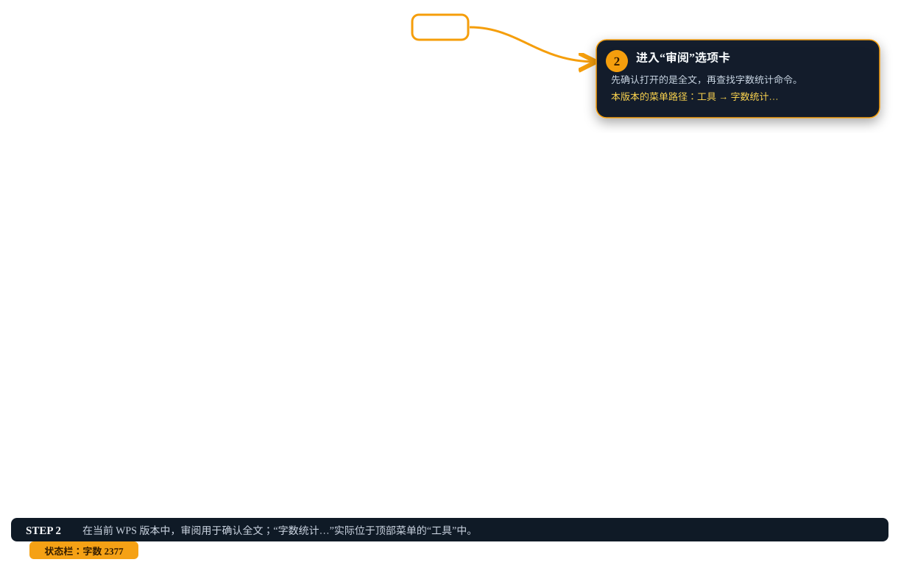
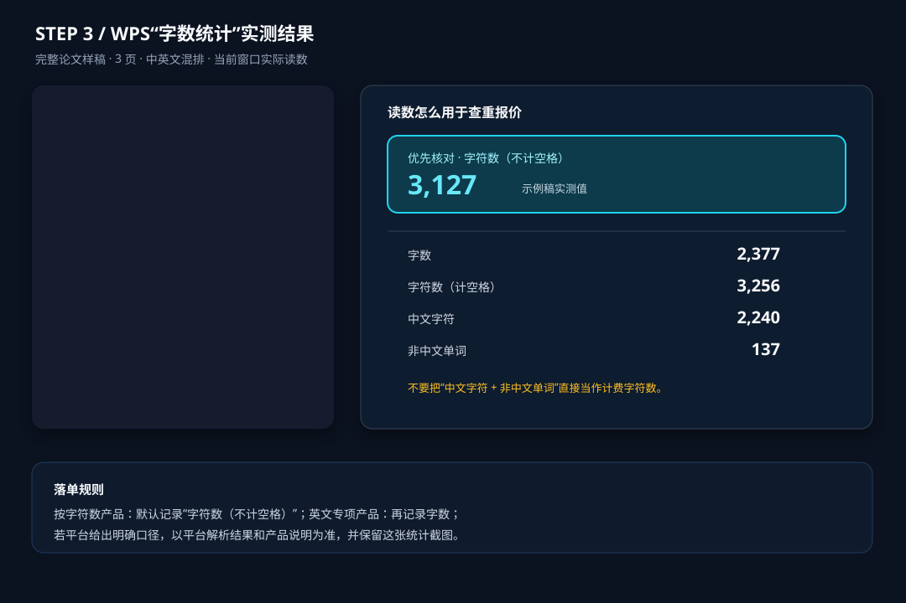

# WPS 实机操作教程（Mac 版）

这组截图是在本机 WPS Office 中用一篇三页的中英文混合论文样稿实际操作得到的。样稿题目为《高职院校实训基地建设项目全过程质量控制研究》，内容全部虚构，仅用于演示；截图中的统计数字是 WPS 当时的真实读数，不是任何查重网站的价格或最终计费承诺。

## 1. 打开完整论文

先打开准备提交查重的最终文件，确保摘要、正文、参考文献和英文部分都在同一份文件中。不要只打开摘要、封面或导出的节选。

## 2. 进入审阅并找到字数统计

点击顶部“审阅”选项卡，先确认全文范围。WPS 的不同版本可能把命令放在不同位置：本机 Mac 版本在顶部菜单“工具”中提供“字数统计…”，因此实际点击路径是 **工具 → 字数统计…**。如果你的版本在“审阅”功能区直接显示“字数统计”，以界面上可见的入口为准。

## 3. 读取统计窗口

本次实机统计窗口显示：页数 3、字数 2377、字符数（不计空格）3127、字符数（计空格）3256、段落数 33、非中文单词 137、中文字符 2240。

按字符数的产品，预估时优先记录 **字符数（不计空格）**；英文产品若明确要求 `words/字数`，再记录“字数”。“中文字符 + 非中文单词”不能自行相加当作查重计费字符数，最终仍以你要使用的查重网站对同一文件的解析结果为准。

## 4. 复选框怎么处理

“包括文本框、脚注和尾注”会改变 WPS 本地统计范围。勾选与否要与学校要求、论文最终上传范围保持一致；即使 WPS 勾选后得到一个新数字，也不能据此断言供应商一定采用相同的解析规则。建议把复选框状态和最终读数一起截图留档。

## 5. 这组截图不能证明什么

- 不能用截图中的 3127 直接代替任何查重网站的解析字符数；它只是在提交前的本地估算。
- 不能把 2377（字数）、2240（中文字符）或 137（非中文单词）直接当作某个字符档位的订单值。
- 价格、上下限、是否按篇、是否允许补差，必须回到你准备使用的查重网站当前页面和订单结果。
