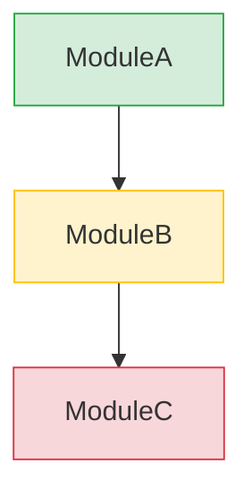

# Architecture Review �?代码库分�?+ 可视化报�?
将代码库架构分析�?HTML 可视化报告结合，输出可直接分享的架构评审报告�?
## 为什么组�?
架构分析的结果如果只以文字形式输出，关键信息容易被淹没在大段描述中�?组合 html-report 后，分析结果以可视化方式呈现：依赖图一目了然，问题用卡片展示，改进�?Before/After 对比�?
## 执行流程

### Phase 1: 代码库扫�?
收集代码库的结构信息�?
1. **目录结构** �?顶层目录和关键子目录
2. **模块划分** �?识别主要模块/�?命名空间
3. **依赖关系** �?模块间的导入/导出关系
4. **技术栈** �?语言、框架、关键依赖库
5. **代码指标** �?文件数量、代码行数（大致估算�?
### Phase 2: 架构分析

基于扫描数据，分析以下维度：

1. **模块化程�?*
   - 模块边界是否清晰
   - 是否存在循环依赖
   - 耦合度评估（�?�?低）

2. **分层合理�?*
   - 是否遵循分层架构
   - 是否存在跨层调用
   - 依赖方向是否正确

3. **技术债务**
   - 大文�?复杂文件识别
   - 重复代码模式
   - 过时依赖/废弃 API

4. **可维护�?*
   - 命名一致�?   - 错误处理模式
   - 测试覆盖情况

### Phase 3: 生成 HTML 报告

加载 `/html-report` skill，生成可视化报告�?
#### 报告结构

```
1. 报告头部
   - 项目名称、分析日期、分析范�?
2. 执行摘要
   - 整体健康度评分（1-10�?   - 3-5个关键发�?   - 最高优先级建议

3. 架构视图（Mermaid图表�?   - 模块依赖图（graph TD�?   - 分层架构�?   - 数据流图（如适用�?
4. 核心发现（卡片网格）
   - 每个发现一张卡�?   - 标注强度徽章（Strong / Worth exploring / Speculative�?   - 影响范围说明

5. 技术债务清单
   - 按严重程度排�?   - 估算修复工作�?   - 优先级建�?
6. Before/After 对比
   - 当前架构 vs 建议架构
   - 关键改进点可视化

7. 推荐行动
   - 按优先级排序
   - 标注强度徽章
   - 预估工作�?```

#### Mermaid 图表示例

**模块依赖�?*�?```mermaid
graph TD
    UI[UI Layer] --> Service[Service Layer]
    Service --> Repository[Repository Layer]
    Repository --> Database[(Database)]
    Service --> ExternalAPI[External API]
```

**问题热力�?*（用 classDef 标注）：


### Phase 4: 报告交付

1. 保存 HTML 文件�?workspace
2. 命名格式：`architecture-review-{项目名}-{日期}.html`
3. 告知用户文件路径

## 适用场景

| 场景 | 报告重点 |
|------|----------|
| **架构评审** | 模块依赖�?+ 分层分析 + 改进建议 |
| **技术债务评估** | 债务清单 + 优先�?+ 修复工作�?|
| **项目健康�?* | 健康度评�?+ 关键指标 + 趋势 |
| **重构方案** | 现状分析 + 目标架构 + 迁移路径 |
| **新成员入�?* | 架构概览 + 模块说明 + 关键流程 |

## 快速启�?
```
用户：帮我分析一下XX项目的架�?�?触发 /architecture-review
�?Phase 1: 代码库扫描（~5分钟�?�?Phase 2: 架构分析（~10分钟�?�?Phase 3: 生成HTML报告（~5分钟�?�?输出：architecture-review-{项目}-{日期}.html
```

## 与其�?Skill 的关�?
- 如果分析后发现需要重�?�?推荐 `/implement` 执行重构
- 如果分析前需要需求澄�?�?推荐 `/grill-with-docs` 先做需求建�?- 报告可以配合 `/skill-router` 导航后续行动
