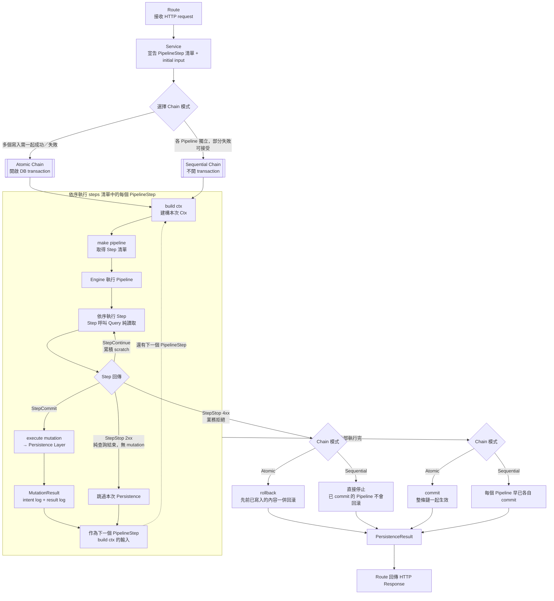

# Pipeline Architecture

## 選擇語言參考檔（動手前先做這件事）

本檔案只描述**與語言無關的架構規則**。所有程式碼範例都放在 `references/` 底下。
寫任何程式碼之前，先判斷專案語言，然後**只讀對應的那一份**：

| 判斷依據 | 語言 | 讀哪一份 |
|---|---|---|
| 有 `pyproject.toml` / `requirements.txt`，或要改的檔案是 `.py` | Python / FastAPI | `references/python.md` |
| 有 `package.json` / `tsconfig.json`，或要改的檔案是 `.ts` | TypeScript / Node.js | `references/typescript.md` |

兩份 reference 描述的是**同一套架構**，本檔案的所有規則對兩種語言一律適用。

- ❌ **禁止混用命名慣例**：不要在 Python 專案裡寫出 `runWorkflow`，也不要在 TypeScript 專案裡寫出 `run_workflow`。
- ❌ **禁止兩份都讀**：只讀專案實際使用的那一份，避免把另一種語言的寫法帶進來。
- ⚠️ **唯一的結構性差異是 transaction 邊界**（見下方「跨語言差異」一節），其餘都只是語法不同。

---

## 核心思想

**先說完所有意圖，再一次執行。**

Pipeline 執行期間只做兩件事：讀取世界的狀態（Query）、宣告想要改變什麼（Mutation）。
真正的寫入永遠發生在 Pipeline 結束之後，由 Persistence 層統一執行。

這讓整個 workflow 的意圖可以被記錄、被測試、被重播，副作用永遠可預期。

**「中繼資料」與「意圖」是兩件不同的事。** Step 之間為了做判斷而互相傳遞的暫存資料（例如查到的方案限制）稱為 **scratch**，它只是計算過程中的草稿；真正要交給 Persistence 執行的寫入意圖是 **DataMutation**，只能由 StepCommit 一次組裝完成。scratch 不會、也不能自動變成 mutation 的一部分 —— 詳見「Step 的三種回傳值」一節。

---

## 架構總覽

**圖中重點：**
- **Atomic Chain**：整條迴圈在同一個 DB transaction 內執行，任何 `StepStop(4xx)` 觸發 rollback 時，先前已經寫入的內容也會一起回滾；全部跑完才在最後統一 commit。
- **Sequential Chain**：沒有 transaction。每個 StepCommit 觸發的寫入是獨立、立即生效的 commit；中途若有 `StepStop(4xx)`，只是停止繼續往下跑，**已經 commit 的 Pipeline 不會被回滾**。
- 兩種模式共用同一套「迴圈內現場建構 ctx → 執行 Pipeline → 依 Step 回傳決定是否寫入」邏輯，差異只在 transaction 邊界與失敗時的回滾範圍。

---

## 層與職責

| 層 | 職責 | 關鍵限制 |
|---|---|---|
| **Route** | 接收 HTTP request，呼叫 Service | 不含業務邏輯 |
| **Service** | 宣告 Pipeline 鏈；協調跨域流程 | 不含業務邏輯 |
| **Pipeline Chain** | 依序執行 Pipeline；Atomic 模式管理 transaction | 共用基礎設施，不因業務修改 |
| **Pipeline** | 宣告 step 清單；注入依賴 | 只有 list，無條件判斷、無 I/O |
| **Engine** | 執行 steps；累積 scratch；收集 spans | 共用基礎設施，不因業務修改 |
| **Step** | 決策與資料形狀對映 | 不直接碰 DB；呼叫 Query |
| **Query** | 純讀取：DB、API、runtime 變數、純計算 | 不寫入；不知道 ctx／scratch |
| **Persistence** | 執行 mutation；記錄 intent／result log | 單一寫入入口，不含業務邏輯 |

---

## 命名規則

每個層的函式在**檔案內部**使用固定的通用名稱。
呼叫端在 **import 時加入 domain 名稱**區分不同 domain（TypeScript 用 `as`，Python 用 `as`）。

Query 和 Persistence 函式依照功能命名，不套用固定通用名稱。

### 跨語言命名對照

| 概念 | TypeScript | Python |
|---|---|---|
| Service 入口 | `runWorkflow` | `run_workflow` |
| Pipeline 工廠 | `makePipeline` | `make_pipeline` |
| commit step | `buildCommit` | `build_commit` |
| Chain 函式 | `runAtomicChain` / `runSequentialChain` | `run_atomic_chain` / `run_sequential_chain` |
| ctx 建構 | `buildCtx` | `build_ctx` |
| 寫入入口 | `executeMutation` | `execute_mutation` |
| 強制執行旗標 | `alwaysRun` | `always_run` |
| 檔名慣例 | kebab-case（`pipeline-chain.ts`） | snake_case（`pipeline_chain.py`） |
| schema 欄位 | camelCase（`changedFields`） | snake_case（`changed_fields`） |
| domain 型別目錄 | `types/` | `schemas/`（避開 stdlib `types` 衝突） |

---

## Step 的三種回傳值

每個 Step 只能回傳三種值之一：

| 回傳值 | 語意 | 攜帶的資料 | Engine 行為 |
|---|---|---|---|
| **StepContinue** | 繼續，附帶部分中繼資料 | `scratch`（暫存，供後續 Step 判斷用） | 合併進累積的 scratch，執行下一個 Step |
| **StepStop** | 終止，無寫入意圖 | 無 | 直接回傳 output，不觸碰 Persistence |
| **StepCommit** | 終止，帶著完整 Mutation | `mutation`（完整、型別明確的 DataMutation） | 回傳 output + mutation，交給 Persistence |

**StepStop 的兩種情境：**
- 業務拒絕（403 權限不足、404 找不到資源、422 條件不符）
- 成功的純查詢結束（200，有 output 但沒有任何寫入意圖）

**StepCommit 是唯一帶著 Mutation 離開 Pipeline 的方式。**
Step 不宣告下一步要做什麼。Pipeline 之間的串接由 Service 層的 Pipeline Chain 決定。

> **設計轉向說明：** 本版本刻意以「Service 端的 PipelineStep 清單」取代早期版本中「由 StepCommit 宣告 `next_pipelines`（可預測／不可預測世界）」的機制。所有 Pipeline 串接一律收斂到 Service 層宣告，StepCommit 不再包含任何後續流程的欄位。若對照舊版設計文件發現 `next_pipelines` 相關描述，以本版本為準。

### scratch 與 mutation 不會混在一起

`StepContinue` 的 scratch 是 Step 之間傳遞的中繼資料（例如查詢結果、暫存的判斷依據），型別是自由的字典／map，單純方便後續 Step 讀取。它**不是** DataMutation 的草稿，Engine 也**不會**把 scratch 自動併入最終送進 Persistence 的 mutation。

真正的寫入意圖必須由 StepCommit 自己組裝成一份完整、符合 DataMutation schema 的物件 —— 通常會讀取 ctx 或先前累積的 scratch 來決定內容，但輸出的 mutation 本身必須是乾淨、只包含 DataMutation 定義欄位的物件，不會殘留 `plan_limits` 這類判斷用的暫存資料。

**因此 StepCommit 的 mutation 欄位在兩種語言都被宣告為明確的 DataMutation 型別**（而非自由字典），讓型別系統直接擋掉污染，不需要任何強制轉型。

---

## DataMutation（意圖 Schema）

DataMutation 是**封閉的 schema**：只包含以下欄位。StepCommit 組裝時不應該、也不能夾帶 schema 之外的暫存欄位（那些屬於 scratch 的職責）。

| 欄位 | 語意 |
|---|---|
| `entity` | 實體名稱（如 `user`、`order`） |
| `target` | `database` / `file` / `device` / `external_api` |
| `operation` | `create` / `update` / `delete` |
| `before` | 變更前資料 |
| `after` | 變更後資料 |
| `changed_fields` | 異動欄位清單 |
| `performed_by` | 執行者 |
| `reason` | 異動原因（寫進 audit log） |

**before／after 的語意：**
- `create`：before = null，after = 新資料
- `update`：before = 變更前（由 Persistence 擷取），after = 變更後
- `delete`：before = 刪除前資料，after = null

Step 宣告的是「意圖」，`before` 在宣告階段可能為 null，真正的 before 由 Persistence 在執行前擷取並記錄。

---

## MutationResult（真實寫入結果）

Persistence 執行完一筆 mutation 後回傳的結果，包含：`before`、`after`、`diff`、`intent_log_id`、`result_log_id`。

**`after` 是真實寫入後的狀態**，包含資料庫自動生成的欄位（id、created_at、version 等）。Chain 將此值傳遞給下一個 Pipeline 作為 ctx 基礎，**不能**用 `DataMutation.after`（意圖中的 after）代替。

**沒有 `success` 欄位。** 目前寫入失敗一律以例外處理（由 Chain 攔截並回滾），因此 MutationResult 只描述成功寫入後的結果。若未來需要區分「失敗但不拋例外」的情境（例如 Compensate 機制），屆時應以 discriminated union（`MutationSuccess | MutationFailure`）重新設計，而非加回一個布林旗標。

---

## Pipeline Chain 的兩種模式

| 模式 | 行為 | 適用場景 |
|---|---|---|
| **Atomic Chain** | 所有 Pipeline 在同一 DB transaction 內執行，全部成功才 commit，任何失敗則 rollback | 多個寫入必須一起成功或一起失敗（**預設選項**） |
| **Sequential Chain** | 每個 Pipeline 獨立 commit，失敗不影響已完成的 Pipeline | 每個 Pipeline 獨立，部分失敗可接受 |

兩者呼叫端介面一致：都接收 **PipelineStep 清單**與 **initial input**（傳給第一個 Pipeline 的 ctx 建構函式的原始輸入），**不是**已經建好的 Ctx。

### PipelineStep 的三個欄位

| 欄位 | 說明 |
|---|---|
| `make_pipeline` | Pipeline 工廠函式，回傳 Step 清單 |
| `build_ctx` | ctx 建構函式（簽名依位置不同，見下方） |
| `always_run` | 即使前一個 Pipeline 為 StepStop（無 mutation），是否仍強制執行本 Pipeline。適用於稽核日誌等 side-effect |

### build_ctx 的呼叫慣例

`build_ctx` 有兩種簽名，**由 PipelineStep 在清單中的位置決定**：

| 位置 | 簽名 |
|---|---|
| 第一個 Pipeline | `(db, initial_input) → Ctx` |
| 第二個及之後 | `(db, previous_output, mutation_result) → Ctx` |

`mutation_result` 是上一個 Pipeline 的真實寫入結果；若上一個 Pipeline 為 StepStop（無 mutation），則為 null。

⚠️ **這是靠位置約定、而非型別系統強制的。** Chain 是用陣列索引判斷「這是不是第一個」，然後以對應簽名呼叫 `build_ctx`。如果把非第一個位置的 `build_ctx` 寫成第一種簽名，型別檢查**不會報錯**，但執行期會拿到錯的參數。寫 PipelineStep 清單時必須自己確認簽名與位置相符。

### 執行順序重點

每個 Pipeline 的 ctx 都是在**該 Pipeline 即將執行前**，由 Chain 在迴圈內現場呼叫對應的 `build_ctx` 建構出來的。Chain 不會預先建好一整串 ctx，也不會在上一步結束時「提前」建構下一步的 ctx。

---

## 跨語言差異：Transaction 邊界

這是兩種語言在**結構上**唯一不同的地方（其餘都只是語法差異），寫程式前務必確認：

| | TypeScript | Python（SQLAlchemy） |
|---|---|---|
| transaction 物件 | `db.beginTransaction()` 回傳獨立的 `tx` 物件 | `AsyncSession` 本身就是 unit of work，沒有獨立 tx 物件 |
| 寫入入口簽名 | `executeMutation(db, mutation, tx?)` | `execute_mutation(session, mutation)`（**沒有 tx 參數**） |
| Atomic 成功時 | 明確呼叫 `tx.commit()` | 離開 `async with session.begin()` 自動 commit |
| Atomic 業務拒絕（4xx）| 呼叫 `tx.rollback()` 後直接 return | **必須用例外離開 `async with`** 才會 rollback |

> 🚨 **Python 端的致命陷阱：** 在 `async with session.begin()` 區塊內用 `return` 提前離開，SQLAlchemy 會判定為「正常結束」而執行 **commit**，不是 rollback。這會讓「業務拒絕時應該回滾」的語意徹底反轉，而且沒有任何錯誤訊息。Python 版因此使用一個私有的 `_ChainAbort` 例外來承載提前中止的結果 —— 細節見 `references/python.md`。

---

## 程式碼品質原則

### 不洩漏內部型別

每一層只暴露自己定義的型別。ORM model、DB row、第三方 API response 不能直接穿透層邊界傳給上層。

- Route 邊界：不回傳 ORM model，轉成 Response schema
- Query → Step 邊界：Query 回傳的是原始 dict／object，Step 負責轉成 mutation schema 的形狀
- scratch → mutation 邊界：scratch 是內部判斷用的暫存形狀，StepCommit 負責把最終決定轉換成乾淨的 DataMutation，不能讓 scratch 的形狀直接穿透變成 mutation 的欄位

### 函式大小準則

出現以下任一狀況就拆分：

- 超過 **30 行**（不含空行與註解）
- 巢狀超過 **3 層**
- 需要用「然後」才能描述它做的事（代表它做了超過一件事）

一個 Step 只做一件事：驗證是一個 Step，查詢是一個 Step，計算是一個 Step。

### Rule of Three（抽象的時機）

看到重複的程式碼，先忍住。等到**第三次**出現才抽象。過早抽象比重複更難維護。

例外：如果重複的程式碼已經造成 bug（改一處忘了改另一處），不需要等到第三次，立刻抽象。

### 用介面定義測試邊界

當 Step 或 Query 依賴外部系統時，用介面描述依賴的**簽名**（參數型別 + 回傳型別），讓測試可以換成假實作，不需要真實連線。

- TypeScript：`interface` 或 function type alias
- Python：`typing.Protocol` 搭配 `async def __call__`（保留參數名稱，比 `Callable` 更精確）

---

## 目錄結構

兩種語言的層次完全相同，只有檔名慣例與少數目錄名不同：

| 用途 | TypeScript | Python |
|---|---|---|
| HTTP 入口 | `routes/` | `routes/` |
| Orchestrator | `services/` | `services/` |
| Pipeline 宣告 | `pipelines/` | `pipelines/` |
| Step | `steps/{domain}.ts` + `common.ts` + `utils.ts` | `steps/{domain}.py` + `common.py` + `utils.py` |
| Query | `queries/` | `queries/` |
| domain 型別 | `types/` | `schemas/` |
| 共用基礎設施 | `core/` | `core/` |
| 寫入層 | `persistence/` | `persistence/` |
| 測試 | `tests/` | `tests/` |

**steps/ 的三種檔案：**
- `{domain}` — 各 domain 專屬的 steps
- `common` — 跨 domain 共用的 steps（知道 ctx／scratch 介面）
- `utils` — 純工具函式（不知道任何 Step 或 domain 概念，只接受原始值）

**Persistence 結構：** domain 少於 5 種用扁平結構；超過 5 種時加入 `adapters/`（各 target 的寫入實作）+ `repositories/`（各 domain 的具體 SQL／schema）。

---

## 決策速查表

| 問題 | 答案 |
|---|---|
| 業務邏輯在哪裡？ | Step |
| DB 查詢在哪裡？ | Query |
| 純計算在哪裡？ | Query |
| 跨 domain 共用的 Step 放哪裡？ | `steps/common` |
| 純工具函式放哪裡？ | `steps/utils` |
| 誰決定要寫什麼？ | Step（在 StepCommit 組裝 mutation schema） |
| 誰真正執行寫入？ | Persistence，由 Pipeline Chain 呼叫 |
| 誰決定 Pipeline 之間的串接？ | Service，透過 PipelineStep 清單宣告 |
| 純查詢結束用什麼？ | StepStop（status 200，無 mutation） |
| 業務拒絕用什麼？ | StepStop（status 4xx，無 mutation） |
| 有寫入意圖的終止用什麼？ | StepCommit（status 2xx，有 mutation） |
| 何時用 Atomic Chain？ | 多個寫入必須一起成功或一起失敗（預設選項） |
| 何時用 Sequential Chain？ | 每個 Pipeline 獨立，部分失敗可接受 |
| Atomic Chain 中 Pipeline N+1 看得到 Pipeline N 的寫入嗎？ | ✅ 是（同一個 DB transaction 內可見） |
| Chain 的呼叫端要傳已建好的 Ctx 嗎？ | ❌ 不要。傳 initial input，ctx 由第一個 PipelineStep 的 `build_ctx` 建構 |
| 第一個 Pipeline 的 `build_ctx` 何時被呼叫？ | 由 Chain 在執行第一個 Pipeline 前現場呼叫 |
| `mutation_result.after` 是什麼？ | **真實寫入後的狀態**（含 DB 自動生成欄位），不是意圖中的 after |
| StepContinue 累積的中繼資料叫什麼？ | `scratch`，型別是自由的字典 |
| scratch 和 mutation 是同一份資料嗎？ | ❌ 不是。Engine 不會把 scratch 併入 mutation，StepCommit 必須自己組出完整、乾淨的 DataMutation |
| MutationResult 有 `success` 欄位嗎？ | ❌ 沒有，已移除。失敗一律拋例外 |
| Step 可以宣告 `next_pipeline` 嗎？ | ❌ 不行。串接由 Service 的 PipelineStep 清單決定 |
| Step 可以呼叫另一個 Step 嗎？ | ❌ 不行 |
| Query 可以接收 ctx 或 scratch 嗎？ | ❌ 不行，只接受原始值 |
| Pipeline 可以有條件判斷嗎？ | ❌ 不行，branching 在 Step 裡 |
| Engine 可以為業務修改嗎？ | ❌ 不行，共用基礎設施 |
| 外部 API／裝置寫入也要走 Persistence 嗎？ | ✅ 是，target 設為對應類型 |
| ORM model 可以直接回傳給 Route 嗎？ | ❌ 不行，轉成 Response schema |
| 看到重複程式碼要馬上抽象嗎？ | ❌ 等第三次出現再抽象（除非已造成 bug） |
| 函式超過 30 行怎麼辦？ | 拆分成更小的函式或獨立的 step |
| 外部依賴如何讓測試容易替換？ | 用介面定義簽名，fake 實作注入 |

---

## 常見錯誤

- ❌ 沒先判斷專案語言就開始寫 → 先看副檔名／設定檔，只讀對應的 reference
- ❌ 在 Python 專案用 camelCase 命名（或反之）→ 命名是契約，依語言慣例
- ❌ Service 的入口函式不用統一名稱 → 統一命名，呼叫端 import 時用 `as` 加 domain 名區分
- ❌ 在 Service 手動呼叫 Engine 或 Persistence → 一律使用 Atomic／Sequential Chain
- ❌ 傳已建好的 Ctx 給 Chain → 一律傳 initial input，ctx 由第一個 PipelineStep 的 `build_ctx` 建構
- ❌ 在 Step 裡宣告 `next_pipeline` → Step 不包含此欄位，串接由 Service 決定
- ❌ 在 Step 裡寫 SQL → 移到 Query
- ❌ 在 Query 裡接收 ctx 或 scratch → Query 只接受原始值
- ❌ 在 Pipeline 裡寫條件判斷 → branching 屬於 Step 的決策
- ❌ 在 Step 裡直接執行寫入 → Mutation 只能被宣告，不能在 Step 裡執行
- ❌ 在 Service 裡寫業務邏輯 → Service 只做 Pipeline 鏈宣告與 ctx 建構
- ❌ 用 StepStop 帶 mutation → StepStop 永遠沒有 mutation，有意圖用 StepCommit
- ❌ 把 StepContinue 的中繼資料欄位當成 mutation 使用 → 那是 scratch，和 DataMutation 是不同容器
- ❌ 期待 Engine 把 scratch 自動併入最終 DataMutation → 不會合併，StepCommit 必須自己組出完整、乾淨的 DataMutation
- ❌ 用強制轉型把自由字典塞進 StepCommit 的 mutation → mutation 欄位型別就是 DataMutation，不需要也不允許轉型
- ❌ 跨 domain 共用邏輯放進 domain step 檔案 → 移到 `steps/common`
- ❌ 把純工具函式寫成接收 ctx 的形狀 → 移到 `steps/utils`，只接受原始值
- ❌ 用 `DataMutation.after` 當作下一個 Pipeline 的輸入 → 用 `MutationResult.after`（真實寫入結果）
- ❌ 外部 API 或裝置的寫入繞過 Persistence → 所有寫入都必須有 intent log 和 result log
- ❌ ORM model 直接穿透層邊界 → 在邊界明確轉換成該層自己的型別
- ❌ 看到兩個相似的函式就立刻抽象 → 等第三個出現，確認共同結構後再抽象
- ❌ 測試需要真實 DB 連線才能跑 → 用介面 + fake 實作隔離外部依賴
- 🚨 ❌ **（Python 限定）在 `async with session.begin()` 內用 return 提前離開** → 會誤觸發 commit，必須拋例外才會 rollback
