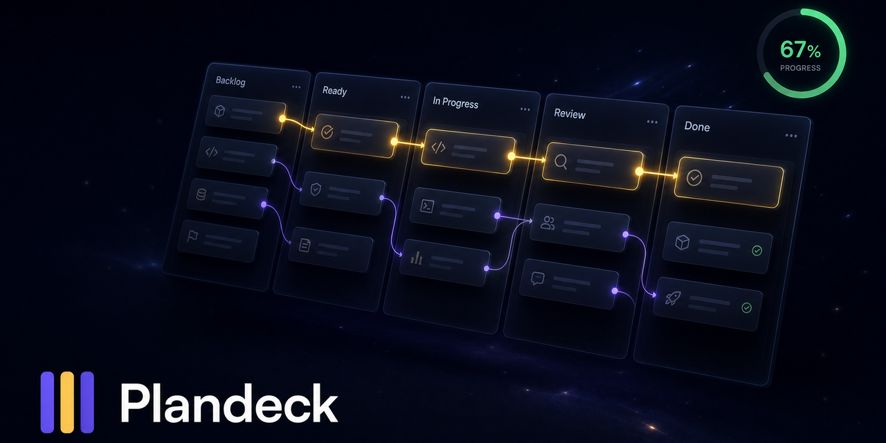
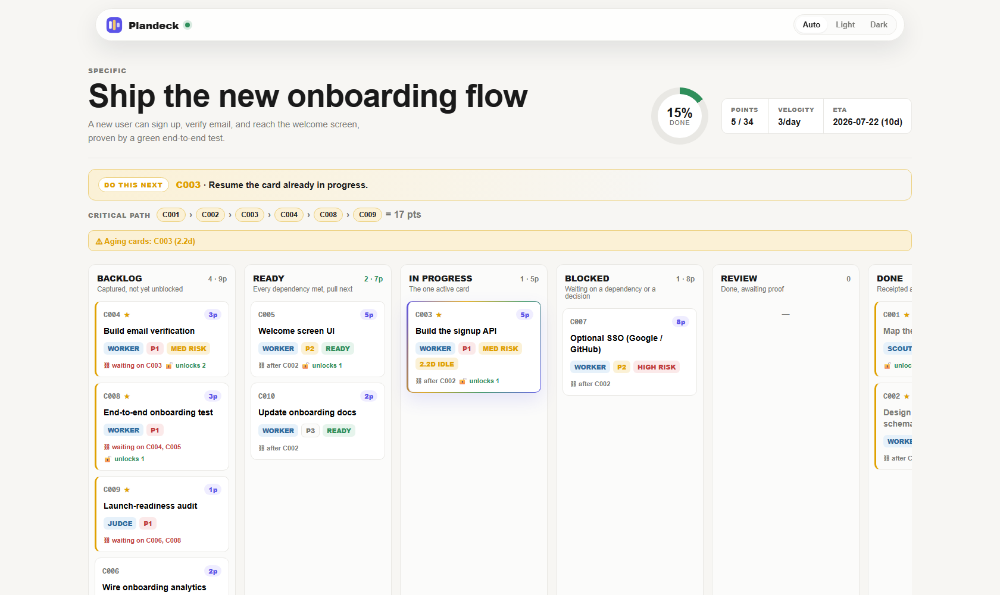
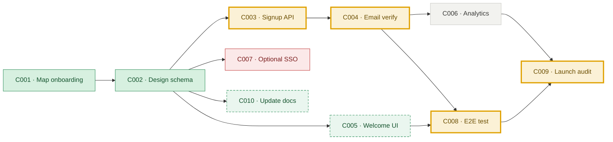

# Plandeck



**The visual Kanban for long-running agentic work.** Nobody wants to read a markdown plan or stare at raw HTML while an agent grinds for an hour. Plandeck turns your AI agent's plan into a live board that organizes itself: dependencies unlock into Ready, the critical path lights up in gold, estimates roll up, and the one next move is always obvious. It stays a plain file on disk underneath, so it survives `/clear` and a context reset.

```bash
npx skills add https://github.com/othmanadi/plandeck --skill plandeck
```

Or from npm (same content, plus the CLI on your PATH):

```bash
npm install -g plandeck    # global plandeck command
pi install npm:plandeck    # Pi Coding Agent: skill + CLI in one package
```

Zero dependencies, so there is nothing to install beyond that. Working from a clone instead? `node scripts/cli.mjs <cmd>` or `npm link` both work; `npx plandeck` runs the published release directly.

   



---

## The problem

AI coding agents lose the thread. After a context compaction or a `/clear`, an agent drops half the TODO list and stops mid-task, or it picks up the wrong thing next because the plan never said what was actually blocked. Flat markdown plans make this worse: a checklist cannot express that card C003 needs C002 done first, so "what should I do now" stays ambiguous even in popular planning tools. The agent guesses. The guess is often wrong.

Plandeck is the fix. It turns the plan into a structured, queryable task graph. Dependencies are explicit. A ready-queue is computed, not guessed. There is exactly one unambiguous next move, and it survives a context reset because it lives in a file on disk.

## Why it exists

Plandeck grows out of **planning-with-files** ([OthmanAdi/planning-with-files](https://github.com/OthmanAdi/planning-with-files), MIT), which gave crash-proof markdown plans that survive `/clear` plus a deterministic completion gate. Plandeck keeps that DNA (durable plans on disk, and a `check` command that only says COMPLETE when the work truly is) and adds the thing a wall of markdown can never give you: a live visual board with a brain.

That brain is a **deterministic intelligence layer** with no AI and no LLM anywhere in it. It is pure functions over YAML: given the cards, it computes the ready-queue, the critical path, the rollups, and the one next action. Because it is pure, it is fully testable, and it gives the same answer every time. The board server, the YAML reader, and the rendering are all Plandeck's own, with zero dependencies.

## 60-second Quickstart

```bash
# 1. Start the live board for the bundled example
node scripts/cli.mjs board examples/ship-onboarding-flow

# 2. Open the URL it prints, e.g.
#    http://plandeck.localhost:41747/ship-onboarding-flow/

# 3. In another window, open the plan and mark a card done:
#    edit examples/ship-onboarding-flow/plan.yaml
#    set one card's  column: done

# 4. Watch the board without touching the browser.
```

The payoff is immediate. When you set a card to `done`, every backlog card whose dependencies are now satisfied **auto-promotes to Ready**, the gold **critical path recomputes** and re-draws itself, the progress ring ticks up, and the "Do this next" banner points at the new single move. All of it streams over SSE. You never drag a card.

No Node handy? Open [`media/board-preview.html`](media/board-preview.html) in any browser to see the board with the sample data baked in, no server required.

## One port, every live board

The first `plandeck board` process becomes a local hub. It publishes a small `plandeck-hub.json` breadcrumb in the operating system's temporary directory. Later commands verify that breadcrumb with `GET /api/boards`, register their plan with the confirmed hub, hand over their file watcher, then exit. This also discovers a hub that had to use a fallback or ephemeral port. A stale process id or port is ignored and normal port selection continues. Open the root URL printed by the command to see every live plan as a card with progress, lane counts, and its next action.

```bash
plandeck board ./plans/api
plandeck board ./plans/web
# Both boards now live on port 41747, with an index at the root URL.
```

Plan slugs stay readable. If two different roots both use `slug: launch`, their paths become `/launch/` and `/launch-2/`. Registering the same root twice refreshes the existing board. When a plan disappears, the hub closes its watcher and SSE clients, then removes it from the index. Every occupied port in the Windows-safe ladder is checked for a compatible hub before Plandeck moves on.

Security posture: the hub binds to `127.0.0.1` by default. `POST /api/boards` and `DELETE /api/boards` require `Content-Type: application/json` and an exact Host header for `127.0.0.1`, `localhost`, or `plandeck.localhost` on the active port. Other hosts are rejected. The temporary breadcrumb is only a discovery hint and is never trusted without the hub handshake.

## The board model

Six lanes. A card lands in Blocked when a dependency is unmet or you set `status: blocked` (or `column: blocked`). Ready is computed, never placed by hand.

Six lanes carry the flow: Backlog, Ready, In Progress, Review, Done, plus a
Blocked lane. The dependency graph below is the bundled sample. You author only
the `depends_on` edges; Plandeck computes the rest.



Green is done, the gold chain is the critical path (17 points, the longest one),
dashed green auto-promoted to Ready the moment C002 finished, and red is blocked.
`plandeck next` reads exactly this graph and points at the one card to do now.

Each card shows its id, an estimate chip, role / priority / risk badges, and dependency indicators (`⛓ after X`, `🔓 unlocks N`). Click a card for full detail: dependencies met and unmet, verify commands, and the receipt.

A broken YAML edit does not wipe the board. Plandeck keeps serving the last good payload and places a red parse-error banner above the lanes. Fix `plan.yaml` and the live board resumes from the new state.

### The signature feature: the /clear-proof hand-off

After a context reset, an agent runs `plandeck next .` (or reads `NEXT.md`) and instantly knows the one move to make. While a board is running, its watcher refreshes `NEXT.md` after every valid plan change and skips the write when the content is unchanged. The breadcrumb stays current without creating a watcher feedback loop. `NEXT.md` is a tiny **separate** file, never an in-place rewrite of the big plan. That is deliberate: rewriting the large plan on every step would invalidate the model's prompt cache, so the breadcrumb is kept small and standalone to stay cache-safe.

```markdown
# ▸ NEXT

**C003 · Build the signup API**  `P1` `critical path` `5 pts` `unblocks 1`
Resume the card already in progress.

- Progress: 15% (5/34 pts, 2/10 cards)
- Ready now: C005, C010
- Blocked: C007
- Critical path: C001 → C002 → C003 → C004 → C008 → C009 (17 pts)

## Since you left
- C004 moved doing → blocked — claude-sonnet-4, 2026-07-13 14:02 UTC
- C004 moved blocked → doing — gpt-5, 2026-07-14 09:10 UTC

- Live board: http://plandeck.localhost:41747/ship-onboarding-flow/
```

## The deterministic brain

Every one of these is a pure function of the YAML, cycle-guarded, and tested. No AI.

- **Ready detection.** Topological. A backlog card auto-promotes to Ready the moment every one of its `depends_on` cards is done. A card caught in a dependency cycle is never marked Ready, and the cycle is flagged instead.
- **Critical path.** The longest points-weighted dependency chain, drawn in gold on the board. An unestimated card uses one point here and in every rollup.
- **Rollups.** An honest percent-complete derived from points, plus per-column point sums. Archived points remain in both the done and total values.
- **Velocity and ETA.** A positive `plan.velocity` is the configured points-per-day rate. When it is unset, Plandeck derives an observed rate once at least three dated done or archived cards span one day or more. The payload labels the basis as `configured` or `observed`.
- **Aging.** Cards are flagged from `updated_at` after one day blocked, two days in `doing` or `review`, or five days in `ready`.
- **Receipt hygiene.** `plandeck check` warns when a `cards/*.md` file has no live or archived card reference, or when a card references a note file that does not exist.
- **next.** One tie-broken next-action id. It prefers the active card, then a Ready card on the critical path, then priority, then how many cards it unblocks.

## Continuity across time

Plandeck remembers observed change as well as current state. Each successful board refresh or `plandeck next` observation compares the live cards with `.plandeck/last-state.json` and appends column, status, receipt, card, and lifecycle events to `.plandeck/journal.ndjson`. Receipt events contain only a short hash and character count. Raw receipt text is never copied into the journal. `plandeck archive` records one archived lifecycle event for every card it moves. `plandeck check` remains a read-only validation gate and does not create continuity data.

Set `PLANDECK_ACTOR` or pass `--actor <name>` to `board`, `next`, `archive`, or `doctor` so journal entries identify the observing agent. Precedence is `--actor`, then `PLANDECK_ACTOR`, then `unknown-agent`. Attribution is best-effort and session-scoped. A running board attributes every transition it observes to the actor that most recently registered that plan, even when another process edited the file.

Read history with `plandeck journal <dir>`. It returns the newest entries first, accepts `--since <ISO>` and `--limit <n>`, and supports raw `--json` output. A live hub exposes the same data at `GET /<slug>/api/journal?since=<ISO>&limit=<n>`. `NEXT.md` includes the last five entries under `Since you left`, in chronological order, so a returning agent can read the recent sequence directly.

Every successful board or `next` observation also snapshots changed, valid `plan.yaml` content into `.plandeck/snapshots/`. Filenames use a Windows-safe compact timestamp, and the newest 20 are retained. If the plan stops parsing, run `plandeck doctor <dir>` before reaching for git. It reports the parse error and available snapshots. `plandeck doctor <dir> --restore latest` restores the newest snapshot atomically and saves the replaced content as `plan.yaml.corrupt`. A compact snapshot timestamp can select an older version. Plandeck never restores automatically.

For polling agents, `plandeck next <dir> --json` includes a short `stateHash` derived from ordered card id, effective column, and status tuples. Send that value back with `--since <hash>`. An unchanged plan returns only `{ "unchanged": true, "stateHash": "..." }`; a changed plan returns the normal next-action payload with a new hash.

The continuity files are derived data. Do not edit `journal.ndjson` or `last-state.json` by hand. The journal grows without rotation, and append operations use no lockfile. Concurrent board and CLI processes can rarely duplicate, miss, or interleave a journal line, but they cannot corrupt `plan.yaml`. Continuity write failures warn once and never block `board`, `next`, or `archive`. Plan, archive, `NEXT.md`, breadcrumb, cache, and doctor restore writes use atomic replacement; snapshots use exclusive create because they are immutable.

## Data model

A plan directory holds these files:

| File | Role |
|------|------|
| `plan.yaml` | The single source of truth (the board). An agent reads and writes it; the board re-renders live. |
| `archive.yaml` | Completed cards moved out of the live plan by `plandeck archive`. Archived IDs still satisfy dependencies. |
| `plan.md` | The human and agent-readable charter: north star, why, constraints. |
| `cards/*.md` | Optional long receipts. `plandeck check` warns about unreferenced files and missing card references. |
| `NEXT.md` | Generated re-entry breadcrumb. Refreshed when its content changes while the board runs. |
| `.plandeck/` | Derived continuity data: the append-only mission journal, last observed card state, and the newest 20 valid plan snapshots. Gitignored. |
| `plan.yaml.corrupt` | The content replaced by the most recent explicit doctor restore. Gitignored and kept beside `plan.yaml` for inspection. |
| `.plandeck-board/` | Generated static board app. Gitignored. |

### Fields you author

`id` (required, e.g. `C001`), `title`, `column` (`backlog` \| `ready` \| `doing` \| `review` \| `done`), `status` (optional: `queued` \| `active` \| `blocked` \| `done`, where `active` marks the one in-flight card), `role` (`scout` \| `worker` \| `judge` \| `pm`), `estimate` (story points, fibonacci 1/2/3/5/8/13 recommended, no hours; an omitted estimate counts as one point), `confidence` (0..1), `priority` (`P0`..`P4`), `risk` (`low` \| `med` \| `high`), `depends_on` (`[ids]`), `verify` (commands that prove the card is done), `next_action` (the one concrete move), `tags` (`[..]`), `updated_at` (ISO, powers aging and observed velocity for done cards), and `receipt` (`{result, summary, changed_files, commands, evidence, note}`).

### Fields Plandeck derives

Never hand-set these. They are recomputed on every read and serialize in the board payload as `ready`, `onCriticalPath`, `unblocks` (how many cards this one unblocks), `unmetDeps`, `ageDays`, the rollups, and the single `next` pointer.

### A card, copy-paste

```yaml
cards:
  - id: C003
    title: "Build the signup API"
    role: worker
    column: doing
    status: active
    estimate: 5
    confidence: 0.7
    priority: P1
    risk: med
    depends_on: [C002]
    verify: ["curl -f localhost:3000/api/signup -d @test/fixtures/user.json"]
    next_action: "Wire the POST /signup handler to the users table, return 201 with the new id."
    tags: [api, auth]
    receipt:
      result: null
      summary: null
```

## Commands

From the repo root, run `node scripts/cli.mjs <cmd>`, or `plandeck <cmd>` after `npm link`. The table uses the `plandeck` name for brevity.

| Command | What it does |
|---------|--------------|
| `plandeck board <dir> [--once] [--json] [--port N] [--host H] [--actor NAME]` | Starts or registers a live board. A verified temporary breadcrumb discovers the active hub even on a fallback or ephemeral port. The watcher observes transitions, snapshots changed valid plans, refreshes `NEXT.md` only when its content changes, and streams the board plus hub index over SSE. A malformed plan keeps the last good lanes visible. `--once` generates the app and exits. |
| `plandeck archive <dir> [--json] [--actor NAME]` | Moves cards with `status: done` or `column: done` into `archive.yaml` and records their lifecycle entries. It preserves all plan text outside the removed card ranges, appends through atomic file replacements, and refuses an ID already present in the archive. Archived IDs satisfy dependencies and archived points stay in progress totals. |
| `plandeck check <dir> [--json]` | Validates the plan and runs the completion gate. Exits 1 on a hard error (parse error, duplicate id, dependency cycle, dangling dependency); reports softer issues (more than one active card, aging, orphan notes, missing note files) as warnings. Archived dependencies and note references count. Prints COMPLETE only when every live or archived card is done and the plan is structurally clean. |
| `plandeck next <dir> [--write] [--json] [--since HASH] [--actor NAME]` | Observes the plan and prints the one next action. JSON includes `stateHash`; a matching `--since` value returns only the unchanged marker. `--write` atomically emits `NEXT.md` with recent journal entries. |
| `plandeck journal <dir> [--since ISO] [--limit N] [--json]` | Reads observed plan history newest-first. Without `--since`, the default is the newest 20 entries. |
| `plandeck doctor <dir> [--restore TIMESTAMP\|latest] [--json] [--actor NAME]` | Diagnoses a healthy or broken plan and lists last-known-good snapshots. Restore is explicit, atomic, and preserves replaced content in `plan.yaml.corrupt`. |
| `plandeck init [dir]` | Scaffolds `plan.yaml` and `plan.md`. |

## Compatibility

Honest and small on purpose.

- **Claude Code** (skill plus CLI, tested on Windows 11).
- **Any agent that runs a shell and reads files** can use the CLI (`plandeck board` / `archive` / `check` / `next` / `journal` / `doctor`).
- The bundled `SKILL.md` follows the open SKILL.md standard, so it loads anywhere that reads SKILL.md (Codex, Cursor, and others).

Got Plandeck working with another agent? Open a PR or an issue and we will list it once it is verified.

## Credits and license

Plandeck grows out of **planning-with-files** by [OthmanAdi](https://github.com/OthmanAdi/planning-with-files) (MIT): durable, crash-proof plans on disk and a deterministic completion gate. Everything else, the board server, the YAML reader, the intelligence layer, and the rendering, is Plandeck's own, with zero dependencies.

Plandeck is MIT, copyright 2026 Ahmad Othman Ammar Adi (CodingWithAdi). See [LICENSE](LICENSE) and [NOTICE](NOTICE).
