# plantuml-skill

[](https://clawhub.ai/holdyounger/skills/plantuml-skill-2)
[](LICENSE)

用 PlantUML 文本语法绘制 UML 图与架构图。面向 OpenClaw / Claude 等 AI Agent 的技能（Skill），也让 Agent 一次说对话，直接产出可渲染的 `.puml`。

**Draw UML and architecture diagrams with PlantUML text syntax — sequence, class, activity, use case, state, component, deployment, timing, ER, C4, network, mindmap, Gantt, WBS, JSON/YAML, Salt wireframes.**

## 预览

全部预览图由官方在线服务实时渲染自 `examples/` 中的源码，所见即所得。

### 新增亮点图类型

| ER 实体关系 | C4 容器图 | 网络图 nwdiag |
|---|---|---|
| 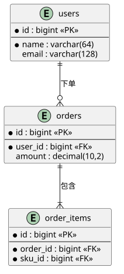 | 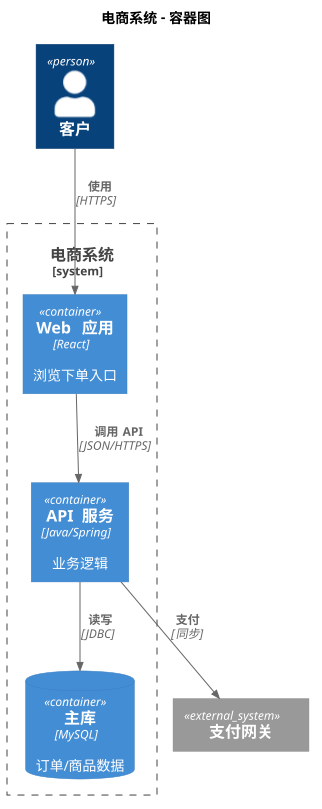 | 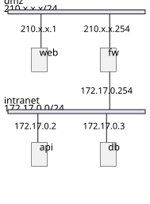 |

| JSON 可视化 | Salt 界面原型 | 甘特图 |
|---|---|---|
| 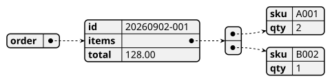 | 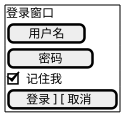 | 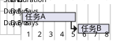 |

### 基础 UML

| 时序图 | 类图 | 活动图 |
|---|---|---|
| 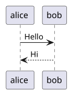 | 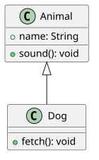 | 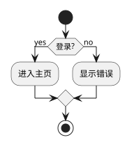 |

| 状态图 | 思维导图 | |
|---|---|---|
| 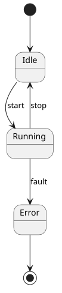 | 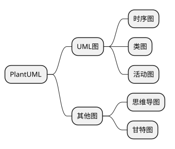 | |

## 为什么选这个技能

- **覆盖面广**：15+ 图类型，含 ER（Crow's Foot）、C4 架构（官方 C4 标准库）、nwdiag 网络图、JSON/YAML 数据可视化、Salt 界面原型等高频非 UML 图——同类技能大多只覆盖基础 UML
- **可渲染性优先**：所有语法片段按官方文档核对，Agent 生成即可渲染，不用反复试错
- **主题与美化**：内置 25+ 主题速查（`!theme` 一键换肤），附主题画廊链接
- **进阶能力**：预处理（变量/条件/循环/函数）、`<style>` CSS 定制、skinparam 迁移指南

## 支持的图表类型

| 类别 | 图类型 |
|------|--------|
| 结构 UML | 类图、组件图、部署图、对象图、包图 |
| 行为 UML | 时序图、活动图、用例图、状态图、定时图 |
| 架构与数据 | **C4（Context/Container/Component）**、**ER 实体关系**、**网络图 nwdiag**、Archimate |
| 可视化 | **JSON**、**YAML**、正则图、EBNF 语法图、数学公式 |
| 规划 | 甘特图、**WBS 工作分解**、思维导图 |
| 界面 | **Salt UI 线框原型** |

## 安装

### ClawHub（推荐）

```bash
openclaw skills install plantuml-skill-2
```

或全局安装：

```bash
openclaw skills install plantuml-skill-2 --global
```

### 从源码

```bash
git clone https://github.com/holdyounger/plantuml-skill.git ~/.openclaw/workspace/skills/plantuml-skill
```

## 使用示例

装好后直接对 Agent 说：

- 「画一个用户登录的时序图」
- 「给这个微服务系统画 C4 容器图」
- 「根据这段建表 SQL 画 ER 图」
- 「把这个 JSON 画成结构图」
- 「画一个 App 首页的界面原型」

## 渲染输出

技能生成 `.puml` 源码后，可选任意一种方式出图：

```bash
# 本地（需 Java）
java -jar plantuml.jar -tsvg diagram.puml

# VS Code：PlantUML 插件，Alt+D 预览
# 在线：https://www.plantuml.com/plantuml
# Mermaid 互转不适用，PlantUML 语法独立
```

## 文件结构

```
plantuml-skill/
├── SKILL.md              # 主技能文件（901 行语法参考，Agent 按需加载）
├── README.md             # 本文件
├── examples/             # 可渲染示例（11 个）
│   ├── sequence.puml / class.puml / activity.puml / state.puml
│   ├── er.puml / c4-container.puml / network.puml
│   ├── json.puml / salt.puml / mindmap.puml / gantt.puml
└── references/
    └── cheatsheet.md     # 速查表
```

## 与同类技能的对比

| | 本技能 | 基础 PlantUML 技能 |
|---|---|---|
| 基础 UML（9 类）| ✅ | ✅ |
| ER 图（Crow's Foot 完整记号）| ✅ 独立章节 | 多数只有最小示例 |
| C4 架构图 | ✅ 官方 C4 库 | ❌ |
| 网络图 nwdiag | ✅ | ❌ |
| JSON/YAML 可视化 | ✅ | ❌ |
| Salt UI 原型 | ✅ | ❌ |
| 主题速查（25+）| ✅ | 部分 |
| 预处理/style 进阶 | ✅ | ❌ |

## License

MIT
