# PlantUML 图表绘制

使用 PlantUML 基于文本的语法生成 UML 图和其他图表类型。所有图表都以 `@startuml` 开始，以 `@enduml` 结束。

## 基本结构

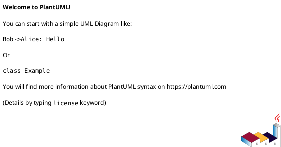

注释：单行用 `'`，块注释用 `/' ... '/`。

## 通用命令

- `title` — 添加标题
- `caption` — 图片下方标题
- `header` / `footer` — 页眉/页脚（可加 `left`/`center`/`right`）
- `legend` ... `end legend` — 图例
- `scale 1.5` / `scale 200 width` / `scale 200*100` — 缩放
- `left to right direction` — 改变方向（**仅类图 / 组件图 / 部署图可靠**；活动图不支持，见「渲染与预览」排查清单⑤）
- Creole 语法可用于文本格式化（粗体 `**...**`、斜体 `//...//`、列表等）

## 如何选择图表类型

拿到“画个图”的需求时，先按场景定类型，再去看对应章节的语法。拿不准先用 `!theme plain` 出图、再换皮。

| 场景 | 推荐图表 | 关键字 |
|------|----------|--------|
| 对象 / 服务间的消息调用顺序 | 时序图 Sequence | `@startuml` + `participant` |
| 业务流程、工作流、分支循环 | 活动图 Activity | `start` / `stop` |
| 对象生命周期的状态变迁 | 状态图 State | `[*] -->` |
| 系统功能与角色关系 | 用例图 Use Case | `actor` / `usecase` |
| 类 / 接口结构与继承、依赖 | 类图 Class | `class` |
| 模块组织与接口依赖 | 组件图 Component | `component` |
| 硬件 / 节点部署拓扑 | 部署图 Deployment | `node` |
| 某时刻对象实例快照 | 对象图 Object | `object` |
| 系统分层架构（上下文 / 容器 / 组件） | C4 | `!include <C4/C4_*>` |
| 网段划分 / 网络拓扑 | 网络图 nwdiag | `@startnwdiag` |
| 数据库表结构与表间关系 | ER 实体关系 | `entity` + `||--o{` |
| JSON 数据结构 | JSON 可视化 | `@startjson` |
| YAML 数据结构 | YAML 可视化 | `@startyaml` |
| 文法规则 | EBNF 语法图 | `@startebnf` |
| 正则表达式 | 正则图 Regex | `@startregex` |
| 项目进度排期 | 甘特图 Gantt | `@startgantt` |
| 任务层级分解 | WBS 工作分解 | `@startwbs` |
| 头脑风暴 / 知识整理 | 思维导图 MindMap | `@startmindmap` |
| 表单 / 界面原型 | Salt 界面线框 | `@startsalt` |
| 信号 / 时间约束 | 定时图 Timing | `clock` / `binary` |
| 企业架构 | Archimate | `Archimate_*` |

## 时序图 (Sequence Diagram)


### 参与者声明

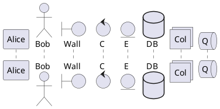

用 `as` 定义别名：`participant Alice as A`。
用 `order` 设定顺序：`participant Alice order 10`。

### 消息箭头

- `A -> B` — 实线箭头
- `A --> B` — 虚线箭头
- `A <- B` — 反向
- `A ->> B` — 实线开放箭头
- `A -\ B` — 仅起始端箭头
- `A \\- B` — 仅末端箭头
- `A x> B` — 末端带X
- `A -> B : 消息文本` — 带标签

### 生命线

- `activate A` / `deactivate A`
- `autoactivate on` — 自动激活
- `destroy A` — 销毁

### 分组

- `alt/else` — 条件分支
- `opt` — 可选
- `loop` — 循环
- `par` — 并行
- `break` — 中断
- `critical` — 关键
- `group 标题` — 自定义分组

### 其他

- `note left/right/over` — 注释
- `A -> B : <text>` 中可使用 `\n` 换行
- `ref over A, B` — 引用
- `delay` — 延迟
- `divider` — 分隔线

## 类图 (Class Diagram)


### 元素声明

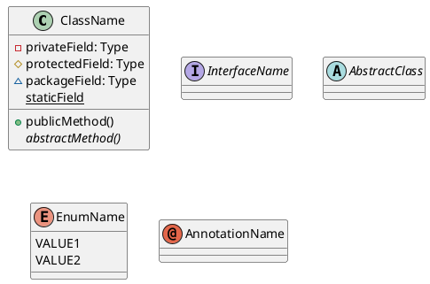

可见性：`+` public, `-` private, `#` protected, `~` package。

### 关系

- `A --|> B` — 继承（A继承B）
- `A ..|> B` — 实现（A实现B接口）
- `A --> B` — 关联
- `A --* B` — 组合
- `A ..* B` — 聚合
- `A o-- B` — 聚合（反向）
- `A ..> B` — 依赖
- `A -- B` — 实线连接
- `A .. B` — 虚线连接

关系标签：`A --> "1" B : "包含"`，`"*" --> "1"` 多重性。

### 构造型与注释

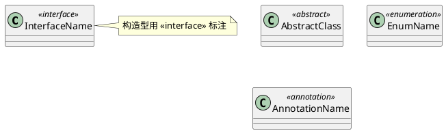

> 构造型 `<<...>>` 必须挂在**已声明的元素**后面（如 `class X <<interface>>`）。单独写一行 `<<interface>> Xxx` 会被误判成时序图而报 Syntax Error。

类内注释：`note left`, `note right`, `note top`, `note bottom`。

### 包

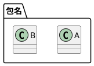

## 活动图 (Activity Diagram, Beta)


### 基本语法

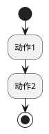

动作以 `:` 开始，`;` 结束。隐式自动连接。

### 条件

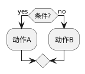

`elseif` 支持多分支。`!pragma useVerticalIf on` 切换垂直模式。

### Switch

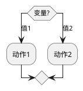

### 循环

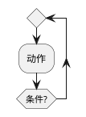

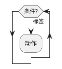

### 并行

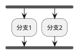

### 分割

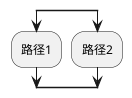

### 泳道

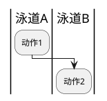

泳道别名：`|#<颜色>|<别名>| <标题>`。

### 分组

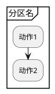

也支持 `group`, `package`, `rectangle`, `card`。

### 其他

- `kill` / `detach` — 终止/分离
- `break` — 打断循环
- `note` — 注释（可用 `floating` 浮动）
- 箭头：`->` 可加文本和颜色

## 用例图 (Use Case Diagram)


### 语法

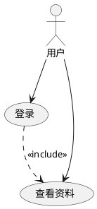

- Actor：`actor` 关键字或冒号语法 `:用户名:`
- 用例：`usecase` 关键字或括号 `(用例名)`
- `as` 定义别名
- 矩形：`rectangle "系统名" { ... }` 分组

### 关系

- `-->` 关联
- `..>` 依赖
- `..> : <<include>>` 包含
- `..> : <<extend>>` 扩展
- `--|>` 继承

## 状态图 (State Diagram)


### 基本语法

```json
[*] --> State1
State1 --> State2 : 事件
State2 --> [*]
```

### 复合状态

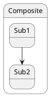

### 伪状态

- `<<fork>>` / `<<join>>` — 分叉/合并
- `<<choice>>` — 选择
- `<<entryPoint>>` / `<<exitPoint>>` — 入口/出口
- `[H]` / `[H*]` — 历史/深历史状态

### 并发

用 `--` 或 `||` 分隔并发区域。

### 注释

`note left of`, `note right of`, `note top of`, `note bottom of`, `note on link`。

## 组件图 (Component Diagram)


### 语法

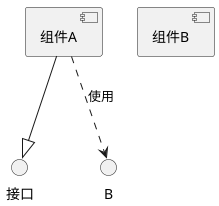

- 组件：`component` 或 `[名称]`
- 接口：`interface` 或 `()名称`
- `as` 别名

### 连接类型

- `..` 虚线
- `--` 实线
- `-->` 箭头

### 分组容器

`package`, `node`, `folder`, `frame`, `cloud`, `database`。

### 端口

`port`, `portIn`, `portOut` 关键字。

## 部署图 (Deployment Diagram)


### 元素

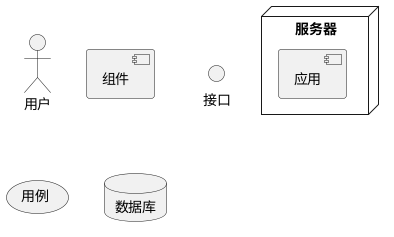

短格式：`:a:` (actor), `[c]` (component), `()i` (interface), `(u)` (usecase)。

### 连接

与组件图相同的连接类型，支持线条样式、颜色、粗细。

### 嵌套

所有元素可嵌套：`node`, `package`, `folder`, `frame`, `cloud`, `database`。

`allowmixing` 或 `allow_mixing` 指令允许在类图/对象图中混用部署元素。

## 时序图/定时图 (Timing Diagram)


### 参与者类型

- `analog` — 模拟信号（连续，线性插值）
- `binary` — 二进制信号
- `clock` — 时钟信号（必须用 `with period N`，可选 `pulse` / `offset`）
- `concise` — 简明表示
- `robust` — 状态线表示

### 语法

```plantuml
@startuml
clock "时钟" as clk with period 2
binary b
robust r
@0
b is high
r is state1
@5
b is low
r is state2
@enduml
```

- `@N` — 绝对时间
- `@+N` / `@-N` — 相对时间
- `@N as :名称` — 锚点
- `is` — 定义状态

> ⚠️ `clock` 的周期必须写成 `with period N`，写成 `clock clk period 2` 会被判成 sequence 图而报 `Syntax Error?`。

## 思维导图 (MindMap)


### 语法（运算符方式）


运算符：`+` 右侧, `-` 左侧, `*` 右侧多级, `_` 左侧多级。

### OrgMode 语法

```plantuml
@startmindmap
* 中心
** 分支1
*** 子分支
@endmindmap
```

### Markdown 语法

```plantuml
@startmindmap
- 中心
-- 分支
--- 子分支
@endmindmap
```

多行文本用 `:` 和 `;` 包围。

## 甘特图 (Gantt Diagram)


### 语法

```plantuml
@startgantt
[任务A] lasts 5 days
[任务B] lasts 3 days
[任务B] starts at [任务A]'s end
@endgantt
```

### 关键命令

- `[任务] lasts N days` — 持续时间
- `[任务] starts N days after [任务B]'s end` — 相对开始
- `[任务] ends at [任务B]'s end` — 相对结束
- `[任务] happens at 2024-01-15` — 绝对日期
- `then` — 连续任务
- `[任务] as T` — 短名称
- `is xx% completed` — 完成度
- `[里程碑] happens at 2024-02-01` — 里程碑

### 日历

- `Project starts 2024-01-01` / `projectscale monthly` — 项目起点与尺度（实测当前版本 `projectstart` 语法会报错，用 `Project starts`）
- `2024-01-01 to 2024-12-31` — 日期范围
- `saturday are closed` / `sunday are closed` — 关闭日
- `printscale daily/weekly/monthly/quarterly/yearly` — 尺度

## ER 实体关系图 (Entity Relationship)


数据库设计首选。基于 Crow's Foot 记号，实体用 `entity` 定义。

### 实体与字段

```plantuml
@startuml
entity "用户" as user {
  * id : int <<PK>>
  --
  * name : varchar(64)
  email : varchar(128)
  created_at : datetime
}
entity "订单" as order {
  * id : bigint <<PK>>
  --
  * user_id : bigint <<FK>>
  amount : decimal(10,2)
  status : tinyint
}
@enduml
```

- `*` 开头 = 必填字段；`--` = 字段分隔线
- `<<PK>>` / `<<FK>>` / `<<unique>>` 构型标注键

### 关系记号（Crow's Foot）

| 语法 | 含义 |
|------|------|
| `\|\|--o{` | 一对多（左1 右0..n）|
| `\|\|--\|\|` | 一对一 |
| `}o--o{` | 多对多 |
| `\|\|-ri-o{` | 零或一对多 |

组合口诀：第一段 `\|\|`=恰1、`}o`=多、`|o`=0或1；第二段同；中间 `--` 实线 / `..` 虚线。

### 完整示例

```plantuml
@startuml
' 隐藏未使用的字段行，或用 !define 简化
entity users {
  * id : bigint <<PK>>
  --
  name : varchar(64)
}
entity orders {
  * id : bigint <<PK>>
  --
  * user_id : bigint <<FK>>
}
entity order_items {
  * id : bigint <<PK>>
  --
  * order_id : bigint <<FK>>
  * sku_id : bigint <<FK>>
}
users ||--o{ orders : "下单"
orders ||--|{ order_items : "包含"
@enduml
```

## C4 架构图（Context / Container / Component）


用 `!include <C4/C4>` 标准库画 C4 模型，适合系统架构文档。另有 C4_Context / C4_Container / C4_Component / C4_Dynamic / C4_Deployment 等子库。

### 系统上下文图 (C4 Context)

```plantuml
@startuml
!include <C4/C4_Context>
title 电商系统 - 系统上下文

Person(customer, "客户", "平台买家")
System(eshop, "电商系统", "允许客户浏览购买商品")
System_Ext(payment, "支付网关", "第三方支付")

Rel(customer, eshop, "浏览/下单", "HTTPS")
Rel(eshop, payment, "支付回调", "JSON/HTTPS")
@enduml
```

### 容器图 (C4 Container)

```plantuml
@startuml
!include <C4/C4_Container>
title 电商系统 - 容器图

Person(customer, "客户")
System_Boundary(c1, "电商系统") {
  Container(web, "Web 应用", "React", "浏览下单入口")
  Container(api, "API 服务", "Java/Spring", "业务逻辑")
  ContainerDb(db, "主库", "MySQL", "订单/商品数据")
  ContainerQueue(mq, "消息队列", "Kafka", "异步事件")
}
System_Ext(payment, "支付网关")

Rel(customer, web, "使用", "HTTPS")
Rel(web, api, "调用 API", "JSON/HTTPS")
Rel(api, db, "读写", "JDBC")
Rel(api, mq, "发布事件")
Rel(api, payment, "支付", "同步")
@enduml
```

常用元素：`Person` / `System` / `System_Ext` / `Container` / `ContainerDb` / `ContainerQueue` / `Component`；关系用 `Rel(a, b, "标签", "技术")`，虚线用 `Rel_Back`。

## 网络图 (nwdiag)


```plantuml
@startnwdiag
nwdiag {
  network dmz {
    address = "210.x.x.x/24"
    web [address = "210.x.x.1"];
    fw [address = "210.x.x.254"];
  }
  network intranet {
    address = "172.17.0.0/24"
    fw [address = "172.17.0.254"];
    api [address = "172.17.0.2"];
    db [address = "172.17.0.3"];
  }
}
@endnwdiag
```

> ⚠️ 必须用 `@startnwdiag` / `@endnwdiag` 专用标签，用 `@startuml` 包裹会报错（提示 Please use @startnwdiag）。同一节点在多个 network 中重复出现 = 跨网段（多网卡/防火墙场景），如示例中的 `fw`。

- `network` 定义网段，`address` 可省略
- 节点属性：`shape = "cloud"`、`icon` 等

## WBS 工作分解图

与思维导图同源语法，`*` 层级递进；支持侧向分支与样式。

```plantuml
@startwbs
* 项目
** 阶段一：设计
*** 需求分析
*** 概要设计
** 阶段二：开发
*** 后端
**** API 开发
**** 数据库
*** 前端
@endwbs
```

- `*` 右侧节点、`-` 左侧不常用于 WBS；`**` 加 `<>` 样式括号可着色：`**<color:red>关键路径`

## Salt 界面原型 (UI Wireframe)


快速画表单/界面线框，适合需求文档。

```plantuml
@startsalt
{^
  登录窗口
  [用户名      ]
  [密码        ]
  [X] 记住我
  [  登录  ] [ 取消 ]
}
@endsalt
```

常用控件：`[文本框]`、`()`单选、`[X]`复选、`{ ... }`分组框、`{# "标签" | 内容}`标签页、`[--]`下拉、`^下拉^`、`[&icon:图片]`；`{^ ... }`带标题分组。

## JSON / YAML 数据可视化


直接把数据结构渲染成图，适合接口文档/配置说明。

```json
@startjson
{
  "order": {
    "id": "20260902-001",
    "items": [
      {"sku": "A001", "qty": 2},
      {"sku": "B002", "qty": 1}
    ],
    "total": 128.00
  }
}
@endjson
```

```yaml
@startyaml
service:
  name: order-api
  replicas: 3
  resources:
    cpu: "500m"
    memory: 512Mi
@endyaml
```

## 主题（!theme）

PlantUML 内置了多套预设主题，用 `!theme` 指令即可一键切换整套配色/字体/形状，不用手动调 skinparam。

```plantuml
@startuml
!theme cyborg
class Foo
@enduml
```

`!theme` 通常放在 `@startuml` 之后、图内容之前。

### 常用内置主题

| 主题 | 风格 |
|------|------|
| `plain` | 简单黑底白字（默认风格对照） |
| `bluegray` | 蓝灰 |
| `blueprint` | 蓝图风格（白底蓝线，仿蓝图复印） |
| `amiga` | Amiga Workbench 1.x（白字蓝底） |
| `mimeograph` | 油印风格（灰底紫字） |
| `cyborg` / `superhero` / `united` / `minty` / `sandstone` / `sketchy` / `spacelab` / `materia` / `cerulean` | Bootswatch 风格系列 |
| `hacker` | Jekyll hacker 风格（终端感） |
| `crt-amber` | 单色 CRT 琥珀色（橙字黑底） |
| `reddress-darkblue` / `reddress-lightblue` | Red Dress 红裙风格（深/浅蓝） |
| `aws-orange` | AWS 配色 |
| `cloudscape-design` | Cloudscape 设计配色 |
| `carbon-gray` | Carbon 设计灰阶 |
| `Sunlust` | Solarized 配色 |
| `black-knight` / `metal` / `silver` / `lightgray` | 深色/金属/灰色系 |
| `mars` / `toy` / `vibrant` | future-architect/puml-themes 系列 |
| `mono` | 单色 + 等宽字体 |

> 部分主题（如 `cyborg`、`sketchy`、`reddress-*` 等）有多个变体，可在主题详情页查看。完整主题画廊与预览：
> <https://the-lum.github.io/puml-themes-gallery/themes/>

### 主题变体与使用

- 主题名区分大小写（如 `Sunlust`）。
- 可指定皮肤变体：`!theme cyborg-outline` 等（具体变体名参考画廊详情页）。
- 主题可叠加 `<style>` 进一步微调。
- 不确定用哪个时，可先选对照主题 `plain`，再按需切换。

### 主题 vs skinparam

- `!theme`：一键整套预设外观，优先使用。
- `skinparam`：细粒度参数覆盖（已废弃，仍可用），仅在主题基础上微调个别参数。
- `<style>`：CSS 式样（主题的底层实现），高级自定义推荐方式。

## 非 UML 图表

PlantUML 不仅能画 UML，还支持大量非 UML 图表类型。当用户需要画结构/数据/界面/流程类图表时，优先考虑用 PlantUML 表达。完整列表见 <https://plantuml.com/zh/>。

### 常用非 UML 图表语法

**WBS / Salt / ER / 网络图 / JSON / YAML / 定时图** → 均已有独立章节，直接看上方对应部分即可。下方补充其余非 UML 类型。

#### 正则表达式图表

```plantuml
@startregex
A|B(CD)*E
@endregex
```

#### EBNF 语法图

```plantuml
@startebnf
digit = "0" | "1" | "2" | "3" ;
@endebnf
```

#### Archimate 架构图

```text
@startuml
!include <archimate/Archimate>
Archimate_BusinessFunction(F1, "订单管理")
Archimate_ApplicationComponent(C1, "订单服务")
@enduml
```

> Archimate 依赖标准库宏，公共服务器 1.2026.8beta1 上 `Archimate_*` 调用会报 `Syntax Error? (Assumed diagram type: sequence)`，属版本问题。要出图请改用本地 PlantUML，或等服务器升版；这里用 `text` 保留写法参考。

### 非 UML 图表类型清单

- 数据：EBNF、Regex、信息工程图（IE）；ER / JSON / YAML 已在上方独立章节详述
- 结构：架构图（Archimate）；C4 / nwdiag / WBS / Salt 已在上方独立章节详述
- 流程：SDL、Ditaa、甘特图、时序图（chronology）
- 其他：AsciiMath / JLaTeXMath 数学公式

## skinparam 常用参数

> 注意：skinparam 已废弃，建议迁移到 `<style>` CSS 样式。

```plantuml
@startuml
skinparam backgroundColor transparent
skinparam monochrome true
skinparam shadowing false
skinparam defaultFontName Helvetica
skinparam classFontColor red
skinparam classFontSize 10
skinparam ArrowHeadColor none
skinparam componentStyle rectangle
@enduml
```

嵌套写法：

```plantuml
@startuml
skinparam class {
  FontColor red
  FontSize 10
  FontName Helvetica
}
@enduml
```

## 预处理

### 变量

```plantuml
@startuml
!$var = "value"
!$i = 42
!$a ?= "default"
@enduml
```

### 条件

```plantuml
@startuml
!if ($var == "value")
  ...
!else
  ...
!endif
@enduml
```

### 循环

```plantuml
@startuml
!while ($i > 0)
  ...
!endwhile
@enduml
```

### 函数

```plantuml
@startuml
!function $name($param)
  !return $param + "!"
!endfunction
@enduml
```

### 包含文件

```text
!include file.iuml
!include_many file.iuml
!include_once file.iuml
!includesub file.puml!SECTION
```

> 这几个指令要读外部文件，单独一段源码是渲染不出图的（会报文件不存在），所以用 `text` 展示写法。实际用时放在 `@startuml` 之后。

### 内置函数

`%date()`, `%now()`, `%darken("red", 20)`, `%chr(65)`, `%intval("42")`, `%file_exists("path")` 等。

## 颜色

支持标准颜色名（`red`, `blue`, `green` 等）和 RGB 码（`#FF0000`）。`transparent` 仅用于背景。

内联颜色样式：`#color;line:color;line.[bold|dashed|dotted];text:color`。

## 渲染与预览（闭环）

生成 `.puml` 后必须能出图才算闭环。按环境三选一：

1. **在线服务器（无需本地 Java，推荐）**
   把 PlantUML 源码做 percent-encode 后拼到公共服务器地址即可直接出图：
   - PNG：`https://www.plantuml.com/plantuml/png/?~<url-encoded-source>`
   - SVG：`https://www.plantuml.com/plantuml/svg/?~<url-encoded-source>`
   `<url-encoded-source>` 即把整段 `@startuml ... @enduml` 做 URL 编码（空格→`%20`、`@`→`%40`、`>`→`%3E` 等）。`?~` 形式对中小图（约 4000 字符内）最省事，浏览器打开即显示图；需要图片二进制时改用 deflate 压缩后的 `/png/<encoded>` 形式。
   例：`@startuml` + `Alice -> Bob : Hi` + `@enduml` →
   `https://www.plantuml.com/plantuml/png/?~%40startuml%0AAlice%20-%3E%20Bob%20%3A%20Hi%0A%40enduml`

2. **本地命令行（需 Java）**

   ```bash
   java -jar plantuml.jar -tsvg diagram.puml   # -tpng 默认, 也可 -tpdf -tlatex
   ```

3. **编辑器 / IDE**
   - VS Code：PlantUML 插件，`Alt+D` 预览
   - IntelliJ：PlantUML Integration 插件
   - Typora / Obsidian：直接渲染 Markdown 里的 PlantUML 代码块。Typora 需装 Java，或在「偏好设置 → 高级设置 → 打开配置文件」的 `conf.user.json` 里配 `"plantuml": {"server": "https://www.plantuml.com/plantuml"}`
   - **代码块语言标识写 `plantuml`，不要写 `puml`**：Typora / Obsidian 只识别 ` ```plantuml ` 才会渲染，写成 ` ```puml ` 会被当成普通代码块原样显示。`.puml` 只是源文件的扩展名，跟代码块标识无关——两者别混为一谈。
   - 在线手绘：<https://www.plantuml.com/plantuml>

4. **批量重渲 + 校验（本仓库自带）**
   `scripts/render_preview.py`（Python 3 标准库，零依赖）会把 `examples/*.puml` 渲染到 `assets/preview/`，且**在写盘前校验结果是不是真图**：

   ```bash
   python scripts/render_preview.py              # 全部重渲
   python scripts/render_preview.py timing class # 只渲指定几个
   python scripts/render_preview.py --check      # 只校验已有 svg
   ```

   两个关键点：① 压缩形式 `/svg/<encoded>` 的编码表是 PlantUML **自定义 64 字符表**（`0-9A-Za-z-_`），不是标准 base64，用 base64 替换 `+/=` 会拿到一张 "bad URL / HUFFMAN" 报错图；② 服务器报错时返回的**也是一张合法 SVG**，所以必须检查内容里有没有 `Syntax Error` / `Assumed diagram` 等标记，不能只看 HTTP 200。

> 渲染异常先查七点：① 是否用了正确的 `@start*/@end*`（非 UML 图如 nwdiag 必须用 `@startnwdiag`）；② 中文 / 特殊字符是否正常编码；③ 超长源码改用 deflate 压缩形式（去掉 `~`，用服务器接受的压缩编码）；④ `title` 里别用 ASCII 空格-空格（` - `），个别版本会误判为 sequence 图而报 Syntax Error，用 `·` 或下划线代替；⑤ 活动图里别写 `left to right direction` / `top to bottom direction`，该指令只在类图 / 组件图 / 部署图可靠；⑥ `!theme` / `!include` 等 `!` 预处理指令**不支持行尾注释**，注释要单独写一行，否则整行会被当成参数；⑦ 别用 `...` 当占位内容（EBNF 等语法图会报 Unparsable expression），示例要给真实可解析的内容。若返回 HTTP 403 `error code: 1010` 或 HTTP 509 崩溃图，是公共服务器限流或临时故障，稍后重试即可，不是源码问题。

### 写 Markdown 时的两条硬约束

1. **代码块必须自带 `@startuml` / `@enduml`**。只写片段（如只有 `class A`）在 Typora / Obsidian 里会报 `TypeError: Cannot read properties of undefined (reading 'startsWith')`——渲染器要先解析 `@start` 才能判断图类型，取不到就崩。语法速查里的片段也要补全成能独立出图的完整源码。
2. **语言标识写 `plantuml` 而不是 `puml`**。同上，只有 ` ```plantuml ` 会被识别。确实无法独立渲染的（如依赖外部文件的 `!include` 系列）改用 ` ```text `，别硬塞进 plantuml 块。

## 如何用得好：PlantUML 实践指南


语法正确只是及格线。图是给人读的——清晰、准确、可维护才是好图。以下原则让生成的图从「能渲」变成「好用」。

### 1. 先想清楚，再写代码

- 动笔前先定三件事：**给谁看、回答什么问题、只讲一件事**。一张图塞两个主题，读者必然迷路。
- 用上文「如何选择图表类型」定图种。选错图种比语法错更糟：用时序图硬塞状态流转、用类图硬画流程，都是南辕北辙。

### 2. 可读性优先（最重要的 5 条）

- **分而治之**：单图超过约 20 个节点就拆。用 `!include` 把大图拆成子文件，或在文档里用多张小图取代一张巨图。
- **命名即文档**：用业务名而非 `A`/`B`/`C`。`participant "订单服务" as OrderSvc` 比 `participant A` 好读十倍。
- **注释写意图**：`'` 开头单行注释不渲染，可在源码里标注「为什么这样画」「待确认」，方便协作者理解。
- **分组圈边界**：用 `package` / `rectangle` / `cloud` / `database` 把同类项圈起来，读者一眼看出模块边界。
- **控制方向**：类图 / 组件图 / 部署图优先 `left to right direction`，横向展开在宽屏上更易读；时序图默认自上而下即可，不用改。
  > ⚠️ **活动图不要加 `direction`**。`left to right direction` / `top to bottom direction` 在活动图里会让 PlantUML 1.2026.8beta1 报 `Syntax Error? (Assumed diagram type: class)`。想给活动图分阶段，用 `partition` 而不是改方向。

### 3. 减少视觉噪音

- **克制用色**：颜色只用于区分关注点（如正常 / 异常路径、核心 / 外围），不要每个元素一种色。统一用 1 个 `!theme` 或统一 skinparam，而不是逐元素上色。
- **标签写动宾**：箭头标签写「动词+宾语」（`写入`、`调用`、`返回`），别写整句长说明。
- **隐藏不必要元素**：类图 `hide unlinked` / `hide circle`；用 `-[hidden]->` 控制排版位置；`!pragma layout smetana` 调自动布局。

### 4. 反模式（别这样画）

- ❌ 一张图塞整个系统 —— 拆。
- ❌ 颜色编码却无图例 —— 读者猜不出含义。
- ❌ 复制示例只改文字、不更新关系 —— 出现「箭头 A→B 但文字说调 C」的矛盾。
- ❌ `title` 里写 ASCII 空格-空格（` - `）—— 个别版本误判为 sequence 图语法错误（见渲染排查 ④）。
- ❌ 用图画表格数据 —— 建表 SQL / 配置项用表格或代码块更清楚，别硬画。
- ❌ 箭头语义混乱 —— 同一张图里 `->` 忽指调用忽指数据流，统一一种语义或加图例。

### 5. 何时不该画图

- 纯列表 / 对比 / 配置 → 用 Markdown 表格或代码块。
- 需要精确数值 → 图看不清，上表格或专门图表。
- 概念一句话能说清 → 不画。图的成本高于文字时，别画。

### 6. 规模化与可维护

- **大图输出用 SVG**：`-tsvg` 矢量放大不糊，适合文档嵌入；PNG 适合快速分享。
- **在线长度限制**：`?~` 形式对约 4000 字符内最稳；更长改用 deflate 压缩编码（见渲染段）。
- **图随代码活起来**：把 `.puml` 放进仓库（与文档 / 代码同仓），CI 用 `plantuml.jar` 自动重渲染，避免文档过期。
- **统一团队风格**：共享一份 `!theme` + skinparam 片段（放进可被 `!include` 的 `style.puml`），保证视觉一致、改主题一处生效。

> 详细「好 / 差对照」与可复制模板见 `references/best-practices.md`。


