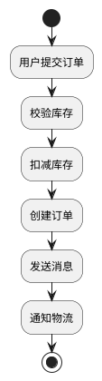
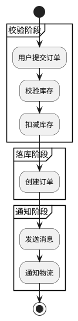
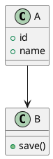
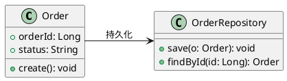
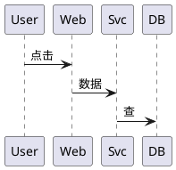
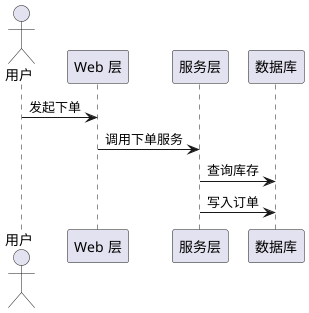

# PlantUML 实践指南：好图 vs 差图

> 配套 SKILL.md「如何用得好」段的详细版。每个对照都给可运行源码，直接复制改即可渲染。

## 为什么需要这套指南

语法会了只能保证「能渲」，但图是沟通工具。下面三组对照展示最常见的「差 → 好」跃迁，覆盖活动图、类图、时序图三种高频图。

---

## 对照一：活动图（分组分阶段 vs 一长条平铺）

### ❌ 差：所有步骤平铺、无分组、方向默认



问题：步骤一多就成一长条竖线，看不出「校验 / 落库 / 通知」三个阶段边界。

### ✅ 好：用 `partition` 分三个阶段



三个阶段一目了然，读者一眼能定位「我现在卡在哪一步」。

> ⚠️ **别在活动图里用 `left to right direction`**。PlantUML 1.2026.8beta1 的活动图引擎不支持 `direction` 指令，一加就报 `Syntax Error? (Assumed diagram type: class)`（`top to bottom direction` 同样会挂）。该指令只在类图 / 组件图 / 部署图上可靠——见下一个对照。

---

## 对照二：类图（业务命名 vs 占位符）

### ❌ 差：用 A / B 占位，关系无说明



问题：读者不知道 A、B 是什么，箭头含义全靠猜。

### ✅ 好：业务命名 + 字段类型 + 关系标签



---

## 对照三：时序图（箭头语义统一 + 图例感）

### ❌ 差：箭头有时指调用有时指数据，标签随意



问题：到底是「调用」还是「传数据」？语义混乱，读者要脑补。

### ✅ 好：统一调用语义 + 标签动宾 + 显式参与者



---

## 可复制的统一样式片段（style.puml）

把这段存成 `style.puml`，再 `!include` 进每张图，团队风格一致、改主题一处生效：

```text
' style.puml —— 团队统一视觉（放在 @startuml 之后 !include）
!theme plain
skinparam backgroundColor #FFFFFF
skinparam defaultFontName "Microsoft YaHei"
skinparam ArrowColor #333333
skinparam ClassBackgroundColor #F5F7FA
skinparam ClassBorderColor #409EFF
skinparam ParticipantBorderColor #409EFF
skinparam sequenceArrowColor #333333
```

用法（下面这段是可直接渲染的完整示例，样式已内联，不依赖外部文件）：

```plantuml
@startuml
' !include style.puml
!theme plain
skinparam backgroundColor #FFFFFF
skinparam defaultFontName "Microsoft YaHei"
skinparam ArrowColor #333333
skinparam ClassBackgroundColor #F5F7FA
skinparam ClassBorderColor #409EFF

class Order {
  +orderId: Long
  +status: String
}
class OrderItem {
  +sku: String
  +qty: Integer
}
Order "1" *-- "n" OrderItem
@enduml
```



---

## 一句话总结

先想清、再分组、少上色、统一语义、随代码更新。图是沟通工具，不是炫技。
