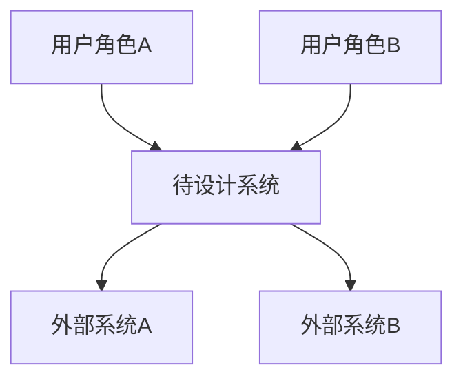
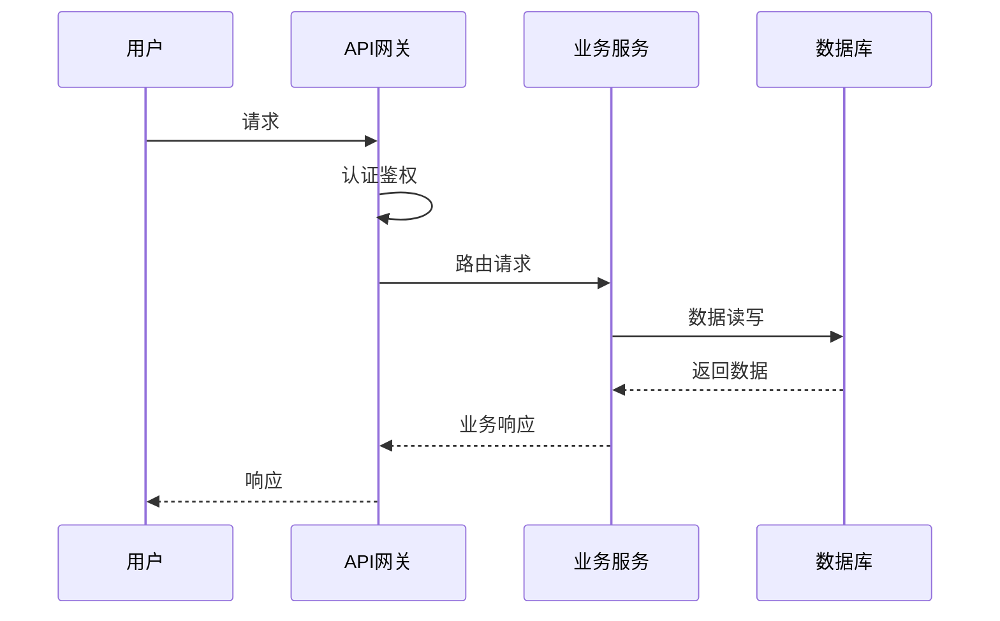

# Skill 2：平台架构设计（核心）

## 功能概述

基于需求分析结果，输出完整的系统架构设计方案，包括系统分层架构、核心模块划分、技术栈选型、关键数据流、API设计和模块间协作机制。

## 输入与输出

| 项目 | 内容 |
|------|------|
| **输入** | 需求分析报告（来自Skill 1） |
| **输出** | 完整架构设计方案（含C4架构图、技术栈对比、API设计） |

## 执行流程

### Step 1：C4 Model架构总览

使用C4 Model从4个层次描述系统架构：

**Level 1 — Context Diagram（系统上下文）**

- 描述：谁在使用系统？系统依赖哪些外部系统？

**Level 2 — Container Diagram（容器/服务划分）**
- 描述：系统由哪些高层容器/服务组成？
- 典型容器：Web前端、API网关、业务服务、数据存储、消息队列、AI服务

**Level 3 — Component Diagram（组件分解）**
- 描述：每个容器内部的核心组件及其关系

**Level 4 — Code Diagram（代码层面，可选）**
- 描述：关键组件的内部类/模块结构（仅在需要时产出）

### Step 2：分层架构设计

按以下6层结构设计（根据领域类型调整侧重）：

| 层级 | 说明 | 所有方案必须覆盖 |
|------|------|-----------------|
| **1. 前端/展现层** | Web端、App端、管理后台、BFF层 | ✅ |
| **2. 网关/接入层** | API网关、负载均衡、认证鉴权、限流熔断 | ✅ |
| **3. 业务服务层** | 核心业务模块、服务编排、工作流引擎 | ✅ |
| **4. AI/智能层** | Agent编排、LLM集成、推理服务、模型管理 | 按需 |
| **5. 数据层** | 关系数据库、缓存、搜索引擎、数据仓库 | ✅ |
| **6. 基础设施层** | 容器编排、服务网格、监控、日志、CI/CD | ✅ |

> **领域适配规则**：
> - 平台级架构：重点关注1-6层的完整性和模块化
> - 尽调系统：重点关注3-5层（流程引擎、数据采集、报告生成）
> - 合规系统：额外加强安全审计层、权限管控层

### Step 3：核心模块划分

对于每个模块，输出：
- **模块名称**：标识
- **职责边界**：该模块做什么和不做什么
- **对外接口**：暴露哪些API/事件
- **依赖模块**：依赖哪些其他模块
- **数据所有权**：拥有哪些数据

示例格式：

```markdown
### 模块：Agent编排引擎

| 属性 | 内容 |
|------|------|
| **职责** | 负责Agent的定义、编排、执行生命周期管理 |
| **非职责** | 不处理用户认证、不负责数据持久化 |
| **对外接口** | REST API: /api/v1/agents/*, GraphQL Query |
| **依赖** | 工作流引擎、用户管理、LLM网关 |
| **数据所有权** | Agent定义、编排配置、执行日志 |
```

### Step 4：技术栈选型（多方案对比）

每个技术决策给出至少2-3个选择，结构化对比：

```markdown
### 后端框架选型

| 方案 | 优势 | 劣势 | 适用场景 | 综合评分 |
|------|------|------|---------|---------|
| **方案A: Spring Cloud** | 成熟生态、微服务体系完整 | 较重、Java依赖 | 企业级平台 | ⭐⭐⭐⭐⭐ |
| **方案B: Go + Kratos** | 轻量、高并发、云原生友好 | 生态相对较新 | 高并发系统 | ⭐⭐⭐⭐ |
| **方案C: Python FastAPI** | AI集成方便、开发效率高 | 并发性能有限 | AI密集系统 | ⭐⭐⭐⭐ |

**推荐方案**: [方案A/B/C]
**推荐理由**: [详细说明]
```

**技术栈选型覆盖维度**：
1. 后端框架
2. 前端框架
3. 数据库（关系型/NoSQL/缓存/搜索引擎）
4. 消息队列
5. AI/LLM框架
6. 容器与编排
7. 监控与可观测性
8. CI/CD工具

### Step 5：关键数据流

描述系统中的核心数据流转路径，使用Mermaid序列图或流程图：



**必须覆盖的数据流**：
- [ ] 用户认证与授权流
- [ ] 核心业务流程（根据需求分析确定）
- [ ] 数据同步/事件驱动流
- [ ] 错误处理与降级流

### Step 6：API设计概要

基于模块划分，输出关键API设计：

```markdown
### API设计概要

| 模块 | API路径 | 方法 | 说明 | 认证方式 |
|------|---------|------|------|---------|
| 用户管理 | /api/v1/users | POST | 创建用户 | JWT |
| ... | ... | ... | ... | ... |
```

**覆盖范围**：
- 核心模块的外部API
- 模块间内部API（gRPC/消息）
- 异步事件/消息契约

### Step 7：模块间通信机制

描述模块间如何通信和协作：

| 通信模式 | 适用场景 | 技术选型 |
|---------|---------|---------|
| 同步REST | 查询/短操作 | HTTP/gRPC |
| 异步消息 | 解耦/事件驱动 | Kafka/RabbitMQ/Pulsar |
| 事件总线 | 领域事件 | 事件驱动架构 |
| 数据共享 | 只读数据 | 缓存/物化视图 |

### Step 8：输出架构设计报告

```markdown
# 系统架构设计方案

## 1. C4架构总览
[包含Context/Container/Component三层视图]

## 2. 分层架构
[六层结构详细说明]

## 3. 核心模块设计
[每个模块的职责边界描述]

## 4. 技术栈选型对比
[所有技术决策的多方案对比]

## 5. 关键数据流
[核心流程的序列图]

## 6. API设计
[核心API和事件契约]

## 7. 通信机制
[模块间通信方案]
```

## 质量检查清单

- [ ] 是否完整覆盖6层架构？
- [ ] 每个模块的职责边界是否清晰？
- [ ] 技术栈选型是否给出至少2个方案对比？
- [ ] 是否有C4 Model的Context和Container层视图？
- [ ] 核心数据流是否完整描述？
- [ ] API设计是否覆盖所有核心模块？
- [ ] 模块间通信机制是否明确？
- [ ] 是否符合领域适配规则？