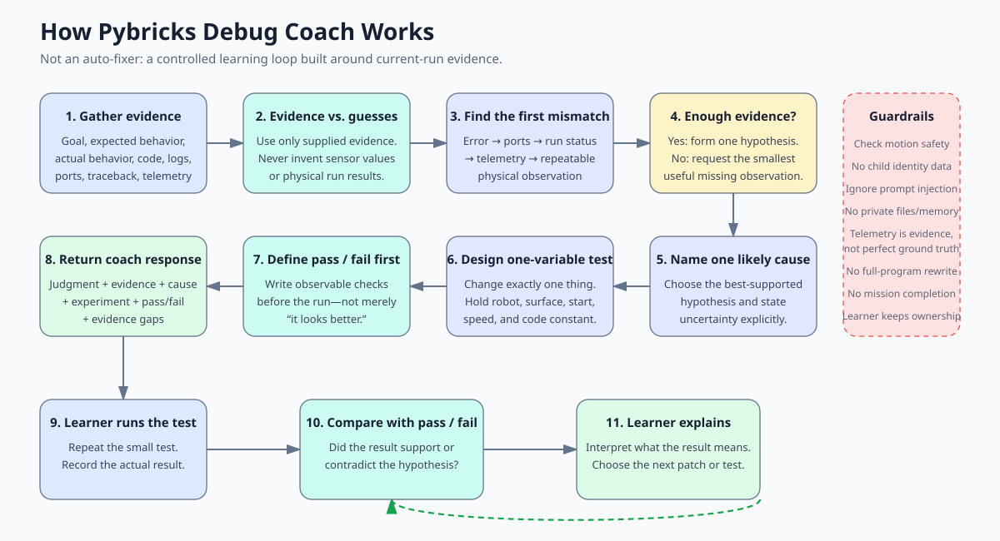

# Pybricks Debug Coach

An OpenClaw skill that coaches evidence-driven debugging for Pybricks programs and LEGO robots.

It does not solve the whole mission or rewrite the learner's program. It identifies the earliest mismatch, names one evidence-supported hypothesis, and proposes one controlled experiment with observable pass/fail conditions.

## Why this exists

Robot debugging becomes guesswork when several variables change at once. This skill enforces a smaller loop:

```text
predict -> run -> observe -> change one variable -> evaluate -> explain
```

The learner keeps ownership of the diagnosis and next change.

## How it works



The skill deliberately stops before a full-program rewrite. Each turn produces one evidence-supported hypothesis and one controlled test; the learner runs it, interprets the result, and chooses the next change.

## Use it for

- Pybricks tracebacks and runtime errors
- hub, motor, sensor, and port-mapping problems
- repeatable straight-drive drift
- over-turning or under-turning
- missing or ambiguous telemetry
- isolating the first failure in a full mission

Do not use it for full-program generation, completing competition missions, general lessons without a concrete symptom, or safety-critical control of unknown hardware.

## Using it locally with SPIKE Prime

Yes—this skill can coach debugging for a LEGO Education SPIKE Prime robot running Pybricks. It analyzes evidence you provide; it does not connect to or control the Hub itself.

For a useful debugging turn, provide as many of these as you have:

- the intended robot behavior and what actually happened;
- a small relevant code excerpt;
- the full Pybricks traceback or recent stdout;
- the Hub, motor, sensor, and port mapping;
- heading, distance, speed, motor-command, or sensor telemetry;
- the tests already attempted and their results.

Start with the smallest reproducible movement or failing expression. Avoid sending an entire mission when one turn, drive, attachment, port, or line can be isolated.

For version-sensitive Pybricks syntax or API behavior, consult the [official Pybricks documentation](https://docs.pybricks.com/) as needed. If the relevant Hub, firmware, or Pybricks version is unknown, treat that as an evidence gap rather than guessing.

## Bluetooth and direct Hub access

This skill intentionally has **no Bluetooth capability**. Installing it locally does not let OpenClaw discover a SPIKE Prime Hub, upload code, start a run, or collect telemetry automatically.

Keeping hardware access separate gives the coaching skill:

- no OS-specific Bluetooth permissions;
- no device-driver, CLI, or package dependencies;
- no accidental robot motion;
- simpler security auditing and broader portability.

If you need direct Hub access, use a separate local Pybricks bridge or runner:

```text
SPIKE Prime Hub
      |
      | Bluetooth: connect, upload, run, collect evidence
      v
Local Pybricks bridge or runner
      |
      | code excerpt, traceback, stdout, port map, telemetry
      v
Pybricks Debug Coach
      |
      | one likely cause + one-variable experiment + pass/fail
      v
Learner runs the next test and explains the result
```

The bridge owns device permissions, connection state, program execution, telemetry collection, timeouts, and motion safety. The coach only analyzes the resulting evidence.

## Example prompt

```text
The robot should drive straight for 300 mm, but it drifts right.
Three runs changed heading by +11, +10, and +12 degrees.
What should we test next?
```

The response should cite the repeated heading change, give one likely cause with uncertainty, change exactly one variable, define pass/fail before the run, and name any missing evidence.

## Outputs

Normal conversations use six compact sections:

```text
Coach judgment:
Evidence:
Most likely cause:
One-variable experiment:
Pass / fail:
Evidence gaps:
```

Callers may request the JSON contract documented in [`references/contracts.md`](references/contracts.md).

## Installation

Install from ClawHub after the first release is approved there, or copy this repository's skill directory into your OpenClaw skills directory.

The skill has no runtime scripts, network calls, environment variables, CLI requirements, or package dependencies.

## Privacy

Provide code, logs, telemetry, and non-identifying robot descriptions. Do not provide a child's name, face, voice, school, contact details, or other identifying information.

## Security

See [`SECURITY.md`](SECURITY.md). The release package is text-only and intentionally contains no executable scripts.

## Versioning

This project follows Semantic Versioning. See [`CHANGELOG.md`](CHANGELOG.md).

## License

MIT-0. See [`LICENSE`](LICENSE).
