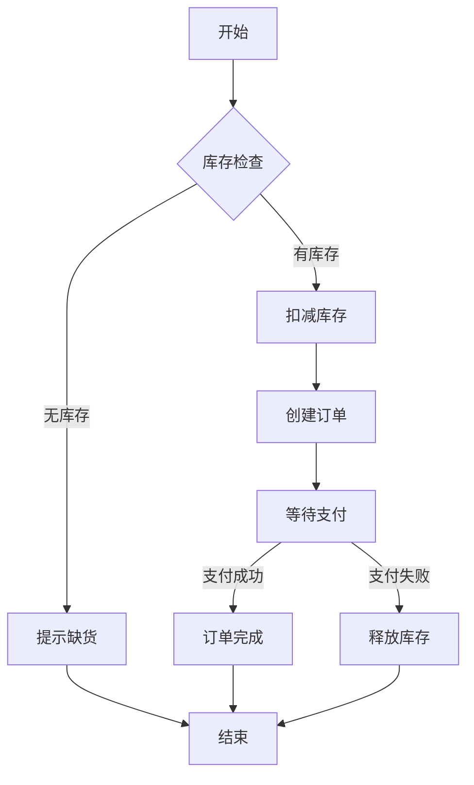

# 图片与流程图分析

## 分析目标

从需求文档中的图片/流程图提取可测试信息，转化为测试用例。

## 图表类型分析

### 流程图分析

**识别元素**：
- 开始/结束节点 → 流程边界
- 处理节点 → 操作步骤
- 判断节点 → 决策点（分支）
- 连接线 → 流程路径

**测试用例映射**：
- 每条完整路径 → 1条功能用例
- 每个判断节点 → 至少2条用例（真/假分支）
- 循环节点 → 边界用例（0次、1次、最大次数）

**示例分析**：
```
流程图：
开始 → 判断库存 → 有库存 → 扣减库存 → 创建订单 → 结束
                 → 无库存 → 提示缺货 → 结束

生成用例：
- TC-001: 有库存时下单（主流程）
- TC-002: 无库存时提示缺货（异常流程）
```

### 状态图分析

**识别元素**：
- 状态节点 → 系统状态
- 转换箭头 → 状态转换
- 转换条件 → 触发事件

**测试用例映射**：
- 每个合法转换 → 1条功能用例
- 每个非法转换 → 1条异常用例
- 状态回退/循环 → 边界用例

**示例分析**：
```
状态图：
待支付 →(支付) 已支付 →(发货) 已发货 →(收货) 已完成
待支付 →(超时) 已取消
已支付 →(退款) 已退款

生成用例：
- TC-001: 待支付→已支付（合法转换）
- TC-002: 已支付→已发货（合法转换）
- TC-003: 已发货→已完成（合法转换）
- TC-004: 待支付→已取消（合法转换）
- TC-005: 已支付→已退款（合法转换）
- TC-006: 已发货→待支付（非法逆向）
```

### 序列图分析

**识别元素**：
- 参与者（系统/用户/外部服务）
- 消息流（请求/响应）
- 生命线（对象存在期间）

**测试用例映射**：
- 正常消息流 → 集成测试用例
- 超时/异常响应 → 异常处理用例
- 消息顺序 → 时序验证用例

### UI原型分析

**识别元素**：
- 界面元素（按钮、输入框、列表）
- 交互行为（点击、输入、滚动）
- 布局规格（尺寸、间距、对齐）

**测试用例映射**：
- 每个可交互元素 → 功能用例
- 布局规格 → UI验证用例
- 响应式行为 → 兼容性用例

## 图片质量优化

### PDF图片提取优化

问题：PDF中同一图片可能被多次引用，导致重复提取。

解决方案：
1. **xref去重**：同一PDF对象只提取一次
2. **MD5哈希去重**：内容相同的图片只保留一份
3. **质量过滤**：过滤小尺寸、低质量图片
4. **颜色空间处理**：CMYK自动转RGB

效果：从300个重复文件优化到10个唯一图片，节省97%存储。

### 提取脚本

```python
import fitz  # PyMuPDF
import hashlib
from pathlib import Path

def extract_unique_images(pdf_path, output_dir, min_size=5120):
    """提取PDF中唯一的高质量图片"""
    doc = fitz.open(pdf_path)
    seen_hashes = set()
    saved_images = []
    
    for page_num in range(len(doc)):
        page = doc[page_num]
        for img in page.get_images():
            xref = img[0]
            try:
                pix = fitz.Pixmap(doc, xref)
                
                # 质量过滤
                if pix.width < 100 or pix.height < 100:
                    continue
                
                img_data = pix.tobytes()
                if len(img_data) < min_size:
                    continue
                
                # MD5去重
                img_hash = hashlib.md5(img_data).hexdigest()
                if img_hash in seen_hashes:
                    continue
                
                # 保存图片
                seen_hashes.add(img_hash)
                filename = f"image_{len(saved_images)+1:02d}_{pix.width}x{pix.height}.png"
                pix.save(str(output_dir / filename))
                saved_images.append(filename)
                
            except Exception as e:
                print(f"提取失败: xref={xref}, 错误: {e}")
    
    doc.close()
    return saved_images
```

## Mermaid流程图生成

在需求分析阶段生成Mermaid格式流程图，辅助理解和验证：



### 生成规则

- `graph TD`：从上到下
- `graph LR`：从左到右
- `[]`：处理节点
- `{}`：判断节点
- `()`：开始/结束节点
- `-->|条件|`：带条件的连接线
