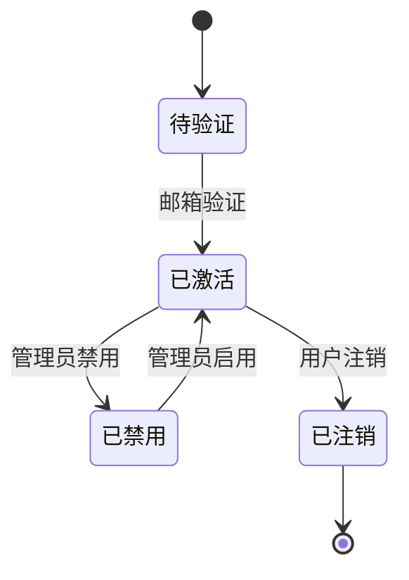

# 用户管理系统需求文档

## 1. 功能需求

### 1.1 用户注册
- 用户必须提供有效的邮箱地址进行注册
- 密码长度至少8位，必须包含大小写字母和数字
- 用户名长度3-20个字符，只能包含字母、数字和下划线
- 注册成功后发送验证邮件

### 1.2 用户登录
- 用户使用邮箱和密码登录
- 连续5次登录失败后账户锁定30分钟
- 登录成功后生成JWT令牌，有效期24小时

### 1.3 用户信息管理
- 用户可以修改个人资料（昵称、头像、手机号）
- 用户可以修改密码（需要验证旧密码）
- 用户可以注销账户（需要二次确认）

### 1.4 权限管理
- 管理员可以查看所有用户列表
- 管理员可以禁用/启用用户账户
- 普通用户只能查看自己的信息

## 2. 非功能需求

### 2.1 性能要求
- 登录接口响应时间 < 500ms
- 支持1000并发用户
- 数据库查询响应时间 < 100ms

### 2.2 安全要求
- 密码必须加密存储（bcrypt）
- API接口需要HTTPS
- 敏感操作需要记录审计日志

## 3. 业务规则

### 3.1 用户状态流转

### 3.2 密码策略
- 密码有效期90天
- 不能使用最近3次使用过的密码
- 密码必须包含至少1个特殊字符

## 4. 接口定义

### 4.1 注册接口
- URL: POST /api/auth/register
- 请求体: { email, username, password, confirmPassword }
- 成功响应: 201 Created
- 失败响应: 400 Bad Request

### 4.2 登录接口
- URL: POST /api/auth/login
- 请求体: { email, password }
- 成功响应: 200 OK + JWT token
- 失败响应: 401 Unauthorized

## 5. 界面原型

### 5.1 登录页面

### 5.2 注册页面

