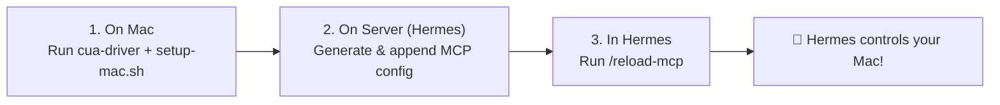
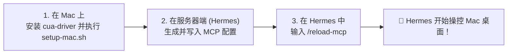

# 🍎 Remote macOS Computer Use (Hermes Skill)

<p align="center">
  
  
  
  
</p>

<p align="center">
  <b><a href="#-english">English</a></b> | <b><a href="#-中文说明">中文说明</a></b>
</p>

---

## 🌐 English

### ⚡ What is this?
A **Hermes Agent Skill** that enables Hermes running on a remote/cloud server to control your local Mac desktop (click, type, screenshot, run apps) via [cua-driver](https://cua.ai) MCP and an auto-healing reverse SSH tunnel.

---

#### Option 1: Clone directly into Hermes Skills directory (Recommended)
```bash
git clone https://github.com/dont-see-big-shark/remote-macos-computer-use ~/.hermes/skills/remote-macos-computer-use
```

#### Option 2: Via Hermes CLI
```bash
hermes skills install https://raw.githubusercontent.com/dont-see-big-shark/remote-macos-computer-use/main/SKILL.md --force
```

---

### 🤖 How to use with Hermes Agent

Once the skill is installed, simply prompt your Hermes Agent:

> **Prompt Example:**
> *"Help me set up remote macOS computer use. My cloud server IP is `203.0.113.10`, server user is `ubuntu`, and my Mac user is `alice`."*

Hermes will automatically execute `SKILL.md` to guide the setup:



---

### 🛠️ Simplified 3-Step Setup

#### Step 1: On Your Mac (One-time)
```bash
# 1. Install cua-driver & grant Accessibility/Screen permissions
/bin/bash -c "$(curl -fsSL https://cua.ai/driver/install.sh)"
cua-driver permissions grant

# 2. Enable SSH Remote Login
sudo launchctl enable system/com.openssh.sshd
sudo launchctl kickstart -k system/com.openssh.sshd

# 3. Start auto-reconnect background daemons
REMOTE_HOST="<server-ip>" REMOTE_USER="ubuntu" REVERSE_PORT=2299 bash ./scripts/setup-mac.sh
```

#### Step 2: On Your Server (Configure Hermes)
Generate the MCP config fragment and append to `~/.hermes/config.yaml`:
```bash
MAC_USER="<mac-username>" REVERSE_PORT=2299 REMOTE_KEY=~/.ssh/id_ed25519_mac python3 ./scripts/gen-mcp-config.py >> ~/.hermes/config.yaml
```

#### Step 3: In Hermes Chat
```text
/reload-mcp
```
*(Or start a new Hermes session)*. Hermes now has access to all `mcp__mac_computer__*` tools!

---
---

## 🇨🇳 中文说明

### ⚡ 这是什么？
这是一个 **Hermes Agent 技能包（Skill）**。它让运行在云端服务器上的 Hermes Agent 可以跨网段接管并操作你的局域网 Mac 桌面（截屏、点击、输入、打开应用），通过 [cua-driver](https://cua.ai) MCP 与自愈式反向 SSH 隧道实现零公网 IP 穿透与全天候后台保活。

---

#### 方式一：克隆到 Hermes 技能目录（推荐）
```bash
git clone https://github.com/dont-see-big-shark/remote-macos-computer-use ~/.hermes/skills/remote-macos-computer-use
```

#### 方式二：通过 Hermes 命令行安装
```bash
hermes skills install https://raw.githubusercontent.com/dont-see-big-shark/remote-macos-computer-use/main/SKILL.md --force
```

---

### 🤖 如何让 Hermes AI 执行安装与配置

安装 Skill 后，直接在 Hermes 对话框中发送指令即可：

> **对 Hermes 说的提示词（Prompt）：**
> *“帮我配置 remote-macos-computer-use 技能。我的云端服务器 IP 是 `203.0.113.10`，服务器用户名是 `ubuntu`，Mac 用户名是 `alice`。”*

Hermes 会自动读取 `SKILL.md` 并一步步协助完成初始化：



---

### 🛠️ 极简 3 步极速配置

#### 第一步：在 Mac 终端执行（一次性）
```bash
# 1. 安装 cua-driver 并授予系统辅助/截屏权限
/bin/bash -c "$(curl -fsSL https://cua.ai/driver/install.sh)"
cua-driver permissions grant

# 2. 开启远程登录 (SSH)
sudo launchctl enable system/com.openssh.sshd
sudo launchctl kickstart -k system/com.openssh.sshd

# 3. 启动后台守护进程（隧道自愈 + 防休眠）
REMOTE_HOST="<云服务器IP>" REMOTE_USER="ubuntu" REVERSE_PORT=2299 bash ./scripts/setup-mac.sh
```

#### 第二步：在云端服务器配置 Hermes
生成 MCP 配置并追加到 `~/.hermes/config.yaml`：
```bash
MAC_USER="<Mac用户名>" REVERSE_PORT=2299 REMOTE_KEY=~/.ssh/id_ed25519_mac python3 ./scripts/gen-mcp-config.py >> ~/.hermes/config.yaml
```

#### 第三步：在 Hermes 对话中刷新生效
```text
/reload-mcp
```
*(或开启一个新会话)*。Hermes 即可直接使用 `mcp__mac_computer__*` 操控 Mac！

