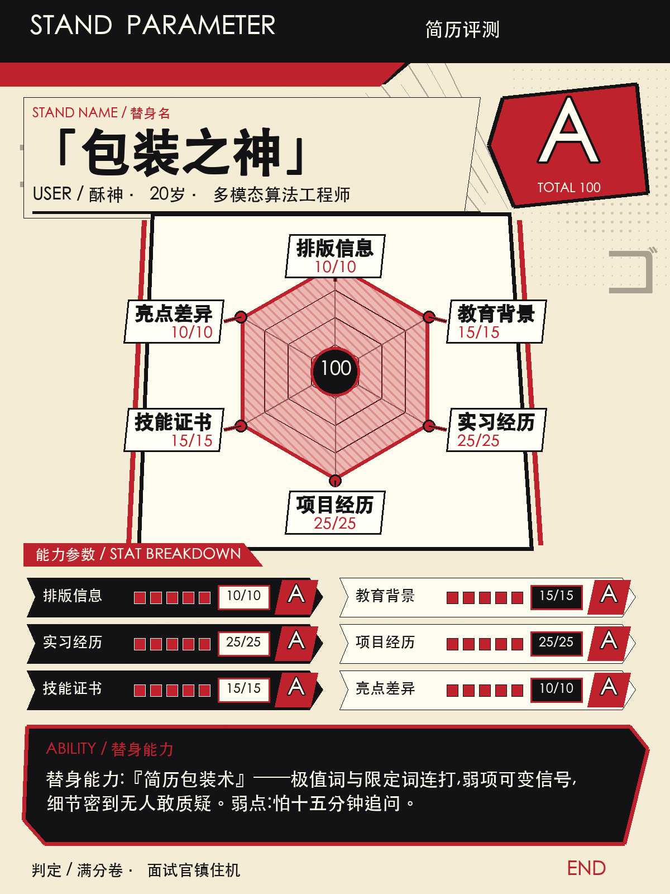

# 简历评测 · 替身面板版 🃏

把你的简历测评成一张 **JOJO 替身面板**——六维能力值雷达图 + 评级字母(A-E)+
毒舌替身名 + 替身能力判词。1200×1600 PNG,直接发朋友圈 / 小红书 / 微博 / 抖音。

```
你的简历 → AI 打分 → 毒舌判词 → 一张荒木风六边形面板
```



## 它能干嘛

- **测评**:按 6 个维度打分(排版 / 教育 / 实习 / 项目 / 技能 / 亮点),总分 100,
  评级 A-E:A(90+)/ B(75-89)/ C(60-74)/ D(45-59)/ E(<45)
- **吐槽**:给简历起替身名(「泡池子之主」「已读不回使者」…),判词每条都来自
  简历真实槽点,不编造、不人身攻击
- **建议**:替身能力描述里带一条可执行的修改建议,结尾落在鼓励上
- **出图**:一键渲染 JOJO 风格六边形能力面板,纯本地,不需要网络

## 快速开始(3 步,不需要任何 AI agent 系统)

需要:Python 3.10+、[uv](https://docs.astral.sh/uv/)(或直接 pip)。

```bash
# 1. 提取简历文本
uv run --with pymupdf --with python-docx python scripts/extract_resume.py 我的简历.pdf -o resume.txt

# 2. 生成测评数据:把 resume.txt 的内容 + references/roast-prompt.md 里的提示词
#    发给任意大模型(ChatGPT/Claude/DeepSeek),把返回的 JSON 存成 panel.json

# 3. 渲染面板图
uv run --with pillow python scripts/render_stand.py panel.json 我的测评面板.png
```

没装 uv 也行:`pip install pillow`,然后 `python scripts/render_stand.py panel.json out.png`。

先看效果(仓库自带酥神示例):

```bash
uv run --with pillow python scripts/render_stand.py templates/panel_template.json demo.png
```

## 让任何 AI 助手使用这个 skill

这个仓库是**纯通用 skill**,不绑定任何 agent 系统。四种用法任选:

1. **ClawHub 一键安装**(OpenClaw 用户推荐):

   ```bash
   npx clawhub@latest install @padepa/resume-review
   ```

2. **放进你 AI 助手的 skills 目录**:支持 SKILL.md 的助手(Claude Code 的
   `~/.claude/skills/`、OpenClaw 的 skills 目录等)直接把整个仓库文件夹放进去,
   然后对它说「测评一下我的简历」即可
3. **直接对话**:把 `SKILL.md` 内容贴给 AI,它就知道怎么干了
4. **纯手动**:上面的 3 步快速开始,连 AI 助手都不需要

## 输入格式(panel.json)

```json
{
  "persona": "酥神 · 20岁 · 多模态算法工程师",
  "stand_name": "「包装之神」",
  "total_score": 100,
  "verdict": "满分卷 · 面试官镇住机",
  "ability": "替身能力:『简历包装术』——极值词连打,弱项变信号。弱点:怕十五分钟追问。",
  "dimensions": [
    {"name": "排版信息", "score": 10, "max": 10},
    {"name": "教育背景", "score": 15, "max": 15},
    {"name": "实习经历", "score": 25, "max": 25},
    {"name": "项目经历", "score": 25, "max": 25},
    {"name": "技能证书", "score": 15, "max": 15},
    {"name": "亮点差异", "score": 10, "max": 10}
  ]
}
```

- `dimensions` 固定 6 项,顺序为排版/教育/实习/项目/技能/亮点
- `stand_name` ≤8 字,`verdict` ≤10 字,`ability` ≤50 字(排版安全线)
- 完整生成规则见 `references/roast-prompt.md`(可直接当提示词喂给大模型)

## 常见问题

- **字体报错?** 脚本自动找系统 CJK 字体,找不到用 `--font /path/to/font.ttf`
- **`OSError: cannot open resource`?** 部分桌面 AI 应用会注入 PYTHONPATH,
  用 `env -u PYTHONPATH uv run --with pillow ...` 重跑
- **扫描版 PDF 提取不到文字?** 先 OCR(如 ocrmypdf)再跑 extract_resume.py
- **发图要注意什么?** 脚本不自动打码,JSON 里姓名/电话/邮箱/公司名请一律换成
  花名/「某厂」(生成提示词已内置此规则)

## 目录结构

```
resume-review/
├── SKILL.md                    # 通用 skill 入口(任何 AI 可读)
├── scripts/
│   ├── render_stand.py         # JOJO 面板图渲染器(核心)
│   └── extract_resume.py       # 简历文本提取(PDF/DOCX/TXT)
├── templates/
│   └── panel_template.json     # 示例面板数据(酥神)
├── references/
│   ├── roast-prompt.md         # 给 LLM 的面板数据生成提示词
│   └── humor-style.md          # 梗库与评分表
└── docs/                       # README 示例图
```

## License

MIT © padepa
