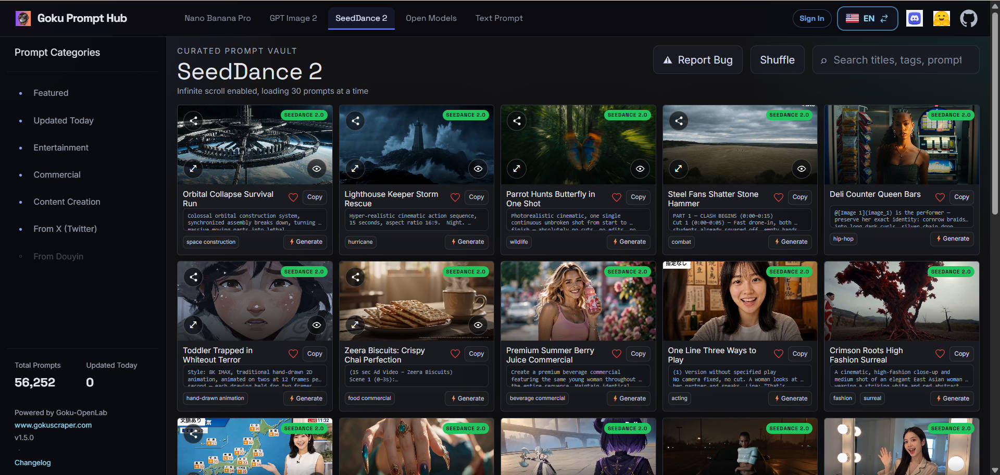

# AI Video Prompt Recommender — 8,000+ Seedance 2 Prompts

[](https://huggingface.co/datasets/GokuScraper/seedance-2-prompts-datasets)
[](https://github.com/gokuscraper/seedance-2-prompts-skill)
[](LICENSE)
[](README.md) [](README.zh.md)

> **Stop spending hours hunting for the right AI video prompt.** Tell your AI assistant what you need in one sentence — it searches 8,000+ curated Seedance 2 prompts and returns the top 3 matches with cover images and video links, ready to use.
>
> 🎬 [Browse the Dataset →](https://prompthub.gokuscraper.com/prompts/?model=seedance-2)



## What Is This?

An **AI agent skill** that gives Claude, OpenClaw, Cursor, and other AI assistants the ability to intelligently search a curated library of **8,000+ Seedance 2 (ByteDance video model) prompts**, recommend the best matches for your use case, and even customize prompts based on your content.

**Seedance 2** is ByteDance's latest video generation model — one of the most powerful AI video generators available today. High-quality prompts are the key to great results.

## Why Use This Skill?

- ✅ **8,000+ prompts** — massive library covering diverse use cases
- ✅ **Every prompt includes a cover image + video link** — see the preview before you generate
- ✅ **Smart semantic search** — describe what you need, the AI finds the match
- ✅ **Content remix mode** — paste your article or video script, get a custom prompt
- ✅ **Multi-language** — responds in your language, always provides English prompt for generation
- ✅ **Bilingual data** — prompts available in both English and Chinese

---

## Installation

### OpenClaw (Recommended)

```bash
clawhub install seedance-2-prompts-skill
```

Or search inside OpenClaw chat:

> "Install the gpt image 2 prompts skill from clawhub"

### Claude Code

```bash
npx skills i gokuscraper/seedance-2-prompts-skill
```

### Other AI Assistants (Cursor, Codex, Gemini CLI, Windsurf)

```bash
# Universal installer — auto-detects your AI assistant
npx skills i gokuscraper/seedance-2-prompts-skill
```

### Manual / openskills

```bash
npx openskills install gokuscraper/seedance-2-prompts-skill
```

---

## How to Use

### Mode 1: Direct Search

Just describe what you need:

```
"Find me a cyberpunk-style avatar prompt"
"I need prompts for travel blog article covers"
"Looking for a product photo on white background"
"Help me find a YouTube thumbnail for a tech review video"
```

You'll get up to 3 recommendations with:
- Translated title & description (in your language)
- The exact English prompt to copy
- Cover images + video links to preview the result

### Mode 2: Content Illustration (Remix)

Paste your content and ask for a matching illustration:

```
"Here's my article about startup failure — help me create a cover image:
[paste article text]"

"I need a thumbnail for this video script: [paste script]"

"Generate an illustration for this podcast episode about AI: [paste notes]"
```

The skill will:
1. Recommend matching style templates
2. Ask a few questions to personalize (gender, mood, setting)
3. Generate a customized prompt tailored to your content

---

## Data Overview

| Item | Details |
|------|---------|
| Total Prompts | 8,000 |
| Languages | English, Chinese (bilingual) |
| Source | [GokuScraper Seedance 2 Dataset](https://huggingface.co/datasets/GokuScraper/seedance-2-prompts-datasets) |
| License | Skill: MIT · Dataset: CC BY 4.0 |
| Format | JSONL (one prompt per line) |

---

## How It Works

```
User describes need
      ↓
Searches prompt library (token-efficient grep, never loads full file)
      ↓
Returns top 3 prompts with cover images + video links + translated descriptions
      ↓
[Optional] User picks one → Skill remixes it to match their content
```

**Token-efficient by design**: The skill never loads the full prompt file. It uses grep-style search to extract only matching prompts, keeping token usage minimal even with 8,000+ prompts in the library.

---

## Data Source

Prompts are curated from the open community, sourced from the [GokuScraper Seedance 2 dataset](https://huggingface.co/datasets/GokuScraper/seedance-2-prompts-datasets) on HuggingFace — 8,000+ prompts with full metadata, preview images, and bilingual (EN/ZH) support.

*Prompts curated from the open community by [GokuOpenLab](https://prompthub.gokuscraper.com/) ❤️*

---

## Frequently Asked Questions

**Q: What is Seedance 2?**
Seedance 2 is ByteDance's latest video generation model. It produces high-quality, cinematic videos from text prompts.

**Q: Do I need an account to use this skill?**
No. The skill is completely free and works with any AI assistant that supports custom skills (Claude Code, OpenClaw, Cursor, Codex, Gemini CLI).

**Q: How is this different from just searching Twitter for prompts?**
The library is pre-structured with 8,000+ entries — you don't have to scroll through noise. Every prompt includes sample images so you know what you're getting. The remix mode lets you personalize a template to match your specific content.

**Q: Can I contribute prompts?**
The source dataset is CC BY 4.0; this skill code is MIT. Visit the [HuggingFace dataset](https://huggingface.co/datasets/GokuScraper/seedance-2-prompts-datasets) to learn more.

**Q: How often is the library updated?**
The dataset on HuggingFace is updated regularly by the GokuOpenLab community.

**Q: Does this work with other image generation models?**
The prompts are optimized for Seedance 2, but many work well with other video models

**Q: What's the difference between OpenClaw and Claude Code installation?**
OpenClaw uses the `clawhub install` command and integrates directly into your OpenClaw agent workspace. Claude Code uses `npx skills i` and installs into your Claude project context. Both use the same SKILL.md and prompt library.

---

## Project Structure

```
seedance-2-prompts-skill/
├── SKILL.md                 # Skill instructions (works with Claude Code, OpenClaw, Cursor, etc.)
├── README.md
├── README.zh.md
├── package.json
├── scripts/
│   └── setup.js             # Downloads prompt library from HuggingFace
├── references/              # Auto-downloaded prompt data
│   ├── .gitkeep
│   └── metadata.jsonl       # 8,000+ prompts (generated by setup.js)
└── .claude-plugin/
    └── marketplace.json
```

---

## Development

### Prerequisites

- Node.js 18+

### Setup

```bash
pnpm install
```

This automatically downloads the prompt library from HuggingFace. To manually update:

```bash
node scripts/setup.js --force
```

---

## Related Projects

- 🎬 [GokuScraper Seedance 2 Dataset](https://huggingface.co/datasets/GokuScraper/seedance-2-prompts-datasets) — Source dataset on HuggingFace (8,000+ prompts, videos, metadata)

## Related Tools

- [Claude Code](https://claude.com/claude-code) — Anthropic's terminal-native AI agent
- [OpenClaw](https://openclaw.ai) — AI agent platform with skill ecosystem
- [skills CLI](https://www.npmjs.com/package/skills) — Universal AI skills installer

---

## License

MIT © [GokuOpenLab](https://huggingface.co/Goku-OpenLab)
