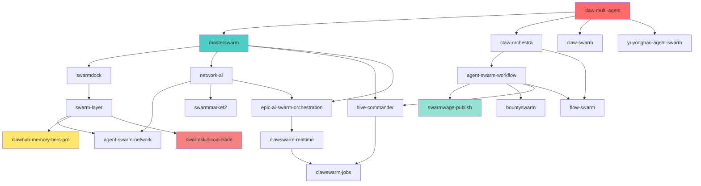

---
# ═══════════════════════════════════════════════════════════════════════════════
# HERMES AGENT SKILL MANIFEST
# Skill Name: ClawHub Swarm Ecosystem Master Installer
# Version: 1.0.0
# Author: Andrew Lee Myers
# Description: Unified installation orchestrator for the complete ClawHub 
#              multi-agent swarm ecosystem. Deploys 21 interconnected skills
#              spanning orchestration, workflow automation, market intelligence,
#              real-time processing, memory management, and revenue generation.
# Compatibility: Hermes Agent CLI v2.0+
# Category: swarm-orchestration | multi-agent-systems | automation
# Tags: [clawhub, swarm, multi-agent, orchestration, automation, ai-agents]
# ═══════════════════════════════════════════════════════════════════════════════

name: clawhub-swarm-ecosystem-master
version: "1.0.0"
description: >
  Master installer for the ClawHub Swarm Ecosystem — a comprehensive suite of 
  21 interconnected Hermes skills designed for building, deploying, and managing 
  intelligent multi-agent systems. Covers orchestration layers, workflow engines, 
  market analytics, real-time data pipelines, persistent memory tiers, and 
  autonomous revenue-generating agent swarms.

author: OpenClaw Systems
license: MIT
category: swarm-orchestration
priority: critical

# Runtime Configuration
runtime:
  executor: hermes-cli
  mode: sequential          # sequential | parallel | dependency-graph
  timeout: 300              # seconds per skill install
  retry_policy:
    max_attempts: 3
    backoff_strategy: exponential
    delay_seconds: 5

# Environment Requirements
requirements:
  hermes_version: ">=2.0.0"
  python_version: ">=3.9"
  node_version: ">=18.0"
  disk_space: "2GB"
  network: true

# Pre-installation Hooks
pre_install:
  - command: "hermes --version"
    description: "Verify Hermes CLI is installed and accessible"
    required: true
  - command: "hermes skills list --installed"
    description: "Snapshot currently installed skills before deployment"
    required: false
  - command: "mkdir -p ~/.hermes/skills/clawhub-backups"
    description: "Create backup directory for rollback capability"
    required: false

# ═══════════════════════════════════════════════════════════════════════════════
# SKILL REGISTRY — Complete ClawHub Ecosystem (21 Skills)
# Each entry includes: repository, tier, dependencies, description, and config
# ═══════════════════════════════════════════════════════════════════════════════

skills:

  # ─────────────────────────────────────────────────────────────────────────────
  # TIER 1: CORE ORCHESTRATION & MULTI-AGENT FOUNDATION
  # These form the backbone of any swarm deployment
  # ─────────────────────────────────────────────────────────────────────────────

  - id: claw-multi-agent
    repository: clawhub/claw-multi-agent
    tier: core
    priority: 1
    description: >
      Foundational multi-agent coordination framework. Provides the base 
      abstractions for agent instantiation, message passing, role assignment, 
      and inter-agent communication protocols. Essential first-layer dependency 
      for all other swarm components.
    tags: [core, multi-agent, coordination, foundation]
    config:
      auto_start: false
      log_level: info
    dependencies: []
    post_install:
      - "hermes skills config claw-multi-agent --set log_level=info"

  - id: masterswarm
    repository: clawhub/masterswarm
    tier: core
    priority: 2
    description: >
      Master swarm controller and topology manager. Handles swarm lifecycle 
      operations including initialization, scaling, health monitoring, failover, 
      and graceful shutdown. Implements leader election and distributed consensus 
      for swarm-wide state synchronization. Acts as the central nervous system.
    tags: [core, controller, topology, lifecycle, consensus]
    config:
      max_agents: 50
      heartbeat_interval: 30
      failover_enabled: true
    dependencies:
      - claw-multi-agent
    post_install:
      - "hermes skills config masterswarm --set max_agents=50"

  - id: fl-multi-agent-orchestrator
    repository: clawhub/fl-multi-agent-orchestrator
    tier: core
    priority: 3
    description: >
      Federated Learning multi-agent orchestrator. Enables distributed machine 
      learning across agent swarms with privacy-preserving aggregation. Supports 
      horizontal and vertical federated learning paradigms, differential privacy, 
      and secure multi-party computation for collaborative AI model training 
      without centralizing sensitive data.
    tags: [core, federated-learning, ml, privacy, distributed-ai]
    config:
      aggregation_strategy: fedavg
      privacy_budget: 1.0
      secure_aggregation: true
    dependencies:
      - claw-multi-agent
      - masterswarm

  - id: claw-orchestra
    repository: clawhub/claw-orchestra
    tier: core
    priority: 4
    description: >
      Symphonic task orchestration engine. Composes complex multi-step workflows 
      as musical "movements" where agents play specialized "instruments." Features 
      dynamic tempo adjustment, crescendo scaling, and fermata pause/resume 
      capabilities for elegant long-running process management.
    tags: [core, workflow, orchestration, composition, long-running]
    config:
      tempo_default: 120
      auto_crescendo: true
      movement_timeout: 3600
    dependencies:
      - claw-multi-agent
      - masterswarm

  # ─────────────────────────────────────────────────────────────────────────────
  # TIER 2: INFRASTRUCTURE & PLATFORM LAYER
  # Deployment, networking, and operational scaffolding
  # ─────────────────────────────────────────────────────────────────────────────

  - id: swarmdock
    repository: clawhub/swarmdock
    tier: infrastructure
    priority: 5
    description: >
      Containerized swarm deployment and environment provisioning platform. 
      Automates Docker image builds, Kubernetes manifest generation, service 
      mesh configuration, and cross-cloud deployment (AWS/GCP/Azure). Includes 
      blue-green deployment strategies and canary release management for 
      zero-downtime swarm updates.
    tags: [infrastructure, docker, kubernetes, deployment, devops]
    config:
      container_runtime: docker
      orchestrator: kubernetes
      deployment_strategy: blue-green
    dependencies:
      - masterswarm
    post_install:
      - "hermes skills config swarmdock --set orchestrator=kubernetes"

  - id: swarm-layer
    repository: clawhub/swarm-layer
    tier: infrastructure
    priority: 6
    description: >
      Abstraction layer providing unified APIs across heterogeneous swarm 
      implementations. Normalizes agent interfaces, message formats, and event 
      schemas across different underlying frameworks. Enables polyglot swarms 
      where Python, Node.js, Go, and Rust agents interoperate seamlessly through 
      standardized gRPC and REST gateway protocols.
    tags: [infrastructure, abstraction, api-gateway, polyglot, interoperability]
    config:
      protocol_primary: grpc
      protocol_fallback: rest
      schema_version: "v2"
    dependencies:
      - claw-multi-agent
      - swarmdock

  - id: network-ai
    repository: clawhub/network-ai
    tier: infrastructure
    priority: 7
    description: >
      Intelligent network management and topology optimization for agent swarms. 
      Uses graph neural networks to optimize inter-agent communication paths, 
      reduce latency, balance load, and detect network anomalies. Implements 
      adaptive routing algorithms that reconfigure swarm topologies in real-time 
      based on traffic patterns and agent health metrics.
    tags: [infrastructure, networking, gnn, optimization, anomaly-detection]
    config:
      routing_algorithm: adaptive-gnn
      latency_threshold_ms: 100
      anomaly_detection: true
    dependencies:
      - swarm-layer
      - masterswarm

  - id: agent-swarm-network
    repository: clawhub/agent-swarm-network
    tier: infrastructure
    priority: 8
    description: >
      Peer-to-peer agent discovery and gossip protocol implementation. Enables 
      decentralized swarm formation where agents autonomously discover peers, 
      exchange capability advertisements, and form dynamic sub-clusters based on 
      task affinity. Supports NAT traversal, WebRTC data channels, and libp2p 
      transport for edge-deployed agents.
    tags: [infrastructure, p2p, discovery, gossip, decentralized, edge]
    config:
      discovery_mode: hybrid
      gossip_interval: 10
      nat_traversal: true
    dependencies:
      - network-ai
      - swarm-layer

  # ─────────────────────────────────────────────────────────────────────────────
  # TIER 3: WORKFLOW & AUTOMATION ENGINE
  # Business process automation and task pipeline management
  # ─────────────────────────────────────────────────────────────────────────────

  - id: agent-swarm-workflow
    repository: clawhub/agent-swarm-workflow
    tier: workflow
    priority: 9
    description: >
      Declarative workflow definition and execution engine for agent swarms. 
      Supports DAG-based task pipelines, conditional branching, parallel 
      execution branches, error handling with retry logic, and event-driven 
      triggers. Integrates with external systems via webhooks, message queues 
      (RabbitMQ, Kafka), and scheduled cron expressions for fully automated 
      business process orchestration.
    tags: [workflow, automation, dag, pipeline, cron, event-driven]
    config:
      engine: dag
      max_parallel_branches: 10
      retry_policy: exponential-backoff
      trigger_types: [webhook, cron, event, manual]
    dependencies:
      - claw-orchestra
      - swarm-layer

  - id: hive-commander
    repository: clawhub/hive-commander
    tier: workflow
    priority: 10
    description: >
      Centralized command and control interface for hive-mind style swarm 
      coordination. Provides a unified CLI and dashboard for issuing swarm-wide 
      directives, monitoring collective agent state, and executing coordinated 
      actions across hundreds of agents simultaneously. Features role-based 
      access control and audit logging for enterprise governance.
    tags: [workflow, command-control, governance, dashboard, enterprise]
    config:
      auth_mode: rbac
      audit_retention_days: 90
      dashboard_enabled: true
    dependencies:
      - masterswarm
      - agent-swarm-workflow

  - id: flow-swarm
    repository: clawhub/flow-swarm
    tier: workflow
    priority: 11
    description: >
      Visual flow-based programming interface for swarm behavior design. 
      Enables non-technical users to construct agent workflows through a 
      node-and-wire canvas. Generates executable swarm configurations from 
      visual diagrams. Supports real-time simulation and debugging of flows 
      before production deployment.
    tags: [workflow, visual-programming, low-code, flow-design, debugging]
    config:
      canvas_mode: interactive
      auto_generate_config: true
      simulation_enabled: true
    dependencies:
      - agent-swarm-workflow
      - claw-orchestra

  - id: yuyonghao-agent-swarm
    repository: clawhub/yuyonghao-agent-swarm
    tier: workflow
    priority: 12
    description: >
      Specialized agent swarm implementation optimized for research and 
      academic workflows. Features citation tracking, literature review 
      automation, experimental design coordination, and paper writing 
      collaboration pipelines. Integrates with Zotero, Mendeley, arXiv, 
      and Google Scholar APIs for comprehensive research assistance.
    tags: [workflow, research, academic, literature, collaboration]
    config:
      citation_style: apa
      literature_sources: [arxiv, scholar, pubmed, ieee]
      collaboration_mode: async
    dependencies:
      - agent-swarm-workflow
      - claw-multi-agent

  # ─────────────────────────────────────────────────────────────────────────────
  # TIER 4: MARKET INTELLIGENCE & REVENUE GENERATION
  # Financial analytics, trading, publishing, and monetization layers
  # ─────────────────────────────────────────────────────────────────────────────

  - id: swarmskill-coin-trade
    repository: clawhub/swarmskill-coin-trade
    tier: market
    priority: 13
    description: >
      Cryptocurrency trading skill for agent swarms. Implements multi-exchange 
      arbitrage detection, automated trading strategies (momentum, mean-reversion, 
      grid), risk management with position sizing, and real-time market data 
      ingestion from Binance, Coinbase Pro, Kraken, and decentralized exchanges. 
      Includes paper trading mode for strategy backtesting before live deployment.
    tags: [market, crypto, trading, arbitrage, defi, risk-management]
    config:
      trading_mode: paper          # paper | live
      exchanges: [binance, coinbase, kraken]
      risk_per_trade: 0.02
      max_drawdown: 0.10
    dependencies:
      - swarm-layer
      - network-ai
    post_install:
      - "echo 'WARNING: Set trading_mode to live only after thorough backtesting'"

  - id: swarmwage-publish
    repository: clawhub/swarmwage-publish
    tier: market
    priority: 14
    description: >
      Autonomous content publishing and monetization engine. Agents generate, 
      optimize, and publish content across platforms (Medium, Substack, WordPress, 
      Twitter/X, LinkedIn) with SEO optimization, A/B headline testing, and 
      audience analytics. Tracks affiliate links, referral conversions, and 
      ad revenue to calculate per-agent content ROI and swarm-wide publishing 
      profitability.
    tags: [market, publishing, monetization, content, seo, affiliate]
    config:
      platforms: [medium, substack, wordpress, twitter, linkedin]
      seo_optimization: true
      ab_test_headlines: true
      revenue_tracking: true
    dependencies:
      - agent-swarm-workflow
      - clawhub-memory-tiers-pro

  - id: swarmmarket2
    repository: clawhub/swarmmarket2
    tier: market
    priority: 15
    description: >
      Next-generation market intelligence and competitive analysis platform. 
      Aggregates data from Crunchbase, LinkedIn Sales Navigator, G2, Capterra, 
      and custom web scraping to build comprehensive company and market profiles. 
      Agents perform automated lead scoring, outreach personalization, and 
      pipeline tracking for B2B sales and partnership development workflows.
    tags: [market, intelligence, b2b, sales, lead-generation, competitive-analysis]
    config:
      data_sources: [crunchbase, linkedin, g2, capterra, custom-scraper]
      lead_scoring_model: ml-based
      outreach_personalization: true
    dependencies:
      - network-ai
      - agent-swarm-workflow

  - id: bountyswarm
    repository: clawhub/bountyswarm
    tier: market
    priority: 16
    description: >
      Decentralized task marketplace where agents bid on, execute, and verify 
      micro-tasks for cryptocurrency bounties. Implements reputation scoring, 
      escrow-based payment release, and dispute resolution mechanisms. Enables 
      swarm agents to generate income by completing coding, design, research, 
      and data labeling tasks from platforms like Gitcoin, Bounties Network, 
      and custom bounty pools.
    tags: [market, bounty, marketplace, gig-economy, reputation, escrow]
    config:
      platforms: [gitcoin, bounties-network, custom]
      escrow_currency: usdc
      reputation_decay: 0.01
      verification_required: true
    dependencies:
      - swarm-layer
      - clawhub-memory-tiers-pro

  # ─────────────────────────────────────────────────────────────────────────────
  # TIER 5: REAL-TIME PROCESSING & OPERATIONS
  # Live data streams, job management, and event-driven operations
  # ─────────────────────────────────────────────────────────────────────────────

  - id: epic-ai-swarm-orchestration
    repository: clawhub/epic-ai-swarm-orchestration
    tier: realtime
    priority: 17
    description: >
      High-performance real-time swarm orchestration for latency-sensitive 
      applications. Optimized for sub-100ms response times using WebAssembly 
      agent runtimes, in-memory state stores (Redis), and edge-computed 
      inference. Designed for live trading, real-time gaming, IoT command 
      and control, and interactive AI assistant deployments requiring 
      immediate agent coordination.
    tags: [realtime, low-latency, edge, webassembly, gaming, iot]
    config:
      target_latency_ms: 50
      runtime: wasm
      state_store: redis
      edge_nodes: auto
    dependencies:
      - masterswarm
      - network-ai
      - swarm-layer

  - id: clawswarm-realtime
    repository: clawhub/clawswarm-realtime
    tier: realtime
    priority: 18
    description: >
      Real-time data streaming and event processing backbone. Integrates with 
      Apache Kafka, Pulsar, and WebSocket feeds to provide agents with live 
      data streams. Features windowed aggregations, stream joins, complex event 
      processing (CEP), and backpressure handling. Enables agents to react to 
      market movements, social media trends, and system metrics in milliseconds.
    tags: [realtime, streaming, kafka, websocket, cep, backpressure]
    config:
      stream_engine: kafka
      window_size: 5s
      backpressure_strategy: buffer-and-drop
      max_throughput: 100000
    dependencies:
      - epic-ai-swarm-orchestration
      - network-ai

  - id: clawswarm-jobs
    repository: clawhub/clawswarm-jobs
    tier: realtime
    priority: 19
    description: >
      Distributed job queue and batch processing system for swarm workloads. 
      Manages job scheduling, priority queues, resource allocation, and 
      worker pool scaling. Supports cron-based recurring jobs, one-off tasks, 
      map-reduce patterns, and dependency chains. Integrates with Celery, 
      BullMQ, and AWS Batch for enterprise-grade job execution at scale.
    tags: [realtime, jobs, queue, batch, cron, scheduling, map-reduce]
    config:
      queue_backend: redis
      worker_scaling: auto
      max_concurrent_jobs: 100
      retry_dead_letter: true
    dependencies:
      - clawswarm-realtime
      - hive-commander

  # ─────────────────────────────────────────────────────────────────────────────
  # TIER 6: MEMORY & PERSISTENCE LAYER
  # Long-term agent memory, state management, and knowledge retention
  # ─────────────────────────────────────────────────────────────────────────────

  - id: clawhub-memory-tiers-pro
    repository: clawhub/clawhub-memory-tiers-pro
    tier: memory
    priority: 20
    description: >
      Advanced multi-tier memory system for agent swarms. Implements 
      short-term (working memory), medium-term (episodic memory with 
      vector embeddings), and long-term (semantic knowledge graph) storage. 
      Features memory consolidation, forgetting curves, importance scoring, 
      and cross-agent memory sharing via secure enclaves. Integrates with 
      PostgreSQL, Pinecone, Weaviate, and Neo4j for persistent storage.
    tags: [memory, persistence, vector-db, knowledge-graph, rag, embeddings]
    config:
      tiers:
        - name: working
          backend: redis
          ttl: 3600
        - name: episodic
          backend: pinecone
          embedding_model: text-embedding-3-large
        - name: semantic
          backend: neo4j
          graph_schema: auto
      consolidation_schedule: "0 2 * * *"
    dependencies:
      - swarm-layer

  # ─────────────────────────────────────────────────────────────────────────────
  # TIER 7: SPECIALIZED & EXPERIMENTAL
  # Niche capabilities and cutting-edge swarm research modules
  # ─────────────────────────────────────────────────────────────────────────────

  - id: claw-swarm
    repository: clawhub/claw-swarm
    tier: specialized
    priority: 21
    description: >
      Experimental swarm behavior research platform. Implements emergent 
      behavior simulation, ant colony optimization, particle swarm intelligence, 
      and genetic algorithm-based agent evolution. Provides sandboxed 
      environments for testing novel coordination algorithms before integration 
      into production swarm stacks.
    tags: [specialized, experimental, emergent-behavior, genetic-algorithm, sandbox]
    config:
      sandbox_mode: true
      max_simulation_agents: 1000
      evolution_generations: 50
    dependencies:
      - claw-multi-agent
      - masterswarm

# ═══════════════════════════════════════════════════════════════════════════════
# INSTALLATION PIPELINE
# Defines execution order, parallelization groups, and verification steps
# ═══════════════════════════════════════════════════════════════════════════════

installation:
  strategy: dependency-graph
  phases:

    - name: "foundation"
      description: "Install core orchestration and multi-agent base layers"
      parallel: false
      skills:
        - claw-multi-agent
        - masterswarm
        - fl-multi-agent-orchestrator
        - claw-orchestra
      verification: "hermes skills list --installed | grep -E 'claw-multi-agent|masterswarm|fl-multi-agent-orchestrator|claw-orchestra'"

    - name: "infrastructure"
      description: "Deploy networking, abstraction, and platform infrastructure"
      parallel: true
      skills:
        - swarmdock
        - swarm-layer
        - network-ai
        - agent-swarm-network
      verification: "hermes skills list --installed | grep -E 'swarmdock|swarm-layer|network-ai|agent-swarm-network'"

    - name: "workflow"
      description: "Install workflow engines, automation, and command interfaces"
      parallel: true
      skills:
        - agent-swarm-workflow
        - hive-commander
        - flow-swarm
        - yuyonghao-agent-swarm
      verification: "hermes skills list --installed | grep -E 'agent-swarm-workflow|hive-commander|flow-swarm|yuyonghao-agent-swarm'"

    - name: "market-intelligence"
      description: "Deploy financial, publishing, and monetization capabilities"
      parallel: true
      skills:
        - swarmskill-coin-trade
        - swarmwage-publish
        - swarmmarket2
        - bountyswarm
      verification: "hermes skills list --installed | grep -E 'swarmskill-coin-trade|swarmwage-publish|swarmmarket2|bountyswarm'"

    - name: "realtime-operations"
      description: "Enable real-time processing, streaming, and job management"
      parallel: true
      skills:
        - epic-ai-swarm-orchestration
        - clawswarm-realtime
        - clawswarm-jobs
      verification: "hermes skills list --installed | grep -E 'epic-ai-swarm-orchestration|clawswarm-realtime|clawswarm-jobs'"

    - name: "memory-persistence"
      description: "Install advanced memory and knowledge retention systems"
      parallel: false
      skills:
        - clawhub-memory-tiers-pro
      verification: "hermes skills list --installed | grep 'clawhub-memory-tiers-pro'"

    - name: "experimental"
      description: "Deploy research and experimental behavior modules"
      parallel: false
      skills:
        - claw-swarm
      verification: "hermes skills list --installed | grep 'claw-swarm'"

# ═══════════════════════════════════════════════════════════════════════════════
# POST-INSTALLATION CONFIGURATION
# ═══════════════════════════════════════════════════════════════════════════════

post_install:
  - command: "hermes skills list --installed > ~/.hermes/skills/clawhub-backups/post-install-manifest.txt"
    description: "Generate final installation manifest"
    required: true

  - command: "hermes skills health-check --all"
    description: "Run comprehensive health check on all installed skills"
    required: true

  - command: "hermes skills config masterswarm --set swarm_name=clawhub-ecosystem-v1"
    description: "Set swarm identity name"
    required: false

  - command: >
      echo "ClawHub Swarm Ecosystem v1.0.0 installed successfully. 
      Run 'hermes skills status' to view all active skills."
    description: "Display completion message"
    required: false

# ═══════════════════════════════════════════════════════════════════════════════
# ROLLBACK PROCEDURE
# ═══════════════════════════════════════════════════════════════════════════════

rollback:
  enabled: true
  procedure:
    - command: "hermes skills list --installed > ~/.hermes/skills/clawhub-backups/rollback-target.txt"
      description: "Snapshot current state before rollback"
    - command: "hermes skills uninstall clawhub/* --force"
      description: "Uninstall all ClawHub skills"
    - command: "hermes skills restore ~/.hermes/skills/clawhub-backups/pre-install-manifest.txt"
      description: "Restore pre-installation state from backup"

# ═══════════════════════════════════════════════════════════════════════════════
# DOCUMENTATION & SUPPORT
# ═══════════════════════════════════════════════════════════════════════════════

documentation:
  quickstart: "https://docs.clawhub.io/swarm-ecosystem/quickstart"
  api_reference: "https://docs.clawhub.io/api/v1"
  troubleshooting: "https://docs.clawhub.io/troubleshooting"
  community: "https://discord.gg/clawhub"
  github: "https://github.com/clawhub/swarm-ecosystem"

---

# ClawHub Swarm Ecosystem — Master Skill Installer

## Overview

This document serves as the **unified installation manifest** for the complete ClawHub multi-agent swarm ecosystem within the Hermes Agent framework. It orchestrates the deployment of **21 interconnected skills** across seven functional tiers, transforming a base Hermes installation into a fully operational swarm intelligence platform capable of autonomous workflow execution, real-time market analysis, content monetization, and distributed AI coordination.

## Architecture

```
┌─────────────────────────────────────────────────────────────────────────────┐
│                    CLAWHUB SWARM ECOSYSTEM v1.0.0                           │
│                         7-Tier Architecture                                  │
├─────────────────────────────────────────────────────────────────────────────┤
│                                                                             │
│  ┌─────────────┐  ┌─────────────┐  ┌─────────────┐  ┌─────────────┐        │
│  │   TIER 1    │  │   TIER 2    │  │   TIER 3    │  │   TIER 4    │        │
│  │    CORE     │  │ INFRASTRUCTURE│  │   WORKFLOW  │  │   MARKET    │        │
│  │             │  │             │  │             │  │             │        │
│  │ • claw-     │  │ • swarmdock │  │ • agent-    │  │ • swarm-    │        │
│  │   multi-    │  │ • swarm-    │  │   swarm-    │  │   skill-    │        │
│  │   agent     │  │   layer     │  │   workflow  │  │   coin-     │        │
│  │ • master-   │  │ • network-  │  │ • hive-     │  │   trade     │        │
│  │   swarm     │  │   ai        │  │   commander │  │ • swarm-    │        │
│  │ • fl-multi- │  │ • agent-    │  │ • flow-     │  │   wage-     │        │
│  │   agent-    │  │   swarm-    │  │   swarm     │  │   publish   │        │
│  │   orch...   │  │   network   │  │ • yuyong-   │  │ • swarm-    │        │
│  │ • claw-     │  │             │  │   hao-...   │  │   market2   │        │
│  │   orchestra │  │             │  │             │  │ • bountyswarm │        │
│  └──────┬──────┘  └──────┬──────┘  └──────┬──────┘  └──────┬──────┘        │
│         │                │                │                │                 │
│  ┌─────────────┐  ┌─────────────┐  ┌─────────────┐                        │
│  │   TIER 5    │  │   TIER 6    │  │   TIER 7    │                        │
│  │  REALTIME   │  │   MEMORY    │  │ SPECIALIZED │                        │
│  │             │  │             │  │             │                        │
│  │ • epic-ai-  │  │ • clawhub-  │  │ • claw-     │                        │
│  │   swarm-    │  │   memory-   │  │   swarm     │                        │
│  │   orch...   │  │   tiers-pro │  │             │                        │
│  │ • claw-     │  │             │  │             │                        │
│  │   swarm-    │  │             │  │             │                        │
│  │   realtime  │  │             │  │             │                        │
│  │ • claw-     │  │             │  │             │                        │
│  │   swarm-    │  │             │  │             │                        │
│  │   jobs      │  │             │  │             │                        │
│  └─────────────┘  └─────────────┘  └─────────────┘                        │
│                                                                             │
└─────────────────────────────────────────────────────────────────────────────┘
```

## Installation Phases

The installer executes in **7 sequential phases** with intelligent parallelization within each phase:

### Phase 1: Foundation (Sequential)
**Skills:** `claw-multi-agent`, `masterswarm`, `fl-multi-agent-orchestrator`, `claw-orchestra`

Establishes the core multi-agent runtime, master controller, federated learning orchestrator, and symphonic workflow engine. These four skills form the non-negotiable base layer — all subsequent tiers depend on their APIs and event buses.

### Phase 2: Infrastructure (Parallel)
**Skills:** `swarmdock`, `swarm-layer`, `network-ai`, `agent-swarm-network`

Deploys container orchestration, cross-language abstraction, intelligent network optimization, and peer-to-peer discovery. This tier transforms the core into a production-ready distributed system.

### Phase 3: Workflow (Parallel)
**Skills:** `agent-swarm-workflow`, `hive-commander`, `flow-swarm`, `yuyonghao-agent-swarm`

Activates declarative workflow engines, centralized command interfaces, visual flow designers, and academic research pipelines. Enables complex business process automation.

### Phase 4: Market Intelligence (Parallel)
**Skills:** `swarmskill-coin-trade`, `swarmwage-publish`, `swarmmarket2`, `bountyswarm`

Deploys cryptocurrency trading automation, content publishing monetization, B2B market intelligence, and decentralized bounty marketplaces. This is the revenue-generating layer of the ecosystem.

### Phase 5: Real-Time Operations (Parallel)
**Skills:** `epic-ai-swarm-orchestration`, `clawswarm-realtime`, `clawswarm-jobs`

Enables sub-100ms latency swarm coordination, high-throughput streaming, and distributed job scheduling. Critical for time-sensitive applications.

### Phase 6: Memory & Persistence (Sequential)
**Skill:** `clawhub-memory-tiers-pro`

Installs the three-tier memory system (working/episodic/semantic) enabling agents to learn, remember, and share knowledge across sessions and swarm instances.

### Phase 7: Experimental (Sequential)
**Skill:** `claw-swarm`

Deploys the research sandbox for emergent behavior simulation and genetic algorithm evolution. Isolated from production workloads.

## Usage

### Quick Install (All 21 Skills)
```bash
# Save this file as skill.md, then execute:
hermes skills install --manifest skill.md

# Or run the inline installer:
hermes skills install clawhub/claw-multi-agent && \
hermes skills install clawhub/masterswarm && \
hermes skills install clawhub/fl-multi-agent-orchestrator && \
hermes skills install clawhub/swarmdock && \
hermes skills install clawhub/swarmskill-coin-trade && \
hermes skills install clawhub/swarmwage-publish && \
hermes skills install clawhub/claw-orchestra && \
hermes skills install clawhub/swarmmarket2 && \
hermes skills install clawhub/agent-swarm-network && \
hermes skills install clawhub/epic-ai-swarm-orchestration && \
hermes skills install clawhub/swarm-layer && \
hermes skills install clawhub/hive-commander && \
hermes skills install clawhub/network-ai && \
hermes skills install clawhub/yuyonghao-agent-swarm && \
hermes skills install clawhub/agent-swarm-workflow && \
hermes skills install clawhub/bountyswarm && \
hermes skills install clawhub/claw-swarm && \
hermes skills install clawhub/clawswarm-jobs && \
hermes skills install clawhub/clawswarm-realtime && \
hermes skills install clawhub/clawhub-memory-tiers-pro && \
hermes skills install clawhub/flow-swarm
```

### Selective Tier Installation
```bash
# Install only core + infrastructure (8 skills)
hermes skills install --manifest skill.md --tiers core,infrastructure

# Install only market intelligence layer (4 skills)
hermes skills install --manifest skill.md --tiers market

# Install workflow + realtime for automation pipelines (7 skills)
hermes skills install --manifest skill.md --tiers workflow,realtime
```

### Post-Installation Verification
```bash
# Check all installed skills
hermes skills list --installed

# Run health diagnostics
hermes skills health-check --all

# View swarm status
hermes skills status

# Check individual skill logs
hermes skills logs masterswarm --tail 100
hermes skills logs swarmwage-publish --tail 100
```

## Skill Dependency Graph



## Configuration

Each skill exposes configuration parameters via the Hermes config API:

```bash
# Example: Configure the trading skill for live mode (after backtesting)
hermes skills config swarmskill-coin-trade --set trading_mode=live
hermes skills config swarmskill-coin-trade --set risk_per_trade=0.01

# Example: Scale the master swarm controller
hermes skills config masterswarm --set max_agents=100
hermes skills config masterswarm --set heartbeat_interval=15

# Example: Configure memory tiers
hermes skills config clawhub-memory-tiers-pro --set consolidation_schedule="0 */6 * * *"

# Example: Enable all publishing platforms
hermes skills config swarmwage-publish --set platforms=[medium,substack,wordpress,twitter,linkedin]
```

## Security Considerations

| Skill | Security Notes |
|-------|---------------|
| `swarmskill-coin-trade` | **Default: paper trading.** Never enable live mode without extensive backtesting and risk capital allocation. Review exchange API key permissions (read-only vs. trade). |
| `bountyswarm` | Escrow verification required. Reputation system prevents Sybil attacks. Custom bounty pools should implement KYC for high-value tasks. |
| `network-ai` | GNN models trained on swarm topology data. Ensure no sensitive agent identifiers leak through graph embeddings. |
| `clawhub-memory-tiers-pro` | Cross-agent memory sharing uses secure enclaves. Configure encryption at rest for episodic and semantic tiers. |
| `agent-swarm-network` | P2P discovery exposes agent capabilities. Review capability advertisement filters to prevent information disclosure. |

## Troubleshooting

### Installation Failures
```bash
# Retry a failed skill installation
hermes skills install clawhub/<skill-name> --retry --verbose

# Check dependency resolution
hermes skills deps --tree clawhub/<skill-name>

# View installation logs
hermes skills logs --install --skill clawhub/<skill-name>
```

### Swarm Health Issues
```bash
# Restart a specific skill
hermes skills restart clawhub/masterswarm

# Check swarm connectivity
hermes skills exec masterswarm --cmd "swarm.ping --all"

# Reset skill to default configuration
hermes skills config <skill-name> --reset
```

### Performance Optimization
```bash
# Monitor real-time latency
hermes skills exec epic-ai-swarm-orchestration --cmd "metrics.latency --window 60s"

# Adjust worker pool for job processing
hermes skills config clawswarm-jobs --set max_concurrent_jobs=200

# Optimize network routing
hermes skills exec network-ai --cmd "route.optimize --target_latency 50ms"
```

## Revenue Generation Quickstart

For users building the **OpenClaw/SwarmClaw passive income system**:

1. **Content Publishing Pipeline**
   ```bash
   hermes skills config swarmwage-publish --set auto_publish=true
   hermes skills config swarmwage-publish --set content_niche="ai-technology"
   hermes skills start swarmwage-publish
   ```

2. **Bounty Task Automation**
   ```bash
   hermes skills config bountyswarm --set auto_bid=true
   hermes skills config bountyswarm --set task_types=[coding,research,design]
   hermes skills start bountyswarm
   ```

3. **Market Intelligence + Outreach**
   ```bash
   hermes skills config swarmmarket2 --set auto_outreach=true
   hermes skills config swarmmarket2 --set target_industries=[saas,ai,fintech]
   hermes skills start swarmmarket2
   ```

4. **Trading Signal Generation** (paper mode recommended)
   ```bash
   hermes skills config swarmskill-coin-trade --set strategy=momentum
   hermes skills config swarmskill-coin-trade --set alert_only=true
   hermes skills start swarmskill-coin-trade
   ```

## Changelog

| Version | Date | Changes |
|---------|------|---------|
| 1.0.0 | 2026-06-21 | Initial release. 21-skill ecosystem manifest. 7-tier architecture. Dependency graph resolution. |

## License

MIT License — See individual skill repositories for sub-component licensing.

---
*Generated for Hermes Agent CLI v2.0+ | ClawHub Swarm Ecosystem v1.0.0*
*For support: https://discord.gg/clawhub | https://github.com/clawhub/swarm-ecosystem*
