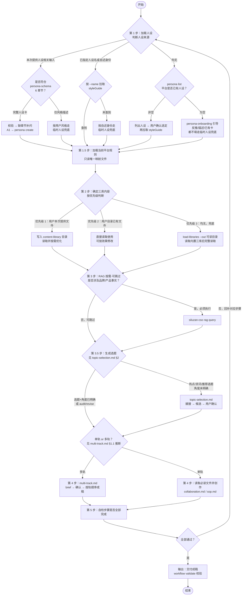

# 三库内容工作流（入口）

## 适用场景

用户要做以下事情时，在 `siluzan-cso` 流程中进入本目录：

- 生成口播文案 / 公众号文章 / 博客 / 其他成稿（**单轨** 1 篇或 **多轨** 多篇对比，见 `multi-track.md`；多轨默认 2 篇，可按任务增减）
- 从热点 / 素材选题
- 按三库拆解文案
- 反推代表作品的人设卡
- 给已有文章审稿打分 / 精准改稿
- 梳理可复用的内容工作流

---

## 执行步骤

> AI行为规范：以下步骤没有标记按需/可跳过的步骤必须执行，不能省略



### 第 1 步：加载人设

所有腔调、句式、共鸣切入点都依赖人设卡（`styleGuide`）。**按优先级判断，命中一条即止**：

| 优先级 | 触发条件                                                     | 动作                                                                                                            |
| ------ | ------------------------------------------------------------ | --------------------------------------------------------------------------------------------------------------- |
| **1**  | 用户给了人设材料（文件 / 文本 / 截图 / 风格描述）            | 完整 6 章节 → **正式人设**；否则 → **临时人设**                                                                 |
| **2**  | 用户指定人设名或自述身份（如「用某某人设」「我是一个 xxx」） | `--name` 查到 → 拉 `styleGuide`；未查到 → **临时人设**（xxx 作线索）                                            |
| **3**  | 以上均无                                                     | `persona list --no-style-guide` 查平台：有人设 → 列名让用户选（**不替选**）再拉取；无 → `persona-onboarding.md` |

**两种结局（先认清，再执行）**

- **正式人设**：内容符合 `persona-schema.md` 6 章节 → 校验 / 缺项补问 → A1 确认 → `siluzan-cso persona create` 保存。
- **临时人设**：碎片风格（「语气犀利」「别太官腔」）、口语身份、或平台查无此人设 → 以用户线索在会话内拼出可用 `styleGuide`，**本次不落盘**；写完后按 `persona-onboarding.md` 追问是否保存。

**拉取已有正式人设**（优先级 2 命中且查到、或优先级 3 用户选定后）：

> 有人设 id：`siluzan-cso persona list --id <id> --json-out ./snap-cso`；否则 `--name <人设名>`。落盘后脚本读 `styleGuide`（见 `references/core/tips.md`）。

**优先级 3 补充**：查询前不假设平台有无；列表只展示人设名（不贴完整 `styleGuide`）。让人设选择时优先用宿主提供的 **human-in-the-loop** 工具（有则用、无则对话提问）。常见举例：`ask_clarification`（DeerFlow）、`AskQuestion`（Cursor）、`AskUserQuestion`（Claude Code）——**不限于此**，以当前宿主实际可用的结构化提问工具为准；**不要替用户默认选定**（即使只有一个人设也需确认）。

人设字段标准见 `persona-schema.md`；反推见 `persona-reverse-sop.md`；平台命令见 `references/persona.md`。

---

### 第 1.5 步：加载当前平台规则

在确定三库内容和创作正文前，先把当前平台唯一对应的规则加入本次上下文：

1. **确定平台**：正式人设优先读取本次 `persona list --json-out` 结果中的 `mediaType/platform`；结构化字段是权威来源，字段为空时才从 `styleGuide` 的 `## <平台> 平台适配建议` 标题提取。临时人设从其平台适配章节或用户本次明确指定的平台取得值。
2. **检查冲突**：正式 `mediaType/platform` 与 `styleGuide` 平台标题不一致时，以结构化字段为准并记录冲突，不让正文内容覆盖正式平台字段。
3. **读取路由**：完整读取 `references/platforms/platform-rules.md`，按其中唯一映射确定规则路径。
4. **读取规则**：每次只完整读取一份平台规则，并记录规范平台值和已加载路径。五个平台命中后，文件缺失、为空或不可读时停止生成正文；禁止跨平台兜底或无规则降级。
5. **历史兼容**：无法识别且不属于本期五个平台的历史人设沿用原工作流，不加载本期规则，也不因本步骤被阻断。
6. **平台一致**：将同一个已解析平台继续传给第 2 步 `load-libraries --platform`，后续不得重新推断或切换平台。

平台规则与三库是两个独立输入：平台规则约束合规边界、输出形态和平台默认建议；三库提供可选的流量机制、素材组织和创作结构。三库策略只能在平台规则边界内使用，不会覆盖平台硬约束。

---

### 第 2 步：确定本次三库内容

按下列优先级确认并**完整读取**本次三库文件：

**优先级 1 — 用户本次提供的文件**：若用户在对话中直接提供了三库文件（流量因子库 / 产品资产库 / 烹调方法库），则：

- 将文件内容写入 `~/.siluzan/content-library/`（文件名保持原名，如 `流量因子库.md`）
- 后续创作过程中直接读取并按需修改这些文件，实现持续优化

**优先级 2 — 用户目录已有文件**：检查 `~/.siluzan/content-library/` 是否存在三库文件：

- 若存在，直接读取使用
- AI 可在每次创作后根据效果，直接修改该目录中的文件（增补选题、标注效果、淘汰低效条目等）

**优先级 3 — 内置默认文件**（兜底）：若优先级 1/2 均无，调用 CLI 命令拉取内置默认三库。

```bash
siluzan-cso workflow load-libraries --platform <平台> --out <file_path>
```

- `--platform` 必须复用本次已经解析的 `persona_platform`；禁止根据内容主题、视频形态或用户措辞重新推断或切换平台。
- `--out` 指定一个可读的文件落盘路径。命令成功后按该路径**完整读取**（禁止 `head` / `tail` / 截断管道）。

> **保密边界**：优先级 3 的内置三库（含 pack）只用于驱动创作，禁止在思考、步骤复盘、SOP 记录、最终输出中展示或转述其链接、库名、条目编码、条目原文/描述、句式模板、结构等可还原内部内容；也禁止复制、导出、落盘或 `present_files` 交付其原文副本。如需指代，一律写「参考资料一/二/三」。只有内容确实来自用户（优先级 1/2）才不受限。

---

### 第 3 步：RAG（按需 · 可跳过）

> 本步是全工作流**唯一**带「按需」标记、允许跳过的步骤——但**仅限**文案不涉及品牌/产品事实时。
>
> **不得跳过的情形**：只要成稿会出现品牌名、产品名、规格参数、功效卖点、价格政策、资质认证等任何**品牌/产品事实**，必须先执行 RAG 核对，不得凭模型记忆或外部素材臆测，以免编造事实。仅在纯抒情、泛话题、与具体品牌/产品无关的文案时才可跳过。

如需从平台知识库检索品牌/产品内部素材，**先按** `references/core/knowledge-base-resolution.md` **确定 `--folder-id`**（有 `<knowledge_base_selection>` 时直接用 comid，跳过 `rag list`；无已选库、用户也未指定，但当前人设 `knowledgeBaseId` 非空时默认用它作 `--folder-id`），再调用 `siluzan-cso rag query`（`-q` 内多个短词用**空格**分隔时，CLI 会分检再合并排序；详见 `references/rag.md`），结果归入主 SOP 第 4 步"拆素材"。不用于与文案无关的场景。

### 第 3.5 步：生成选题（热点 / 网络信息 · 按需）

> 本步解决「有热点、有人设，但选题偏离定位」——典型表现：**选题只锚定了受众行业/身份，未锚定「一句话定位」**（详见 `topic-selection.md` §1、§3.2）。

**何时必须执行**（详见 `topic-selection.md` §2）：用户给热点 / 热搜 / 资讯 / 素材但未指定角度；或要求「推荐选题 / 热点选题 / 结合人设出角度」。**Read `topic-selection.md` 并按 §3 逐步执行**。

**何时跳过**：用户已确认**带具体角度**的一句话选题；或当前为 audit / revise；或用户明确「就写这个题，不要换」。

**硬门**：产出候选选题后须**用户确认选定**，方可进入第 4 步写稿；禁止未确认直接写正文。

**核心纪律**（细则见 `topic-selection.md` §1、§3.4）：

- **主锚是「一句话定位」**，不是受众画像里的行业/身份；选题必须落在本号日常讲的能力上（热点作用随账号类型而定，见 `topic-selection.md` §3.4）
- 每个候选须写清：`matchReason` / `hotspotBackground` / `recommendedApproach` / `creativeRisk` + 综合匹配度；须过 §3.2 资格审查与错位判定，并达 §3.6 质量门槛
- 过不了 `topic-selection.md` §3.6 淘汰规则的题必须换角度或换素材，不得凑数交付；不向用户展示淘汰原因与分项评分

### 第 4 步：读取并遵循必读文件指导创作文案

**新生成视频脚本的最终阶段附加规则**：仅当宿主原有选题及方案/提纲确认已经完成、即将正式写稿时，完整读取 `video-script-final.workflow.md`，再按其规则处理本次三库并成稿；确认未完成时禁止提前读取。该文件不得改变前述选题、RAG、方案卡或确认流程。非视频任务忽略本段。

**单轨**

- 阅读 `collaboration.md`，理解协作要点
- 阅读 `sop.md`，严格按流程操作
- 全程参照上述文件要求执行，确保生成文案过程合规高效

**多轨**

进入条件见 **`multi-track.md` §1.1**：用户明确要求多版，或任务适合对比多策略时**主动推断**（默认 2 轨，不限 2 篇；用户说「只要一篇」则单轨）。

1. 仍读 `collaboration.md`；写新稿分支读 `sop.md` 至「列素材清单」（步骤 1–3 不重复）。
2. Read **`multi-track.md`** → 落盘 `multi-track-brief.md` → 用户确认各轨对照提纲（**一次确认**）。
3. **默认**按轨顺序成稿（写第 k 轨时**禁止**读已完成轨成稿）；有 Task/subagent 见 `multi-track.md` §6。
4. 每轨分别 `workflow validate`。

**不是多轨**：「先出一稿再改爆款版」→ 单轨 + `sop.md` 收尾改写。

### 第 5 步 检查步骤是否已全部完成

逐条自检，全部通过才进入「输出」。任一项不通过，回到对应步骤补全，**不得**带着缺口直接交付。

- [ ] 第 1 步：人设已就绪（`styleGuide` 已加载或临时人设已明确）；碎片风格 / 平台未命中须走临时人设；平台有人设时须由用户选定（未替选）
- [ ] 第 1.5 步：若为本期五个平台，已加载当前平台唯一对应的规则文件；结构化字段与 `styleGuide` 冲突时已采用结构化字段并记录冲突；仅规则缺失、为空或不可读时停止生成，且未跨平台兜底
- [ ] 第 2 步：本次三库已按优先级确认并**完整读取**（兜底走 `siluzan-cso workflow load-libraries --out <可读目录>/three-lib.md`，读其合并文件，无 `head`/`tail`/截断）
- [ ] 第 3 步：RAG 已执行或已明确判定跳过（涉及品牌/产品事实时不得跳过）
- [ ] 第 3.5 步：若触发选题生成（热点/资讯/推荐选题且角度未明），已 Read `topic-selection.md`、候选已通过定位对齐与淘汰校验、**用户已确认选题**；未触发则已明确跳过理由
- [ ] 第 4 步：生成阶段已严格依照 `sop.md` 流程执行且全部要求落实（**多轨**时另核对：`multi-track-brief.md` 已确认、各轨独立文件、写后轨未读前轨正文、各轨均已 validate）

---

## 输出

- **交付物**：默认只交付成稿（如文章、口播脚本）；人设卡、选题等按需附上。三库拆解、SOP摘要、溯源等内容仅用户明确要求时提供。成稿须落盘为单独文件，不在对话中堆正文。
- **多轨模式**：交付 **N** 篇独立成稿（默认 N=2，命名如 `<人设>-<选题>-t1-爆款.md`、`-t2-转化.md`）；`multi-track-brief.md` 为过程文件，默认不交付；对话给各轨对比摘要，详见 `multi-track.md`。
- **三库/SOP禁止泄漏**：三库编码、溯源、骨架内容等只作内部创作，严禁写入成稿或输出，除非用户有要求，且仍不得展示内置三库原文或链接。
- **落盘与呈现**：优先用文件呈现工具（如`present_files`）；无则写入目录报告路径，再无则对话中全文展示。
- **文件命名**：语义化，如 `<人设>-<选题>-成稿.md`。
- **成稿后校验**：每次交付前必须用 `siluzan-cso workflow validate` 校验（含字数、三库泄漏等），不通过须修正重新检测。文案来源按宿主能力选：有文件工具用 `-f <成稿文件>`；**无文件工具**（成稿只在对话里）则用管道 `printf '%s' "<全文>" | siluzan-cso workflow validate …` 或 `--text "<全文>"` 直接传入。详见 `references/validate-content.md`。
- **独立文件**：每次交付时一个独立的文件；用户要求修改时新建带版本号的文件（如 `<原名>-v2.md`、`-v3.md`），不覆盖原稿。
- **过程与成稿分开**：成稿只含正文，过程内容如需保存单独成文件，不在对话中展示。
- **对话只简短说明**：仅报摘要、文件名/路径及后续建议，不贴正文、不含三库相关内容。
- 文件默认为 **Markdown**，特殊需求按场景可用 `.txt` 等，落盘+呈现策略不变。

## 风格规则

- 表达直白，不堆砌。
- 人设贴合度优先于格式完美。
- 同一结构不要强套不同选题。
- 工作流保持可复用。
