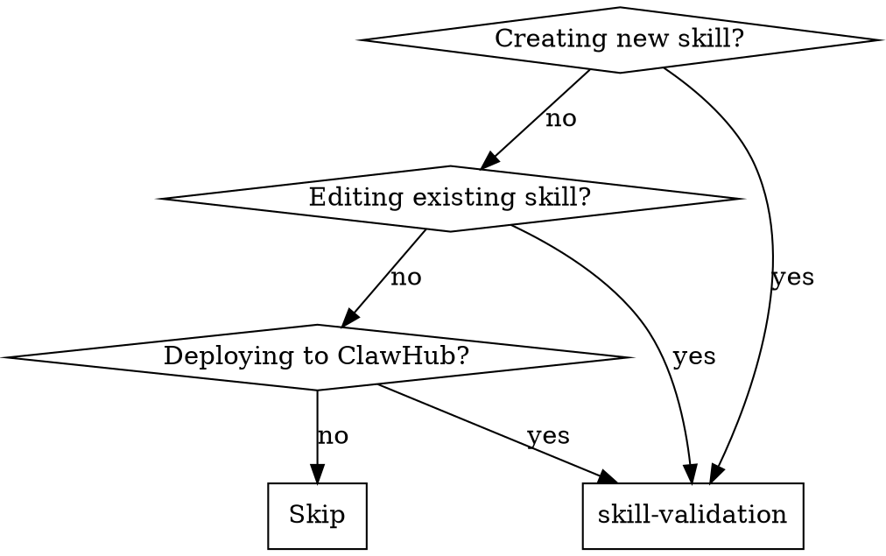

<!-- ===== X∞ COMPLIANCE LAYER (auto-applied by skill-architecture-standard) ===== -->
# skill-validation — X∞ Compliance Layer

## 1. IDENTITY
Skill milik user: `skill-validation`. Mengikuti Skill Architecture Standard X∞ (wajib).

## 2. PURPOSE
Menyediakan kemampuan skill-validation kepada agent saat relevan.

## 3. METADATA
- name: skill-validation
- version: 2.0.0
- standard: Skill Architecture Standard X∞ (21-node)
- scope: lihat body domain
- depends_on: tidak ada (mandiri)

## 4. TRIGGER ENGINE
Aktif ketika user meminta hal yang cocok dengan deskripsi di atas.
Negative trigger: di luar scope deskripsi.

## 5. CONTEXT ENGINE
Baca OS/ARCH/runtime sebelum bertindak. Termux Android ARM64 ≠ Ubuntu x86_64.

## 6. DECISION POLICY
IF uncertainty → VERIFY
IF high risk → ASK/STOP
IF tool unavailable → ALTERNATIVE
IF action fails → RECOVER

## 7. REASONING POLICY
Evidence-first. Bedakan FAKTA vs HIPOTESIS. Confidence: CONFIRMED/LIKELY/POSSIBLE/UNKNOWN.

## 8. EXECUTION POLICY
Ambil tindakan relevan, lalu VERIFY. Jangan klaim sukses sebelum diverifikasi.

## 9. TOOL POLICY
Pilih tool berdasar kebutuhan+konteks. Jangan asal panggil semua tool.

## 10. MEMORY POLICY
Ingat hal relevan; abaikan noise. Retrieve saat dibutuhkan, update bila berubah.

## 11. VERIFICATION ENGINE
ACTION → VERIFY → SUCCESS? Jika tidak: DIAGNOSE → RETRY/CHANGE STRATEGY.

## 12. ERROR RECOVERY
transient→retry; timeout→backoff; auth→credential check; dependency→diagnosis; unknown→investigate.

## 13. SECURITY GUARDRAILS
NEVER log secret. REDACT API KEY/TOKEN/PASSWORD/SECRET sebelum simpan. PII: MINIMIZE→REDACT→HASH.

## 14. EVALUATION
Self-eval: capai goal? terverifikasi? ada asumsi? ada gagal? Kirim ke Agent Evaluation Engine.

## 15. OBSERVABILITY
Emit: START/PROGRESS/TOOL CALL/ERROR/RETRY/SUCCESS/FAILURE + TRACE_ID (tanpa secret).

## 16. PERFORMANCE OPTIMIZATION
FULL→OPTIMIZED→LOW RESOURCE mode bila terbatas. Prioritas: TASK>SAFETY>RELIABILITY.

## 17. SELF-IMPROVEMENT
USE→OBSERVE→EVALUATE→FIND WEAKNESS→IMPROVE→TEST→NEW VERSION (via evaluasi+regresi).

## 18. VERSIONING
Semver. Perubahan struktur = MAJOR. CHANGELOG wajib.
**CHANGELOG**
- 2.0.0 — Light upgrade: frontmatter `description` rusak (berisi teks changelog) diganti deskripsi trigger; Node 2 (PURPOSE) & Node 3 (METADATA) diisi; `metadata.openclaw.version` diset 2.0.0. Body domain dipertahankan.

## 19. COMPATIBILITY
Tahu OS/ARCH/RUNTIME/versi/tool/API tersedia.

## 20. KNOWLEDGE SOURCES
Trust hierarchy: OFFICIAL>PRIMARY>REPUTABLE>COMMUNITY>UNKNOWN. Tandai VERIFIED/LIKELY/UNCERTAIN/OUTDATED/CONFLICTING.

## 21. EXIT CONDITIONS
Berhenti pada: SUCCESS/FAILURE/BLOCKED/NEED USER/NEED CREDENTIAL/NEED TOOL/NEED VERIFICATION.
<!-- ===== END X∞ COMPLIANCE LAYER ===== -->


# Skill Validation

## When to Use



## Validation Checklist

### Structure
- [ ] Folder name **exactly equals** the skill slug (folder name = skill identifier)
- [ ] `SKILL.md` exists — the only hard requirement
- [ ] Optional resources in `scripts/`, `references/`, `assets/` — and each is **linked from SKILL.md with clear when-to-read guidance**
- [ ] `_meta.json` exists with correct slug, version, ownerId (for published skills)
- [ ] `skill-card.md` exists with description, risks, references (for published skills)
- [ ] `.clawhub/origin.json` exists (for installed skills)

### YAML Frontmatter
- [ ] Opening AND closing `---` delimiters both present (a missing opening `---` silently breaks the whole skill)
- [ ] `name` — present; kebab-case or PascalCase; verb-first preferred
- [ ] `slug` — kebab-case, unique, matches folder name
- [ ] `version` — semver (x.y.z), bumped on every change
- [ ] `description` — **trigger mechanism, not marketing copy**: states what the skill does AND when to use it, with the nouns/keywords users actually type ("Use when...")
- [ ] `changelog` — describes this version
- [ ] `metadata` — **single-line JSON object** (parser limitation); `clawdbot` key preferred (`clawdis`/`openclaw` accepted as aliases)
- [ ] `metadata.clawdbot.emoji` — single emoji
- [ ] `metadata.clawdbot.requires.bins` — every CLI the skill calls (curl, jq, node...)
- [ ] `metadata.clawdbot.requires.env` — every env var the skill needs (API keys, URLs)
- [ ] `metadata.clawdbot.os` — supported OS array
- [ ] `metadata.clawdbot.install` — install specs when deps exist (kinds: brew / node / go / uv / download)
- [ ] Optional invocation fields used correctly: `user-invocable`, `disable-model-invocation`, `command-dispatch`

### Content Quality
- [ ] Body is a **runbook** (deterministic steps, stop conditions, output format) — not marketing copy, not a brainstorm note
- [ ] `When to Use` section with decision criteria or DOT diagram
- [ ] **Progressive disclosure budget**: SKILL.md body ≤ ~500 lines / ~5000 words; overflow moved to `references/` and linked
- [ ] Freedom level matches the task: scripts for fragile/exact operations, prose for judgment calls
- [ ] Examples: Good vs Bad patterns, with realistic input/output
- [ ] Edge cases covered: empty input, missing deps, network failure, timeouts
- [ ] Error handling / Red Flags / circuit breakers
- [ ] Verification checklist (if applicable)
- [ ] No hardcoded secrets, URLs, endpoints, or credentials
- [ ] No mixed languages without localization metadata
- [ ] Rationalization table to prevent agent deviation
- [ ] Output format specified and consistent (so other skills can consume it)

### Security
- [ ] No API keys, tokens, or passwords in any file
- [ ] No hardcoded third-party endpoints without validation gates
- [ ] No auto-execution without user confirmation
- [ ] No polling loops without rate limit warnings
- [ ] No eval() or dynamic code execution without sandbox
- [ ] Env vars referenced via `$VAR`, never inlined values

### Red Flags — STOP and Fix

| Flag | Severity | Action |
|------|----------|--------|
| Missing opening `---` | 🔴 Critical | Frontmatter won't parse at all — fix delimiters |
| Folder name ≠ slug | 🔴 Critical | Rename folder to match slug |
| Skill < 500 chars | 🔴 Critical | Rewrite with full structure |
| Description without "Use when" triggers | 🔴 Critical | Skill will never activate — rewrite as trigger phrase |
| No `When to Use` | 🔴 Critical | Agent will invoke randomly |
| Hardcoded URL/secret | 🔴 Critical | Replace with env var or config |
| Escaped quotes (`\"`) in code blocks | 🟡 High | File was shell-escaped during backup — unescape |
| Body > 500 lines, no references split | 🟡 High | Split into `references/` per progressive disclosure |
| No examples | 🟡 High | Add Good vs Bad patterns |
| Mixed languages | 🟡 High | Add localization metadata |
| No error handling | 🟡 High | Add Red Flags section |
| Declares no `requires` but calls curl/APIs | 🟡 High | Declare bins/env in metadata |
| Version in title ≠ version in frontmatter | 🟡 High | Sync them; keep history section |
| No skill-card.md | 🟢 Medium | Create from template |

## Professional Standards

| Level | Criteria |
|-------|----------|
| **Minimal** | name, trigger description, usage steps |
| **Professional** | +slug, version, DOT diagram, rationalization table, examples, declared requires |
| **Enterprise** | +homepage, changelog, install specs, skill-card, origin, reference split, dependency chain |

## Validation Commands

```bash
# Check file structure
ls -la skills/<skill-name>/

# Verify frontmatter delimiters (must print exactly 2)
grep -c '^---$' skills/<skill-name>/SKILL.md

# Verify folder name matches slug
grep '^slug:' skills/<skill-name>/SKILL.md

# Check metadata is single-line JSON
grep '^metadata:' skills/<skill-name>/SKILL.md | python3 -c "import sys,json; json.loads(sys.stdin.read().split(':',1)[1].strip())"

# Check for secrets
grep -ri "api_key\|token\|secret\|password\|ghp_\|sk-" skills/<skill-name>/

# Check for hardcoded URLs
grep -ri "http://\|https://" skills/<skill-name>/ | grep -v "localhost\|127.0.0.1\|github.com\|clawhub.ai"

# Check for escaped quotes (backup corruption)
grep -n '\\"' skills/<skill-name>/SKILL.md

# Body line budget (should be ≤ ~500)
wc -l skills/<skill-name>/SKILL.md
```

## Example: Validating a New Skill

<Good>
```markdown
---
name: my-skill
slug: my-skill
version: 1.0.0
description: "Does X when Y happens. Use when the user asks to X, Y, or Z."
changelog: Initial release
metadata: {"clawdbot":{"emoji":"🔧","requires":{"bins":["curl"],"env":["MY_API_KEY"]},"os":["linux","darwin","win32"]}}
---

# My Skill

## When to Use
User needs to do X in situation Y.

## Core Rules
1. Always confirm with user before Z
2. Never hardcode endpoints
```
</Good>

<Bad>
```markdown
---
name: "my-skill"
description: "Does stuff"
---

# My Skill

## Usage
1. Do thing
2. Do other thing
3. Done
```
Too minimal. No triggers, no validation gates, no examples, no metadata.
</Bad>

## Version History

- **v1.0.0** — Initial release with comprehensive validation checklist
- **v2.0.0** — Aligned with current ClawHub spec: trigger-style descriptions, single-line metadata JSON, folder=slug rule, progressive disclosure budget, install specs, new validation commands
