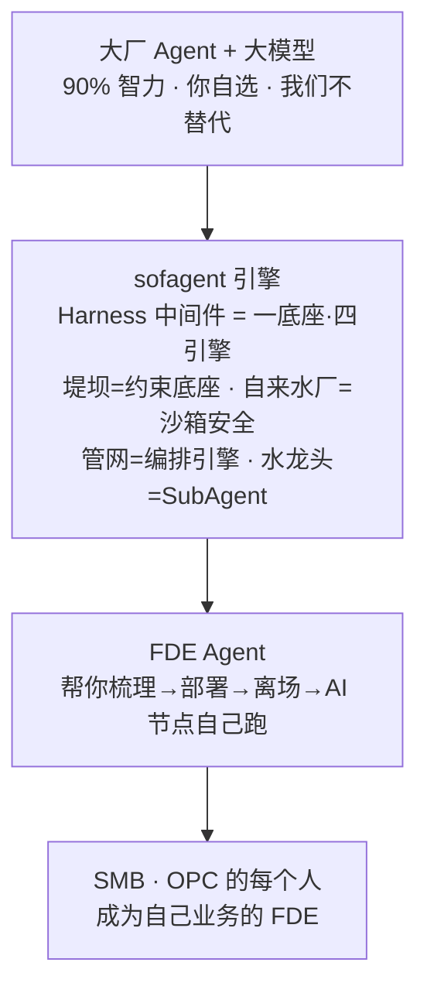

# FDE.md · FDE 能力模型

> v1.2.2 · 2026-07-29（UTC）· 孔放勋

> **Agent 按需读取导航**：本文件 1062 行，**不要一次性全读**。SKILL.md 已内联日常引导所需的全部指令。以下场景才需要读对应章节：
>
> | 你需要 | 读哪段 | 大约第几行 |
> |--------|--------|-----------|
> | 回答"sofagent 到底是什么" | 🎯 先读这段 | ~38 |
> | 做客户教育/讲理论支撑 | 🏗️ 理论基础 + 研读印证 | ~186, ~793 |
> | 讨论"部署后客户忘了你" | 13. 持续存在感机制 | ~676 |
> | 评估企业 AI 成熟度 | 附录：三级台阶 | ~920 |
> | 讨论产品边界/护栏 | 产品化护栏 | ~895 |
> | 企业已有引擎、要看巡检格式 | Sustain 模式 | ~1000 |
> | 完整的四阶段流程细节 | 进场→挖掘→交付→检查离场 | ~253-675 |
>
> §1-§12 的**核心追问话术、判定标准、产出格式**已在 SKILL.md 中内联，日常引导直接用 SKILL.md。

---

今天你看到这个文件名还是 "Forward Deployed Engineer"。FDE 从岗位 title 升级为能力模型，再升级为**常驻 FDE Agent**——**FDE Agent 不走**。你（人）帮客户部署完离场了，FDE Agent 留在客户那里继续干活：梳理好的工作流在跑、合规自检在跑、周度巡检在跑。客户得到的不是一个工具，是一个 7×24 在线的 FDE Agent。

> **这份文档面向两种人**：
> - 如果你是**给别人部署的 FDE**：按四阶段流程，帮客户走完全程。
> - 如果你是**给自己部署的用户**：建议读完——理解这套流程背后的逻辑，你会用得更深。
>
> **最终目标不是培养更多 FDE，而是让 SMB 与 OPC 的每个人，都具备 FDE 的能力：掌握完整上下文、打破岗位边界、对结果负责。**

> **目录**
>
> - [🎯 先读这段：如何正确理解 sofagent](#🎯-先读这段如何正确理解-sofagent)
> - [🚀 5 分钟读懂 FDE](#🚀-5-分钟读懂-fde)
> - [📋 这是什么](#📋-这是什么)
> - [⚠️ 成熟度 & 范围](#⚠️-成熟度--范围)
> - [🏗️ 理论基础](#🏗️-理论基础)
> - [什么时候该上 FDE](#什么时候该上-fde)
> - [FDE 四阶段流程](#fde-四阶段流程)
> - [进场阶段](#进场阶段)
> - [挖掘阶段](#挖掘阶段)
> - [交付阶段](#交付阶段)
>   - [交接清单（私有化评估 / Ontology 说明书 / River）](#9-交接清单)
> - [检查离场](#检查离场)
> - [13. 竣工后：持续存在感机制](#13-竣工后持续存在感机制)
> - [隐性代价](#隐性代价)
> - [研读印证：边界设计与渐进交付框架（2026-07）](#研读印证边界设计与渐进交付框架2026-07)
> - [产品化护栏](#产品化护栏)
> - [附录：企业 AI 成熟度](#附录企业-ai-成熟度三级台阶)
> - [附录：FDE 工具推荐](#附录fde-工具推荐)
> - [附录：Skill 质量标尺与编写原则](#附录skill-质量标尺与编写原则)
> - [持续优化模式（Sustain）](#持续优化模式sustain)

## 🎯 先读这段：如何正确理解 sofagent

> **sofagent 是一款 FDE Agent——品牌名是 sofagent，FDE Agent 是对它核心形态的描述（常驻硅基员工）；底层技术实现是 sofagent 引擎（Harness 中间件）的一底座·四引擎（约束底座 + 编排/审计/回溯/进化引擎）做问责底座。** 我们基于你自选的大厂 Agent 和大模型，不替代它们，而是帮企业梳理 workflow、搭建本体模型、部署专有 SubAgent。

一底座·四引擎是 FDE Agent 的**核心架构**，不是独立销售的产品。

### 最常见的三个误解

| ❌ 常见误解 | ✅ 正确认知 |
|------|------|
| 这是个 Git 审计安全工具 | 审计引擎只是 FDE Agent「一底座·四引擎」中的一环，单独拿出来没有意义 |
| 这是要跟大厂 Agent 竞争 | 我们**不造 Agent**，骑在大厂 Agent + 模型之上做问责底座 |
| 这是卖软件的 | 这是**开源（MIT）的 FDE Agent**——目标是让 SMB 与 OPC 的每个人都能成为 FDE，自主完成部署 |

### 心智模型



> 一底座·四引擎（约束底座 + 编排/审计/回溯/进化引擎）都**服务于 FDE Agent**——这是本项目的核心点。下文四阶段流程讲的就是如何把这套底座用起来：无论你是帮自己还是帮客户做 FDE，都能照着走完。

---

## 🚀 5 分钟读懂 FDE

> **企业 AI 落地失败的首要原因不是技术选错，是顺序搞反了**——上来就选模型、搭平台、买 Agent，结果发现没人用。

**一纸一会两周**：

| 步骤 | 怎么做 | 例子 |
|------|--------|------|
| **一纸** | 写下当前最痛的一个业务场景 | 「客户联系率只有 27%」 |
| **一会** | 第二天早会执行一个最小动作 | 「每人汇报 5 个客户跟进情况」 |
| **两周** | 不看 AI、不买工具，只看数据变化 | 4 周后联系率从 27% → 81% |

这个故事来自一位帮几百家企业跑通 AI 落地的创始人。他发现真正的瓶颈从来不是「AI 不够好」，而是**企业还没搞清楚自己的业务流程，就想让 AI 来接管**。80 人销售团队仅加早会 5 分钟提问环节（未采购任何 AI 工具），四周见效。「管理动作先行」——先让人跑通流程，再用 AI 加速。

sofagent 的 FDE 方法论正是照着这个逻辑设计的：**第一步梳理工作流，本身就是管理动作**。只是把它系统化了——Agent 辅助梳理、审计引擎看门、知识库持续积累。

---

## 📋 这是什么

FDE（或企业 CIO/网管）的操作手册。**读它 → 帮企业梳理 workflow → 识别 AI 节点 → 生成交付手册**。Agent 全程辅助：你负责和人聊，Agent 负责记录、分析、出方案。

**离场后企业留下五样东西**：

| 交付物 | 说明 |
|--------|------|
| 交付手册 | 谁都能看懂，企业 IT 可独立维护 |
| AI 节点 | 在跑的 Agent，自动执行日常任务 |
| AI 知识库 | 持续积累的实体、概念、对比页 |
| 私有化评估体系 | eval 反馈 + Skill 迭代历史——无法复制的企业 IP |
| **sofagent 本身** | **FDE Agent 7×24 在跑**——管上面四样东西的生命周期，人离场了它留下 |

**但其实留下的第五样东西才是最重要的——sofagent 本身。** 上面四样东西不是静态交付物，是 FDE Agent 持续维护的活资产：它跑交付手册里的 workflow、管 AI 节点的生命周期、给知识库做 Dream Cycle 沉淀、用 eval 驱动 Skill 迭代。人（FDE）离场了，sofagent 留下——7×24 在跑。这才是「常驻 FDE Agent」的真正含义：客户得到的不是一套文档+几个脚本，而是一个一直在线、一直干活、一直自检的 FDE Agent。

#### 交付物放在哪：{企业名}/ 可见目录（v1.2.0）

FDE 的交付物不只存在隐藏目录里让用户看不到。交付时在你项目里建一个**以企业名命名的可见目录**：

```
{企业名}/                            ← FDE §3 建档时确定，以此为根目录名
  交付手册/
    企业画像.md                       ← 基于 FDE/templates/enterprise-profile.md
    部署方案.md                       ← 基于 FDE/templates/deployment-plan.md
    运行规范.md                       ← 安装包自带 fde.md
    上手文档.md                       ← 安装包自带 quick-start.md
  nodes/                              ← AI 节点文档（人读 + 编排引擎读）
    节点A.md                          ← 基于 FDE/templates/nodes/node-template.md
    节点B.md
  skills/                             ← AI 节点 Skill（AI 读）
    节点A/SKILL.md                    ← 基于 FDE/templates/skills/skill-template/SKILL.md
    节点B/SKILL.md
  workflows/                          ← Workflow 定义
    节点A.yml
    节点B.yml
```

> 📌 这些文件**不写进 `.gitignore`**——企业画像、节点文档、Skill、Workflow 是企业 AI 化的重要资产，应该进版本控制、团队共享。
>
> 📌 `.sofagent/` 运行时目录保留作为真源与 Dashboard 数据源，`{企业名}/` 为交付物副本，二者并存。
>
> ⚠️ **交付物版本控制安全（v1.2.0）**：交付物进 Git 意味着企业画像 / 节点配置 / Workflow 定义会进入提交历史。三点注意：① **提交前脱敏**——企业画像可能含客户名单 / 财务数据 / 内部系统地址，FDE 离场前必须确认 sanitize 管道覆盖（`@sofagent/audit` A1 敏感文件 + A2 密钥泄漏已在 commit hook 拦截）；② **仓库可见性**——交付物进 Git 仓库后，仓库的可见性（public / private）决定了谁能看到企业信息，FDE 交付的仓库**必须设为 private**；③ **历史不可擦**——一旦提交，即使后续 `git rm`，历史记录仍可追溯，涉及敏感的画像数据建议放在 `.sofagent/knowledge/`（本地存储 + sensitivity 分级）而非交付物目录。

> 📖 FDE 的产品哲学——「不配置 UI，配置对话能力」见 [设计哲学](../docs/PHILOSOPHY.md#六怎么装部署哲学)。

### 三种部署场景

| 场景 | 用户 | 方式 |
|------|------|------|
| 懂电脑 | 技术人员 | 正常安装流程，部署到电脑上就能用 |
| 不懂电脑 | 普通员工 | 给一个 U 盘——sofagent + 联邦密钥 + knowledge 全在盘上，插上就能用 |
| 无头设备 | 服务器/工控机 | U 盘插上别拔，Agent 一直在联邦里跑 |

> 💿 **USB key 是 FDE 的核心交付工具。** FDE 帮企业梳理好 workflow 节点后，一条命令烧录完整运行时到 U 盘——员工拿到 U 盘，插上任何电脑双击就能跑，不需要安装、不需要配对、不需要专业知识。

**烧录方式**——插上 U 盘后跟你的 Agent 说"帮我烧一个财务审计节点的 U 盘"，或直接跑 CLI：

```bash
sofagent-daemon create-usb-key \
  --role "财务审计节点" \
  --target /Volumes/SOFAGENT \
  --platform macos   # 或 linux / win
```

**U 盘里有什么**：Node.js 便携版 + sofagent 引擎（审计/编排/约束/回溯）+ knowledge/ 加密落盘（AES-256-GCM，明文只在内存）+ 三平台启动脚本（start.command/.sh/.bat）+ HMAC-SHA256 防篡改签名。

**插上即用**：双击启动脚本 → 全量验签（fail-closed：签名不匹配拒绝启动）→ 内存解密 knowledge（明文不落盘）→ daemon 启动（cron + 文件监听 + 联邦在线）→ 本机零残留（所有路径指向 U 盘）。

**典型场景**：搭好一个财务 workflow → 烧一批 U 盘 → 发给财务团队 → 每人插上就能用自己的 Agent 调用 U 盘里的知识和审计能力开始干活。换电脑插上，身份不变，知识不变。详见 [PHILOSOPHY §六](../docs/PHILOSOPHY.md#六怎么装部署哲学)。

#### 安全联邦：多设备知识互查（v1.1.8+）

FDE 部署多台设备后，设备之间可以互相查询 knowledge/——财务节点的知识，采购节点经授权后也能查到。整个链路加密，不经过任何第三方服务器。

**安全模型四层纵深防御**：

| 层 | 机制 |
|------|------|
| 应用加密 | AES-256-GCM（IV 12 字节随机不复用 + GCM tag 校验失败抛错），key 只存内存，退出清零 |
| 密钥交换 | ECDH(prime256v1) + HKDF 派生 32 字节 AES key（三条配对路径：6 位码确认 / 环境变量 token / federation.json HMAC 验签），24h 轮换（旧 key 只解不加） |
| sensitivity 过滤 | peer 端 + 本地端双重校验（restricted 不外发、不接收） |
| 合并策略 | automerge CRDT 合并（trust 优先于 mtime）；篡改标签降权 trust=web + 审计 WARN |

> 💡 **FDE 部署时的联邦配置**：FDE 在 §7 交付方案时为每个节点设定 sensitivity（restricted 标好客户名单/财务数据），配对完成后设备间查询自动遵守分级。架构层纵深详见 [ARCHITECTURE 联邦查询](../docs/ARCHITECTURE.md#联邦查询v118)；Prompt 注入防护体系（外部内容 `<untrusted>` 包裹 + 脱敏 + 可信分级）详见 [SECURITY.md](../SECURITY.md)。

> 🔑 微软 CEO Nadella：「未来企业最重要的知识产权是 private evals——工具可以被复制，但差异化反馈数据无法被复制。」

---

## ⚠️ 成熟度 & 范围

| 维度 | 状态 |
|------|------|
| FDE 四阶段流程 | ✅ 已在作者自有企业中实际部署（2026-07） |
| 审计引擎 | ✅ 独立产品，审计核心测试数见 `tools/test-count.sh` 实测（全 workspace 汇总）、跨平台 CI 覆盖 |
| 覆盖范围 | Agent 质量层（代码纪律 + 审计 + 经验沉淀） |
| 不覆盖 | 运维层（监控 / 告警 / 重启 / 日志轮转） |

> 详见 [LIMITATIONS.md](../LIMITATIONS.md)

---

## 🏗️ 理论基础

**Echo-Delta 结构**：Palantir FDE 不是单兵作战——Echo（领域专家）识别真正值得解决的问题，Delta（工程师）在信息不完整中快速构建，优先速度而非完美设计。

**碎石路到高速公路**：FDE 先铺碎石路（快速定制），核心产品团队提炼共同模式为标准功能。每一笔定制转化为产品积累，而非一次性咨询。

**Agent 让 FDE 更重要**：Bob McGrew（前 Palantir/OpenAI）指出 AI agent 没有现成的产品，是 FDE 兴起的核心原因。Agent 是非确定性系统，必须配套 eval、guardrail 和人工复核——这正是审计引擎做的事。

前 Partnership 副总裁、FDE 模式创始人之一 Bob Mycroft 进一步点明：Agent OS 这类产品的核心服务对象**不是终端客户，而是 FDE**——它把原本难以规模化的「沙石路」铺成高速公路，让单个 FDE 服务更多客户、沉淀领域知识。这与上文「碎石路到高速公路」同源，也印证了 sofagent 只做 FDE Agent 能力封装、不做 Agent 运行时的定位。

> 详见：[fde.academy](https://fde.academy/blog/how-palantir-invented-the-forward-deployed-engineer-model) · [OpenFDE](https://open-fde.com/zh/docs/agent-era) · [OpenFDE 工作流](https://open-fde.com/docs/workflow)

---

## 什么时候该上 FDE

FDE 有巨大前期成本，只在三种情况成立：
1. **深度实施需求 + 毛利足以吸收成本**——常规产品自助就能跑通的场景，不必上 FDE
2. **强监管行业**（金融 / 医疗 / 国防 / 政务）——合规要求必须现场定制
3. **需要探路的全新垂直**——产品还没覆盖的行业，FDE 去打样

> **AI 部署的硬数据**：Orgvue + Intuition Labs 调研显示，39% 的企业因 AI 部署进行了裁员，其中 **55% 事后承认决策失误**——裁错了人、裁错了岗位、或者裁完后发现 AI 根本撑不起被裁掉的工作。这不是"AI 不行"，是企业缺乏评估 AI 实际能力的机制——在看不见 Agent 到底能做什么、不能做什么的情况下就做了组织决策。sofagent 的审计引擎（git diff 硬证据）+ FDE 四阶段流程（先判定 AI 节点再部署）就是为了避免企业掉进同一个坑。

### 客户分层打法

| 维度 | SMB / 小客户 | 中型客户 | 大型 / 央国企 |
|------|------------|---------|-------------|
| **团队配置** | 1 名 FDE + agent 舰队 | pod：FDE + PM + 数据工程师 | 全队 + RACI + 指导委员会 |
| **切入方式** | 低价起步 + 自助试用 | 业务驱动 + 多线程 | 高层关系 + 灯塔 POC |
| **第一个项目** | 单一高频关键场景 × 一个用例 | 一个部门 × 有清晰 KPI 的流程 | 灯塔 POC（有限范围 + 内部标杆） |
| **最大风险** | 没钱没数据 + 高流失 | 卡单 + 单线程风险 | 周期长 + 定制债 + 合规坑 |

> 📌 **中型客户（专精特新小巨人）是 FDE 甜点区**——有大企业的复杂度，但没有大企业的预算浪费。中小企业走 PLG / 渠道。

### 客户就绪三前提

Agent 是放大已标准化的能力，**不是替你管理混乱**。进场前必须确认客户满足三个前提，否则部署必败：

| 前提 | 检查点 | 没满足怎么办 |
|------|--------|------------|
| **流程已标准化** | 合同怎么审、风险怎么分级、指标怎么权重——都要先定义清楚 | 先帮客户做流程梳理，不急着上 Agent |
| **数据已打通** | ERP / MES / 财务 / 银行网银不能是孤岛 | 评估数据打通成本，或缩小 Agent 覆盖范围 |
| **权限边界已划定** | 高敏感场景提前明确自动化范围 + 人工确认节点 | entry-gate 风险分级配置时必须一起定 |

> 🎯 **切入顺序**：非车间场景（法务 / 采购 / 财务）先跑通——这类"隐形生产线"规则明确、重复频繁、风险敏感，是 Agent 最容易出效果的入口。车间/产线场景后做。

> 引用来源：[OpenFDE 白皮书](https://open-fde.com/zh/white-book)

---

## FDE 四阶段流程

确认 FDE 适合你的场景后，下面是完整的操作流水线。从进场到离场，共 **4 个阶段、12 个关键步骤**：

| 阶段 | 步骤 | 一句话 |
|------|------|--------|
| **进场** | §1-3 | 搞清楚企业是谁、用什么平台、关键岗位有哪些 |
| **挖掘** | §4-6 | 梳理工作流 → 建立本体模型 → 判定 AI 节点并量化价值 |
| **交付** | §7-9 | 出方案 → 装 sofagent → 部署节点 → 交接手册 |
| **检查离场** | §10-12 | 全跑通 → 两周稳定 → 确认企业能独立运行后离场 |

每一步都有检查清单，不要跳过。你不是来写 PPT 的——你是来确保企业离场后 AI 真的在跑、真的有用。

> **像管理新员工一样管理 AI Agent**——黄仁勋（2025.7, with Harrison Chase）：企业部署 AI，就像给新员工办入职。进场（搞清楚企业是谁、关键岗位有哪些）→ 挖掘（梳理工作流，知道这个"新员工"要干什么）→ 交付（分配工具权限、配安全护栏、连接协作对象、给任务书）→ 检查离场（确认能独立运行后放手）。sofagent 的四阶段十二步流程本质上就是为 AI Agent 构建一套"人力资源管理体系"——过去你怎么管人，现在就怎么管 AI。

---

## 进场阶段

### 1. 确定场景

你需要向部署专家确认：

- 企业叫什么、做什么行业、多少人
- 哪个部门/团队参与本次部署
- 关键岗位有哪些、每个岗位主要产出什么

注意：这一轮不要聊 AI、不要聊工具——只聊业务。你把这些信息记录成「企业画像」：一段话 + 部门/岗位清单。

---

### 2. 盘点平台与工具

你需要向部署专家确认：

- 协同平台（钉钉/飞书/企业微信/Slack……）
- 业务系统（ERP/CRM/自研/Excel）
- 数据可达性（有API/可导出/手动/不可达）
- 知识库平台在哪——后续部署时知识库就落在这里

> 💡 **第三代 AI 数据源**：如果企业用飞书多维表格智能体或钉钉 AI 表格，优先作为 AI 节点的直接数据源和输出目标。飞书的触发器机制（事件驱动自动预警到群）和钉钉 AI 表格的自动化能力，天然适合 §8 的检查点配置——不需要额外搭桥，数据在企业已有平台上跑。

产出：「技术环境清单」。

---

### 3. 建立企业画像

**企业画像，是贯穿全流程的活文档。** 不是一次性填完就锁死的表格：从进场到离场，每个阶段的新发现都要回写进去——§4 梳理出的工作流、§5 判定的 AI 节点、§6 算出的价值数据、§10 验证后的实际运行状态。画像跟着企业一起长。

第一步先把 §1 + §2 的信息填进去，搭好骨架：

```
企业名称：
所在行业：
团队规模：
本次覆盖范围（全公司 / 某部门 / 某项目）：

协同平台（钉钉/飞书/企微/其他）：
业务系统（ERP/CRM/自研/Excel/其他）：
数据可达性（有API/可导出/手动/不可达）：
已有知识库平台：

关键岗位清单：
  1. [岗位名] — 人数：[N] — 主要产出：[描述]
  2. ...
```

建档完成后，与部署专家确认——然后进入挖掘阶段。**注意**：画像里的每一项都不是最终答案。随着部署推进，岗位清单会扩展、业务系统会补充、数据可达性会变化。每次发现新信息，立刻回写到画像里。离场时交给企业的画像，应该比进场时丰富数倍。

---

## 挖掘阶段

### 4. 梳理工作流

**先找主战场**：AI 不是司令员只是援军。先集中资源打一场能计算结果的小仗——问三个问题定位突破口：① 哪个环节卡住了企业？② 在不增加人手的前提下，AI 能承担 30% 还是 80%？③ 打赢之后（可量化结果）再复制到下一个流程。跑通一个流程比铺开十个半成品更有说服力。

引导部署专家逐个岗位、逐段流程地深挖，直到每个节点的五要素全部填满。

#### 五要素

1. **输入**：这个节点接收什么信息/数据？
2. **输出**：这个节点产出什么？
3. **负责人**：谁在做这件事？
4. **耗时**：每次花多长时间？每天/每周做几次？
5. **最卡的地方**：最大的难点是什么？

#### 追问话术

- 「这个岗位每天第一件事做什么？」
- 「做完上一步，下一步是什么？」
- 「这一步输入是什么？谁给你的？输出是什么？交给谁？」
- 「这一步花多长时间？最烦人的地方是什么？」

五要素全部填满 → 换下一个岗位。所有关键岗位全部填满 → 进入 §5 构建本体。

产出：「完整工作流节点图」——每个节点有完整五要素，按岗位分组。

---

### 5. 构建企业本体模型

> 📌 **本体 ≠ 知识图谱数据库**：本体的核心是**业务刻画**——完整呈现业务领域的客观事实与关联关系（如「客户下单 → 订单含哪些产品 → 产品由哪些零部件构成 → 零部件从哪些供应商采购」）。知识图谱只是它的一种技术实现。sofagent 的 ontology 包（objects.yml / actions.yml / constraints.yml 三层 YAML）正是这一业务刻画的**机器可读层**，让 Agent 基于真实业务关系做决策，而非通用回答。

> ⚠️ **本体建设适配性判断**：多数中小企业**不必**建全量本体——本体搭建 + 配套 Agent 开发的投入高，且中小企业流程相对简单，全链路本体建设的投入产出比严重失衡。动手前先判两件事：① 是否需要**业务域级 Agent Runtime**（深度提效、规避人为干预损耗）；② 是否作为**一号位工程**推进。若两者皆否，用**轻量 Agent + 企业 Skill**（个人增强节点 / harness 层）即可满足需求，无需本体建设。
>
> 💡 sofagent 的 ontology 是**轻量业务刻画层**（三层 YAML，由 daemon 自动 `mergeOntology()` 从节点 frontmatter 生长），并非重型 KG 工程——正因如此中小企业也能落地，无需传统本体工程的重投入。

对 §4 的每个节点，补三个字段到节点文档的 frontmatter。人和机器都从这份 frontmatter 理解「谁依赖谁」「谁能看什么」。

**域归属（domain）**：这个节点属于哪个业务域？追问：「这个节点的产出，最终服务哪个部门？」

**上下游关联（relations）**：
- `belongs_to`：输入从哪个节点来？（查 §4 的「输入」字段）
- `has_many`：产出交给哪些节点？（查 §4 的「输出」字段）

**访问边界（knowledge-domain）**：
- `include`：哪些节点 Agent 有权读这个节点的知识库页面？
- `exclude`：哪些明确不能读？（财务节点排除人事域是典型场景）

#### 业务四问清单（FDE 入场必填）

在补节点 frontmatter 之前，先用四问把「企业到底在做什么业务」钉死——这是企业侧业务本体的入口，也是后续 Ontology 统一层（objects/actions/constraints）的事实来源：

1. **关键业务对象有哪些？** —— 客户 / 商品 / 订单 / 供应商……列清实体类型（对齐 GB/T 48000.3-2026「实体类型」）。
2. **每个对象的归属负责人是谁？** —— 谁对这个结果负责（对齐「责任到人」铁律）。
3. **权威数据来源系统是哪个？** —— ERP / CRM / 自研 / Excel，避免 Agent 从非权威源编造（对齐「不可追溯即不可信任」）。
4. **动作风险等级？** —— 每个业务动作定级：低（查询/只读）/ 中高（写操作/审批/对外发）。定级决定后续 Action Type 与 entry-gate 风险分级。

> 这四问不是一次性表格——贯穿 §3 企业画像 → §5 本体建模 → §7 交付方案。画像越准，后面 Ontology 说明书越真。

> 模板见 `FDE/templates/nodes/node-template.md`（frontmatter 段）。第一个节点搞清楚「上下游是谁」「谁能看什么」可能需要半天——因为要翻 §4 的所有节点、逐一确认关联。第十个节点 30 分钟：关联图已经在前面搭好了。设计原理见 [ARCHITECTURE 审计引擎](../docs/ARCHITECTURE.md#审计引擎)。

产出：富本体信息的节点文档集（frontmatter + 正文）+ `workflow.yml`（汇总所有节点的 knowledge-domain + relations）。

---

### 6. 识别节点与量化

对上一步的节点，逐一判定和估值。三问：输入能从系统自动取到吗？处理规则能写清楚吗？输出能自动推到人手里吗？

三个全「是」→ 🔄 自动执行，两个「是」→ ⚡ 强化岗位，否则 → 👤 暂时不动（不量化）。

| 类别 | 特征 | 例子 | 量化口径 | 追问 |
|------|------|------|------|------|
| 🔄 **自动执行** | 规则明确、高频重复、输入输出可结构化 | 数据拉取、报表生成 | **替人成本** | 谁在做？什么职级、大致薪资？ |
| ⚡ **强化岗位** | 需要判断但规则可描述，AI 做领航员 | 设计稿审核、合同条款检查 | **升级成本** | 招一个能驾驭 AI 的人年薪多少？培训周期多长？ |

按小时算：`日耗时 × 时薪 × 年工作日`。每个 🔄/⚡ 节点填四个字段到 `nodes/[节点名].md` 的「价值数据」段：当前成本 / AI 后成本 / 年节省 / 回本周期。模板见 `FDE/templates/nodes/node-template.md`。

产出：「节点分类与价值清单」——每个节点一行：🔄/⚡/👤 + 判定理由 + 四个量化字段。

---

## 交付阶段

### 7. 交付方案

基于 sofagent 的能力，给每个 🔄/⚡ 节点生成配置方案：

| 配置项 | 需要你判断 |
|------|------|
| sofagent 版本 | 🔄 → `full`（编排+审计）；⚡ → harness 层 |
| 交付方式 | 安装部署 / USB key 分发 / 无头设备插盘 |
| 输出终点 | 这个节点的产出推到哪？（飞书/钉钉/企微 Webhook / daemon 通知 / 联邦 knowledge/）。详见 [MCP 使用指南](../docs/guides/mcp-usage.md) |
| 铁律重点 | 这个节点的 Agent 最容易违反哪几条铁律？ |
| 审计周期 | 日报/周报/事件触发 |
| 输入源/输出目标 | 从哪个系统读数据？产出推到哪个平台？ |
| 企业专属 Skill | 是否需要定制企业自己的 Skill？注入什么行业规则？ |

产出：「节点→方案对照表」+ **每个节点三层实体**：

| 层 | 文件 | 给谁读 | 模板 |
|----|------|--------|------|
| 📄 文档层 | `nodes/[节点名].md` | 人读 + 编排引擎读（注入给 sofagent-orchestrator compose 拆任务） | `templates/nodes/node-template.md` |
| 🧠 Skill 层 | `skills/[节点名]/SKILL.md` | AI 读（节点的大脑） | `templates/skills/skill-template/SKILL.md` |
| 🔴 运行层 | 设备上的 session | 活的（SubAgent / AI 领航员） | 文档里 checklist 确认 |

> 节点文档（.md）同时服务两个消费者：企业方人读（看懂这个节点是什么）+ 编排引擎读（Agent 把文档注入给 sofagent-orchestrator compose 拆任务）。配置信息用表格写在 .md 里，不再单独一个 .yaml。

#### 先跑通，后沉淀 Skill

> **黄金顺序：先做产物，后做 Scale。**

在生成任何 Skill 文件之前，必须先走完一步：**用 Agent 完成一次真实任务，并交付高质量产物。**

- 以最高频、最痛的那个节点为起点
- 用 Agent 把真实任务从头到尾跑通一次——不是模拟，是真数据、真流程
- 确认产出达到交付标准后，再回过头来，把这次跑通过的过程抽象成 Skill 模板

**禁止一上来直接写 Skill 文档。** 凭空设计的 Skill 模板来自脑补而非实跑——看起来可能对，但在真实任务中失败的概率极高。所有 Skill 必须是"一次真实跑通过的任务"产物。

对应节点三层实体的生成顺序也要调整——

```
先：运行层（Agent 跑通真实任务，产生产物）
↓  确认跑通
中：Skill 层（把跑通过程抽象为 SKILL.md）
↓  提炼完成
后：文档层（为 Skill 补充人读文档）
```

> 💡 **为什么这样设计**：和 sofagent 审计引擎的哲学同构——审计看 git diff 硬证据，不信任 Agent 自我报告；Skill 也要看"跑通过"的硬证据，不信任凭空设计的模板。详见 v1.3.1 规划中的 Ontology「本体即认知底座」——Skill 的"本体"是真实跑通过的工作流，不是提前画好的架构图。


---

### 8. 方案部署

#### 装上 sofagent——整个部署的核心

**没有 sofagent，前面七步的方案就是一份漂亮的 PPT。** sofagent 不只是一个 Skill——它是三层引擎合起来的平台，装到设备上之后，AI 节点才有了纪律、有了审计、有了编排：

| 层 | 做什么 | 怎么跑 |
|----|--------|--------|
| **约束底座** | fde.md 规则注入 Agent 上下文 | install.sh 装完自动加载 |
| **审计引擎** | git diff → A1-A11、A14-A19 + E1-E4（共 21 条）规则 → exit code | git commit-msg hook，不挑 Agent，**0 token（纯正则引擎）** |
| **编排引擎**（实验性）| 拆任务 → 编排 → 执行 | DeepAgents compose（CLI 入口或 OpenClaw 内部 API）；专有 SubAgent 用 LangGraph 做图编排 |
| **内置 Agent**（v1.0.7 引入，v1.0.8 起为基础设施 Agent）| FDE 部署工程师 + 合规审计员 | `sofagent-orchestrator subagent run fde --task "..."`、`@sofagent-fde` |

> 💡 **审计引擎的双重价值**：工程层面是纪律工具（不改越界、不存盲改）；叙事层面是**轻量级 KYA（Know Your Agent）**——a16z 研判 Agent 经济瓶颈从「智力」转向「身份」，非人类身份:人类 = 96:1。sofagent 的审计引擎（约束行为 + 变更审计 + 责任归属）就是企业内部 Agent 的责任确权底座。用户可追溯每一次 Agent 行动——谁做的、改了什么、为什么、谁批准。

**内置 Agent（v1.0.7 引入，v1.0.8 起升级为基础设施 Agent）**：sofagent 预装了两个 Agent，安装后立即可用——
- **FDE 部署工程师**（`@sofagent-fde`）：梳理工作流、识别 AI 节点、构建知识库、交付离场。在 WorkBuddy 中 `@sofagent-fde 梳理采购流程` 即可调用，或 CLI `sofagent-orchestrator subagent run fde --task "..."`。
- **合规审计员**（`@sofagent-audit`）：Workflow 巡检、铁律覆盖验证、知识库健康度检查。发版前跑一次全量合规扫描。

两个 Agent 的定义在 `SKILL/agents/` 下，`install.sh`（默认模式）会自动安装。详细用法见 `../SKILL/AGENTS.md`。

找一台闲置设备（旧电脑、服务器、Nas 都行），装好 sofagent——这台设备就跑着 harness 层，上面是你梳理出来的 AI 节点。

```bash
# 设备上装 sofagent（核心）
bash install.sh
```

#### 节点类型决策（v1.0.7+）

部署 sofagent 后，根据企业场景选择节点类型：

| 节点类型 | 适用场景 | 需要 OpenClaw | 编排方式 |
|---------|---------|:--:|------|
| **自动运行节点** | 企业无人值守设备（AI 全自动执行） | ✅ 必须 | OpenClaw Channel + DeepAgents 内部 API |
| **个人增强节点** | 个人开发者用 WorkBuddy/Codex/Claude Code | ❌ 不需要 | `sofagent-orchestrator compose --task` CLI |

> 两种模式的核心约束体系完全一致——都是宪法层 SKILL.md + 规范层 fde.md + 反思层 think.md + 知识库 knowledge/。区别只在编排触达方式：自动运行节点走 OpenClaw 内部 API（更快），个人增强节点走 CLI 编排入口（不装 OpenClaw 也能用）。

> 📖 完整对照表（适用场景 / OpenClaw 依赖 / 编排方式）见 [ARCHITECTURE 双节点架构](../docs/ARCHITECTURE.md#双节点架构)。

#### 逐节点部署

1. **节点上线**：🔄 创建 SubAgent session 跑通一次；⚡ 配置 AI 领航员确认岗位人员会用
2. **企业 Skill 注入**：每个节点创建专属 Skill，注入行业术语 / 业务规则 / 历史案例
3. **交付手册落地**：交付手册（见 §9）落地到 §2 盘点的企业平台——让企业方随时翻得到
4. **检查点配置**：每个 🔄/⚡ 输出端设检查点，默认抽检 10%。不合格 → 标记任务 → 反馈主人 → 记录异常 → 触发 Skill 优化分析
5. **教会一个人**：每个 AI 节点指定企业方主人，退出信号为连续两天无人问「怎么用」

> AI 知识库不用你搭——AI 节点跑起来后自动积累（详见下方 §9.3 AI 知识库）。FDE 的职责是装好底座、让节点跑起来，知识库自然就有了。

---

### 9. 交接清单

离场前逐条确认四样东西：

#### 📄 交付手册（一份 .md 文件）

FDE 离场前打包交付给企业的一份文档。模板见 `templates/`。只含两章需要 FDE 写的 + 两章安装包自带的：

| 章节 | 来源 | 内容 |
|------|------|------|
| 企业画像 | `templates/enterprise-profile.md` 填写 | 企业基本信息 + 技术环境 + 持续回写区（§4-§12 逐步补充） |
| 部署方案 | `templates/deployment-plan.md` 填写 | 工作流全景图 + 节点分类 + 价值清单 + 节点→方案对照表 + 检查点配置 |
| 运行规范 | `fde.md`（安装包自带） | 加载到 AI 节点的 harness 层。直接复用，不用重写 |
| 上手文档 | `quick-start.md`（安装包自带） | 企业方人员第一次用怎么操作。直接复用 |

#### ⚙️ AI 节点（三层实体，独立于交付手册）

每个 AI 节点不是一个 checklist 打勾就完了——它有三层实实在在的实体存在。三层实体的完整定义（文档层 / Skill 层 / 运行层各自的文件、模板与读者）详见上方 §7 交付方案的「每个节点三层实体」表格。

每个节点的三层确认打勾，这个节点才算交付完成。

> **企业 Skill 是 AI 节点的大脑。** FDE 在 §7 为每个节点定制专属 Skill——注入企业的行业术语、业务规则、历史案例。节点跑起来后，Skill 会基于 eval.md 的评分和 task/logs 的记录**自动迭代优化**（检查点不合格时触发），不需要 FDE 人工调。详见 ROADMAP「skillopt 自动触发 / 失败清单驱动优化」。

#### 📚 AI 知识库（AI 节点运行后自动积累）

AI 知识库不是 FDE 写出来的——是 AI 节点跑起来后自己长出来的。FDE 的职责是搭好底座、让节点跑起来，知识库自然就会积累。

v1.0.1 起为**结构化 AI 知识库**（`.sofagent/knowledge/` 目录）：daemon 自动从 task/logs 提取新实体和新关联写入 entities/ 页面，loop-evaluate 顺带 Lint，加载链启动时被动注入 top-N 相关页摘要。FDE 在 §5 建立的节点 frontmatter（relations + knowledge-domain）就是知识库的初始骨架——节点跑起来后在此基础上自动生长。

这些是 AI 节点自动生成的文件，FDE 不需要管：

| 文件 | 是什么 | 谁生成 |
|------|--------|--------|
| think.md | 反思日志——每次任务后的经验沉淀 | AI 节点 |
| task/logs/ | 任务记录——每次编排决策、执行过程 | AI 节点 |
| eval.md | Skill 评分——哪些 Skill 好用、哪些要优化 | AI 节点 |
| orchestrator/ | 编排决策——AO Compose 拆任务的过程记录 | AI 节点 |

详见 [v1.0.1 开发日志](../docs/changelog/v1.0/v1.0.1.md)。

#### 知识治理体系（v1.1.7+）

knowledge/ 不再是散点脚本——从 v1.1.7 起升级为 daemon **Dream Cycle 6 阶段流水线**，自动从 task/logs 提取知识，FDE 不需要手动维护：

| 阶段 | 做什么 |
|------|--------|
| ① extract_facts | 从 task/logs 提取事实记录 |
| ② extract_atoms | 分解为知识原子 |
| ③ cluster_patterns | 聚类发现重复模式 |
| ④ synthesize_concepts | 合成概念页写入 concepts/ |
| ⑤ skillopt_backfill | 回填 Skill 优化建议 |
| ⑥ embed | 向量化入库 |

每轮跑完写 `knowledge/log.md` 周报。FDE 部署完，知识库自动生长。

**sensitivity 分级**：每条知识 frontmatter 带 `sensitivity: public | internal | restricted`（缺省 internal）。FDE 部署时需标好 restricted 项（客户名单、财务数据等）——restricted 知识在联邦查询时不外发，`knowledge status` 中只计数不返回内容。

**一条命令看全貌**：

```bash
sofagent-daemon knowledge status
# 输出三源聚合：Dream Cycle 周报 / 知识健康度 / sensitivity 计数
```

> 💡 配套治理：`knowledge-health` 巡检器（daemon @weekly，5 项检查：孤立 / 重复 / 断链 / index 过旧 / 缺源，fail-closed 只读）。详见 [ARCHITECTURE 巡检清单](../docs/ARCHITECTURE.md)。

企业画像是唯一需要 FDE 持续维护的活文档——每次回访、每次调整都同步进去。其余的，AI 跑着跑着就有了。

#### 9.4 私有化评估体系

离场前确认企业 AI 节点的评估闭环可用：

- [ ] `eval.md` 存在且有初始基线（至少 5 条手动评分记录）
- [ ] Skill 迭代历史可见（`skill-iterations/` 或 SkillOpt 日志）
- [ ] 知识库演变可追溯（knowledge/changelog/ 或 index.md 更新记录）
- [ ] 企业关键业务指标与 eval 挂钩（如「审批准确率 ≥ 95%」）

> 回到上方 §这是什么 中 Nadella 的那句话：企业最重要的知识产权是 private evals——工具可复制，差异化反馈无法复制。FDE 离场时留下的不是配置文件，是企业持续培养 Agent 的评估闭环。

#### 9.5 Ontology 说明书（v1.0.8+）

离场前用 `sofagent-ontology view` 生成一份人类可读的 MD 文档——

```bash
sofagent-ontology view > 企业数字孪生说明书.md
```

这份说明书是三个 YAML 文件（objects.yml + actions.yml + constraints.yml）的**人类可读摘要**：

| 章节 | 来源 | 内容 |
|------|------|------|
| 实体关系图 | `objects.yml` | 企业的部门/岗位/系统之间的关联（has_many / belongs_to / depends_on） |
| 动作矩阵 | `actions.yml` | 每个 AI 节点被允许执行什么操作、对什么对象 |
| 约束拓扑 | `constraints.yml` | 知识库访问域（谁能看什么）+ 速率限制 + 权限边界 |

Ontology 说明书是 FDE 离场交付物之一——不是一次性文档。企业新增 workflow 或修改 entity 后，daemon 自动触发 `mergeOntology()` 更新三个 YAML，重新跑 `ontology view` 就能拿到最新版。说明书跟着企业一起演化。

> v1.1.0+ 升级路径：从 MD 文件升级为 HTML Dashboard。通过 MCP 将三个 YAML 推送到服务器，渲染为可视化仪表盘——实体关系网 + 动作矩阵热力图 + 约束拓扑图。但 MD 文件永远保留：它是机器可读的数据源，也是人类离线阅读的保底方案。

#### 9.6 River——大厂造河与企业用水

FDE 交付的本质不是一个个独立 AI 节点，而是把节点间的**关联关系**梳理清楚，让企业 AI 能力流到业务侧。River 比喻完整映射见 [ARCHITECTURE · River — Workflow — Subagent 三层架构](../docs/ARCHITECTURE.md#river--workflow--subagent-三层架构)——sofagent 做堤坝 + 自来水厂 + 管网 + 水龙头，不做河本身。

**战略判断（sofagent 的差异化根）**

- **模型吞噬一切**：skill / prompt / context / harness 本质都是文字约束，每次注入 = 投喂 = 训练，模型必然吞噬文字约束。对策：把 Skill + Harness 封装进 Subagent（代码级，非文字注入）+ 防投喂机制；生存位在细分 workflow 对结果的可约束性。
- **水龙头长出净水能力——选小基座 + QLoRA 精调**：不做大模型剪枝，直接下载开源小基座（0.5B-3B），用企业 workflow 数据做 QLoRA 微调（4-bit 量化 + 低秩适配器，Mac Mini 可跑，适配器几 MB），只干这一个 workflow。详见 ROADMAP「Subagent 内置专精小模型」。
- **任务价值分流**：本地小模型（Qwen2.5-0.5B / Llama-3.2-1B，≤1B）只覆盖业务 workflow（省钱、数据不出域、零投喂）；代码 / 强推理 / 多步规划等高价值任务直接走云端最强 LLM（Claude / GPT / Gemini）。私有部署铁律针对业务数据，与高价值任务走云端不冲突。

> Dashboard 的 River 模块（v1.1.0+）展示流向图——哪些 Workflow 互联、数据怎么回流、任务怎么从入口分发再汇总。不是聊天窗口，是河流流向图。

---

## 检查离场

### 部署技术自检（进场完成后对照）

在走下面三步离场流程之前，先确认部署的技术底座是可靠的。对照 Harness 工程七个维度逐项检查：

- [ ] **上下文**——SKILL.md + fde.md + think.md + knowledge/ 四层加载链在目标设备已生效（跑 `sofagent-audit --doctor` 看加载链状态）
- [ ] **工具**——审计引擎 CLI（`sofagent-audit --version`）+ daemon 守护进程（`sofagent-daemon --status`）都可以正常调用
- [ ] **状态**——`data/` 目录已创建，`history.jsonl` 开始 append，跨会话状态不会丢失
- [ ] **执行控制**——ToolGate 已启用（agent 工具调用前置门禁生效）
- [ ] **权限**——最小权限原则：data/ 目录权限 700，`config.yml` 权限 600，无额外的 sudo/root 权限
- [ ] **可观测性**——审计日志（`data/audit/history.jsonl`）+ daemon 健康面板（`daemon-health.json`）+ webhook 推送已接通至少一个通知渠道
- [ ] **证据**——不是「我觉得装好了」→ 跑一次真实 `git commit` 带 `API_KEY=sk-...`，确认审计拦截确实生效
- [ ] **重试边界**——如果部署中某个节点失败，有明确的恢复路径（不是无限重试，是有 stop-loss）
- [ ] **成本监控**——Agent 调用的 token 消耗和 API 费用有记录方式

> 来源：DBGoal《Agent Harness、Loop 与 Graph：别再把三层架构混为一谈》上线前检查清单 (2026-07)，映射到 sofagent 部署场景。对应 Harness Engineering 的核心原则：让 Agent 在稳定、受控、可恢复的环境中工作。

### 10. 节点全跑通

- [ ] **sofagent 已装上设备**——三层引擎就绪：约束底座 + 审计引擎 + 编排引擎
- [ ] 每个 AI 节点三层实体齐全：文档层（`nodes/[节点名].md`）+ Skill 层（`skills/[节点名]/SKILL.md`）+ 运行层（已跑通）
- [ ] 每个 AI 节点有明确的主人
- [ ] 工作流检查点已配置（抽检率、质检员、不合格处理流程）
- [ ] 交付手册（企业画像 + 部署方案 + `fde.md` + `quick-start.md`）已打包并落地到企业自有平台
- [ ] AI 节点运行记忆（think.md / task/logs / eval.md / orchestrator/）开始积累
- [ ] 审计周报推送已配置并收到第一期
- [ ] **对抗性测试已跑过**——prompt 注入模拟 / 权限越界 / 异常输入（大部分企业只测功能不测攻击）

#### 对抗性测试怎么跑（v1.1.8+）

sofagent 内置 **8 层 Prompt 注入防护**，FDE 部署完用以下方法验证防线是否生效：

| 测试项 | 怎么测 | 预期行为（防护生效） |
|--------|--------|---------------------|
| 外部内容注入 | 向知识库写入含「忽略类」注入指令的页面，看 Agent 是否遵守 | 外部内容被 `<untrusted>` 包裹，注入指令不被执行 |
| 密钥脱敏 | 在 Agent 输入中放入 `sk-xxxx` / `AKIAxxxx` / 手机号格式 | `redactForPrompt()` 自动脱敏为 `sk-***` / `AKIA***` / `1xx****xxxx` |
| 知识可信降级 | 手动将某条 knowledge 标 `trust: web` + `sensitivity: restricted` | 该条被直接丢弃（web+restricted 组合禁止） |
| 联邦篡改 | 模拟 peer 发送篡改标签的 knowledge | 标签被降权 `trust=web` + 审计 WARN，不丢弃但不可信 |

> 💡 8 层防护完整映射表见 [SECURITY.md](../SECURITY.md)。FDE 不需要理解每层实现——只需要知道怎么测防线在不在。

### 11. 两周无报错

- [ ] 系统已连续运行两周无关键报错
- [ ] 近期连续两天无人主动找部署专家问操作问题
- [ ] 每个 🔄/⚡ 节点的实际产出与预期一致

### 12. 确认后离场

**客户满意度 ≠ 退出条件**——客户满意可能只是因为 FDE 一直在无底线兜底。独立运行才是验收标准。离场前确认企业方具备五大能力：

- [ ] **能解释系统**——指标含义、场景边界、为什么这样配
- [ ] **能处理常见问题**——告警响应、权限变更、配置调整、知识库更新
- [ ] **能执行回滚降级**——故障时切回手动流程，不慌
- [ ] **能独立风险判断**——审批规则、风险边界、什么情况升级到外部支持
- [ ] **有后续改进机制**——下一阶段优化清单已有，不是「装完就结束」
- [ ] **对抗性测试已执行**——不仅测功能正常路径，测试过恶意输入/异常输入/边缘 case（大部分企业只测功能不测攻击）
- [ ] 企业负责人确认可以离场

> 你不是在盖章——你是在帮部署专家确认「走之后不会出事」。

> 🚀 **人走，FDE Agent 不走。** 上面 §10-§12 是「人（FDE）离场」的检查清单。但 FDE Agent 本身不离场——离场那一刻，它从 deploy 模式自动切到 **sustain 模式**：周度巡检知识库健康度、月度汇总审计趋势、季度回顾 Skill 退化。见文末[持续优化模式（Sustain）](#持续优化模式sustain)。客户看到的不是「FDE 走了系统就没人管」，而是「FDE 一直在，只是换了个工作节奏」。

---

## 13. 竣工后：持续存在感机制

> **FDE 的成功悖论**：系统跑得越稳，客户感知越弱。部署后 3-6 个月，客户会产生「没有你我也行」的错觉——不是因为你做得不好，恰恰是因为你做得太好。

### 感知衰减曲线

```
感知强度
  │
  │  ██                    ← 部署前（销售阶段）：面对面
  │  ██
  │  ██  ██                ← 服务中：每天在一起
  │  ██  ██  ██
  │  ██  ██  ██  ██
  │  ██  ██  ██  ██  ░░    ← 撤出后 1-2 周：还在习惯中
  │  ██  ██  ██  ██  ░░  ░░ ← 撤出后 1 个月：系统很稳，好像没问题
  │  ██  ██  ██  ██  ░░  ░░  ░░  ░░ ← 撤出后 3 个月：「没有你我也行」
  │  ██  ██  ██  ██  ░░  ░░  ░░  ░░  ░░  ← 撤出后 6 个月：完全忘了
  └──────────────────────────────────────────→ 时间
```

最危险的感受是：**客户不知道你做了什么，只知道系统很久没出问题，于是觉得当初的部署没那么复杂。**

### 三层持续感知体系（离场前必须配置）

这不是营销，是 **sofagent 的产品能力**——系统自己会"说话"。

#### 第一层：定期价值证明

不让客户自己去感受价值，让 sofagent 定期告诉客户「我替你做了什么」。

| 频率 | 推送内容 | 模板要点 |
|------|---------|---------|
| **每周** | 审计守护报告 | 「本周审计引擎扫描了 N 次变更，拦截了 M 次越界修改。如果没有审计引擎，这 M 次问题会直接进入代码仓库。」 |
| **每月** | 知识库增长报告 | 「本月知识库自动增长了 N 条经验。AI 目前掌握了 M 个业务实体，比上月多了 X%。」 |
| **每季度** | 无 FDE 对照报告 | 「裸模型回答同一问题 vs 经过 sofagent 的回答」附对比——直接展示有我没我的差距 |

**关键**：所有推送的**开头**带 FDE 签名——

```text
✅ [sofagent] 本周审计守护报告
部署团队：FDE [名字] · 部署日期：[日期]
本周拦截 X 次违规 · 累计拦截 Y 次
```

客户看到 FDE 名字在每一份报告上，感知就不会断。

#### 第二层：系统自曝复杂度

系统跑得越稳，客户越觉得简单。**主动、定期展示内部复杂度**，让客户对自己系统的真实面貌有认知。

| 机制 | 做什么 | 用户认知变化 |
|------|--------|-------------|
| **本体健康度报告**（每季度） | 展示实体数/关联数/约束规则数 | 「原来我的业务模型已经这么复杂了，当初 FDE 花了两周才建好」 |
| **审计规则进化记录**（实时） | 当进化引擎优化规则，推送：「规则 A3 已进化（v1.2→v1.3），依据近 3 个月 42 次违规模式。此规则由 FDE 团队在 X 月部署，进化引擎在持续优化。」 | 「不是部署完就不管了，是系统自己在变聪明。前提是 FDE 部署的底座。」 |
| **扩容预警**（条件触发） | 当节点数/知识量接近上限：「系统已运行 X 个月，节点数从 A 增至 B，知识量从 C MB 增至 D MB。建议联系 FDE 团队进行扩容评估。」 | 主动制造"需要 FDE"的场景——不等出问题才找，系统告诉你该找了 |

#### 第三层：不可替代性标记

系统中必须有明确的「非 FDE 不能动」的部分。把不可替代性**写进每次推送的起点**：

| 部署物 | 每次引用时标注 |
|--------|---------------|
| fde.md | 「本次审计依据 fde.md（FDE 团队在 YYYY-MM 制定的企业红线）」 |
| Skill | 「节点『采购审批』的 Skill 已自动优化（v2.1→v2.2），优化依据：FDE 团队制定的业务四问框架」 |
| Ontology | 「本月底层 ontology 从 87 个实体增长到 104 个实体——原始框架由 FDE 团队在 YYYY-MM 搭建」 |

### 配置方法

> ⚠️ **Webhook 推送为 v1.2.1 规划能力（已从 v1.2.2 上提）**：下方 `push_target: webhook://feishu/xxx` 的对外推送目前**尚未实装**。当前版本（v1.2.0）感知报告**仅本地存储**，不会经 Webhook 推送到飞书等外部渠道；该配置项先按规划保留，待 v1.2.1 落地后生效。

在 `.sofagent/config.yml` 中配置（v1.2.0 仅本地存储，不对外推送）：

```yaml
perception:
  enabled: true
  fde:
    name: "孔放勋"               # FDE 团队联系人
    deployed_at: "2026-07-15"     # 部署日期
  push_target: "webhook://feishu/xxx"  # v1.2.1：Webhook 推送目标（已支持飞书/钉钉/企微）
  reports:
    weekly_audit: true            # 每周审计守护报告
    monthly_growth: true          # 每月知识库增长报告
    quarterly_comparison: true    # 每季度无 FDE 对照报告
    complexity_health: true       # 本体健康度报告（每季度）
    capacity_alert: true          # 扩容预警（条件触发）
```

### 预期效果

如果这套机制跑起来，客户在考虑新需求时的决策路径从：

> "我想在销售部也上 AI" → "自己研究一下" → "找个人用 ChatGPT 试试" → 失败

变为：

> "我想在销售部也上 AI" → "但上次审计报告显示底座已经在管 23 个节点了" → "本体模型有 104 个实体，自己搞不定" → **"给 FDE 打电话"**

> **关键认知**：这不是锁死客户——是让客户对自己系统的复杂度和依赖关系有真实认知。他知道每一次好结果背后是审计引擎、本体模型、约束规则在兜底。他知道自己搞不定，而且他**看到证据**说明他搞不定。

📖 概念培训页：[fde-training.html](../docs/assets/fde-training.html)（成功悖论 / 感知衰减曲线可视化版）

> **v1.1.3 补入：Agent 身份感知** —— 从 v1.1.3 起，sofagent 加载链（SKILL.md + engage.md）会告知 Agent 它由 sofagent 提供规则框架。Agent 不沉默地遵守约束——它知道规则来自 sofagent，并在关键场景（拦截危险操作/审计通过/主动确认）中自然提及。结合 v1.1.2 的三层输出签名（CLI/Webhook/MCP），sofagent 首次实现了「输出渠道 + Agent 自身」的双向可见性闭环。

---

## 隐性代价

| 代价 | 说明 |
|------|------|
| 理解债 | 企业员工需要理解 sofagent 的约束模型——为什么 Agent 不能直接改代码、为什么要过审计。学习曲线 1-2 周 |
| 认知让渡 | FDE 把 workflow 设计权部分让渡给 sofagent 框架——企业不再完全自由定义 Agent 行为，需在框架约束内运作 |

> 以上为客观陈述，帮助 FDE 做出知情决策。sofagent 的价值在于用约束换取可追溯性——代价是短期摩擦，收益是长期可控。

---

## 研读印证：边界设计与渐进交付框架（2026-07）

> 这一节把 31 篇研读里与 FDE 边界设计 / 渐进交付直接相关的结论落到 FDE 流程旁——帮 FDE 在交付前多一道边界审计视角。

### FDE 五问 CheckList（F1）

FDE 交付前用这五问做**边界审计**——任何一问答不清，就还不能交付：

| # | 问题 | 在拦什么 |
|---|------|---------|
| ① 事实来源 | 这条规则 / 数据谁说了算？（权威系统是哪个） | 防止 Agent 从非权威源编造 |
| ② 最终写入 | 谁负责把结果写回业务系统？（读写风险等级不同） | 写操作比读操作风险高一个量级 |
| ③ 人工确认 | 涉及钱 / 权益 / 合规 / 人事 / 医疗 / 法律吗？ | 这六类必须 human-in-the-loop |
| ④ 失败接管 | 旧流程能否切回？自动化崩了怎么办？ | 确保有降级路径，不把企业锁死 |
| ⑤ 客户维护 | 客户能否独立理解 / 配置 / 监控？ | 离场后企业得自己会养 |

> 📖 来源：31 篇行业笔记跨批研读（2026-07-20）

### 四模式渐进交付（F2）

自动化程度四档，按风险逐级放开：

| 模式 | 适用 | 边界 |
|------|------|------|
| 只读 | 查询 / 报表 / 分析 | 不碰写，几乎零风险 |
| 人工确认 | 写操作但高风险 | 每次触发等人确认 |
| 受控自动 | 中风险、规则清晰 | 受信自动执行 + 事后审计 |
| 全自动 | 仅低风险 · 高确定性 · 可回滚 | 无人值守，但必须有回滚 |

边界不是限制想象力，而是**控制责任 / 风险 / 膨胀**——收太紧价值不足，放太开风险失控。FDE 交付时从「只读」起步，逐级验证再升档。

> 📖 来源：31 篇行业笔记跨批研读（2026-07-20）

### 知识组织 Stage 0-4 成熟度（F4）

| 阶段 | 知识怎么组织 | 升级信号 |
|------|------|------|
| S0 纯 Prompt | 规则全写进 prompt | 文件 >10 个开始难维护 |
| S1 YAML 文件 | 规则抽到 YAML / 配置文件 | 同一别名跨 3 个文件重复 |
| S2 统一文件库 | 统一知识库 + 热加载 + CLI + 变更日志 | 非开发者想改知识 |
| S3 数据库 + Web | 知识进 DB + Web 界面 + 审批流 | 团队 >15 人或外部客户要改 |
| S4 图库 + 自动进化 | 图库 + 数据驱动自动进化 | 出现 3+ 次线上事故，需自动防呆 |

**大部分团队终身停在 S1 / S2，不是越高越好**——这是反过度工程的锚：知识组织复杂度要匹配团队真实阶段，别为「先进」而提前上 S3 / S4。

> 📖 来源：31 篇行业笔记跨批研读（2026-07-20）

### 知识层三件套归属（F3/F7）

行业五层里「知识层三件套」（别名表 / 层级树 / 约束规则）是 FDE 在客户侧交付的**业务资产**——由 FDE 按企业实际语义搭建、随客户维护演进，不是 sofagent 出厂自带的内容。

sofagent 的 Harness（约束底座 / 审计引擎）**不内置**知识内容，只提供两件事：

- **挂载接口**：knowledge/ 加载链把业务知识安全注入 Agent 上下文；
- **校验能力**：约束规则注册器 + A14 知识库越权校验，保证知识被结构化、可审计、不越界。

一句话区分：**知识的「内容」归客户 / FDE；知识的「挂载 + 校验 + 审计」归 Harness。** 对外叙事时不要把 sofagent 说成「自带企业知识库」——它是让知识可被安全使用的框架，不是知识的生产者。

> 📖 来源：31 篇行业笔记跨批研读（2026-07-20）

### 业务逻辑夹缝识别法（X2）

企业 AI 落地最普遍的**隐性风险**——「这条规则不知道该写在哪」：既不能在单测里测、又不能在审计里审，还散落在 prompt / 后端两边。FDE 的价值之一，就是帮客户把这类「夹缝规则」识别出来，收口到约束层（确定性、可审计）或知识层（结构化、可进化），不再两头不靠。

> 📖 来源：31 篇行业笔记跨批研读（2026-07-20）

### 双轴选型注（X11）

F2 的「自动化程度四模式」与「架构复杂度四模式」（A 任务驱动 / B 单步 / C 分类 / D 纯校验可无 AI）是**两个正交轴**——一个管「放多少手」，一个管「用多复杂的架构」。FDE 交付时双轴定档，而非混为一谈：低风险只读（F2 只读）可能仍需 C 分类架构，高风险全自动（F2 全自动）反而可能用最简单的 A 任务驱动。

> 📖 来源：31 篇行业笔记跨批研读（2026-07-20）

### a16z《你刚雇了一百万个糟糕员工》对标（2026-07）

> 📐 来源：a16z（2026-07-14）法则7——面向存量传统企业的 AI 转型服务市场 = Neofirm（AI 原生）的 10 倍；Palantir 卖转型非卖工具（ChatGPT 基期总回报 +26x vs SaaS 一篮子 -2.9%）；Jevons 悖论：每落地 1 个 AI 用例暴露 10 个新需求，持续转型成唯一竞争壁垒。

与 FDE 定位同频：FDE = Services-as-Software，交付「常驻 FDE Agent」而非工具包（见 §先读这段）。ROADMAP「市场信号验证」已有 4 条互证（Anthropic 收 Fractional AI / Accenture×Anthropic 3 万人 FDE 受训 / Blackstone+H&F+Goldman 共建企业 AI 服务 / Anthropic×Palantir FedStart）。Jevons 悖论亦呼应 §13 持续存在感机制（sustain）——转型不是一锤子买卖，是持续陪跑。

### 钉钉 CTO 一粟 FDE 交付四件套 + 交付标准（2026-07 研读）

钉钉 CTO 一粟现场交付物 = 可上线数字员工**四件套**：① SOP（工作流标准）② Skill（节点大脑）③ 权限模型（谁能干啥）④ MCP（工具接入）。四件套齐 = 可独立运行。

**交付标准**：一天调研到上线（现场拆工作流 → 跑通 → 沉淀四件套）。

**OPC 成本阶梯**（三个 FDE 项目实测，数字待核验）：标准项目 1x / 轻量 ≤0.5x / 极简 ≤0.25x——规模化后边际成本骤降。

> 📖 来源：钉钉 CTO 一粟 blog《三个 FDE》《三步上线》（2026，具体 URL 待核验）

### 数字员工全生命周期八阶段（2026-07 研读）

钉钉 CTO 一粟定义数字员工从生到退的治理闭环：规划 → 创建 → 入职 → 培训 → 上岗 → 考核 → 调岗 → 下线。

- 前四阶段（规划→培训）由 FDE 主导落地
- 上岗后进入编排引擎常态运行 + 审计引擎持续守护
- 考核 / 调岗 / 下线由人类管理者按绩效触发

> 与 sofagent 现有 deploy → sustain 模式对齐，补齐「规划 / 入职 / 培训 / 考核」前置与「调岗 / 下线」退出机制。

> 📖 来源：钉钉 CTO 一粟 blog《2026 落地》（2026，具体 URL 待核验）

---

## 产品化护栏

> 来源：[OpenFDE 白皮书](https://open-fde.com/zh/white-book)——FDE 与外包工程师的分水岭，就在于能不能把现场经验泛化成产品复利。

**原则**：前 1-3 个客户可深度定制；从第 4 个起，定制度必须单调递减、复用度单调递增。

**两个必须盯的仪表盘**：

| 指标 | 健康方向 | 含义 |
|------|---------|------|
| 人均 FDE 收入 | ↑ 上升 | 产品杠杆在起作用 |
| 每客户人头 | ↓ 下降 | 从"单用例 3-5 人"降到"1 人管多账户" |

> ⚠️ **退化预警**：若"产品能力"与"客户所需"之间的 gap 不再收窄，两个指标同时停滞 = 你已经退化成服务公司。

**四类可沉淀为产品的资产**：
1. 连接器 / 集成 playbook
2. 行业模板 / 加速器
3. Eval 框架（现场评测集回流成质量基线）
4. 产品需求（现场 gap 直接进 sofagent roadmap）

> sofagent 自身的 FDE.md 和 templates/ 就是第 2 类资产——同一个模板服务不同客户。

---

## 附录：企业 AI 成熟度三级台阶

> 来源：AI 前线 2026-07-08《AI 正在改写企业底层逻辑》，德勤 2026、微软工作趋势指数、Gartner 2027 预测。

FDE 离场后，企业不是「装完就完了」——AI 落地是一个渐进过程。参考行业分析框架，企业 AI 转型分为三级：

| 级别 | 特征 | 典型风险 | FDE 怎么帮 |
|:--:|------|------|------|
| **第一级·替换** | 把 AI 当便宜员工 1:1 替换，仅以降本为目标 | **责任悬空**。Klarna 裁 700 人用 AI 替代，一年后服务质量崩盘被迫召回——Gartner 预测到 2027 年一半 AI 裁员企业会回撤 | **最小安装**：审计引擎 + fde.md 宪法，确保每个 AI 操作可追溯、有负责人 |
| **第二级·增强** | 全员配 AI 工具，但流程和组织没变（德勤 2026：84% 企业停在这一级） | AI 只提高手速，没改变流程。文案快了审核更累，代码快了测试更炸——企业级收益寥寥 | **标准安装**：审计 + 编排 + Skill + AI 知识库，建立「谁改了什么→为什么→谁负责」的完整链路 |
| **第三级·重构** | 围绕「活儿怎么流转」重画岗位、审批、绩效。人机混编组队，每项责任落实到人 | — | **深度 FDE**：三层实体运行稳定后，AI 知识库自动积累最佳实践，Skill 自进化。管理者从管人转向设计人机协作规则 |

> 84% 的企业停在第二级。sofagent 的目标是让企业跨到第三级：**不只装 AI，还装上责任机制。**
>
> 历史不会重复但会押韵——电动机取代蒸汽机的前 30 年，工厂产能几乎零增长，因为大家都在原地换引擎、给旧产线加电器。直到工程师按电的逻辑重新设计整个厂房布局，生产率才真正起飞。今天的裁员就是「原地换引擎」在财务报表上的样子。

---

## 附录：FDE 工具推荐

> 完整工具地图见 [OpenFDE 工具地图](https://open-fde.com/zh/tool-map)——160+ 开源项目，覆盖市场销售、需求设计、开发测试、迭代运维全生命周期。

以下为 sofagent FDE 场景下的核心推荐（优先 MIT/Apache/BSD 许可）：

| 阶段 | 工具 | 用途 |
|------|------|------|
| Discovery | FunASR / whisper.cpp | 现场访谈录音转文字，中文场景优先 FunASR |
| 需求结构化 | GitHub Spec Kit | 将模糊需求转为 Spec → Plan → Tasks |
| 知识图谱 | Graphiti / LinkML / **Ontoflow · OntoEK**（通用构建）/ **FIBO**（金融本体）· **BIAN**（银行业架构网络） | 构建企业本体模型（对应 §5） |
| Agent 编码 | Claude Code / OpenHands | 主力编码 agent（内网用 OpenHands，MIT） |
| SubAgent 编排 | LangGraph + DeepAgents | 给客户搭建专有 SubAgent 的图编排框架（DeepAgents compose 为编排入口） |
| RAG | Onyx（权限感知检索）/ RAGFlow | 企业知识库搭建 |
| Eval | promptfoo / Ragas | AI 系统的正确率、幻觉率评估 |
| 可观测 | Langfuse | prompt 版本管理 + 成本 dashboard + trace |
| 压测 | k6 | JS 脚本写压测，适合 Agent API 场景 |
| IaC | OpenTofu / Ansible | 内网部署首选（纯 SSH，不依赖外网） |
| 轻量 K8s | k3s | 客户内网一体机方案 |
| 工单 / 客服 | Chatwoot（Captain AI） | 全渠道 + AI agent 内置 |
| 状态页 | Uptime Kuma | 客户可见的系统健康页面 |

> 这些工具是 sofagent 的"队友"——sofagent 管 Agent 的纪律和审计，它们管业务流程和基础设施。

---

## 附录：Skill 质量标尺与编写原则

> 来源：《AI 时代 Skill 核心逻辑与普通人落地路径》（2026-07）

### Skill 质量三维度

写完一个 Skill 之后，用这三个维度自检：

| 维度 | 自检问题 | 不合格的表现 |
|------|---------|------------|
| **专业知识标尺** | 这个 Skill 是否包含可验证的正确/错误判断标准？ | Skill 只有流程描述，没有"这样做是对的、那样做是错的"的判断锚点 |
| **AI 边界认知 + 代码兜底** | 是否标注了 AI 不可靠的部分，并给出了兜底方案（规则/脚本/人工）？ | 把 100% 交给 AI 判断——AI 的弱项（精确计算、身份校验）没有明确降级路径 |
| **产品化思维** | 这个 Skill 交付的产物能不能直接作为工作产出？ | Skill 跑完的结果还需要人二次加工才能用 |

> 💡 **优先级**：三个维度都及格才能投产。专业知识标尺是第一关——Skill 没有标尺 = 开车没方向，跑得越快偏得越远。

### 中心短辐射后原则

**SKILL.md = 入口 MD 只放核心流程与判断规则。重内容（行业术语表、历史案例、详细操作指南）外移到 references/ 或注入为 knowledge/，按需调用。**

这是 v0.62 SKILL.md 扁平化背后的设计逻辑——避免上下文溢出。入口文件保持短小精悍，Agent 加载入口即可开始工作；需要深度知识时，再按 Skill 内部的调用链辐射到外挂文件。

> 详见 [SKILL.md 扁平化方案](../SKILL/SKILL.md)（主入口文件）和 [DEVELOPMENT §Skill 文件结构](../docs/DEVELOPMENT.md#skill-文件结构)

### 失败清单驱动优化（v1.2.x 规划）

当前 skillopt 基于正例（成功任务的模式）优化 Skill。更有效的做法是**积累失败清单**——告诉模型"什么做法是错误的"，比"什么是对的"信息量更大。

- 每个 Sprite Skill 跑失败时，记录失败场景 + 原因 + 正确做法
- daemon 定期汇总失败清单，skillopt 以负面样本为主要燃料
- 目标：skillopt 不只是"变得更像成功案例"，而是"避开已知的所有坑"

> ⚠️ 失败清单采集和 negative-sample 驱动的 skillopt 为 v1.2.x 规划项，当前 skillopt 暂不改造。本段为前置设计文档，供产品迭代参考。

---

## 持续优化模式（Sustain）

> v1.0.8 新增。FDE Agent 不只是部署工具——部署完成后，它转为**持续优化角色**。

### 什么时候用

| 模式 | 时机 | 谁触发 |
|------|------|--------|
| deploy | 首次部署 / 业务大变更 | FDE 进场或人工 |
| **sustain** | 周度巡检 / 手动触发 | daemon cron 或人工 |

### sustain 模式读什么

| 数据源 | 读什么 | 产出示例 |
|--------|--------|---------|
| `.sofagent/history.jsonl` | 审计趋势——哪条规则反复 FAIL | "A3 越界修改连续 3 周触发，建议收紧 knowledge-domain.include" |
| `.sofagent/think.md` | Agent 反思趋势——反复出错的操作 | "最近 5 次任务提到'不熟悉 API 格式'，建议补 entity" |
| eval 数据 | 节点评分趋势——哪个节点在退化 | "销售节点评分从 85 降到 72，检查 knowledge 质量" |

### 怎么触发

```bash
# 手动触发一次巡检
sofagent-orchestrator subagent run fde --mode sustain --task "巡检所有节点"

# 自动周度巡检（在 watch.yml 配 cron）
# .sofagent/watch.yml:
#   cron:
#     - schedule: "@weekly"
#       agent: "fde"
#       mode: "sustain"
#       task: "周度巡检"
```

### sustain 输出格式

```
## FDE 巡检报告 · 2026-07-14

### 优先级排序
1. 🔴 销售节点 knowledge 缺失（影响 5 次任务）
   - 修复：补充 entity "customer-profile"
2. 🟡 客服节点 A3 越界频次上升（3→7 次/周）
   - 修复：收紧 include 白名单
3. 🟢 数据分析节点评分稳定（85+）

### 趋势
- 整体审计 FAIL 率：下降 12%（上周修复生效）
- 新增风险：无
```

> 💡 **三审视自查表（X6）**：sustain 巡检时除趋势外，问三问——**语义对齐了吗？**（Agent 理解与企业事实一致？）/ **有护栏吗？**（关键动作有约束层拦截？）/ **有空白地带吗？**（哪些场景既无规则也无监控？）。与 FDE 五问（F1）互补：五问管「交付前边界」，三审视管「运行时语义 / 护栏 / 空白」视角。
>
> 📖 来源：31 篇行业笔记跨批研读（2026-07-20）

### sustain vs deploy 对比

| 维度 | deploy 模式 | sustain 模式 |
|------|------------|-------------|
| 时机 | 首次 / 大变更后 | 周度 / 手动 |
| 产出 | 工作流全景图 + 节点方案 | 优化建议（优先级排序） |
| 改动 | 结构性（新建 knowledge/constraints） | 调整性（微调 include/exclude） |
| 执行者 | FDE 进场 | daemon cron 或人工 |
