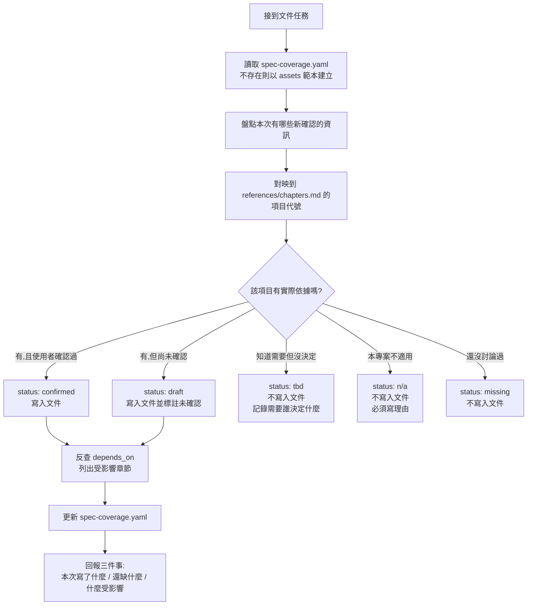

# 軟體規格書撰寫指南

## 核心思想

**只寫已經確認的內容；未確認的東西用「狀態」表達，不用「文字」填滿。**

規格文件的價值不在於完整，而在於**可信**。一份有 10 章但每章都是真實決策的文件，遠勝過一份有 40 章、其中 30 章是推測的文件 —— 因為後者的讀者（人或 Agent）無法分辨哪些是決定、哪些是猜測，只能全部照做。

這份 Skill 的目的，是讓「文件涵蓋度」與「文件內容」分離：
- **內容**寫進規格文件，只放確認過的東西
- **涵蓋度**寫進 `spec-coverage.yaml`，記錄那 40 個考量項目各自的狀態

---

## 本 Skill 的用語

以下是這份 Skill 自訂的詞彙，不是業界通用術語，遇到時一律照這裡的定義理解：

| 用語 | 意思 |
|---|---|
| **考量項目** | `references/chapters.md` 裡的 40 個主題。是規劃時要想過的範圍，**不是**文件目錄 |
| **項目代號** | `S01`–`S40`，每個考量項目的永久編號。章節合併或搬移都不改變 |
| **涵蓋度** | 40 個考量項目各自的處理狀態，記在 `spec-coverage.yaml`。與「文件內容」是兩回事 |
| **五種狀態** | `confirmed` / `draft` / `tbd` / `n/a` / `missing`，見下方〈五種狀態〉 |
| **寫入觸發器** | 「發生什麼事就該補哪一項文件」的對照規則，見下方同名章節 |
| **Gate** | 唯一的硬性關卡：沒有 `FR` 與 `AC` 就不准寫該功能的程式碼 |
| **反查影響** | 修改某項後，找出所有 `depends_on` 包含它的檔案並列出清單的動作 |
| **唯一歸屬** | 同一主題只在一個項目正式描述，其他地方只放連結。見 `references/conventions.md` |
| **空殼章節** | 標題存在但內容是「本章暫無」「待補充」的章節。本 Skill 禁止產生 |
| **憑空生成** | 使用者沒說過、也無其他依據，但被寫得像已確認的內容。本 Skill 最主要要防的失誤 |

至於 `frontmatter`、`Mermaid`、`DLQ`、`PII`、`RBAC`、`RPO/RTO` 這類業界通用術語，需要時查 `references/glossary.md`，正文不重複解釋。

---

## 三條鐵則

### 鐵則 1：不得憑空生成

沒有依據的內容不能寫進文件正文。

你會很自然地想把一個章節「補完整」—— 使用者只說了要有會員系統，你就順手寫出會員狀態、密碼規則、登入流程。**不要這樣做。** 憑空生成的架構決策，外觀和真實決策一模一樣，後續讀者無法分辨，Agent 更會直接照著實作。

沒有依據時，正確做法是在 `spec-coverage.yaml` 標記 `tbd` 並寫明「需要誰決定什麼」，而不是在文件裡寫一段看起來合理的內容。

### 鐵則 2：考量清單 ≠ 文件目錄

`references/chapters.md` 裡的 40 個項目是**撰寫與規劃時要考量的範圍**，不是每份文件都要有的 40 個章節。

實際產出文件時：
- 只輸出**有實際內容**的項目
- 相鄰且內容都很少的項目**可以合併**成一章（合併規則見 `references/conventions.md`）
- 沒有內容的項目**不要出現在文件裡**，改為在 `spec-coverage.yaml` 記錄狀態

嚴禁產出「本章暫無」「待補充」「（略）」這類空殼章節。

### 鐵則 3：每次寫入都要更新涵蓋度並反查影響

任何一次文件寫入或修改，都必須完成三件事：
1. 更新 `spec-coverage.yaml` 中對應項目的狀態
2. 反查 frontmatter 的 `depends_on`，找出哪些章節依賴這次被改動的內容
3. 在回應中輸出「受影響章節清單」

第 3 點是逐步累積模式的核心。一次性產出的文件內部至少自洽；逐步累積的文件必然出現「資料庫改了但 API 規格還是舊的」，而 Agent 讀到矛盾規格時不會報錯，只會挑一個照做。**不要自動修正受影響章節**（會失控），但必須讓問題浮出來。

---

## 標準工作流程



### 每次任務結束時的回報格式

一律用這個格式收尾，不要只說「文件已更新」：

```
本次寫入
  S08 業務規則      confirmed  → 02-business-design.md（新增 BR-004 ~ BR-007）
  S11 功能需求      draft      → 02-business-design.md（FR-012，AC 尚未確認）

受影響（depends_on 反查）
  S23 API 規格      API-005 的錯誤回應可能與新增的 BR-006 衝突，建議複查
  S38 測試策略      FR-012 尚無對應測試案例

仍缺（需要你決定）
  S21 Cache 策略    是否引入 Redis？影響 S13 架構圖
  S28 合規與隱私    尚未界定哪些欄位屬個資
```

---

## 寫入觸發器：什麼時候該補文件

**不要用「開發流程的階段」決定何時寫哪一項。** 這裡的「階段」指的是瀑布式流程的推進階段 —— 需求分析 → 系統設計 → 實作 → 測試 —— 也就是「現在是設計階段，所以這輪把 S13～S22 一次寫完」這種做法。它在 AI 協作開發下一定會失效，因為實際開發不是線性推進的：實作到一半才發現業務規則有洞、寫測試時才確認驗收標準，都是常態。

改用**事件**觸發 —— 某件事發生了，就記下對應的項目：

| 發生了什麼 | 觸發寫入 | 產生的 ID |
|---|---|---|
| 做出技術選型或架構決策 | S35 架構決策紀錄 | `ADR-xxx` |
| 確認一條不可違反的商業邏輯 | S08 業務規則 | `BR-xxx` |
| 需求被討論並確認 | S11 功能需求 + 驗收標準 | `FR-xxx` / `AC-xxx` |
| 定義或修改實體的狀態流轉 | S09 狀態機 | — |
| 發現外部限制（API 限額、平台政策、法規） | S06 假設限制與風險 | — |
| 確認效能／可用性等量化目標 | S29 非功能需求 | `NFR-xxx` |
| 新增或修改對外介面 | S23 API 規格 | `API-xxx` |
| 某個 TBD 被解決 | 對應項目，並從 TBD 清單移除 | — |
| **準備寫某功能的程式碼** | **Gate：見下方** | — |

> **這條規則不代表項目之間沒有先後順序。** 順序依然存在，但它來自**內容依賴**，不是來自流程階段：S18 模型選型沒定，S39 的評測基準就無從寫起；S11 功能需求不存在，就不該動手寫該功能的程式碼。差別在於 —— 依賴關係決定「A 必須先於 B」，而不是由日曆或流程階段決定「這週該寫哪幾章」。依賴關係查 `references/conventions.md` 的常見依賴鏈。

### Gate：唯一的硬性關卡

**動手寫任何功能的程式碼之前，該功能的 `FR-xxx` 與 `AC-xxx` 必須已存在，且 status 至少為 `draft`。**

若不存在：停下來，先補 FR 與 AC 並請使用者確認，不要一邊寫程式一邊補規格。

其他項目全部是「發生就記」，只有這一條是「沒有就不准動手」。這樣既保證程式碼永遠有規格可對應，又不要求規格提前寫完。

---

## 五種狀態

`spec-coverage.yaml` 中每個項目只能是以下五種之一：

| 狀態 | 意義 | 是否寫入文件 | 額外要求 |
|---|---|---|---|
| `confirmed` | 使用者明確確認過 | ✅ 是 | 記錄對應檔案與錨點 |
| `draft` | 有初步內容但未經確認 | ✅ 是，並標註未確認 | 記錄還缺什麼 |
| `tbd` | 知道需要，但尚未決定 | ❌ 否 | **必須寫「需要誰決定什麼」** |
| `n/a` | 本專案不適用 | ❌ 否 | **必須寫理由** |
| `missing` | 尚未討論過 | ❌ 否 | 由你主動標記，提醒使用者 |

`n/a` 與 `tbd` 強制寫理由，是為了同時擋住兩個方向的偷懶：既防止為了省事亂跳過，也防止為了看起來完整而硬生內容。

`missing` 是你的職責 —— 使用者不會知道自己漏了什麼，主動標記是這份 Skill 的主要價值之一。

---

## 參考文件

需要時再讀，不要一次全部載入：

| 檔案 | 什麼時候讀 |
|---|---|
| `references/chapters.md` | 每次產出或更新文件時。40 個考量項目的完整清單與各項要點 |
| `references/conventions.md` | 建立新文件、決定檔案結構、指派 ID、處理章節合併或 depends_on 時 |
| `references/coverage.md` | 建立或更新 `spec-coverage.yaml` 時。含完整 schema 與範例 |
| `references/glossary.md` | 業界通用術語的中文說明。Agent 通常不需要讀；用於向非技術成員解釋文件內容時 |
| `assets/spec-coverage.template.yaml` | 專案第一次建立涵蓋度檔案時直接複製 |

---

## 決策速查表

| 問題 | 答案 |
|---|---|
| 使用者只給了片段資訊，要不要補完整？ | ❌ 不要。標 `tbd` 或 `missing` |
| 某個章節沒內容，要寫「本章暫無」嗎？ | ❌ 不要。不出現在文件裡，只出現在 coverage |
| 兩個項目內容都很少，可以合併嗎？ | ✅ 可以，但**項目 ID 不能變**，合併規則見 conventions.md |
| 驗收標準要獨立成章嗎？ | ❌ 不要。AC 貼在對應的 FR 旁邊 |
| 版本紀錄要放附錄嗎？ | ❌ 不要。放每個檔案的 frontmatter |
| 圖要用 png 還是 Mermaid？ | Mermaid。Agent 讀不懂圖片，且圖文必定不同步 |
| 業務規則要用條列散文還是表格？ | 表格或 YAML，每條有 ID |
| 改了資料庫設計，要順便改 API 規格嗎？ | ❌ 不要自動改。反查 depends_on，列出受影響清單讓人決定 |
| 沒有 FR 可以先寫程式嗎？ | ❌ 不行。Gate 規則 |
| coverage 檔案要每次重建嗎？ | ❌ 不要。它是常駐檔案，只做增量更新 |
| 使用者說「這個不用做」，該怎麼記？ | `n/a` + 理由，不要直接刪掉項目 |
| 找不到對應的項目代號怎麼辦？ | 先看 chapters.md 是否有語意相近的；真的沒有才提議新增，不要自創代號 |

---

## 常見錯誤

- ❌ 把 40 個項目當成文件目錄逐章產出 → 只輸出有內容的項目
- ❌ 產出「本章暫無」「待補充」的空殼章節 → 改記在 coverage 的狀態
- ❌ 使用者沒說的內容自行補完 → 標 `tbd` 並寫明需要誰決定什麼
- ❌ 把推測寫得像已決定（沒有任何標記） → 至少要標 `draft`
- ❌ 寫完文件但沒更新 `spec-coverage.yaml` → 兩者必須同一次任務內完成
- ❌ 改了章節但沒反查 `depends_on` → 逐步累積模式下這是最大的失效來源
- ❌ 自動修正受影響章節 → 只列出清單，由使用者決定
- ❌ 合併章節時重新編號 ID → ID 一旦發出永不變更、永不重用
- ❌ 把驗收標準集中放在文件最後 → AC 要貼在對應的 FR 旁邊
- ❌ 全域維護一份 Revision History → 改用每檔 frontmatter 的 version / last_updated
- ❌ 用 png / jpg 放架構圖與流程圖 → 一律 Mermaid
- ❌ 沒有 FR 與 AC 就開始寫功能程式碼 → 違反 Gate 規則
- ❌ 同一個主題在多個章節重複描述 → 指定唯一歸屬，其他地方只放交叉連結
- ❌ 把這份考量清單放進 `software-spec/` 目錄 → 它是 Skill，不是專案文件，放進去會誘發填空行為
