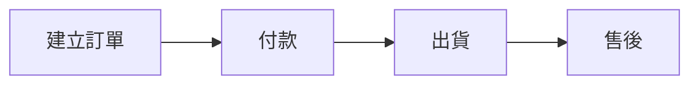

# 考量項目清單（41 項）

這是**撰寫與規劃時要考量的範圍**，不是文件目錄。實際產出文件時只輸出有內容的項目。

項目代號 `S01`–`S41` 是每個主題的識別碼。變更代號需要人類授權，規則見 `SKILL.md`〈項目代號的變更〉。

## 分層原則

排序是**由高抽象層級到低抽象層級**、由大範圍到小範圍。每一層都建立在前一層的結論之上 —— 不知道要解決什麼問題，就不該決定用什麼資料庫。

| 篇 | 層級 | 回答的問題 | 項目 |
|---|---|---|---|
| 一 | Business 商業層 | 為什麼要做 | S01–S06 |
| 二 | Business Design 業務層 | 真實世界怎麼運作 | S07–S11 |
| 三 | Requirements & Constraints 需求與約束層 | 系統必須達成什麼、在什麼條件下 | S12–S16 |
| 四 | System Design 系統層 | 系統由什麼組成 | S17–S22 |
| 五 | Interface Design 介面層 | 系統邊界如何互動 | S23–S26 |
| 六 | Implementation 實作層 | 具體怎麼實現 | S27–S32 |
| 七 | Infrastructure & Operations 基礎架構與運行層 | 如何運行與維持 | S33–S36 |
| 八 | Quality Assurance 品質層 | 如何驗證 | S37–S38 |
| 九 | Records 紀錄 | 跨層的決策與規範 | S39–S41 |

**第九篇不是抽象層級**，是跨層的紀錄集合。ADR 記的決策橫跨架構、資料、基建，開發規範也一樣 —— 它們不比第七篇更具體，只是不屬於任何一層。因此第九篇不參與依賴方向的排序檢查。

依賴方向規則見 `conventions.md`〈依賴方向〉：**較早的篇不得依賴較晚的篇。**

---

# 第一篇 Business（商業層）

## S01 專案背景

為什麼要做這個專案。專案起源、市場背景、問題描述、現況分析、專案願景。

## S02 名詞定義（Glossary）

建立專案共同語言。專有名詞、業務術語、Entity 定義、狀態名稱、縮寫。

> **與 S08 的關係**：Glossary 的 Entity 名稱必須與業務資料模型一致。若兩邊出現不同名稱（Glossary 寫 Member、資料表叫 users），這是必須立刻消除的歧異 —— Agent 會把它們當成兩個不同的東西。

| 名詞 | 英文 | 定義 | 對應 Entity |
|---|---|---|---|
| 會員 | Member | 在系統註冊並擁有帳號者 | `members` |
| 購買人 | Customer | 實際下單付款者，不一定是會員 | `customers` |

## S03 使用者痛點分析

Persona、User Journey、Pain Point、Opportunity。

## S04 專案目標

定義成功的標準，拆成三層：Business Goal（客服成本降低 50%）、Product Goal（AI 回覆率 80%）、Technical Goal（API 回應 < 300ms）。

> 量化目標若涉及系統行為，同時要在 S14 建立對應的 `NFR-xxx`。

## S05 商業模式

Value Proposition、收費模式、利害關係人、收益來源、成本結構。

## S06 假設、限制與風險

**這一項是防止 Agent 腦補的主要防線，也是被引用次數最多的項目**，因此排在最前面 —— 幾乎每一篇都需要引用它，放得越早，能合法引用它的篇章越多。

分四類記錄：

- **Assumptions**：目前假設為真、但未經驗證的前提
- **Constraints**：不可協商的限制（時程、預算、既有系統、平台限制如第三方 API 限額或審核政策、法規要求）
- **Open Questions / TBD**：明確標示的未定事項。Agent 遇到這些主題應停下來詢問，而非自行決定
- **Risks**：已識別的風險與應對方向

**每條一行**，不寫由來與討論經過：

| 類別 | ID | 內容 | 備註 |
|---|---|---|---|
| Constraint | C-001 | 第三方 API 每分鐘 60 次 | 影響 S25、S30 |
| Assumption | A-001 | 單日訊息量不超過 5 萬則 | 未驗證 |
| Risk | R-001 | 第三方 API 政策變更導致整合失效 | 保留手動接手流程 |

Open Questions 與 `spec-coverage.yaml` 中的 `tbd` 項目應保持一致。

> **與 S16 的分工**：這裡放**外部給定**的限制（法規、既有系統、預算）；S16 放**我們自己選擇技術方案後產生**的限制（選了 Lambda 所以有執行時間上限）。

---

# 第二篇 Business Design（業務層）

## S07 業務流程

先定義真實世界如何運作，與 S19 系統流程明確區隔。業務流程圖、泳道圖、正常流程、異常流程。

一律用 Mermaid：



## S08 業務資料模型

業務 Entity 與彼此的關係。這是**概念層**的資料模型，與 S27 資料庫設計（實體層）分屬不同抽象層級 —— 這裡談「訂單有哪些屬性、與顧客是什麼關係」，不談索引、外鍵、分割。

名稱必須與 S02 Glossary 一致。排在業務規則之前，因為規則與狀態機都會引用這些 Entity。

## S09 業務規則（BR-）

所有不能違反的商業邏輯。每條必須有 ID，且用表格而非散文：

| ID | 規則 | 適用範圍 | 違反時行為 |
|---|---|---|---|
| BR-001 | 付款成功才能建立 Invoice | 訂單 | 拒絕，回傳 409 |
| BR-002 | 退款每筆訂單只能執行一次 | 退款 | 拒絕，回傳 422 |

「違反時行為」欄位常被省略，但它是 Agent 實作錯誤處理時唯一的依據，不要省。

## S10 狀態機定義

只定義狀態名稱不夠 —— 必須定義**允許的轉換**。這是 bug 密度最高的區域，也是 Agent 最容易自行發明規則的地方。

每個有狀態的 Entity 一張表：

| 從 | 到 | 觸發者 | 前置條件 |
|---|---|---|---|
| `pending` | `paid` | 金流 webhook | 金額相符 |
| `paid` | `shipped` | 倉管人員 | 庫存已扣 |
| `paid` | `refunded` | 客服主管 | BR-002 未曾退款 |

**未列出的轉換一律視為禁止**，這一句要寫進文件。

## S11 角色定義（業務層）

Role 是誰、負責什麼業務職責。與 S20 權限矩陣分開：這裡定義**角色是什麼**，S20 定義**能操作什麼**。

---

# 第三篇 Requirements & Constraints（需求與約束層）

這一層回答兩件事：系統**必須達成什麼**（S12–S14），以及**在什麼條件下達成**（S15–S16）。

它是業務層與系統層之間的橋梁。缺了這一層，系統設計會直接跳接業務設計，導致約束條件出現在它所約束的決策之後 —— 等於沒有約束力。

## S12 系統定位與範圍

In Scope / Out of Scope / 人工流程 / 系統流程 / AI 流程。明確標示哪些業務交給系統、哪些仍由人工處理。

## S13 功能需求與驗收標準（FR- / AC-）

**這是整份規格的骨幹。** 沒有它，就沒有任何地方能回答「FR-014 是什麼？誰實作？在哪驗收？」

每項功能一個區塊，AC 必須貼在對應 FR 旁邊（不要集中到文件最後 —— 對 Agent 而言 context 的鄰近性直接影響正確率）。**描述 1–3 句即可**，細節靠 AC 表達：

```markdown
### FR-012 自動回覆未讀訊息

**描述**：當顧客訊息超過 N 分鐘未被真人回覆，由 AI 產生回覆。
**相關規則**：BR-006、BR-009
**對應模組**：AI 回覆模組（S18）
**對應介面**：API-005

**驗收標準**
- AC-012-1
  Given 一則顧客訊息已建立且狀態為 unread
  When 超過設定的等待時間
  Then 系統產生 AI 回覆並將狀態改為 auto_replied
- AC-012-2
  Given AI 服務回應逾時
  When 重試達上限
  Then 訊息轉為 pending_human 並通知值班人員
```

AC 用 Given / When / Then 或等價格式，讓人與 Agent 依同一標準驗收。

## S14 非功能需求（NFR-）

Performance、Availability、Scalability、Reliability、Maintainability、Accessibility、i18n、Concurrency、SLA／SLO。

每條給 `NFR-xxx` 並量化 —— 沒有數字的 NFR 無法驗收，也無法約束下游設計。

> NFR 與 FR 是同一層級的兄弟，兩者必須相鄰。把 NFR 放到基礎架構篇是常見錯誤：效能與可用性目標必須在架構決定**之前**就存在。

## S15 合規與隱私要求

法遵面的**要求**（技術實作在 S32）：

- PII 欄位界定（哪些欄位屬個人資料）
- 資料分級
- 保存期限與刪除政策
- 適用法規（個資法；有跨境則含 GDPR）
- 稽核與存取紀錄的**要求**
- 資料落地與跨境傳輸限制（會約束 S16 的區域選擇）

> **唯一歸屬**：Audit Log 的**要求**寫在這裡，S35 只放**實作方式**。

## S16 運行平台與技術選型約束

**這一項存在的理由**：平台選擇會反向約束系統設計。Serverless 與常駐容器會導出完全不同的架構 —— 無狀態要求、執行時間上限、冷啟動、連線池能不能用、部署單位怎麼切。這些不是部署細節，是架構的前提。

只放**會約束上游的事實與限制**，不放選擇的理由（理由寫成 ADR，見 S39）：

- 雲端供應商與運算模型（Lambda / ECS / EC2 / Cloudflare Workers 等）
- 由此導出的硬限制：執行時間上限、記憶體上限、冷啟動、是否強制無狀態、連線數與連線池限制、部署單位大小
- 區域選擇與資料落地（承接 S15 的合規要求）
- 成本模型：按請求計費 vs 常駐計費 —— 這會直接改變架構取捨
- 供應商鎖定程度與退出路徑

> **與 S33 部署架構的分工**：這裡放**選了什麼、因此不能做什麼**；S33 放**怎麼部署、怎麼發版、怎麼回滾**。
>
> **現實中平台與架構是來回迭代決定的**，文件順序不等於思考順序。但文件必須記錄「平台已定 → 架構據此設計」這個依賴方向，這樣日後換平台時，反查影響才能正確標出所有受衝擊的章節。

---

# 第四篇 System Design（系統層）

## S17 系統整體架構

架構圖、元件關係、外部系統、部署拓樸。用 Mermaid，不用 png。

架構決策的**理由**寫成 ADR（S39），這裡只放結論。

## S18 系統模組設計

拆解系統功能。每個 Module 說明：功能、職責、邊界、相依關係。

## S19 系統流程

軟體內部如何運作（登入 → Frontend → API → Cache → DB），與 S07 業務流程明確區隔。

## S20 權限矩陣（RBAC）

Role × Permission 的存取矩陣。角色本身的業務定義在 S11。

## S21 失敗語意與一致性策略

系統層級的失敗行為定義。這一項在多數規格書中缺席，卻是分散式與整合型系統最容易出事的地方：

- **冪等性**：哪些操作可安全重試，用什麼 key 判重
- **重試策略**：次數、退避方式、哪些錯誤才重試
- **補償交易**：外部呼叫已送出但後續失敗時如何反向操作
- **部分失敗**：多步驟流程中途失敗的處理方式
- **降級行為**：外部服務或 AI 不可用時系統該表現成什麼樣子

> **唯一歸屬**：Retry / DLQ 相關規則寫在這裡，S24 與 S30 只放交叉連結，不要重複描述。

## S22 AI 元件設計

**產品本身含 AI 功能時才需要**（若 AI 只是開發工具而非產品組成，標 `n/a`）。

- 模型選型與版本策略
- Prompt 管理與版本控制
- 評估標準：準確率、幻覺率，以及 S04 的量化目標如何量測
- Human-in-the-loop：升級真人的觸發條件
- Guardrails 與禁止行為
- Token 成本與流量控制
- 資料送往第三方 LLM 的隱私邊界（承接 S15）

---

# 第五篇 Interface Design（介面層）

介面是系統對外的契約，影響範圍大於內部實作，因此排在實作層之前。API 設計應由功能需求驅動，不該由資料表結構驅動。

## S23 API 規格（API-）

REST / GraphQL / Webhook、認證方式、錯誤碼、版本策略。每個端點給 `API-xxx` 並註明對應的 `FR-xxx`。

> **唯一歸屬**：錯誤碼定義在這裡，S40 開發規範只放命名慣例，不重列錯誤碼。

## S24 Event 與訊息設計

Event schema、Queue、Pub/Sub、訂閱關係。Retry 與 DLQ 規則交叉引用 S21。

## S25 第三方整合

外部服務清單、認證方式、限額、失敗行為、沙盒環境。

> 發現的外部限制要**往上登記到 S06**，不要只寫在這裡 —— 否則早篇無法合法引用。

## S26 UI／UX 規劃

Sitemap、User Flow、Wireframe、畫面清單、欄位規則。

> 建議與系統規格分開管理，本項保留為索引與關聯，避免業務規格反向依賴畫面設計。

---

# 第六篇 Implementation（實作層）

## S27 資料庫設計

ER Diagram、Table、Index、Constraint、FK、Partition。概念層的實體關係在 S08。

## S28 Cache 與資料同步策略

快取層、失效策略、讀寫策略、同步機制、一致性等級。效能目標承接 S14。

## S29 資料遷移與轉換

取代既有系統或變更 schema 時的遷移計畫：來源、對映、backfill、驗證方式、回滾方式。

> **與 S33 的分工**：這裡是**資料怎麼搬**，S33 是**什麼時候跑**。

## S30 批次任務與背景作業

Cron、Scheduler、Event Trigger、逾時。Retry 與 DLQ 交叉引用 S21。

## S31 檔案與媒體管理

上傳、儲存、影像處理、CDN、病毒掃描、保存政策。

## S32 系統安全實作

Authentication、Authorization、加密、OWASP、Rate Limit、Secret 管理。

合規面的**要求**在 S15，這裡只放**實作方式**。

---

# 第七篇 Infrastructure & Operations（基礎架構與運行層）

平台選型與由此產生的約束在 S16。這一篇放的是**怎麼部署、怎麼維持運行**。

## S33 部署架構

環境（Dev / Test / UAT / Production）、CI/CD、Rollback、Feature Flag、Migration 執行時機、IaC。

## S34 備份與災難復原

Backup Policy、Restore Procedure、RPO、RTO、HA、Failover。

## S35 觀測與監控

Logging、Metrics、Tracing、Dashboard、Alert、Error Tracking、Health Check、Runbook。

> **唯一歸屬**：Audit Log 的**實作**寫在這裡，要求在 S15。

## S36 設定與環境變數清單

每個設定項：名稱、用途、預設值、適用環境、是否敏感。Agent 部署或除錯時最常缺的就是這張表。

---

# 第八篇 Quality Assurance（品質層）

驗收標準不在這裡 —— 它貼在 S13 的各項功能旁邊。這一篇只放**跨功能的品質策略**。

## S37 測試策略

Unit / Integration / E2E / Security / Performance / Regression 的範圍與責任分工、覆蓋率目標、測試資料策略、Definition of Done。

## S38 AI 評測

**產品含 AI 功能時才需要**，與傳統測試不同：需要 eval set、評分方式、回歸基準線、可接受的品質下限、上線前的評測門檻。

---

# 第九篇 Records（紀錄，跨層）

本篇不參與依賴方向排序 —— 它記錄的內容橫跨所有層級。

## S39 架構決策紀錄（ADR-）

記錄重大技術決策**與原因**，而非只記錄最終方案。每則包含：背景、決策內容、考慮過的替代方案、採用原因、影響範圍、狀態（proposed / accepted / superseded）。

**單則以一頁為上限**（篇幅標準見 `SKILL.md`〈寫法與篇幅〉）。ADR 的作用是防止決策被反覆推翻，不是保存討論過程 —— 背景 2–3 句、每個替代方案一行、採用原因 2–3 句就夠。

```markdown
# ADR-004 使用 ECS 而非 Lambda

**狀態**：accepted ｜ **日期**：2026-08-17

**背景**
訊息處理需長時間持有資料庫連線，且尖峰時段流量穩定。

**決策**
運算層採用 ECS Fargate。

**替代方案**
- Lambda —— 無法維持連線池，且單次執行時間上限不足
- EC2 —— 需自行管理主機，維運成本不划算

**原因**
常駐容器可使用連線池，流量穩定時成本低於按次計費。

**影響**：S16、S17、S21、S33
```

被取代的 ADR 標為 `superseded` 並指向新的，**不要刪除** —— 決策的演變本身就是重要資訊。

> **方向注意**：ADR 依賴它所解釋的章節，不是反過來。S17 架構陳述結論，ADR 解釋為什麼；架構章節寫「見 ADR-003」是閱讀導引，不構成 `depends_on`。

## S40 開發規範

Repository 結構、Coding Style、Branch 策略、Commit 慣例、API 命名、錯誤處理慣例、Logging 慣例。

## S41 參考資料

外部文件、第三方 API 文件、法規、設計規範、相關研究。

> **版本紀錄不放這裡。** 模組化拆檔後，全域 Revision History 必然過期而變成假資訊。改用每個檔案 frontmatter 的 `version` / `last_updated` / `owner`（見 `conventions.md`）。
