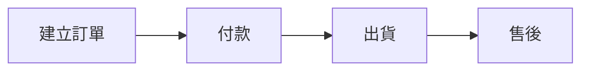

# 考量項目清單（40 項）

這是**撰寫與規劃時要考量的範圍**，不是文件目錄。實際產出文件時只輸出有內容的項目。
項目代號（`S01`–`S40`）永久固定，即使章節被合併或搬移也不變 —— `spec-coverage.yaml` 靠它對應。

## 目錄

| 篇 | 範圍 | 項目 |
|---|---|---|
| 一 | Business 商業規劃 | S01–S06 |
| 二 | Business Design 業務設計 | S07–S12 |
| 三 | System Design 系統設計 | S13–S18 |
| 四 | Data Design 資料設計 | S19–S22 |
| 五 | Interface Design 介面設計 | S23–S26 |
| 六 | Infrastructure 基礎架構 | S27–S34 |
| 七 | Engineering 工程管理 | S35–S37 |
| 八 | Quality Assurance 品質保證 | S38–S39 |
| 九 | Appendix 附錄 | S40 |

排序原則是**由商業到技術**，不是依部門切分。每一層都建立在上一層的結論之上：不知道要解決什麼問題，就不該決定用什麼資料庫。

---

# 第一篇 Business（商業規劃）

## S01 專案背景

為什麼要做這個專案。專案起源、市場背景、問題描述、現況分析、專案願景。

## S02 名詞定義（Glossary）

建立專案共同語言。專有名詞、業務術語、Entity 定義、狀態名稱、縮寫。

> **與 S19 的關係**：Glossary 的 Entity 名稱必須與資料模型一致。若兩邊出現不同名稱（例如 Glossary 寫 Member、資料表叫 users），這是必須立刻消除的歧異 —— Agent 會把它們當成兩個不同的東西。

範例格式：

| 名詞 | 英文 | 定義 | 對應 Entity |
|---|---|---|---|
| 會員 | Member | 在系統註冊並擁有帳號者 | `members` |
| 購買人 | Customer | 實際下單付款者，不一定是會員 | `customers` |

## S03 使用者痛點分析

Persona、User Journey、Pain Point、Opportunity。

## S04 專案目標

定義成功的標準，拆成三層：Business Goal（客服成本降低 50%）、Product Goal（AI 回覆率 80%）、Technical Goal（API 回應 < 300ms）。

> 量化目標若涉及系統行為，同時要在 S29 建立對應的 `NFR-xxx`。

## S05 商業模式

Value Proposition、收費模式、利害關係人、收益來源、成本結構。

## S06 假設、限制與風險

**這一項是防止 Agent 腦補的主要防線。** 分四類記錄：

- **Assumptions**：目前假設為真、但未經驗證的前提
- **Constraints**：不可協商的限制（時程、預算、技術棧、平台限制如第三方 API 限額或審核政策、法規要求）
- **Open Questions / TBD**：明確標示的未定事項。Agent 遇到這些主題應停下來詢問，而非自行決定
- **Risks**：已識別的風險與應對方向

Open Questions 與 `spec-coverage.yaml` 中的 `tbd` 項目應保持一致。

---

# 第二篇 Business Design（業務設計）

## S07 業務流程

先定義真實世界如何運作，與 S16 系統流程明確區隔。業務流程圖、泳道圖、正常流程、異常流程。

一律用 Mermaid：



## S08 業務規則（BR-）

所有不能違反的商業邏輯。每條規則必須有 ID，且用表格而非散文：

| ID | 規則 | 適用範圍 | 違反時行為 |
|---|---|---|---|
| BR-001 | 付款成功才能建立 Invoice | 訂單 | 拒絕，回傳 409 |
| BR-002 | 退款每筆訂單只能執行一次 | 退款 | 拒絕，回傳 422 |

「違反時行為」欄位常被省略，但它是 Agent 實作錯誤處理時唯一的依據，不要省。

## S09 狀態機定義

只定義狀態名稱不夠 —— 必須定義**允許的轉換**。這是 bug 密度最高的區域，也是 Agent 最容易自行發明規則的地方。

每個有狀態的 Entity 都要有一張表：

| 從 | 到 | 觸發者 | 前置條件 |
|---|---|---|---|
| `pending` | `paid` | 金流 webhook | 金額相符 |
| `paid` | `shipped` | 倉管人員 | 庫存已扣 |
| `paid` | `refunded` | 客服主管 | BR-002 未曾退款 |

**未列出的轉換一律視為禁止**，這一句要寫進文件。

## S10 系統定位與範圍

In Scope / Out of Scope / 人工流程 / 系統流程 / AI 流程。明確標示哪些業務交給系統、哪些仍由人工處理。

## S11 功能需求與驗收標準（FR- / AC-）

**這是整份規格的骨幹，也是最常被遺漏的一項。** 沒有它，就沒有任何地方能回答「FR-014 是什麼？誰實作？在哪驗收？」

每項功能一個區塊，AC 必須貼在對應 FR 旁邊（不要集中到文件最後 —— 對 Agent 而言 context 的鄰近性直接影響正確率）：

```markdown
### FR-012 自動回覆未讀訊息

**描述**：當顧客訊息超過 N 分鐘未被真人回覆，由 AI 產生回覆。
**相關規則**：BR-006、BR-009
**對應模組**：AI 回覆模組（S14）
**對應介面**：API-005

**驗收標準**
- AC-012-1
  Given 一則顧客訊息已建立且狀態為 unread
  When 超過設定的等待時間
  Then 系統產生 AI 回覆並將狀態改為 auto_replied
- AC-012-2
  Given AI 服務回應逾時
  When 重試達上限
  Then 訊息轉為 pending_human 並通知值班人員
```

AC 用 Given / When / Then 或等價格式，讓人與 Agent 依同一標準驗收。

## S12 角色定義（業務層）

Role 是誰、負責什麼業務職責。與 S15 權限矩陣分開：這裡定義**角色是什麼**，S15 定義**能操作什麼**。

---

# 第三篇 System Design（系統設計）

## S13 系統整體架構

架構圖、元件關係、外部系統、Cloud 架構。用 Mermaid，不用 png。

## S14 系統模組設計

拆解系統功能。每個 Module 說明：功能、職責、邊界、相依關係。

## S15 權限矩陣（RBAC）

Role × Permission 的存取矩陣。角色本身的業務定義在 S12。

## S16 系統流程

軟體內部如何運作（登入 → Frontend → API → Cache → DB），與 S07 業務流程明確區隔。

## S17 失敗語意與一致性策略

系統層級的失敗行為定義。這一項在多數規格書中缺席，但它是分散式與整合型系統最容易出事的地方：

- **冪等性**：哪些操作可安全重試，用什麼 key 判重
- **重試策略**：次數、退避方式、哪些錯誤才重試
- **補償交易**：外部呼叫已送出但後續失敗時如何反向操作
- **部分失敗**：多步驟流程中途失敗的處理方式
- **降級行為**：外部服務或 AI 不可用時系統該表現成什麼樣子

> **唯一歸屬**：Retry / DLQ 相關規則寫在這裡，S24 與 S30 只放交叉連結，不要重複描述。

## S18 AI 元件設計

**產品本身含 AI 功能時才需要**（若 AI 只是開發工具而非產品組成，標 `n/a`）。

- 模型選型與版本策略
- Prompt 管理與版本控制
- 評估標準：準確率、幻覺率，以及 S04 的量化目標如何量測
- Human-in-the-loop：升級真人的觸發條件
- Guardrails 與禁止行為
- Token 成本與流量控制
- 資料送往第三方 LLM 的隱私邊界（與 S28 交叉引用）

---

# 第四篇 Data Design（資料設計）

## S19 業務資料模型

業務 Entity 與關係。名稱必須與 S02 Glossary 一致。

## S20 資料庫設計

ER Diagram、Table、Index、Constraint、FK、Partition。

## S21 Cache 與資料同步策略

快取層、失效策略、讀寫策略、同步機制、一致性等級。

## S22 資料遷移與轉換

取代既有系統或變更 schema 時的遷移計畫：來源、對映、backfill、驗證方式、回滾方式。與 S32 的 migration 執行機制分開 —— 這裡是**資料怎麼搬**，S32 是**什麼時候跑**。

---

# 第五篇 Interface Design（介面設計）

## S23 API 規格（API-）

REST / GraphQL / Webhook、認證方式、錯誤碼、版本策略。每個端點給 `API-xxx` 並註明對應的 `FR-xxx`。

> **唯一歸屬**：錯誤碼定義在這裡，S36 開發規範只放命名慣例，不重列錯誤碼。

## S24 Event 與訊息設計

Event schema、Queue、Pub/Sub、訂閱關係。Retry 與 DLQ 規則交叉引用 S17。

## S25 第三方整合

外部服務清單、認證方式、限額、失敗行為、沙盒環境。每個整合都應記錄其限制（同時進 S06 Constraints）。

## S26 UI／UX 規劃

Sitemap、User Flow、Wireframe、畫面清單、欄位規則。

> 建議與系統規格分開管理，本項保留為索引與關聯，避免業務規格反向依賴畫面設計。

---

# 第六篇 Infrastructure（基礎架構）

## S27 系統安全與防護

Authentication、Authorization、加密、OWASP、Rate Limit、Secret 管理。

## S28 合規與隱私

S27 是技術面，這一項是法遵面：

- PII 欄位界定（哪些欄位屬個人資料）
- 資料分級
- 保存期限與刪除政策
- 適用法規（個資法；有跨境則含 GDPR）
- 稽核與存取紀錄要求

> **唯一歸屬**：Audit Log 的**要求**寫在這裡，S34 只放**實作方式**。

## S29 非功能需求（NFR-）

Performance、Availability、Scalability、Reliability、Maintainability、Accessibility、i18n、Concurrency、SLA／SLO。每條給 `NFR-xxx` 並量化 —— 沒有數字的 NFR 無法驗收。

## S30 批次任務與背景作業

Cron、Scheduler、Event Trigger、逾時。Retry 與 DLQ 交叉引用 S17。

## S31 檔案與媒體管理

上傳、儲存、影像處理、CDN、病毒掃描、保存政策。

## S32 部署架構

環境（Dev / Test / UAT / Production）、CI/CD、Rollback、Feature Flag、Migration 執行時機。

## S33 備份與災難復原

Backup Policy、Restore Procedure、RPO、RTO、HA、Failover。

## S34 觀測與監控

Logging、Metrics、Tracing、Dashboard、Alert、Error Tracking、Health Check、Runbook。

---

# 第七篇 Engineering（工程管理）

## S35 架構決策紀錄（ADR-）

記錄重大技術決策**與原因**，而非只記錄最終方案。每則 ADR 包含：背景、決策內容、考慮過的替代方案、採用原因、影響範圍、狀態（proposed / accepted / superseded）。

被取代的 ADR 標為 `superseded` 並指向新的，**不要刪除** —— 決策的演變本身就是重要資訊。

## S36 開發規範

Repository 結構、Coding Style、Branch 策略、Commit 慣例、API 命名、錯誤處理慣例、Logging 慣例。

## S37 設定與環境變數清單

每個設定項：名稱、用途、預設值、適用環境、是否敏感。Agent 部署或除錯時最常缺的就是這張表。

---

# 第八篇 Quality Assurance（品質保證）

驗收標準不在這裡 —— 它貼在 S11 的各項功能旁邊。這一篇只放**跨功能的品質策略**。

## S38 測試策略

Unit / Integration / E2E / Security / Performance / Regression 的範圍與責任分工、覆蓋率目標、測試資料策略、Definition of Done。

## S39 AI 評測

**產品含 AI 功能時才需要**，與傳統測試不同：需要 eval set、評分方式、回歸基準線、可接受的品質下限、上線前的評測門檻。

---

# 第九篇 Appendix（附錄）

## S40 參考資料

外部文件、第三方 API 文件、法規、設計規範、相關研究。

> **版本紀錄不放這裡。** 模組化拆檔後，全域 Revision History 必然過期而變成假資訊。改用每個檔案 frontmatter 的 `version` / `last_updated` / `owner`（見 `conventions.md`）。
