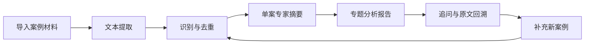

# SZZZ Case Study Lite｜案例分析技能

八股仙人，长期关注法律实务、文档自动化与 AI 工作流，分享面向中文法律文本处理的工具和方法。

小红书 @八股仙人｜AI工作流<br>
微信公众号 @八股仙人<br>
微博 @八股仙人AI

SZZZ Case Study Lite 是一个免费的本地民事裁判文书研究工具。它可以把用户已有的案例材料整理成可检索、可更新、可回溯原文的本地案例库。

**当前版本：v3.0.1**

## 特色功能

这不只是一个生成摘要的工具，而是一套从材料整理到持续维护的本地案例研究流程。



| 特色能力 | 可以做什么 |
|---|---|
| 完备的摘要体系 | 从案情和诉辩，到争议焦点、裁判逻辑、裁判结果与实务提示，形成统一的单案摘要 |
| 完整的研究流程 | 串联提取、去重、逐案分析、专题报告、追问和原文核对 |
| 多格式材料提取 | 批量处理 PDF、DOCX 和旧式 DOC，并为 PDF 保留页码标记 |
| 重复案例排除 | 按“案号 + 文书类型”去重，无标准案号时辅助进行正文相似去重 |
| 追问与进度看板 | 继续比较案件、核对具体事实，并查看全库、已完成、待处理和待启动增量数量 |
| 增量分析与维护 | 随时补充新案例，只处理新增材料，逐步沉淀为可持续维护的本地案例库 |

整个流程只处理用户提供的本地文件，不自动联网检索案例。

## 安装

仓库可以放在任意目录，不要求安装到 `~/.claude`。先克隆仓库并安装 Python 依赖：

```bash
git clone https://github.com/szzzcode/szzz-case-study-lite.git
cd szzz-case-study-lite
python3 -m pip install -r scripts/requirements.txt
```

Windows 环境如果没有 `python3` 命令，可以把上述命令及下文命令中的 `python3` 改为 `python`。

### 在不同 AI 工具中使用

脚本本身不依赖 Claude、Cursor、WorkBuddy 或其他特定 AI 工具。不同工具的技能目录和导入方式可能不同：

- 如果工具支持读取 `SKILL.md`，按照该工具的说明，把整个仓库放入或导入其技能目录；
- 如果工具暂不支持 `SKILL.md`，仍然可以直接运行下面的 Python 命令，再让 AI 读取生成的摘要、报告和 raw 原文；
- 不要只复制 `SKILL.md`，脚本和 `prompts/` 模板也需要保留在仓库中。

## DOC 支持

- macOS：使用系统自带的 `textutil`，通常不需要额外安装；
- Windows/Linux：需要安装 LibreOffice，并确保 `soffice` 或 `libreoffice` 命令位于 PATH；
- 转换器不可用或转换失败时，系统会明确报告，不生成空白文本。

扫描型 PDF 需要先进行 OCR，否则可能无法提取正文。

## 使用

以下命令默认在仓库根目录运行。

首次扫描、提取和去重：

```bash
python3 scripts/main.py init "[案例文件夹]"
```

逐案摘要：

```bash
python3 scripts/main.py focus "[案例文件夹]"
```

加入新文件后，再次执行 `init`。检测到增量材料时运行：

```bash
python3 scripts/main.py focus_incremental "[案例文件夹]"
```

用户确认报告方向后：

```bash
python3 scripts/main.py report "[专题词]" "[案例文件夹]"
```

查看处理进度：

```bash
python3 scripts/main.py next "[案例文件夹]"
```

## 输出结构

```text
案例文件夹/
└── law_analysis_results/
    ├── status.json
    ├── dedup_report.txt
    ├── source_texts/
    │   └── 原文件名-raw.md
    ├── individual_cases/
    │   └── 案号-文书类型-当事人简称-案由-摘要.md
    ├── master_data.json
    └── Master_Report.md
```

## 摘要完成后的三个方向

1. 提供具体案情或问题，从既有案例库检索并在必要时回溯 raw 原文；
2. 从系统归纳的三个高频争议焦点中选择一个，生成 Master Report；
3. 提供自定义报告关键词。

向案例库提问时，宏观问题可以先读取 Master Report，案件比较读取单案摘要，涉及特定事实、证据、金额或日期时应回到 `source_texts/*-raw.md` 核对。

## 多工具使用提醒

同一份仓库可以被不同 AI 工具读取，不会因为使用 Cursor、WorkBuddy 或 Claude 而改变案例数据。但不要让两个工具同时处理同一个案例文件夹，以免它们同时更新 `status.json`。

不同案例文件夹可以分别处理，互不影响。

## 重要提醒

本工具生成的内容用于辅助法律研究。案号、金额、裁判结果、证据原话和法律依据应回到 raw 原文核对。裁判文书没有披露的信息，不应由模型推测补充。

## 许可

本项目采用 MIT License。英文法律文本及中文参考译文见 [LICENSE](./LICENSE)。

## Lite 与 Pro

Lite 是免费公开版，提供完整的本地案例研究流程；Pro 在此基础上增加元典外部类案检索、动态选案、归档校验和 Obsidian 案例知识库等专业功能。
