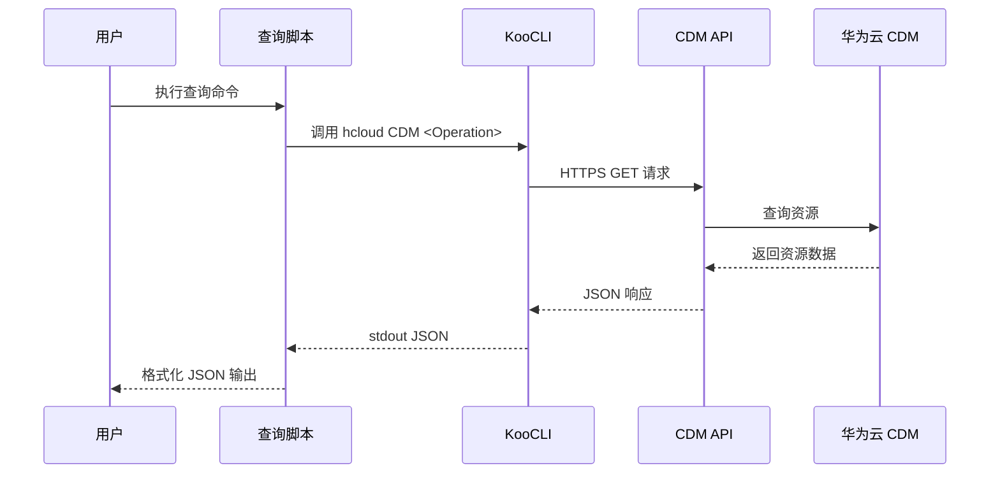

# 华为云 CDM 资源查询 Skill

## 安全硬约束

1. 认证信息（AK/SK）必须通过环境变量注入，禁止在代码或命令行参数中硬编码。
2. 支持的 environment variable 前缀包括 `HUAWEI_`、`HW_`、`HWC_`，脚本会自动扫描。
3. 所有 API 请求均通过 HTTPS 加密传输。
4. 脚本仅执行 CDM 资源的只读查询操作，不涉及任何创建、修改或删除操作。
5. 所有 CLI 调用设置 timeout=30 秒，超时或 403/429 错误会给出明确提示。
6. 错误信息中可能包含 API 请求 ID，但不包含敏感的认证凭据。

## Overview

本 Skill 基于华为云 KooCLI（hcloud）实现对 CDM（Cloud Data Migration）服务的只读查询能力。支持查询集群列表、集群详情、任务列表以及任务执行历史。

该 Skill 适用于以下场景：
- 日常巡检中快速查看 CDM 集群状态
- 排查数据迁移任务执行情况
- 自动化脚本中集成 CDM 信息查询

## Prerequisites

### 环境要求

- Python 3.7+
- 华为云 KooCLI 已安装并配置（参考 `references/cli-installation-guide.md`）
- 华为云账号已开通 CDM 服务
- 已获取华为云 AK/SK 访问密钥

### 环境变量

| 变量名 | 说明 | 是否必填 |
|--------|------|----------|
| `HUAWEI_ACCESS_KEY` | 访问密钥 ID (AK) | 是 |
| `HUAWEI_SECRET_KEY` | 秘密访问密钥 (SK) | 是 |
| `HUAWEI_CLOUD_REGION` | 区域代码（默认: cn-north-4） | 否 |

也支持 `HW_` / `HWC_` 前缀的等价变量名，以及 `_AK` / `_SK` / `_REGION` 后缀。

## Workflow

CDM 查询的工作流程如下：



## Core Commands

### 列出所有能力

```bash
python scripts/hcs-cdm-query.py --project-id <PROJECT_ID> capability-list
```

### 查询集群列表

```bash
python scripts/hcs-cdm-query.py --project-id <PROJECT_ID> list-clusters
```

可选参数：
- `--region`：区域代码（默认: cn-north-4）

### 查询集群详情

```bash
python scripts/hcs-cdm-query.py --project-id <PROJECT_ID> show-cluster <cluster_id>
```

### 查询任务列表

```bash
python scripts/hcs-cdm-query.py --project-id <PROJECT_ID> list-jobs <cluster_id>
```

可选参数：
- `--job-name`：任务名称（默认: all 查询全部）
- `--filter`：任务名称模糊过滤
- `--job-type`：任务类型过滤（NORMAL_JOB / BATCH_JOB / SCENARIO_JOB）
- `--page-no`：页码
- `--page-size`：每页数量（10-100）

### 查询任务执行历史

```bash
python scripts/hcs-cdm-query.py --project-id <PROJECT_ID> show-submissions <cluster_id> <job_name>
```

### 退出码

| 退出码 | 含义       |
|--------|------------|
| 0      | 执行成功   |
| 2      | 参数错误   |
| 3      | 认证错误   |
| 4      | API 错误   |
| 5      | CLI 错误   |

## KooCLI Command Format Standard

本 Skill 使用 KooCLI 模式调用 CDM API，格式如下：

```
hcloud CDM <Operation> --cli-region={region} --project_id={project_id} [--param=value]
```

支持的操作对应关系：

| 子命令 | CLI Operation | HTTP Method | API Path |
|--------|---------------|-------------|----------|
| list-clusters | ListClusters | GET | /v1.1/{project_id}/clusters |
| show-cluster | ShowClusterDetail | GET | /v1.1/{project_id}/clusters/{cluster_id} |
| list-jobs | ShowJobs | GET | /v1.1/{project_id}/clusters/{cluster_id}/cdm/job/{job_name} |
| show-submissions | ShowSubmissions | GET | /v1.1/{project_id}/clusters/{cluster_id}/cdm/submissions |

## Parameter Confirmation

| 参数 | 来源 | 获取方式 |
|------|------|----------|
| AK/SK | 环境变量 | 自动检测 |
| Region | 环境变量/命令行参数 | 自动检测/用户指定 |
| Project ID | 命令行参数 | 用户输入（必填） |
| Cluster ID | 命令行参数 | 用户输入 |
| Job Name | 命令行参数 | 用户输入 |

在执行查询之前，脚本会自动检测环境变量中的认证信息。如果 AK/SK 缺失，脚本将以退出码 3 终止并提示错误信息。

## Reference Documents

- [IAM 权限策略文档](references/iam-policies.md)
- [CLI 安装认证指南](references/cli-installation-guide.md)
- [数据流图](references/dataflow-diagram.md)
- [验证方法](references/verification-method.md)
- [验收标准](references/acceptance-criteria.md)
- 华为云 CDM API 参考: https://support.huaweicloud.com/api-cdm/index.html
- 华为云 KooCLI: https://support.huaweicloud.com/qs-hcli/hcli_02_003.html
