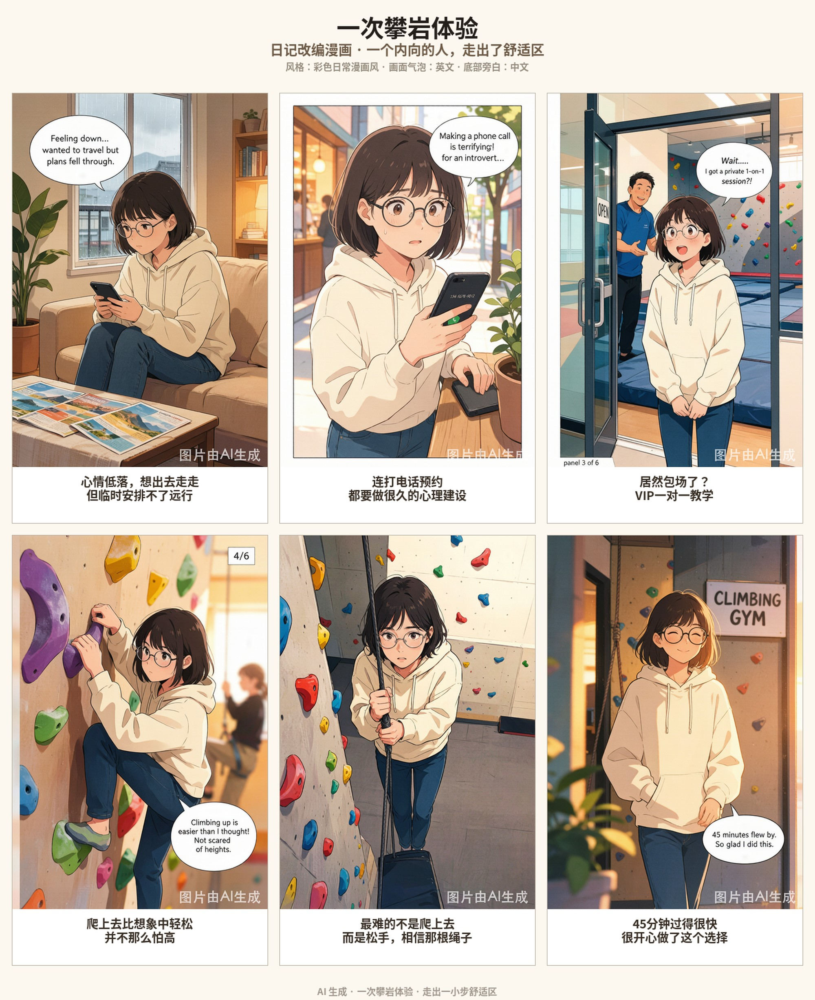
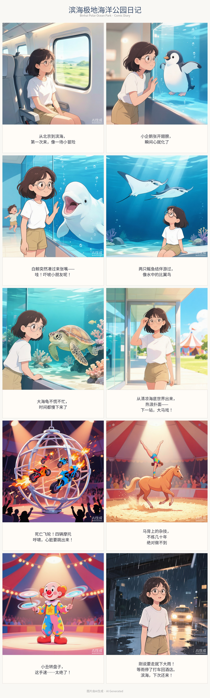

# text-to-comic v2.2.0

中文 | [English](#english)

> 一句话把文字/照片/日记变成漫画、绘本、信息图 —— 自动分镜、逐格渲染、校验拼版。

---

## 中文

### 这是什么？

一个 AI Agent Skill，把用户口述的文字、照片说明、日记、诗歌或知识内容，自动转化为最适合的视觉作品：

- 自动判断内容类型（叙事 / 知识 / 对话 / 诗意 / 混合）
- 自动选择视觉形式（漫画 / 绘本 / 信息图 / 混合）
- 推荐 11 种风格（明亮卡通、水彩绘本、日式漫画、国风工笔、水墨、3D、黏土、科幻、复古水彩、潦草涂鸦……）
- 结构化分镜 → 逐格渲染 → 校验 → 重试 → 拼版

### 核心能力

- **主角一致性**：character bible 机制，跨作品复用同一个角色
- **单格修复**：只重画坏的那格，不整页重来
- **结构化中间层**：panel plan + render task 双 schema，可校验可回溯
- **重试阶梯**：显式 retry ladder + 风格 fallback
- **真实工具脚本**：编译 prompt、校验 plan、拼版出图

### 目录结构

```text
.
├── SKILL.md                技能定义（发布核心）
├── README.md               本文件
├── CHANGELOG.md            版本记录
├── skill-card.md           ClawHub 展示卡
├── presets/
│   └── styles.json         11 种风格注册表
├── schemas/
│   ├── panel-plan.schema.json   分镜计划 schema
│   └── render-task.schema.json  渲染任务 schema
├── examples/
│   ├── four-panel-demo.json     四格示例
│   ├── infographic-demo.json    信息图示例
│   ├── webtoon-demo.json        竖屏条漫示例
│   ├── climbing-diary-final.jpg    真实成品：攀岩日记
│   └── ocean-park-diary-final.jpg  真实成品：海洋公园日记
└── scripts/
    ├── compile_prompt.py        plan + style → 每格 prompt
    ├── validate_panel_plan.py   校验 panel plan
    └── assemble_page.py         拼版 + 中文旁白
```

### 真实成品展示



> 6格(2×3)日记漫画：第一次室内攀岩，彩色日常漫画风。



> 10格(2×5)日记漫画：极地海洋公园+大马戏的一天，同一主角换夏装。

### 跨日记复用主角

两篇漫画使用**同一个角色设定**（短发圆框眼镜女生），随季节换装（攀岩穿卫衣、夏天穿T恤短裤）。复用同一个 character bible，个人日记漫画会读起来像一部连贯的"系列剧"（第1集、第2集……）。

### 安装

#### ClawHub
```bash
clawhub install bonniegeng-max/text-to-comic
```

#### OpenClaw（本地）
```bash
cp -r ./ ~/.openclaw/skills/text-to-comic/
```

### 使用

安装后直接对 AI Agent 说：

- "帮我把这段话画成漫画"
- "把今天的日记变成漫画"
- "画成水墨绘本"
- "做成信息图"
- "把这张照片画成涂鸦风"
- "做成竖屏条漫"

### 重试策略

默认 retry ladder：
1. 缩短对白或把文字移出图内
2. 减少背景复杂度
3. 改成更稳镜头（如 `medium`）
4. 减少配角
5. fallback 到更稳的 style preset

### 发布与迭代

- 语义化版本 + 每版 CHANGELOG 说明 Added/Changed/Fixed
- 发布前 `--dry-run` 预览，发布后确认审核 CLEAN

### 许可证

MIT-0（免费使用、修改、再分发，无需署名）

---

## English

> Turn text, photo notes, diary entries, poems or knowledge content into comics, picture-book spreads, infographics, or hybrid visual pages.

### What is this?

An AI Agent Skill that auto-converts user text, photo notes, diary entries, poems, or knowledge content into the most suitable visual deliverable:

- Auto content-type classification (narrative / knowledge / dialog / poetic / hybrid)
- Auto visual-form selection (comic / picture book / infographic / hybrid)
- 11 style presets (bright cartoon, watercolor picture book, shonen manga, gongbi, ink wash, 3D toon, claymation, sci-fi, vintage watercolor, doodle sketch...)
- Structured storyboard → panel-by-panel rendering → validation → retry → assembly

### Key features

- **Character consistency**: character bible that can be reused across works
- **Single-panel repair**: re-render only the broken panel, not the whole page
- **Structured artifacts**: panel-plan + render-task schemas, inspectable and revisable
- **Retry ladder**: explicit retry + style fallback
- **Real tooling**: prompt compiler, plan validator, page assembler

### Real finished comics


> A 6-panel (2x3) diary comic: first-time indoor climbing, slice-of-life style.


> A 10-panel (2x5) diary comic: a day at a polar ocean park + circus show, same protagonist in summer outfit.

### Reuse your protagonist across diaries

Both comics use the **same character bible** (a short-haired woman with round glasses) — only the outfit changes with the season. Reusing one character bible makes a personal diary comic read like a coherent "series" (episode 1, episode 2, ...).

### Install

#### ClawHub
```bash
clawhub install bonniegeng-max/text-to-comic
```

#### OpenClaw (local)
```bash
cp -r ./ ~/.openclaw/skills/text-to-comic/
```

### Usage

Just tell your agent:

- "Turn this into a comic"
- "Turn today's diary into a comic"
- "Draw it as an ink-wash picture book"
- "Make it an infographic"
- "Turn this photo into a doodle sketch"
- "Make a vertical webtoon"

### Retry behavior

Default retry ladder:
1. shorten or externalize text
2. simplify background
3. switch to a more stable shot such as `medium`
4. reduce side characters
5. fall back to a more stable preset

### License

MIT-0 (Free to use, modify, and redistribute. No attribution required.)
