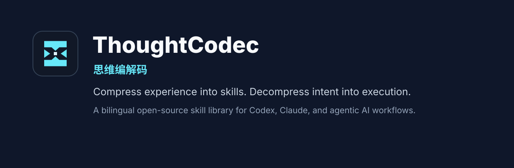
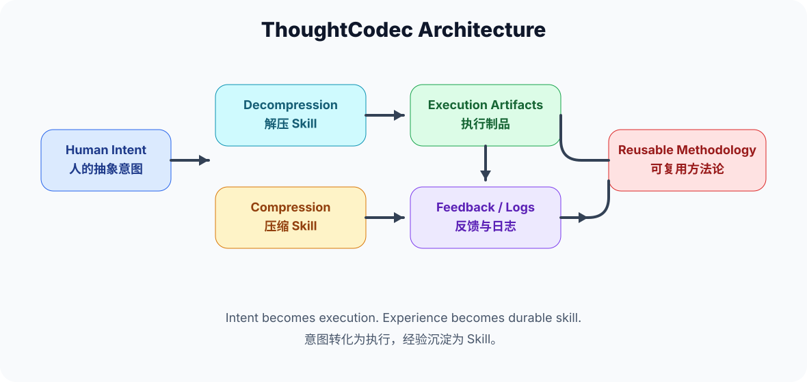

# ThoughtCodec

[](LICENSE.md)




**ThoughtCodec** is a bilingual, open-source skill library for turning abstract human intent into executable AI workflows, then compressing repeated practice back into reusable skills.

中文说明请见 [README.zh-CN.md](README.zh-CN.md).

## Why This Exists

Most AI workflows still treat models as tools that answer isolated questions. ThoughtCodec treats AI collaboration as a two-way codec:

- **Decompression:** expand high-density ideas, strategies, and constraints into plans, SOPs, code structures, diagrams, and execution checklists.
- **Compression:** extract reusable rules from corrections, logs, repeated decisions, and finished work, then turn them into durable skills.

The project starts from five practical skills for Codex, Claude, and similar agentic assistants.

## Documentation

- [English docs](docs/en/README.md)
- [简体中文文档](docs/zh-CN/README.md)
- [Roadmap](ROADMAP.md)

## Skill Library

| Skill | Type | Use it when you need to |
| --- | --- | --- |
| [Architecture Scaffolding](skills/architecture-scaffolding/SKILL.md) | Decompression | Convert business logic into architecture, data models, API contracts, and code structure. |
| [SOP Instantiation](skills/sop-instantiation/SKILL.md) | Decompression | Convert a broad goal into a concrete operating procedure with milestones and checks. |
| [Rule & Prompt Optimizer](skills/rule-prompt-optimizer/SKILL.md) | Compression | Convert feedback, corrections, and conversation traces into reusable prompt rules. |
| [Code Abstraction & Encapsulation](skills/code-abstraction-encapsulation/SKILL.md) | Compression | Convert repeated or messy code into reusable components and engineering rules. |
| [Personal Methodology Engine](skills/personal-methodology-engine/SKILL.md) | Loop | Combine decompression and compression into a personal working-system loop. |

Each skill has an English and Simplified Chinese version:

```text
skills/<skill-id>/SKILL.md
skills/<skill-id>/SKILL.zh-CN.md
```

Each skill also includes a practical example under `skills/<skill-id>/examples/`.

## Architecture



ThoughtCodec uses three shared building blocks:

- [Decompression and Compression Protocols](docs/en/protocols.md)
- [Four-Layer Evolution Model](docs/en/protocols.md#four-layer-evolution-model)
- [Agentic Loop](docs/en/protocols.md#agentic-loop)

## Repository Layout

```text
.
|-- assets/              # Logo, banner, diagrams, and social preview images
|-- catalog/             # Machine-readable bilingual skill index
|-- docs/
|   |-- en/              # English project documentation
|   `-- zh-CN/           # Simplified Chinese project documentation
|-- examples/            # Cross-skill workflow examples
|-- scripts/             # Validation and maintenance scripts
`-- skills/              # One folder per skill
```

## Quick Start

1. Pick the skill that matches your task.
2. Read the English or Chinese `SKILL` file.
3. Paste the skill instructions into Codex, Claude, or another agentic assistant.
4. Provide the required inputs.
5. Review the output, then record useful corrections for future compression.

Run the repository check locally:

```bash
bash scripts/validate_structure.sh
```

## Visual Assets

This repository includes reusable open-source project visuals:

- [Logo](assets/logo.svg)
- [README banner](assets/banner.svg)
- [Social preview](assets/social-preview.svg)
- [Upload-ready social preview PNG](assets/social-preview.png)
- [Monochrome logo](assets/logo-mono.svg)
- [Architecture diagram](assets/diagrams/architecture.svg)
- [Decompression and compression diagram](assets/diagrams/decompression-compression.svg)
- [Agentic loop diagram](assets/diagrams/agentic-loop.svg)

## Status

ThoughtCodec is currently an initial public preview. The structure, first five preview-status skills, bilingual documentation, examples, visual assets, and validation script are in place. Future work can add integrations, tests, and more domain-specific skills.

## License

Released under the [MIT License](LICENSE.md).
