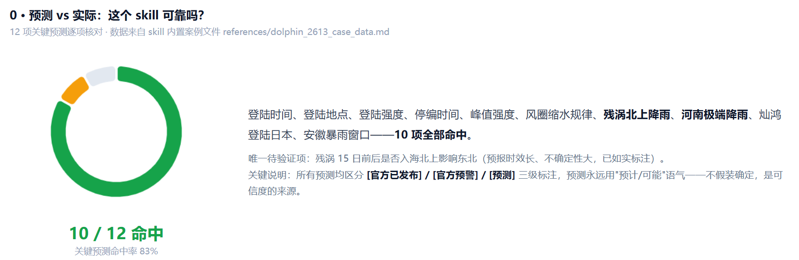
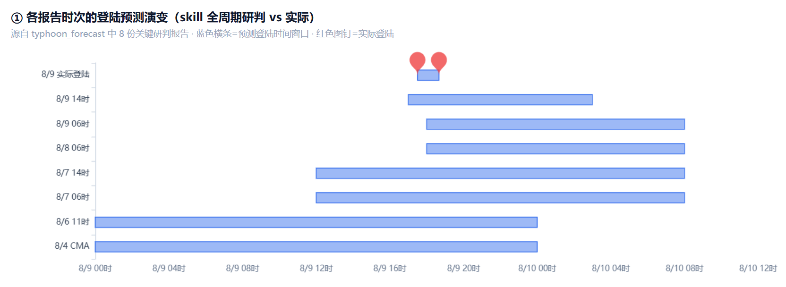
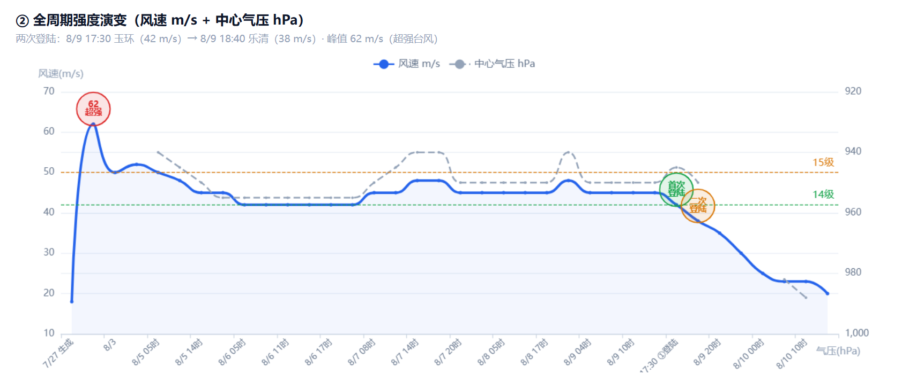
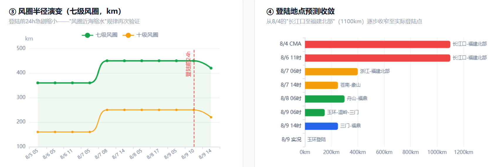

# Typhoon Tracker — 台风实时追踪与影响研判 Skill

**为华东（江浙沪）深度优化的台风研判助手，同时具备全国通用评估能力。**

不是简单的"天气预报工具"，而是一套经过**两个真实台风全周期实战验证**的方法论：数据采集 → 冲突仲裁 → 影响建模 → 决策支持。回答你真正关心的问题：**要不要退票？哪天不能出门？要不要撤离？**

> 当前版本：**v1.1.2**（查看[更新记录](#更新记录)）

---

## 为什么选择本 Skill？

### 1. 真实台风实战打磨，非纸上谈兵

| 验证案例                        | 追踪周期                       | 核心成果                                                               |
| ------------------------------- | ------------------------------ | ---------------------------------------------------------------------- |
| **巴威（2609）** 2026.7   | 5 天周期追踪（0707-0712）      | 10 次预报迭代，登陆时间预测最终偏差仅**10 分钟**                 |
| **白海豚（2613）** 2026.8 | 15天3小时生命周期（0727-0812） | 远洋生成 + 双台风交互 + 残涡极端降雨，**全周期预测复盘命中率高** |

所有预测规律均来自实测数据反推（如下：巴威、白海豚预测演变与收敛过程）。

##### 1.1 白海豚登陆时间预测收敛过程



| 预测项       | 预测（时间）                     | 实际                             | 结果 |
| ------------ | -------------------------------- | -------------------------------- | ---- |
| 登陆时间     | 9日晚-10日早晨（多机构收敛）     | 8/9 17:30 玉环 + 18:40 乐清      | 命中 |
| 登陆地点     | 苍南到象山一带（8/7收窄250km）   | 玉环市坎门街道                   | 命中 |
| 登陆强度     | 38-45 m/s（13-14级）             | 42 m/s（14级）                   | 命中 |
| 停编时间     | 8/11晨入湖北减弱（8/10晚）       | 8/11 11时减热带低压、17时停编    | 命中 |
| 峰值强度     | 可达48-50 m/s（8/7 CMA首席）     | 8/7 17时达48 m/s（15级）         | 命中 |
| 风圈近海缩水 | 七级风圈登陆前24h缩水            | 420→300km（缩29%，8/9 14时）    | 命中 |
| 残涡北上降雨 | 淮南/淮北11-12日暴雨窗口         | 安徽北部暴雨局地大暴雨兑现       | 命中 |
| 河南极端降雨 | 11-12日豫西沿山特大暴雨250-350mm | 橙警沿山250-280mm；舞钢破8月极值 | 命中 |
| 灿鸿登陆日本 | 8/11傍晚后登陆（8/10预测）       | 8/11 19时登陆茨城县              | 命中 |
| 安徽北部窗口 | 淮北12日大雨到暴雨               | 暴雨橙警列入大暴雨区             | 命中 |
| 杭州8/9航班  | 预计8/8晚-9日发布停运公告        | 8/8 19时官方公布取消52架次       | 命中 |
| 残涡入海北上 | 15日前后可能影响东北（不确定大） | 待验证                           | 待定 |



##### 1.2 巴威登陆时间预测收敛过程


##### 2. 华东特化 + 全国通用，双模式覆盖

- **华东深度特化**：杭州（西湖/滨江等）、上海（嘉定等）、宁波/温州（沿海地区）、安徽淮南/淮北（内陆地区）——内置详细评估参照（内陆衰减、山区降雨、地铁/高铁/航班、风暴潮、残余降雨）
- **全国通用**：内置 10 步「城市快速评估框架」，输入任意城市名即可评估——坐标 → 距离 → 风圈等级 → 风力/降雨 → 次生灾害/交通 → 风险评级

### 3. 22 个权威数据源 + 冲突仲裁

国内官方（CMA/省市气象台/12306/海事局）+ 国际机构（JMA/JTWC）+ 数值模型（ECMWF/GFS）+ AI 集合预报。**关键设计**：当各机构分歧时，有明确取舍规则（CMA 为锚、分歧 >300km 给区间而非装确定、每个结论强制标注置信度）——**不信息过载，不假装确定**。

### 4. 实战提炼的预测规律

- 登陆时间收敛：T+4天 ±12h → T+1小时 分钟级
- 风圈近海缩水：七级风圈 24h 内可缩 70%（预报偏差最大来源）
- 铁路停运三层模型：整体计划 T-48~72h / 单次邮件 T-21~32h / 当日紧急
- 内陆城市预报系统性偏保守 1-3 级

### 5. 决策支持，不止播报天气

出行/退票时机判断、演唱会、漫展等活动可行性评估、应急准备清单、撤离决策矩阵、"台风眼假象"等易误判时点提醒。

### 6. 信息分级，杜绝误判

交通停运等关键信息严格区分 `[官方已发布]` / `[官方预警]` / `[预测]` 三级——**预测永远用"预计/可能"语气**，每条状态标注核实时间。

### 7. 案例数据持续迭代，越用越准

每轮追踪自动追加实测数据，台风结束后生成"预测 vs 实际"复盘表。每追踪一个台风，skill 就更聪明。

---

## 安装渠道

| 平台 | 链接 | 特点 |
|------|------|------|
| **GitHub**（源码/完整文档） | https://github.com/FireflJay/typhoon-tracker | 完整 README、案例数据、版本历史、可提 Issue |
| **ClawHub**（OpenClaw） | https://clawhub.ai/skills/firefljay/typhoon-tracker | `openclaw skills install @firefljay/typhoon-tracker` |
| **SkillHub**（国内/腾讯生态） | https://skillhub.cn/skills/user_e20e6d28/typhoon-tracker | 微信生态，支持中文社区 |

---

## 快速开始

### WorkBuddy（最易部署且功能完整）

```bash
cp -r typhoon-tracker ~/.workbuddy/skills/
```

对话中直接提问即可自动触发：

```
"白海豚台风现在到哪了？预计什么时候登陆？"
"8月9日杭州能出行吗？高铁会停运吗？"
"生成一份完整的台风研判报告"
```

### OpenClaw（7×24h 定时任务 + 飞书等推送）

```bash
openclaw skills install @firefljay/typhoon-tracker
```

配合飞书通道可设置每日早/中/晚三次自动推送台风速报到手机。

### 手动加载

将 `SKILL.md` 内容注入任意 AI 助手系统提示词即可使用核心方法论。

---

## 使用示例

**问**：台风最新情况，杭州会受多大影响？

**答**（移动端友好速报格式）：

```
台风晚报·白海豚（2613）— 8月6日20时

**位置**：约26.7°N、131.7°E（温州偏东约1150-1200km）
**强度**：强台风级，42m/s（14级）/ 955hPa
**登陆预测**（置信度：中-高）：9日晚-10日白天登陆浙江沿海，概率70-75%

**城市影响**：
1. 温州（🔴）：9日12-14级，可能为登陆点附近
2. 杭州西湖/滨江（🟠）：9日大到暴雨、阵风7-9级
...

**行动建议**：
1. 8/7可出行；8/8不建议长途；8/9-10不安排出行
2. 收到12306停运通知立即退票
```

---

## 文件结构

```
typhoon-tracker/
├── SKILL.md                    ← 核心方法论（数据源/冲突仲裁/评估公式/决策框架）
├── README.md                   ← 本文件
├── references/
│   ├── bavi_2609_case_data.md      ← 巴威全周期实测（含预测演变表）
│   ├── dolphin_2613_case_data.md   ← 白海豚全周期实测（含预测vs实际复盘）
│   ├── deployment_guide.md         ← 部署环境与网络容错
│   ├── mobile_channel_guide.md     ← 移动端/消息通道适配
│   └── report_template_guide.md    ← 报告模板与命名规范
└── scripts/
    └── generate_pdf.py         ← Markdown 报告转精美 PDF（含封面）
```

---

## 重要说明

1. **不替代官方预警**——最终以中央气象台、当地应急管理部门官方发布为准
2. **台风预测本质是概率性的**——价值在于"用有限信息诚实判断"，标注置信度而非假装确定
3. **数据源黑名单**：不接受自媒体推测、"据网友说"等模糊来源

---

## 更新记录

| 版本   | 日期       | 内容                                                                                              |
| ------ | ---------- | ------------------------------------------------------------------------------------------------- |
| v1.1.2 | 2026-08-15 | **触发条件重构**：航班/高铁/交通出行查询与行程规划必须排查台风及残余环流背景（禁止仅凭当日天气回答交通问题）；**新增「用户提供信息验证协议」**（用户信息→内置P0/P1/P2信源交叉验证→采信/纠偏/迭代）；**新增航旅纵横APP为P1信源**（含访问边界：仅用户侧可用、AI无法主动采集）；明确"本场雷暴解除≠航路无对流"判断规则 |
| v1.1.1 | 2026-08-12 | 新增三平台安装渠道互链表（GitHub/ClawHub/SkillHub）；frontmatter 增加 source/homepage 指向源码仓库 |
| v1.1.0 | 2026-08-12 | 新增「PDF生成格式避坑指南」与「停编与收官处理协议」；白海豚案例追加全周期实测数据与预测vs实际复盘 |
| v1.0.0 | 2026-08-07 | 首次发布：核心方法论 + 交通停运三级验证协议 + 巴威案例数据                                        |

---

## 许可与贡献

- **许可**：MIT License
- **贡献**：提交真实台风案例数据、改进评估公式、修复 bug
- **反馈**：欢迎提 Issue / Pull Request

---

> 台风预报很难，但决策可以很简单——提前准备、主动关注、宁愿十防九空，也要未雨绸缪、留足余地。
