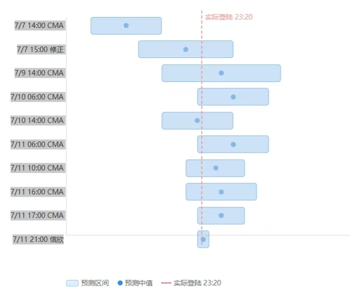

# 🌪️ Typhoon Tracker — 台风实时追踪与影响研判 Skill

> **为华东地区（江浙沪）量身打造，具备全国通用评估能力的台风研判助手**

一款经过**真实台风全周期实战验证**（2026年7月超强台风"巴威"、2026年8月台风"白海豚"经验持续进化）的台风追踪 Skill。它不是一个简单的"天气预报查询工具"，而是一套完整的**数据采集 → 冲突仲裁 → 影响建模 → 决策支持**方法论，帮助你在台风到来前做出正确判断：要不要退票、要不要撤离、哪天不能出门。

---

## 一、为什么选择本 Skill？

### 1. 真实台风实战打磨，不是纸上谈兵

| 验证案例                           | 追踪周期   | 核心成果                                                                                       |
| ---------------------------------- | ---------- | ---------------------------------------------------------------------------------------------- |
| **巴威（2609）** 2026年7月   | 5 天全周期 | 10 次预报迭代追踪，登陆时间预测最终偏差仅**10 分钟**；积累了"风圈近海缩水 70%"等关键规律 |
| **白海豚（2613）** 2026年8月 | 追踪中     | 远洋生成 + 双台风（鲸鱼）场景，验证国际模型冲突仲裁机制                                        |

所有预测规律均来自**实测数据反推**，不是理论假设（图：对巴威登录时间的预测）。



### 2. 华东特化 + 全国通用，双模式覆盖

 **2.1 华东深度特化**（内置详细评估参照）：

- **杭州市**（西湖区/滨江区等主城区）— 内陆风力衰减、西部山区降雨、地铁/高铁
- **上海市**（嘉定南翔等近郊）— 沿江风力、高层阵风、航班、风暴潮
- **宁波/温州** — 台风登陆点邻近城市，沿海直接冲击
- **安徽淮南/淮北** — 台风深入内陆后的残余降雨与地质灾害

 **2.2 全国通用**：内置 10 步「城市快速评估框架」，输入任意城市名即可系统性评估——获取坐标 → 计算与台风中心距离 → 判定风圈影响等级 → 估算风力/降雨 → 评估次生灾害/交通 → 输出风险评级。未内置的城市同样可用。

### 3. 严谨的数据源体系：22 个权威源 + 冲突仲裁

| 层级               | 数据源                                                              | 说明           |
| ------------------ | ------------------------------------------------------------------- | -------------- |
| **国内官方** | 中央气象台台风网、CMA公报、省/市气象台、水利部、12306、地铁、海事局 | 中国近海最权威 |
| **国际机构** | JMA（日本气象厅）、JTWC（美军联合台风预警中心）                     | 独立交叉验证   |
| **数值模型** | ECMWF、GFS、Tropical Tidbits、Zoom Earth、Windy                     | 远洋路径预判   |
| **AI 模型**  | 各机构 AI 集合预报对比                                              | 新趋势         |

**关键设计——信息源冲突仲裁**：当 CMA 说登陆浙江、JMA 说转向、ECMWF 说偏福建时，skill 有明确的取舍规则（CMA 为中国近海锚点、分歧 >300km 时给区间而非假装确定、每个结论强制标注置信度高/中/低）。**不会信息过载，也不会假装确定。**

### 4. 预测变化规律（从实战中提炼的"经验法则"）

- **登陆时间收敛规律**：T+4 天误差 ±12h → T+2 天 ±6h → T+1 天 ±3h → 短临分钟级
- **风圈近海缩水**：七级风圈可在登陆前 24h 内从 480km 缩至 150km（缩小 70%）——这是预报与实际偏差的最大来源
- **铁路停运三层模型**（多案例实测）：整体计划 T-48~72h / 单次车次邮件 T-21~32h / 当日紧急 T-几小时
- **内陆城市预报偏差**：预报系统性偏保守 1-3 级（风圈缩小后尤为突出）

### 5. 决策支持，不止于"播报天气"

- **出行决策**：高铁/航班停运窗口预测、退票时机判断
- **活动可行性**：台风天活动能否举办的系统评估
- **应急准备**：物资清单、门窗加固、撤离决策矩阵（含建筑条件判断）
- **心理提示**：针对"台风眼假象""暴风雨前平静"等易误判时点的提醒

### 6. 案例数据持续迭代（越用越准）

每次追踪周期自动追加实测数据到案例文件（`references/[台风名]_[编号]_case_data.md`），台风消散后自动生成"预测 vs 实际"对比表。**每追踪一个台风，skill 就变得更聪明**——新台风的预测会参考历史相似路径台风的实测偏差。

---

## 二、文件结构

```
typhoon-tracker/
├── SKILL.md                              ← 核心方法论（数据源/冲突仲裁/评估公式/决策框架）
├── README.md                             ← 本文件
├── references/
│   ├── bavi_2609_case_data.md            ← 台风巴威全周期实测数据（含预测演变表）
│   ├── dolphin_2613_case_data.md         ← 台风白海豚追踪数据（远洋+双台风案例）
│   ├── deployment_guide.md               ← 部署环境与网络容错指南
│   ├── mobile_channel_guide.md           ← 移动端/消息通道适配指南（飞书/微信等）
│   └── report_template_guide.md          ← 报告模板与文件命名规范
└── scripts/
    └── generate_pdf.py                   ← Markdown 报告转精美 PDF（含封面页）
```

---

## 三、快速开始

### 方式一：WorkBuddy（推荐，功能最完整）

```bash
# 将 typhoon-tracker 文件夹复制到用户级 skill 目录
cp -r typhoon-tracker ~/.workbuddy/skills/
```

然后在对话中直接提问，skill 自动触发：

```
"白海豚台风现在到哪了？预计什么时候登陆？"
"8月9日杭州能出行吗？高铁会停运吗？"
"生成一份完整的台风研判报告"
"把报告转成 PDF"
```

### 方式二：OpenClaw（支持 7×24h 定时任务 + 飞书推送）

```bash
openclaw skills install /path/to/typhoon-tracker --agent main
```

配合飞书通道，可设置每日定时追踪（早/中/晚三次自动推送台风速报到手机）。

### 方式三：手动加载

将 `SKILL.md` 内容注入任意 AI 助手的系统提示词即可使用核心方法论。

---

## 使用示例

**问**：台风白海豚最新情况，杭州会受多大影响？

**答**（速报格式，移动端友好）：

```
台风晚报·白海豚（2613）— 8月6日20时

**位置**：约26.7°N、131.7°E（温州偏东约1150-1200km）
**强度**：强台风级，42m/s（14级）/ 955hPa
**移动**：西北西 15-20km/h，7日白天进入东海

**登陆预测**（置信度：中-高）：9日晚-10日白天登陆浙江沿海，概率70-75%

**城市影响**：
1. 温州（🔴）：9日12-14级，可能为登陆点附近
2. 杭州西湖/滨江（🟠）：9日大到暴雨、阵风7-9级
...

**行动建议**：
1. 8/7可出行（选早班）；8/8不建议长途；8/9-10不安排出行
2. 收到12306停运通知立即退票
```

---

## 四、重要说明⚠️

1. **本 Skill 不替代官方预警**——所有判断基于公开信息整合，最终以中央气象台、当地应急管理部门的官方预警为准
2. **台风预测本质是概率性的**——skill 的价值在于"用有限信息做出诚实判断"，标注置信度而非假装确定
3. **置信度标注**：高（共识明确/临近登陆）/ 中（模型分歧）/ 低（远洋/分歧大）——请据此判断该信几分
4. **数据源黑名单**：不接受自媒体推测、"据网友说"等模糊来源

---

## 五、许可与贡献

- **许可**：MIT License
- **贡献方式**：提交真实台风案例数据、改进评估公式、修复 bug
- **联系我们**：欢迎提 Issue / Pull Request，让更多人在台风面前多一份从容

---

> **最后的话**：台风预报很难，但决策可以很简单——提前准备、相信官方、留足余地。希望这个 Skill 能帮你在台风到来前，做出更从容的选择。
